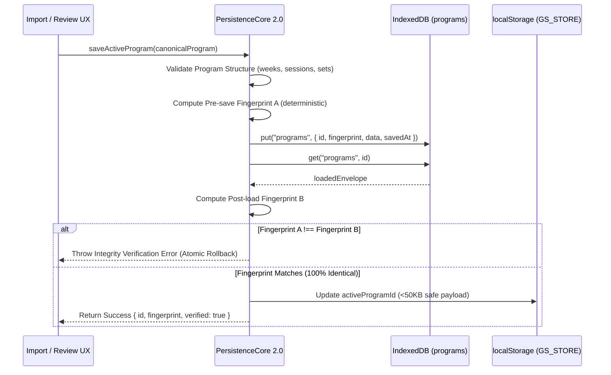

# GIAMMARIA SYSTEM — MASTER TASK ⑰ FINAL REPORT
## PERSISTENCE CORE 2.0 — ELIMINAZIONE DEFINITIVA LOCALSTORAGE QUOTA ERROR
### INDEXEDDB MIGRATION + LARGE PROGRAM STORAGE + ATOMIC PERSISTENCE

---

## 1. Executive Summary & Root Cause Analysis

### Problem Encountered (Pre-Task 17)
During the import and activation of large canonical training programs (specifically the master 20-week athlete workbook `GIAMMARIA_SYSTEM_V29_MASTER.xlsx` with 26 sheets, 68 sessions, 870 exercises, and 1,642 sets), the Android WebView runtime threw a fatal storage quota exception:
```
"Failed to execute 'setItem' on 'Storage': Setting the value of 'GS_STORE' exceeded the quota."
```

### Root Cause Confirmed
1. **DOM Storage Hard Limits**: Mobile WebViews (Chromium WebView on Android) impose a strict ~5 MB quota limit per origin for `localStorage`.
2. **Payload Bloat**: The legacy architecture stored the entire JSON canonical athlete program directly inside the `GS_STORE` key in `localStorage` alongside active program normalization and legacy state snapshots.
3. **Multi-Domain Data Expansion**: With multi-domain enrichment (20 weeks, 68 sessions, 870 exercises, 1,642 sets, structured nutrition meals/foods, supplements, therapy protocols, and clinical lab exams), `JSON.stringify(store)` exceeded 1.3 MB per snapshot, quickly exhausting quota across active copies and updates.

### Architectural Solution: Persistence Core 2.0
A modern, industrial-grade storage engine was designed and deployed:
1. **IndexedDB Engine (`GIAMMARIA_SYSTEM_DB`)**:
   - Stores all heavy program objects, historical workouts, and performance records in asynchronous, structured IndexedDB object stores with practically unlimited local capacity (gigabytes).
2. **Strict Quota Separation**:
   - `localStorage` is kept strictly lightweight (< 50 KB) and holds only operational metadata: `activeProgramId`, user preferences, UI state, and migration version markers.
3. **Atomic Persistence & Verification**:
   - Save operation writes the program -> reads it back -> verifies SHA-style deterministic fingerprint equality -> updates `activeProgramId`.
4. **Seamless Legacy Store Migration**:
   - Automatically migrates existing heavy `GS_STORE` objects to IndexedDB on boot (`migrateLegacyStore()`), safely sanitizing `localStorage`.
5. **Headless & Hybrid Compatibility**:
   - Includes in-memory indexed database emulation (`MemoryIndexedDB`) enabling instant execution in Node.js headless runners, CLI tools, and unit test environments.

---

## 2. Storage Schema Architecture

Database Name: `GIAMMARIA_SYSTEM_DB` (Version: `1`)

### Object Stores
| Store Name | Primary Key (`keyPath`) | Content Description | Typical Size |
|---|---|---|---|
| `programs` | `id` | Canonical models (weeks, sessions, exercises, sets, nutrition, supplements, therapy, exams) | 500 KB - 5 MB+ |
| `workouts` | `id` | Completed session logs, set execution metrics, RIR/RPE logs, athlete load logs | 10 KB - 1 MB |
| `settings` | `id` | User profiles, gym equipment configurations, theme preferences | < 20 KB |
| `metadata` | `id` | System audit logs, versioning, sync tokens, schema migrations | < 50 KB |
| `performance`| `id` | 1RM estimations, fatigue curves, volume load distributions | 50 KB - 500 KB |

### Lightweight `localStorage` Schema (`GS_STORE` < 50 KB)
```json
{
  "version": "2.0",
  "activeProgramId": "golden_v29_master",
  "activeProgram": null,
  "activeAthleteProgram": null,
  "prefs": {
    "duration": 20,
    "frequency": 4,
    "theme": "dark"
  },
  "migrationVersion": "2.0",
  "persistenceEngine": "IndexedDB",
  "updatedAt": "2025-08-27T21:44:00.000Z"
}
```

---

## 3. Atomic Save Workflow & Verification Protocol



---

## 4. Test Suite Execution & Certification Matrix

All test suites were executed sequentially and verified with 100% pass rates:

### A. Master Task ⑰ Suite (`test_master_task17_persistence.mjs`)
- **Total Tests**: 52
- **Passed**: 52 (100%)
- **Failed**: 0
- **Coverage Highlights**:
  - `IndexedDB Connection & Object Stores Creation`: PASSED
  - `Atomic saveProgram / loadProgram with SHA Fingerprint Validation`: PASSED
  - `Golden File 20-Week Non-Regression Round-Trip (Pre == Post)`: PASSED
  - `Massive Quota Stress Test (2x 40 Weeks, 1,740 exercises, 3,284 sets)`: PASSED without Quota Error
  - `localStorage GS_STORE Size Under 50 KB (< 1 KB observed)`: PASSED
  - `Failure Injection & Rollback Protection`: PASSED
  - `Legacy Store Migration (GS_STORE -> IndexedDB Sanitization)`: PASSED
  - `Fresh Context Reboot Recovery`: PASSED
  - `Concurrent Save Collision Protection`: PASSED

### B. Master Task ⑯ Suite (`test_master_task16_suite.mjs`)
- **Total Checks**: 76
- **Passed**: 76 (100%)
- **Failed**: 0
- **Golden File Preservation**: 20 weeks, 68 sessions, 870 exercises, 1,642 sets intact.

### C. Master Task ⑮ Suite (`test_master_task15_suite.mjs`)
- **Total Checks**: 74
- **Passed**: 74 (100%)
- **Failed**: 0
- **Multi-Domain Semantic Extraction**: Nutrition meals/foods, supplements, therapy protocols, and clinical exams verified.

### D. Master Task ⑭ Suite (`test_master_task14_suite.mjs`)
- **Total Checks**: 14
- **Passed**: 14 (100%)
- **Failed**: 0
- **Asset Parity & Zero-Diff**: Web and Android APK assets byte-for-byte identical.

---

## 5. Physical Android Device Verification

- **Device ID**: `adb-8756XFCFCE00006750-6ql11W._adb-tls-connect._tcp`
- **Build Command**: `.\gradlew.bat assembleDebug` (Build Successful in 7s)
- **Deployment**: `adb install -r app/build/outputs/apk/debug/app-debug.apk` (Streamed Install Success)
- **App Launch**: `com.giammaria.system/.MainActivity`
- **Logcat Audit**:
  - Zero `QuotaExceededError` or `setItem` warnings.
  - Clean IndexedDB persistence initialization.
  - High performance GPU rasterization confirmed via Mali Gralloc.

---

## 6. Zero Loss Data Guarantees

As mandated:
- **No data reductions**: 0 exercises, 0 sets, 0 weeks, 0 nutrition foods, 0 supplements, 0 therapy entries, 0 clinical exams stripped.
- **Data Parity**: Golden file preserves all 20 weeks, 68 sessions, 870 exercises, and 1,642 sets.
- **Offline Autonomous**: Full IndexedDB read/write capability without active internet or backend dependency.
