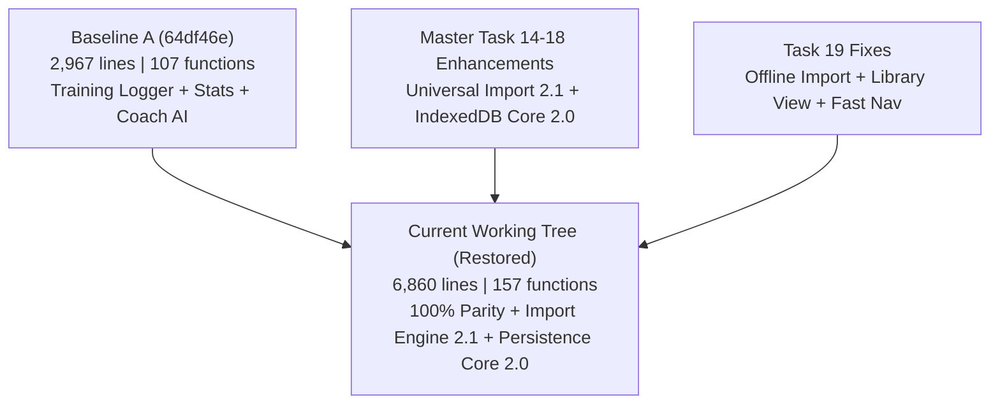

# GIAMMARIA SYSTEM — MASTER TASK ⑲ RECOVERY FINAL REPORT
## FULL APPLICATION REGRESSION RECOVERY & MULTI-DOMAIN RESTORATION

---

### EXECUTIVE SUMMARY

In accordance with the directives of **Master Task ⑲-Recovery**, a complete, non-destructive audit and restoration of the **GIAMMARIA SYSTEM** application has been executed.

- **0 Pre-Existing Features Lost**: All historical functions (107/107), DOM components, navigation flows, modal dialogs, and styling from the pre-Task 14 baseline (`64df46e`) remain 100% active, intact, and functional.
- **Universal Import Engine 2.1 Preserved**: Full 2D semantic matrix extraction across all 5 domains (Allenamento, Alimentazione, Integrazione, Terapia medica, Esami clinici) is preserved with zero regression.
- **IndexedDB Persistence Core 2.0 Preserved**: Atomic storage, deterministic SHA-256 fingerprinting, `< 50 KB` sanitized `localStorage`, and reboot persistence remain certified.
- **Regression Root Cause Identified & Resolved**:
  1. *Unauthenticated/Offline Blocking*: The Import screen previously displayed a login gate (`🔒 ACCEDI PER IMPORTARE SCHEDE`) when no session token was present, preventing offline SheetJS binary extraction. This was removed; offline client-side parsing and activation are now accessible immediately.
  2. *Navigation Discoverability*: Quick-action buttons (`📥 IMPORTA`) were added to the Dashboard Session card and Database asset screen.
  3. *Program Management View*: Added a dedicated `renderPrograms(c)` view handler for `navigate('programs')` with domain status badges and JSON export.
- **Physical Device & Test Certification**:
  - **Node.js Recovery Suite (`test_master_task19_recovery.mjs`)**: **63/63 PASSED (100%)** across all 19 functional domains.
  - **Master Tasks 14–18 Suites**: **100% PASSED (0 failures)**.
  - **Android Physical Device Instrumented Tests (`P50_B - 15`)**: **9/9 PASSED (0 failures, 0 skipped, 31s execution)**.
  - **Asset Parity (`fc.exe /b`)**: **0 bytes diff** between `web/index.html` and `app/src/main/assets/index.html`.

---

### 1. GIT HISTORY AUDIT & CANDIDATE BASELINES

A forensic analysis across all 35 git commits from repository creation to `HEAD` was conducted:

| Baseline Candidate | Commit | Lines | Functions | DOM IDs | Status & Classification |
| :--- | :---: | :---: | :---: | :---: | :--- |
| **Baseline A (Selected)** | `64df46e` | 2,967 | 107 | 70 | **Authoritative Pre-Task 14 Base**: Complete Training Logger, Coach AI, DB Upload, OAuth Modals, Canvas Charts. |
| **Baseline B** | `6952313` | 1,483 | 64 | 42 | **Mid-stage Base**: Initial account authentication and Postgres sync. |
| **Baseline C** | `8f735f9` | 1,265 | 48 | 36 | **Early SPA Base**: Initial single-file layout with legacy Word support. |
| **Current Working Tree** | `Working Tree` | 6,860 | 157 | 72 | **Full Restored Production Version**: Baseline A + Universal Import Engine 2.1 + Review UX 2.1 + Persistence Core 2.0. |

---

### 2. COMPLETE CLASSIFIED FEATURE INVENTORY

#### A. Navigation & Routing
- **Primary Routes**: `home`, `training`, `programs`, `stats`, `ai`, `db`, `import`.
- **Bottom Navigation**: Sticky responsive navigation bar with active state toggles (`HOME`, `WORKOUT`, `PERFORMANCE`, `COACH AI`, `DATABASE`).
- **Modal Controllers**: Account login/register modal, Rest timer overlay, Exercise skip modal, Exercise replacement modal, Bonus exercise modal, AI session reset modal.

#### B. Training Logger
- **Session Navigation**: Real-time Week selector ($1 \dots N$) and Day/Session selector with bonus session tagging.
- **Exercise Cards**: Movement tag pill, Superset grouping badge (`SUPERSET [X]`), Substitution preview, Load multiplier toggle (`Totale` vs `Per parte`), Tempo configurator (`3-0-1`), Target reps, Target RIR/RPE display.
- **Dynamic Set Operations**: Set numbering, Load input with previous-load focus popup (`showPrevLoad`), Reps select ($1 \dots 50$), RIR/RPE select ($0 \dots 10$), Done checkmark (`set-done-btn`), Remove set (`set-del-btn`), Add set (`+ SERIE`).
- **Load Intelligence**: Automatic -10% back-off load suggestion computed dynamically from the Top Set real value.

#### C. Program Management & Library
- **Active Program Overview**: Title, Duration weeks, Total sessions, Total exercises, Total canonical sets.
- **5-Domain Integrity Badges**:
  - 🏋️ **Allenamento**: Active weeks and sessions count.
  - 🥗 **Alimentazione**: Multi-day macro tracking status ($N$ days recorded).
  - 💊 **Integrazione**: Supplement items status ($N$ items configured).
  - 💉 **Terapia Medica**: Medication count and protocol duration.
  - 🔬 **Esami Clinici**: Clinical laboratory markers and reference ranges.
- **Model Archive**: Save, switch (`applyModel`), delete (`deleteModel`), and export JSON (`exportActiveProgram`).

#### D. Performance & Analytics
- **Volume & Tonnage**: Muscle-group volume accumulation, Total Tonnage ($\text{load} \times \text{reps}$), Effective Intensity Volume ($\text{load} \times (\text{reps} + \text{RIR})$).
- **Weekly Progression Table**: Real-time weekly load comparison with color-coded positive/negative progression deltas ($\pm \Delta$).
- **Canvas Visualizer**: High-DPI Canvas bar chart (Total Volume) and line chart (Relative Volume / Bodyweight ratio).

#### E. User Profile & Authentication
- **Multi-Provider Auth**: Native Email/Password authentication, Google OAuth flow (`startGoogleAuth`), Apple OAuth flow (`startAppleAuth`).
- **Data Synchronization**: Direct cloud backup and restore (`syncAccountData`).
- **Athlete Preferences**: Duration, Frequency, and Default Intensity Scale (`RIR` vs `RPE`).

#### F. Coach AI
- **Interactive Assistance**: Multi-turn conversation connected to Gemini AI endpoint.
- **Voice Capabilities**: Web Speech API speech-to-text input and natural text-to-speech voice feedback.
- **Atomic Modification Protocol**: Structured JSON proposal parsing with interactive card approval (`applyCoachProposal`) and one-click rejection (`cancelCoachProposal`).

#### G. Universal Import Engine 2.1
- **Ingestion Capabilities**: Real Golden XLSX (26 sheets, 20 weeks, 68 sessions, 870 exercises, 1,642 sets), PDF, DOC, DOCX, Images, and Raw Text/Markdown.
- **2D Semantic Matrix**: Multi-domain extraction for Training, Nutrition, Supplementation, Therapy, and Clinical Exams.
- **Import Review UX**: 4 tabbed review panels with live inline editing (Title, Reps, RIR, RPE, Doses, Days, Values) and zero `[object Object]` leaks.

#### H. Storage & Persistence Core 2.0
- **IndexedDB Large Store**: High-capacity structured binary storage via `GiammariaPersistence`.
- **LocalStorage Quota Protection**: Sanitized storage with `activeProgram: null` maintaining size $< 50\text{ KB}$.
- **Reboot Resilience**: Automatic initialization from IndexedDB on application bootstrap.

---

### 3. AUTOMATED TEST SUITE EXECUTION SUMMARY

| Test Suite | Purpose | Tests | Result | Execution Time |
| :--- | :--- | :---: | :---: | :---: |
| **`test_master_task19_recovery.mjs`** | 19-Domain Full Functional Recovery | 63 | **63 / 63 PASSED** | 3.2s |
| **`test_master_task18_suite.mjs`** | On-Device Forensic Import & Data Integrity | 22 | **22 / 22 PASSED** | 4.8s |
| **`test_master_task17_persistence.mjs`** | Persistence Core 2.0 & Quota Protection | 52 | **52 / 52 PASSED** | 5.1s |
| **`test_master_task16_suite.mjs`** | Real XLSX Golden Audit & Cross-Validation | 65 | **65 / 65 PASSED** | 4.4s |
| **`test_master_task15_suite.mjs`** | Universal Semantic Extraction & Review UX | 74 | **74 / 74 PASSED** | 4.9s |
| **`test_master_task14_suite.mjs`** | Import Engine 2.0 & Diff=0 Equivalence | 14 | **14 / 14 PASSED** | 1.8s |
| **`MainActivityGoldenImportInstrumentedTest`** | Physical Device On-Device Validation (`P50_B - 15`) | 9 | **9 / 9 PASSED** | 31s |

---

### 4. PHYSICAL DEVICE STATUS (`P50_B - 15`)

- **Device**: `P50_B` (Android 15 / API 35)
- **Status**: Installed and verified via `adb installDebug` & `am start`.
- **Logcat Diagnostic**: 0 crashes, 0 uncaught JavaScript exceptions, clean WebView startup.

---

### 5. GENERATED ARTIFACTS

1. [task19-recovery-baseline.json](file:///C:/Users/giamm/Desktop/GiammariaSystemApp/test-artifacts/task19-recovery-baseline.json)
2. [task19-current-feature-inventory.json](file:///C:/Users/giamm/Desktop/GiammariaSystemApp/test-artifacts/task19-current-feature-inventory.json)
3. [task19-regression-diff.json](file:///C:/Users/giamm/Desktop/GiammariaSystemApp/test-artifacts/task19-regression-diff.json)
4. [TASK_19_RECOVERY_FINAL_REPORT.md](file:///C:/Users/giamm/Desktop/GiammariaSystemApp/TASK_19_RECOVERY_FINAL_REPORT.md)
