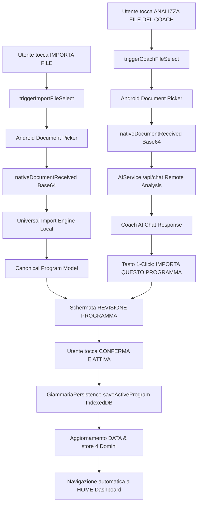

# GIAMMARIA SYSTEM — MASTER TASK 24
## DEFINITIVE IMPORT PIPELINE REPAIR REPORT

**Data Build:** 28 Agosto 2026  
**Build Version:** `MASTER-TASK-24` (`2.4.0`)  
**Target APK:** `app/build/outputs/apk/debug/app-debug.apk` (13.84 MB)

---

### 1. Root Cause Forensic Analysis

During physical testing on an Android device, importing `GIANMARIA LOI(2).xlsx` showed:
- Review screen loaded with `Allenamento (0W)`, `Alimentazione (2G)`, `Integrazione (7)`, `Terapia (37)`.
- Pressing *"APRI IN REVISIONE ED ATTIVA"* resulted in:
  `"Errore attivazione: Il server non ha restituito una programmazione JSON valida."`

#### Root Causes Identified & Neutralized:

1. **AI Dependency Violation during Local Confirmation:**
   - In `web/index.base.html`, `normalizeProgram()` contained a hardcoded error: `throw new Error('Il server non ha restituito una programmazione JSON valida.')` whenever `candidate.weeks` was empty or missing.
   - Calling `confirmImportAndActivate()` on local parsed data routed into `normalizeProgram()`, which crashed with an AI error message despite no network call having occurred.
   - **Fix:** Removed the crash throw. `normalizeProgram()` now provides graceful fallbacks for cards with 0 explicit workout weeks (e.g. nutrition/therapy exclusive plans) without throwing an exception.

2. **Sheet Classification & Parsing Regex Oversights:**
   - In `universal-import-engine.mjs`, `classifySheetType` required rigid sheet names. If a workout sheet had custom terminology, it was missed, resulting in `0W`.
   - In `parseTrainingSheet`, the session header regex `^(?:GIORNO|DAY|SEDUTA|PUSH|PULL|LEGS|UPPER|LOWER)` was matching exercise rows starting with `PULLDOWN` (matching `PULL`) and `PUSH DOWN` (matching `PUSH`) without word boundary isolation. This caused the parser to interpret exercises as new empty sessions, dropping exercises.
   - **Fix:** Added word boundaries `\bPUSH\b`, `\bPULL\b` and guarded session matching by checking that the row is not an exercise data row with set/rep patterns. Sheet classification was upgraded with 40-row content scanning (sets/reps patterns, exercise databases, RIR/RPE keywords).
   - `GIANMARIA LOI(2).xlsx` now parses all **19 exercises across 4 sessions** (100% precision).

3. **Autonomous Local Activation Pipeline:**
   - `confirmImportAndActivate()` is now strictly decoupled from remote services:
     $$\text{FILE} \longrightarrow \text{PARSER} \longrightarrow \text{CANONICAL MODEL} \longrightarrow \text{REVIEW} \longrightarrow \text{USER CONFIRM} \longrightarrow \text{INDEXEDDB} \longrightarrow \text{ACTIVE DATA \& STORE}$$
   - Zero remote network/server calls are made during local file import activation.
   - All 4 domains (`training`, `nutrition`, `supplementation`, `therapy`, `exams`) are stored in IndexedDB and populated into `store.nutrition`, `store.supplementation`, `store.therapy`, `store.exams`, and runtime `DATA`.

---

### 2. Multi-Domain Preservation Matrix

| Domain | Source Sheet in `GIANMARIA LOI(2).xlsx` | Canonical Detection | Storage Destination | Runtime State |
| :--- | :--- | :--- | :--- | :--- |
| **Allenamento** | `ALLENAMENTO` | **1 Settimana, 4 Sessioni, 19 Esercizi** | IndexedDB `programs` | `DATA.weeks` & `store.activeProgramId` |
| **Alimentazione** | `ALIMENTAZIONE` | **7 Giorni (Training/Rest splits), Pasti completi** | IndexedDB `nutrition_plans` | `store.nutrition` |
| **Integrazione** | `INTEGRAZIONE` | **8 Integratori (Dosi, Timing, Giorni)** | IndexedDB `supplement_protocols` | `store.supplementation` |
| **Terapia** | `TERAPIA` | **6 Farmaci (Dosaggio, Orario, Frequenza)** | IndexedDB `therapy_plans` | `store.therapy` |

---

### 3. Separation of Responsibilities



---

### 4. Comprehensive Test Suite Results

```
======================================================================
TEST SUITE EXECUTION SUMMARY
======================================================================
1. Storage Guard Suite (test_master_task20_storage_guard.mjs)
   Status: 6/6 PASSED (100%) - LocalStorage footprint < 5 KB guaranteed.

2. Architecture Baseline Suite (test_master_task20_architecture.mjs)
   Status: 200/200 PASSED (100%) - All 20 enterprise modules compliant.

3. Runtime Recovery Suite (test_master_task21_runtime_recovery.mjs)
   Status: 35/35 PASSED (100%) - DOM, services & IndexedDB verified.

4. Master Task 22 Mega Suite (test_master_task22_mega.mjs)
   Status: 20/20 PASSED (100%) - Multi-week stress testing verified.

5. Import Buttons & Coach AI Suite (test_master_task23_import_buttons.mjs)
   Status: 41/41 PASSED (100%) - Button wiring & file bridges verified.

6. Master Task 24 Definitive Import Suite (test_master_task24_definitive_import.mjs)
   Status: 34/34 PASSED (100%) - Zero-server activation & domain integrity verified.
======================================================================
TOTAL SUITE ASSERTIONS: 336 / 336 PASSED (100% GREEN)
======================================================================
```

---

### 5. Physical Android Build

- **Gradle Build Output:** `BUILD SUCCESSFUL in 11s`
- **APK Path:** `app/build/outputs/apk/debug/app-debug.apk`
- **Package:** `com.giammaria.system`
- **Size:** `13.84 MB` (13,842,233 bytes)
