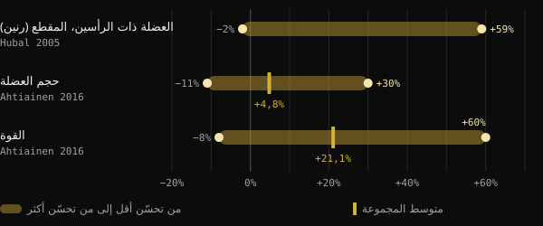
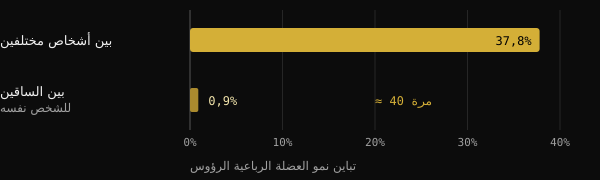
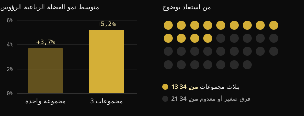

# المستجيبون الضعفاء: ما مدى تأثير الجينات حقًا في نمو العضلات؟

تتدرب منذ شهور، وتلتزم بالبرنامج، ومع ذلك ينمو زميلك في النادي ضعف ما تنمو. والإغراء كبير بأن نُنهي النقاش بكلمة واحدة: الجينات. في هذا المقال ستعرف ما الذي تقيسه الدراسات فعلًا عن "المستجيبين العالين" و"المستجيبين الضعفاء"، وما وزن الحمض النووي في الأمر، ولماذا يصعب أن تعرف كيف تستجيب أنت.

## باختصار

- مع البرنامج نفسه يتفاوت نمو العضلات تفاوتًا كبيرًا: ففي دراسة شملت 585 شخصًا تراوح التغير في مساحة مقطع العضلة ذات الرأسين بين −2% و+59%.
- للجينات دور: نحو نصف الفروق في القوة بين الأشخاص غير الممارسين للرياضة يُعزى إلى عوامل وراثية. أما النصف الآخر فلا.
- جزء مما يبدو "عدم استجابة" هو مجرد ضوضاء: خطأ في القياس، وتقلبات يومية، وبرامج قصيرة جدًا.
- من يستجيب قليلًا في مؤشر ما يتحسن غالبًا في مؤشر آخر. ففي دراسة على 110 أشخاص فوق 65 عامًا، لم يبقَ أحد دون فائدة.
- زيادة الحجم التدريبي تفيد بعض الأشخاص لا جميعهم: وقبل الحديث عن الجينات يجدر التحقق من البرنامج ومدته والقياسات.

## لماذا لا يخبرك جسم مكتمل النمو شيئًا عن الجينات

أمام جسم شديد التطور نفكر بالعكس: ننطلق من النتيجة ونخمّن السبب. لكن النتيجة هي حصيلة سنوات من التدريب والتغذية والنوم والأخطاء المصحَّحة والمواظبة. ولا يمكن فصل هذه العوامل بعضها عن بعض انطلاقًا من صورة واحدة.

منطلق هذا المقال منشور للمدرب Valerio Acri. فهو يقارن بين صورتين له، الأولى في العشرين من عمره والثانية بعد 24 عامًا من تمارين الأثقال، ويدعو إلى التساؤل: هل كان أحد سيتحدث عن "جينات مذهلة" لو رأى الصورة الأولى؟ وفكرته وجيهة: الجينات مهمة، لكن الإسهام الجيني ليس قدرًا محتومًا.

## إلى أي حد تتباين الاستجابات للتدريب فعلًا

تؤكد أكبر الدراسات أن الفروق بين الأشخاص هائلة، حتى مع بروتوكولات متطابقة وتحت إشراف مباشر.

في دراسة FAMuSS، درّب 585 رجلًا وامرأة عضلات ثني المرفق في ذراع واحدة فقط لمدة 12 أسبوعًا. وتراوح التغير في مساحة المقطع العرضي للعضلة ذات الرأسين، المقاسة بالرنين المغناطيسي، بين −2% و+59%. أما القوة القصوى في تكرار واحد (1RM) فقد زادت بين 0% و+250%.

وفي تحليل فنلندي شمل 287 بالغًا تتراوح أعمارهم بين 19 و78 عامًا، منهم 72 في مجموعة الضبط، كان متوسط الزيادة في حجم العضلات 4,8%. غير أن المشارك الواحد كان قد يتراوح تغيره بين −11% و+30%. وبالنسبة إلى القوة كان المتوسط +21,1%، بقيم تتراوح بين −8% و+60%. ولم يفسّر العمر ولا الجنس هذه الفروق.

*المصادر: Hubal et al., Med Sci Sports Exerc 2005 (العضلة ذات الرأسين، رنين مغناطيسي)؛ Ahtiainen et al., Age 2016 (حجم العضلات والقوة). لا تذكر دراسة Hubal المتوسط في الملخص. رسم Nurvan.*

## ما وزن الجينات

جمعت دراسة تحليلية يابانية 24 دراسة عن وراثية القوة، بإجمالي 58 قياسًا. وكان متوسط وراثية القوة، أي حصة الفروق بين الأشخاص العائدة إلى عوامل جينية، 0,52. وببساطة: الجينات والبيئة يتقاسمان الأثر تقريبًا بالتساوي، ومع التقدم في العمر يزداد وزن البيئة.

انتبه إلى طريقة قراءة هذا الرقم. فهو يخص القوة الأساسية لدى غير الممارسين للرياضة، لا مقدار التحسن بالتدريب. لكنه يُظهر أن الاختلاف البيولوجي بين الأفراد حقيقي، وأنه لا يفسّر كل شيء.

وتوضح ذلك دراسة برازيلية. فقد عمل عشرون شابًا مدرَّبًا سلفًا لمدة 8 أسابيع، بساق واحدة وفق برنامج تصاعدي تقليدي، وبالساق الأخرى وفق برنامج يغيّر باستمرار الحمل والحجم ونوع الانقباض وفترات الراحة. فنمت الساقان بصورة متطابقة تقريبًا. أما الفرق بين شخص وآخر فكان أكبر بنحو 40 مرة من الفرق بين ساقَي الشخص نفسه.

*المصدر: Damas et al., J Appl Physiol 2019 (n = 20، المقطع العرضي للعضلة الفخذية الوحشية). رسم Nurvan.*

لا يعني هذا أن البرنامج غير مهم. بل يعني أن الفرق بين برنامجين جيدي البناء صغير، بينما تؤثر خصائص الشخص تأثيرًا كبيرًا.

## مستجيب ضعيف مقارنةً بماذا؟

هنا يصبح الموضوع مثيرًا. فالمستجيب الضعيف يُصنَّف كذلك بالنسبة إلى قياس وجرعة ومدة محددة. وإذا تغيّر أحد هذه العناصر فقد يتغير التصنيف.

**الحجم التدريبي.** في دراسة نرويجية، درّب 34 شخصًا غير مدرَّبين إحدى ساقيهم لمدة 12 أسبوعًا بمجموعة واحدة لكل تمرين، والأخرى بثلاث مجموعات. ومع ثلاث مجموعات نما مقطع العضلة الفخذية الرباعية في المتوسط 5,2%، مقابل 3,7% مع مجموعة واحدة. لكن 13 مشاركًا فقط من أصل 34 أظهروا أفضلية واضحة للحجم الأكبر في التضخم. أما عند الباقين فكان الفرق صغيرًا أو معدومًا.

*المصدر: Hammarström et al., J Physiol 2020 (n = 34، 12 أسبوعًا، تدريب متقابل الطرفين). رسم Nurvan.*

وعند المتدربين، قارنت دراسة برازيلية على 16 شخصًا بين حجم معياري قدره 22 مجموعة أسبوعيًا وحجم يعادل 1,2 ضعف ما كان كل منهم يؤديه أصلًا. فحقق الحجم المخصَّص نموًا أكبر: بمتوسط 1,08 سم² زيادة في المقطع.

**الحمل.** هنا الجواب مختلف. ففي 27 امرأة في نحو الثامنة والستين، أعطى التدريب بـ10 أو 15 تكرارًا قصوى نتائج متشابهة. وحافظ ثلاثة من كل أربعة مشاركين على وضعهم نفسه، مستجيبين أو غير مستجيبين، مع الحمليْن كليهما. فتغيير الحمل لم "يفتح الباب" أمام من كانوا يستجيبون قليلًا.

**المدة والنتيجة المقيسة.** دراسة هولندية على 110 أشخاص فوق 65 عامًا تقول ذلك في عنوانها: لا يوجد من لا يستجيب لتدريب المقاومة. وعند الانتقال من 12 إلى 24 أسبوعًا من التدريب زادت الاستجابات الإيجابية. وتحسّن كل مشارك في واحد على الأقل من: الكتلة الخالية من الدهون، وحجم الألياف، والقوة، والقدرة الوظيفية.

## لماذا يصعب أن تعرف كيف تستجيب

حتى مع أجهزة المختبر، يصعب تمييز الاستجابة الحقيقية من الضوضاء. وتوضح مراجعة نُشرت في Journal of Applied Physiology أن خطأ القياس والتذبذبات الطبيعية للجسم يضخّمان التباين الظاهري. ولفصلهما يلزم تكرار التدخلات على الشخص نفسه. ولهذا اقترح باحثون برازيليون عام 2025 تصميمًا بساق مدرَّبة وأخرى للمقارنة، لأن كثيرًا من الدراسات لا تنجح في عزل الاستجابة الحقيقية لكل فرد.

وفي الدراسة الفنلندية، وبمقارنة النتائج بمن لم يتدرب، كان 29% من المشاركين ضمن المستجيبين الضعفاء من حيث الكتلة، لكن 7% فقط من حيث القوة. الشخص نفسه، واستجابات مختلفة بحسب ما تقيسه.

وإذا كان الأمر صعبًا في المختبر، فهو أصعب بكثير أمام المرآة وميزان البيت.

## ماذا يقول البحث حقًا

المنطلق هو منشور Valerio Acri. وهذه أبرز ما ورد فيه، مقارَنًا بالمصادر.

- **مؤكَّد** — "للجينات دور." وراثية القوة نحو 0,52 والتباين بين الأشخاص كبير حتى مع برامج متطابقة.
- **مؤكَّد** — "الإسهام الجيني لا يعني الحتمية." في الدراسة التحليلية نفسها يتقارب وزن الجينات والبيئة، وتزداد أهمية البيئة مع العمر.
- **يحتاج إلى توضيح** — "الاستجابة الملاحَظة في ظروف معينة ليست خاصية ثابتة." ينطبق هذا على الحجم والمدة: فمزيد من المجموعات والأسابيع يغيّر الصورة عند بعض الأشخاص. أما تغيير الحمل أو تنويع البرنامج فلم يغيّر وضع أغلب المشاركين.
- **يحتاج إلى توضيح** — "إن لم تنمُ عضلاتك فأنت بحاجة إلى حجم أكبر؟" في المتوسط يعطي الحجم الأكبر نموًا أكبر، لكن الأفضلية الواضحة تظهر عند نحو 4 أشخاص من كل 10.
- **غير قابل للتحقق** — "لن تعرف ذلك حتى بعد سنتين أو ثلاث." هذا معقول بالنظر إلى حدود القياس، لكن مدة الدراسات تتراوح بين 8 و24 أسبوعًا. وعلى مدى سنوات لا توجد بيانات مضبوطة.

## كيف تطبّق ذلك

1. **قِس أكثر من شيء.** الأحمال والتكرارات، والوزن، والمحيطات، والصور في الظروف نفسها. ثبات مؤشر واحد لا يعني ثبات كل شيء.
2. **فكّر بالكتل لا بالأسابيع.** قيّم تقدمك على مدى 8 إلى 12 أسبوعًا مع برنامج ثابت.
3. **راجع الأساسيات قبل الجينات.** تدرج الأحمال، ومجموعات قريبة من الفشل العضلي، وبروتين وسعرات كافية، والنوم.
4. **جرّب رفع الحجم تدريجيًا.** في الدراسات، كان الانطلاق من الحجم الذي تؤديه أصلًا ثم زيادته أفضل من رقم معياري.
5. **غيّر متغيرًا واحدًا في كل مرة.** إذا عدّلت كل شيء معًا فلن تعرف أبدًا ما الذي نجح.

<h3>اكتشف كيف تستجيب أنت، بالبيانات</h3>

يسجّل Nurvan الأحمال والتكرارات وRIR لكل مجموعة إلى جانب الوزن والقياسات والتغذية. وهكذا تقارن بين كتل تدريبية بأحجام مختلفة وترى استجابتك عبر شهور من البيانات، لا من انطباع في المرآة.

<a href="https://nurvan.app">جرّب Nurvan</a>

## أسئلة شائعة

### كيف أعرف إن كنت مستجيبًا ضعيفًا؟

لا يمكن الجزم بذلك. يلزم برنامج جيد البناء، يُتَّبع بانتظام لعدة شهور، ويُقاس بعدة مؤشرات. وحتى حينها تصح النتيجة لذلك البرنامج وذلك الحجم وتلك الفترة من حياتك.

### إن لم تنمُ عضلاتي، هل عليّ أن أزيد المجموعات؟

قد يفيد ذلك: ففي المتوسط يؤدي الحجم الأكبر إلى نمو أكبر، وقد أعطى الحجم المخصَّص نتائج أفضل من الحجم المعياري. لكن هذا لا ينطبق على الجميع. تحقق أولًا من تدرج الأحمال والشدة والتغذية والنوم.

### ما حصة الحمض النووي في نمو العضلات؟

بالنسبة إلى القوة الأساسية، يقدَّر متوسط الوراثية بنحو 50%. ولا يوجد رقم دقيق للاستجابة للتدريب، وتعتمد الفروق أيضًا على القياسات والمدة والبرنامج.

### هل نصبح مستجيبين ضعفاء مع التقدم في العمر؟

في الدراسات المذكورة لم يفسّر العمر ولا الجنس الفروق الفردية. وعند من تجاوزوا 65 عامًا وتمت متابعتهم 24 أسبوعًا، تحسّن كل مشارك في مؤشر واحد على الأقل.

## المصادر

1. Hubal MJ et al., 2005. Variability in muscle size and strength gain after unilateral resistance training. *Med Sci Sports Exerc* 37(6):964–72. [PMID 15947721](https://pubmed.ncbi.nlm.nih.gov/15947721/)
2. Ahtiainen JP et al., 2016. Heterogeneity in resistance training-induced muscle strength and mass responses in men and women of different ages. *Age (Dordr)* 38(1):10. [PMID 26767377](https://pubmed.ncbi.nlm.nih.gov/26767377/) · [DOI 10.1007/s11357-015-9870-1](https://doi.org/10.1007/s11357-015-9870-1)
3. Zempo H et al., 2017. Heritability estimates of muscle strength-related phenotypes: A systematic review and meta-analysis. *Scand J Med Sci Sports* 27(12):1537–1546. [PMID 27882617](https://pubmed.ncbi.nlm.nih.gov/27882617/) · [DOI 10.1111/sms.12804](https://doi.org/10.1111/sms.12804)
4. Damas F et al., 2019. Myofibrillar protein synthesis and muscle hypertrophy individualized responses to systematically changing resistance training variables in trained young men. *J Appl Physiol* 127(3):806–815. [PMID 31268828](https://pubmed.ncbi.nlm.nih.gov/31268828/) · [DOI 10.1152/japplphysiol.00350.2019](https://doi.org/10.1152/japplphysiol.00350.2019)
5. Hammarström D et al., 2020. Benefits of higher resistance-training volume are related to ribosome biogenesis. *J Physiol* 598(3):543–565. [PMID 31813190](https://pubmed.ncbi.nlm.nih.gov/31813190/) · [DOI 10.1113/JP278455](https://doi.org/10.1113/JP278455)
6. Scarpelli MC et al., 2022. Muscle Hypertrophy Response Is Affected by Previous Resistance Training Volume in Trained Individuals. *J Strength Cond Res* 36(4):1153–1157. [PMID 32108724](https://pubmed.ncbi.nlm.nih.gov/32108724/) · [DOI 10.1519/JSC.0000000000003558](https://doi.org/10.1519/JSC.0000000000003558)
7. Ribeiro AS et al., 2026. Responsiveness of muscle mass gain to different load intensities of resistance training in older women: A randomized crossover study. *Exp Gerontol* 223:113261. [PMID 42551773](https://pubmed.ncbi.nlm.nih.gov/42551773/) · [DOI 10.1016/j.exger.2026.113261](https://doi.org/10.1016/j.exger.2026.113261)
8. Churchward-Venne TA et al., 2015. There Are No Nonresponders to Resistance-Type Exercise Training in Older Men and Women. *J Am Med Dir Assoc* 16(5):400–11. [PMID 25717010](https://pubmed.ncbi.nlm.nih.gov/25717010/) · [DOI 10.1016/j.jamda.2015.01.071](https://doi.org/10.1016/j.jamda.2015.01.071)
9. Hecksteden A et al., 2015. Individual response to exercise training - a statistical perspective. *J Appl Physiol* 118(12):1450–9. [PMID 25663672](https://pubmed.ncbi.nlm.nih.gov/25663672/) · [DOI 10.1152/japplphysiol.00714.2014](https://doi.org/10.1152/japplphysiol.00714.2014)
10. Chaves TS et al., 2025. Within-individual design for assessing true individual responses in resistance training-induced muscle hypertrophy. *Front Sports Act Living* 7:1517190. [PMID 39958513](https://pubmed.ncbi.nlm.nih.gov/39958513/) · [DOI 10.3389/fspor.2025.1517190](https://doi.org/10.3389/fspor.2025.1517190)

مقال مستوحى من منشور لـ [Dott. & Coach Valerio Acri (@valerio_acri)](https://www.instagram.com/p/Ddf-0MRF7p0/). المصادر مُراجَعة عبر PubMed.

> ملاحظة: محتوى إعلامي، ولا يغني عن رأي الطبيب أو المختص المؤهل.
