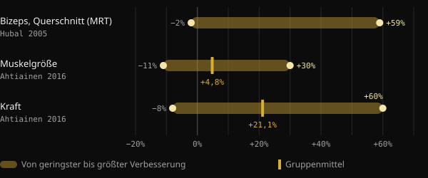
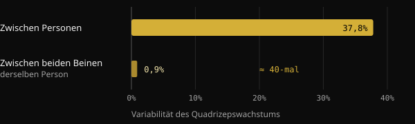
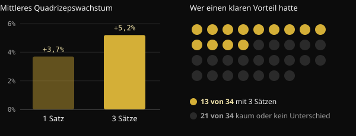

# Low Responder: Wie viel macht die Genetik beim Muskelaufbau wirklich aus?

Du trainierst seit Monaten, hältst dich an den Plan – und dein Trainingspartner baut trotzdem doppelt so schnell auf. Die Versuchung ist groß, das Thema mit einem Wort abzuhaken: Genetik. Hier erfährst du, was Studien zu „High Respondern“ und „Low Respondern“ tatsächlich messen, wie viel die DNA ausmacht und warum sich so schwer sagen lässt, wie du selbst ansprichst.

## Kurz gefasst

- Bei identischem Programm fällt der Muskelzuwachs extrem unterschiedlich aus: In einer Studie mit 585 Personen reichte die Veränderung des Bizepsquerschnitts von −2 % bis +59 %.
- Die Genetik spielt eine Rolle: Etwa die Hälfte der Kraftunterschiede zwischen untrainierten Menschen lässt sich auf erbliche Faktoren zurückführen. Die andere Hälfte nicht.
- Ein Teil dessen, was nach „Nichtansprechen“ aussieht, ist Rauschen: Messfehler, Tagesschwankungen, zu kurze Programme.
- Wer bei einem Parameter wenig anspricht, verbessert sich oft bei einem anderen. In einer Studie mit 110 über 65-Jährigen blieb niemand ohne Nutzen.
- Mehr Volumen hilft einem Teil der Menschen, aber nicht allen: Bevor du von Genetik sprichst, lohnt sich ein Blick auf Programm, Dauer und Messungen.

## Warum ein fertiger Körper nichts über die Genetik verrät

Vor einem sehr gut entwickelten Körper denken wir rückwärts: Wir gehen vom Ergebnis aus und raten die Ursache. Das Ergebnis ist aber die Summe aus Jahren an Training, Ernährung, Schlaf, korrigierten Fehlern und Beständigkeit. Aus einem Foto lassen sich diese Faktoren nicht voneinander trennen.

Der Anstoß für diesen Artikel ist ein Post des Coaches Valerio Acri. Er stellt zwei Fotos von sich gegenüber, das erste mit Anfang zwanzig, das zweite nach 24 Jahren Krafttraining, und fragt, ob beim ersten irgendjemand von „unglaublicher Genetik“ gesprochen hätte. Sein Punkt ist nachvollziehbar: Die Genetik zählt, aber ein genetischer Beitrag ist kein Schicksal.

## Wie stark die Trainingsreaktionen wirklich schwanken

Die größten Studien bestätigen, dass die Unterschiede zwischen Menschen enorm sind – selbst bei identischen, betreuten Protokollen.

In der FAMuSS-Studie trainierten 585 Männer und Frauen zwölf Wochen lang die Ellenbogenbeuger eines Arms. Der per Magnetresonanztomografie gemessene Bizepsquerschnitt veränderte sich zwischen −2 % und +59 %. Die Maximalkraft bei einer Wiederholung (1RM) stieg zwischen 0 % und +250 %.

Eine finnische Analyse mit 287 Erwachsenen zwischen 19 und 78 Jahren, darunter 72 Kontrollpersonen, fand einen durchschnittlichen Zuwachs der Muskelgröße von 4,8 %. Beim einzelnen Teilnehmer konnte der Wert jedoch zwischen −11 % und +30 % liegen. Bei der Kraft lag der Mittelwert bei +21,1 %, mit Werten zwischen −8 % und +60 %. Alter und Geschlecht erklärten diese Unterschiede nicht.

*Quellen: Hubal et al., Med Sci Sports Exerc 2005 (Bizeps, Magnetresonanztomografie); Ahtiainen et al., Age 2016 (Muskelgröße und Kraft). Hubal gibt im Abstract keinen Mittelwert an. Grafik: Nurvan.*

## Wie viel die Genetik ausmacht

Eine japanische Metaanalyse hat 24 Studien zur Erblichkeit der Kraft mit 58 Messungen zusammengetragen. Die mittlere Erblichkeit der Kraft, also der Anteil der Unterschiede zwischen Menschen, der sich auf genetische Faktoren zurückführen lässt, lag bei 0,52. Einfach gesagt: Gene und Umwelt wiegen ungefähr gleich schwer, und mit dem Alter nimmt das Gewicht der Umwelt zu.

Vorsicht bei der Deutung. Die Zahl betrifft die Ausgangskraft untrainierter Menschen, nicht die Frage, wie stark man sich durch Training verbessert. Sie zeigt aber, dass die individuelle Biologie real ist – und dass sie nicht alles erklärt.

Eine brasilianische Studie macht das anschaulich. Zwanzig bereits trainierte junge Männer trainierten acht Wochen lang ein Bein nach einem klassischen progressiven Programm und das andere nach einem Programm, das Last, Volumen, Kontraktionsart und Pausen ständig wechselte. Beide Beine wuchsen nahezu gleich. Der Unterschied von Person zu Person war dagegen rund 40-mal größer als der zwischen den beiden Beinen derselben Person.

*Quelle: Damas et al., J Appl Physiol 2019 (n = 20, Querschnitt des Vastus lateralis). Grafik: Nurvan.*

Das Ergebnis heißt nicht, dass das Programm egal ist. Es heißt, dass der Unterschied zwischen zwei gut aufgebauten Programmen klein ist, während die Eigenschaften der Person stark ins Gewicht fallen.

## Low Responder – gemessen woran?

Hier wird es interessant. Ein „Low Responder“ ist das immer bezogen auf eine bestimmte Messgröße, eine bestimmte Dosis und eine bestimmte Dauer. Ändert sich eines davon, kann sich auch die Einordnung ändern.

**Das Volumen.** In einer norwegischen Studie trainierten 34 untrainierte Personen zwölf Wochen lang ein Bein mit einem Satz pro Übung und das andere mit drei Sätzen. Mit drei Sätzen wuchs der Quadrizepsquerschnitt im Schnitt um 5,2 %, mit einem Satz um 3,7 %. Aber nur 13 von 34 Teilnehmern zeigten bei der Hypertrophie einen klaren Vorteil durch das höhere Volumen. Bei den übrigen war der Unterschied klein oder nicht vorhanden.

*Quelle: Hammarström et al., J Physiol 2020 (n = 34, 12 Wochen, kontralaterales Trainingsdesign). Grafik: Nurvan.*

Bei Trainierten verglich eine brasilianische Studie an 16 Personen ein Standardvolumen von 22 Sätzen pro Woche mit einem Volumen, das dem 1,2-Fachen dessen entsprach, was jeder Einzelne ohnehin schon machte. Das individualisierte Volumen brachte mehr Wachstum: im Schnitt 1,08 cm² mehr Querschnitt.

**Die Last.** Hier fällt die Antwort anders aus. Bei 27 Frauen um die 68 Jahre führte das Training mit 10 oder mit 15 maximalen Wiederholungen zu ähnlichen Ergebnissen. Drei von vier Teilnehmerinnen behielten mit beiden Lasten denselben Status, Responder oder Non-Responder. Der Wechsel der Last hat diejenigen, die wenig ansprachen, nicht „freigeschaltet“.

**Die Dauer und die gemessene Zielgröße.** Eine niederländische Studie mit 110 über 65-Jährigen sagt es schon im Titel: Es gibt keine Non-Responder beim Krafttraining. Beim Übergang von 12 auf 24 Trainingswochen nahmen die positiven Reaktionen zu. Und jeder Teilnehmer verbesserte sich bei mindestens einer der Größen fettfreie Masse, Fasergröße, Kraft und funktionelle Leistungsfähigkeit.

## Warum es so schwer ist zu wissen, wie du ansprichst

Selbst mit Laborgeräten ist es kompliziert, eine echte Reaktion vom Rauschen zu unterscheiden. Eine im Journal of Applied Physiology veröffentlichte Übersichtsarbeit erklärt, dass Messfehler und die normalen Schwankungen des Organismus die scheinbare Variabilität aufblähen. Um beides zu trennen, bräuchte es wiederholte Interventionen an derselben Person. Brasilianische Forscher haben deshalb 2025 ein Design mit einem trainierten Bein und einem Vergleichsbein vorgeschlagen, weil viele Studien die echte Reaktion des Einzelnen nicht isolieren können.

In der finnischen Studie fielen im Vergleich mit den Nichttrainierenden 29 % der Teilnehmer bei der Muskelmasse unter die Low Responder, bei der Kraft aber nur 7 %. Dieselbe Person, unterschiedliche Reaktionen – je nachdem, was du misst.

Wenn es schon im Labor schwierig ist, dann erst recht mit Spiegel und Waage zu Hause.

## Was die Forschung wirklich sagt

Der Anstoß ist der Post von Valerio Acri. Hier seine wichtigsten Aussagen im Abgleich mit den Quellen.

- **Bestätigt** — „Die Genetik zählt.“ Die Erblichkeit der Kraft liegt bei etwa 0,52, und die Variabilität zwischen Personen ist auch bei identischen Programmen groß.
- **Bestätigt** — „Ein genetischer Beitrag bedeutet keinen Determinismus.“ In derselben Metaanalyse wiegen Gene und Umwelt vergleichbar schwer, und die Umwelt gewinnt mit dem Alter an Gewicht.
- **Zu präzisieren** — „Eine unter bestimmten Bedingungen beobachtete Reaktion ist keine unveränderliche Eigenschaft.“ Das gilt für Volumen und Dauer: Mehr Sätze und mehr Wochen verändern das Bild für einen Teil der Menschen. Die Last zu wechseln oder das Programm zu variieren hat den Status der meisten Teilnehmer dagegen nicht verändert.
- **Zu präzisieren** — „Wenn du nicht wächst, brauchst du mehr Volumen?“ Im Schnitt bringt mehr Volumen mehr Wachstum, ein klarer Vorteil zeigt sich aber nur bei etwa 4 von 10 Personen.
- **Nicht überprüfbar** — „Du wüsstest es nicht einmal nach zwei oder drei Jahren.“ Angesichts der Messgrenzen ist das plausibel, die Studien dauern aber 8 bis 24 Wochen. Kontrollierte Daten über Jahre gibt es nicht.

## So setzt du es um

1. **Miss mehr als eine Sache.** Gewichte und Wiederholungen, Körpergewicht, Umfänge und Fotos unter gleichen Bedingungen. Ein Parameter, der stagniert, heißt nicht, dass alles stagniert.
2. **Denk in Blöcken, nicht in Wochen.** Beurteile deinen Fortschritt über 8–12 Wochen mit einem gleichbleibenden Programm.
3. **Prüf erst die Grundlagen, dann die Genetik.** Progression bei den Gewichten, Sätze nahe am Muskelversagen, ausreichend Protein und Kalorien, Schlaf.
4. **Versuch, das Volumen schrittweise zu erhöhen.** In den Studien hat es besser funktioniert, vom bereits absolvierten Volumen auszugehen und es zu steigern, als eine Standardzahl vorzugeben.
5. **Ändere immer nur eine Variable.** Wenn du alles gleichzeitig umstellst, erfährst du nie, was gewirkt hat.

<h3>Finde mit Daten heraus, wie du ansprichst</h3>

Nurvan erfasst Gewichte, Wiederholungen und RIR jedes Satzes zusammen mit Körpergewicht, Maßen und Ernährung. So vergleichst du Trainingsblöcke mit unterschiedlichem Volumen und siehst deine Reaktion über Monate an Daten – nicht anhand eines Eindrucks im Spiegel.

<a href="https://nurvan.app">Nurvan ausprobieren</a>

## Häufige Fragen

### Wie erkenne ich, ob ich ein Low Responder bin?

Mit Sicherheit gar nicht. Du brauchst ein gut aufgebautes Programm, das du viele Monate konsequent durchziehst und anhand mehrerer Parameter auswertest. Selbst dann gilt das Ergebnis nur für dieses Programm, dieses Volumen und diese Phase deines Lebens.

### Muss ich mehr Sätze machen, wenn ich nicht wachse?

Es kann helfen: Im Schnitt führt mehr Volumen zu mehr Wachstum, und ein individualisiertes Volumen hat bessere Ergebnisse gebracht als ein Standardvolumen. Das gilt aber nicht für alle. Prüf zuerst Progression, Intensität, Ernährung und Schlaf.

### Wie viel des Muskelwachstums hängt von der DNA ab?

Für die Ausgangskraft liegt die geschätzte mittlere Erblichkeit bei etwa 50 %. Für die Reaktion auf Training gibt es keine exakte Zahl, und die Unterschiede hängen auch von Messmethoden, Dauer und Programm ab.

### Wird man mit dem Alter zum Low Responder?

In den zitierten Studien erklärten Alter und Geschlecht die individuellen Unterschiede nicht. Bei den über 65-Jährigen, die 24 Wochen begleitet wurden, verbesserte sich jeder Teilnehmer bei mindestens einem Parameter.

## Quellen

1. Hubal MJ et al., 2005. Variability in muscle size and strength gain after unilateral resistance training. *Med Sci Sports Exerc* 37(6):964–72. [PMID 15947721](https://pubmed.ncbi.nlm.nih.gov/15947721/)
2. Ahtiainen JP et al., 2016. Heterogeneity in resistance training-induced muscle strength and mass responses in men and women of different ages. *Age (Dordr)* 38(1):10. [PMID 26767377](https://pubmed.ncbi.nlm.nih.gov/26767377/) · [DOI 10.1007/s11357-015-9870-1](https://doi.org/10.1007/s11357-015-9870-1)
3. Zempo H et al., 2017. Heritability estimates of muscle strength-related phenotypes: A systematic review and meta-analysis. *Scand J Med Sci Sports* 27(12):1537–1546. [PMID 27882617](https://pubmed.ncbi.nlm.nih.gov/27882617/) · [DOI 10.1111/sms.12804](https://doi.org/10.1111/sms.12804)
4. Damas F et al., 2019. Myofibrillar protein synthesis and muscle hypertrophy individualized responses to systematically changing resistance training variables in trained young men. *J Appl Physiol* 127(3):806–815. [PMID 31268828](https://pubmed.ncbi.nlm.nih.gov/31268828/) · [DOI 10.1152/japplphysiol.00350.2019](https://doi.org/10.1152/japplphysiol.00350.2019)
5. Hammarström D et al., 2020. Benefits of higher resistance-training volume are related to ribosome biogenesis. *J Physiol* 598(3):543–565. [PMID 31813190](https://pubmed.ncbi.nlm.nih.gov/31813190/) · [DOI 10.1113/JP278455](https://doi.org/10.1113/JP278455)
6. Scarpelli MC et al., 2022. Muscle Hypertrophy Response Is Affected by Previous Resistance Training Volume in Trained Individuals. *J Strength Cond Res* 36(4):1153–1157. [PMID 32108724](https://pubmed.ncbi.nlm.nih.gov/32108724/) · [DOI 10.1519/JSC.0000000000003558](https://doi.org/10.1519/JSC.0000000000003558)
7. Ribeiro AS et al., 2026. Responsiveness of muscle mass gain to different load intensities of resistance training in older women: A randomized crossover study. *Exp Gerontol* 223:113261. [PMID 42551773](https://pubmed.ncbi.nlm.nih.gov/42551773/) · [DOI 10.1016/j.exger.2026.113261](https://doi.org/10.1016/j.exger.2026.113261)
8. Churchward-Venne TA et al., 2015. There Are No Nonresponders to Resistance-Type Exercise Training in Older Men and Women. *J Am Med Dir Assoc* 16(5):400–11. [PMID 25717010](https://pubmed.ncbi.nlm.nih.gov/25717010/) · [DOI 10.1016/j.jamda.2015.01.071](https://doi.org/10.1016/j.jamda.2015.01.071)
9. Hecksteden A et al., 2015. Individual response to exercise training - a statistical perspective. *J Appl Physiol* 118(12):1450–9. [PMID 25663672](https://pubmed.ncbi.nlm.nih.gov/25663672/) · [DOI 10.1152/japplphysiol.00714.2014](https://doi.org/10.1152/japplphysiol.00714.2014)
10. Chaves TS et al., 2025. Within-individual design for assessing true individual responses in resistance training-induced muscle hypertrophy. *Front Sports Act Living* 7:1517190. [PMID 39958513](https://pubmed.ncbi.nlm.nih.gov/39958513/) · [DOI 10.3389/fspor.2025.1517190](https://doi.org/10.3389/fspor.2025.1517190)

Dieser Artikel ist von einem Post von [Dott. & Coach Valerio Acri (@valerio_acri)](https://www.instagram.com/p/Ddf-0MRF7p0/) inspiriert. Quellen über PubMed recherchiert.

> Hinweis: Dieser Inhalt dient der Information und ersetzt nicht den Rat einer Ärztin, eines Arztes oder einer qualifizierten Fachperson.
