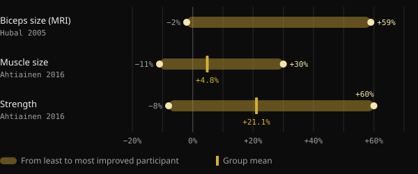
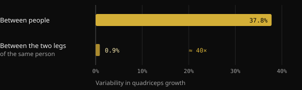
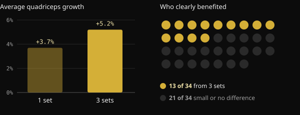

# Low responders: how much do genetics really limit muscle growth?

You have been training for months, you follow the plan, and your gym partner still grows twice as fast. It is tempting to sum it up in one word: genetics. Here is what studies on "high responders" and "low responders" actually measure, how much your DNA matters, and why it is so hard to know how you respond.

## Key takeaways

- On the same program, muscle growth varies enormously: in a study of 585 people, biceps size changed anywhere from −2% to +59%.
- Genetics matter: roughly half of the differences in strength between untrained people can be attributed to inherited factors. The other half cannot.
- Part of what looks like "not responding" is noise: measurement error, day-to-day fluctuations and programs that are too short.
- People who respond poorly on one outcome often improve on another. In a study of 110 adults over 65, nobody was left without a benefit.
- More training volume helps some people, but not everyone. Check your program, its duration and how you measure before blaming genetics.

## Why a finished physique tells you nothing about genetics

When we see a very muscular person, we reason backwards: we start from the result and guess the cause. But that result is the sum of years of training, nutrition, sleep, corrected mistakes and consistency. A photo cannot separate those factors.

This article was inspired by a post from Italian coach Valerio Acri. He compares two of his photos, one in his early twenties and one after 24 years of lifting, and asks whether anyone would have called the first one "incredible genetics". His point holds up: genetics matter, but a genetic contribution is not destiny.

## How much training responses really vary

The largest studies confirm that differences between people are huge, even with identical, supervised programs.

In the FAMuSS study, 585 men and women trained the elbow flexors of one arm for 12 weeks. Biceps cross-sectional area, measured by MRI, changed by −2% to +59%. One-rep max (1RM) strength increased by 0% to +250%.

A Finnish analysis of 287 adults aged 19 to 78, including 72 controls, found an average muscle size increase of 4.8%. Individual participants, however, ranged from −11% to +30%. For strength, the average was +21.1%, with values from −8% to +60%. Age and sex did not explain these differences.

*Sources: Hubal et al., Med Sci Sports Exerc 2005 (biceps, MRI); Ahtiainen et al., Age 2016 (muscle size and strength). Hubal does not report the mean in the abstract. Nurvan chart.*

## How much do genetics matter?

A Japanese meta-analysis pooled 24 studies on the heritability of strength, with 58 measurements. Average heritability, meaning the share of differences between people attributable to genetic factors, was 0.52. Put simply: genes and environment weigh roughly the same, and the role of environment grows with age.

Read this carefully. It refers to baseline strength in untrained people, not to how much you improve with training. Still, it shows that individual biology is real, and that it does not explain everything.

A Brazilian study makes the point clearly. Twenty trained young men spent 8 weeks training one leg on a classic progressive program and the other on a program that constantly changed load, volume, contraction type and rest. Both legs grew almost identically. The difference between one person and another, however, was about 40 times larger than the difference between the two legs of the same person.

*Source: Damas et al., J Appl Physiol 2019 (n = 20, vastus lateralis cross-sectional area). Nurvan chart.*

This does not mean programming is irrelevant. It means that between two well-designed programs the difference is small, while individual characteristics matter a lot.

## A low responder to what, exactly?

This is where it gets interesting. A "low responder" is only a low responder for a specific outcome, dose and duration. Change one of those, and the label can change too.

**Volume.** In a Norwegian study, 34 untrained people trained one leg with 1 set per exercise and the other with 3 sets for 12 weeks. With 3 sets, quadriceps cross-sectional area grew by 5.2% on average, versus 3.7% with one set. But only 13 of the 34 participants showed a clear hypertrophy benefit from the higher volume. For the rest, the difference was small or absent.

*Source: Hammarström et al., J Physiol 2020 (n = 34, 12 weeks, within-subject design). Nurvan chart.*

In trained lifters, a Brazilian study of 16 people compared a standard 22 sets per week with a volume equal to 1.2 times what each person was already doing. The individualized volume produced more growth: on average 1.08 cm² more cross-sectional area.

**Load.** Here the answer is different. In 27 women around 68 years old, training at 10-rep max or 15-rep max gave similar results. Three in four participants kept the same status, responder or non-responder, with both loads. Changing the load did not "unlock" those who responded poorly.

**Duration and the outcome you measure.** A Dutch study of 110 adults over 65 says it in the title: there are no non-responders to resistance training. Going from 12 to 24 weeks of training increased positive responses. And every participant improved in at least one of lean mass, muscle fiber size, strength and physical function.

## Why it is so hard to know how you respond

Even with lab equipment, separating a true response from noise is difficult. A review in the Journal of Applied Physiology explains that measurement error and normal biological fluctuations inflate apparent variability. Separating them would require repeating the intervention on the same person. In 2025, Brazilian researchers proposed a design with one trained leg and one comparison leg for exactly this reason: many studies cannot isolate each person's true response.

In the Finnish study, when results were compared with people who did not train, 29% of participants counted as low responders for muscle size, but only 7% for strength. Same people, different answers depending on what you measure.

If it is that hard in a lab, it is even harder with a mirror and a bathroom scale.

## What the research actually says

The starting point is Valerio Acri's post. Here are its main claims, checked against the sources.

- **Confirmed** — "Genetics matter." Heritability of strength is about 0.52, and individual variability is wide even on identical programs.
- **Confirmed** — "Genetic contribution does not mean genetic determinism." In the same meta-analysis, genes and environment weigh about the same, and environment matters more with age.
- **Needs nuance** — "A response observed under certain conditions is not a fixed trait." That holds for volume and duration: more sets and more weeks change the picture for some people. But changing the load or varying the program did not change the status of most participants.
- **Needs nuance** — "If you are not growing, do you need more volume?" On average more volume means more growth, but a clear benefit shows up in about 4 in 10 people.
- **Not verifiable** — "You would not know even after two or three years." Plausible given measurement limits, but studies last 8 to 24 weeks. There is no controlled data over several years.

## How to apply it

1. **Measure more than one thing.** Loads and reps, body weight, circumferences and photos taken in the same conditions. One stalled number does not mean everything has stalled.
2. **Think in blocks, not weeks.** Judge progress over 8–12 weeks on a consistent program.
3. **Check the basics before genetics.** Load progression, sets close to failure, enough protein and calories, sleep.
4. **Try increasing volume gradually.** In the studies, starting from the volume you already do and building on it worked better than a standard number.
5. **Change one variable at a time.** If you change everything at once, you will never know what worked.

<h3>Find out how you respond, with data</h3>

Nurvan logs the load, reps and RIR of every set alongside body weight, measurements and nutrition. That lets you compare training blocks with different volumes and see your response across months of data, not a guess in the mirror.

<a href="https://nurvan.app">Try Nurvan</a>

## Frequently asked questions

### How do I know if I am a low responder?

You cannot know for sure. You need a well-designed program, followed consistently for many months and measured on more than one outcome. Even then, the result applies to that program, that volume and that stage of your life.

### If I am not growing, should I do more sets?

It may help: on average more volume means more growth, and individualized volume beat a standard prescription. But it does not work for everyone. First check load progression, effort, nutrition and sleep.

### How much of muscle growth is genetic?

For baseline strength, average heritability is estimated at about 50%. There is no precise figure for training response, and differences also depend on measurement, duration and programming.

### Do you become a low responder as you age?

In the studies cited here, age and sex did not explain individual differences. Among adults over 65 followed for 24 weeks, every participant improved on at least one outcome.

## Sources

1. Hubal MJ et al., 2005. Variability in muscle size and strength gain after unilateral resistance training. *Med Sci Sports Exerc* 37(6):964–72. [PMID 15947721](https://pubmed.ncbi.nlm.nih.gov/15947721/)
2. Ahtiainen JP et al., 2016. Heterogeneity in resistance training-induced muscle strength and mass responses in men and women of different ages. *Age (Dordr)* 38(1):10. [PMID 26767377](https://pubmed.ncbi.nlm.nih.gov/26767377/) · [DOI 10.1007/s11357-015-9870-1](https://doi.org/10.1007/s11357-015-9870-1)
3. Zempo H et al., 2017. Heritability estimates of muscle strength-related phenotypes: A systematic review and meta-analysis. *Scand J Med Sci Sports* 27(12):1537–1546. [PMID 27882617](https://pubmed.ncbi.nlm.nih.gov/27882617/) · [DOI 10.1111/sms.12804](https://doi.org/10.1111/sms.12804)
4. Damas F et al., 2019. Myofibrillar protein synthesis and muscle hypertrophy individualized responses to systematically changing resistance training variables in trained young men. *J Appl Physiol* 127(3):806–815. [PMID 31268828](https://pubmed.ncbi.nlm.nih.gov/31268828/) · [DOI 10.1152/japplphysiol.00350.2019](https://doi.org/10.1152/japplphysiol.00350.2019)
5. Hammarström D et al., 2020. Benefits of higher resistance-training volume are related to ribosome biogenesis. *J Physiol* 598(3):543–565. [PMID 31813190](https://pubmed.ncbi.nlm.nih.gov/31813190/) · [DOI 10.1113/JP278455](https://doi.org/10.1113/JP278455)
6. Scarpelli MC et al., 2022. Muscle Hypertrophy Response Is Affected by Previous Resistance Training Volume in Trained Individuals. *J Strength Cond Res* 36(4):1153–1157. [PMID 32108724](https://pubmed.ncbi.nlm.nih.gov/32108724/) · [DOI 10.1519/JSC.0000000000003558](https://doi.org/10.1519/JSC.0000000000003558)
7. Ribeiro AS et al., 2026. Responsiveness of muscle mass gain to different load intensities of resistance training in older women: A randomized crossover study. *Exp Gerontol* 223:113261. [PMID 42551773](https://pubmed.ncbi.nlm.nih.gov/42551773/) · [DOI 10.1016/j.exger.2026.113261](https://doi.org/10.1016/j.exger.2026.113261)
8. Churchward-Venne TA et al., 2015. There Are No Nonresponders to Resistance-Type Exercise Training in Older Men and Women. *J Am Med Dir Assoc* 16(5):400–11. [PMID 25717010](https://pubmed.ncbi.nlm.nih.gov/25717010/) · [DOI 10.1016/j.jamda.2015.01.071](https://doi.org/10.1016/j.jamda.2015.01.071)
9. Hecksteden A et al., 2015. Individual response to exercise training - a statistical perspective. *J Appl Physiol* 118(12):1450–9. [PMID 25663672](https://pubmed.ncbi.nlm.nih.gov/25663672/) · [DOI 10.1152/japplphysiol.00714.2014](https://doi.org/10.1152/japplphysiol.00714.2014)
10. Chaves TS et al., 2025. Within-individual design for assessing true individual responses in resistance training-induced muscle hypertrophy. *Front Sports Act Living* 7:1517190. [PMID 39958513](https://pubmed.ncbi.nlm.nih.gov/39958513/) · [DOI 10.3389/fspor.2025.1517190](https://doi.org/10.3389/fspor.2025.1517190)

Inspired by a post from [Dott. & Coach Valerio Acri (@valerio_acri)](https://www.instagram.com/p/Ddf-0MRF7p0/). Sources reviewed via PubMed.

> Note: this content is for information only and does not replace the advice of a doctor or qualified professional.
