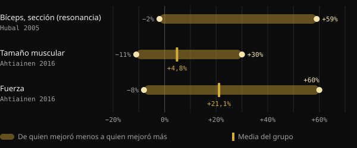
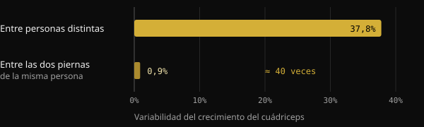
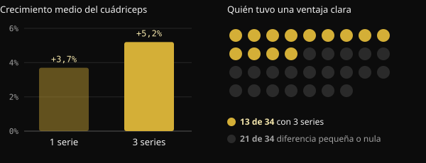

# Low responder: ¿cuánto pesa de verdad la genética en el crecimiento muscular?

Llevas meses entrenando, sigues el programa y, aun así, tu compañero de gimnasio crece el doble. La tentación es zanjar el asunto con una palabra: genética. Aquí verás qué miden realmente los estudios sobre los «high responders» y los «low responders», cuánto pesa el ADN y por qué es difícil saber cómo respondes tú.

## En resumen

- Con el mismo programa, el crecimiento muscular varía muchísimo: en un estudio con 585 personas va de −2% a +59% de sección del bíceps.
- La genética cuenta: alrededor de la mitad de las diferencias de fuerza entre personas sedentarias se puede atribuir a factores hereditarios. La otra mitad, no.
- Parte de lo que parece «no responder» es ruido: error de medición, variaciones de un día a otro, programas demasiado cortos.
- Quien responde poco en un parámetro suele mejorar en otro. En un estudio con 110 mayores de 65 años, nadie se quedó sin beneficios.
- Más volumen ayuda a una parte de las personas, pero no a todas: antes de hablar de genética conviene revisar el programa, la duración y las mediciones.

## Por qué un físico ya construido no te dice nada sobre la genética

Ante un físico muy desarrollado razonamos al revés: partimos del resultado y adivinamos la causa. Pero el resultado es la suma de años de entrenamiento, alimentación, sueño, errores corregidos y constancia. A partir de una fotografía no se pueden separar esos factores.

Este artículo nace de una publicación del coach Valerio Acri. Compara dos fotos suyas, la primera con veinte años y la segunda tras 24 años de pesas, e invita a preguntarse si, viendo la primera, alguien habría hablado de «genética increíble». Su argumento se sostiene: la genética cuenta, pero una contribución genética no es un destino.

## Cuánto varían realmente las respuestas al entrenamiento

Los estudios más grandes confirman que las diferencias entre personas son enormes, incluso con protocolos idénticos y supervisados.

En el estudio FAMuSS, 585 hombres y mujeres entrenaron durante 12 semanas los flexores del codo de un solo brazo. La sección transversal del bíceps, medida con resonancia magnética, cambió entre −2% y +59%. La fuerza máxima en una repetición (1RM) aumentó entre 0% y +250%.

Un análisis finlandés con 287 adultos de entre 19 y 78 años, 72 de ellos de control, encontró un aumento medio del tamaño muscular del 4,8%. Sin embargo, cada participante podía situarse entre −11% y +30%. En fuerza, la media fue de +21,1%, con valores entre −8% y +60%. Ni la edad ni el sexo explicaban esas diferencias.

*Fuentes: Hubal et al., Med Sci Sports Exerc 2005 (bíceps, resonancia magnética); Ahtiainen et al., Age 2016 (tamaño muscular y fuerza). Hubal no indica la media en el abstract. Gráfico de Nurvan.*

## Cuánto pesa la genética

Un metaanálisis japonés reunió 24 estudios sobre la heredabilidad de la fuerza, con 58 mediciones. La heredabilidad media de la fuerza, es decir, la parte de las diferencias entre personas atribuible a factores genéticos, fue de 0,52. Dicho de forma sencilla: genes y ambiente pesan más o menos lo mismo, y con la edad el peso del ambiente aumenta.

Ojo con cómo se lee el dato. Se refiere a la fuerza de base en personas sedentarias, no a cuánto se mejora con el entrenamiento. Pero muestra que la biología individual es real, y que no lo explica todo.

Un estudio brasileño lo deja en evidencia. Veinte jóvenes ya entrenados trabajaron durante 8 semanas una pierna con un programa progresivo clásico y la otra con un programa que cambiaba continuamente la carga, el volumen, el tipo de contracción y los descansos. Las dos piernas crecieron de forma casi idéntica. En cambio, la diferencia entre una persona y otra fue unas 40 veces mayor que la que había entre las dos piernas de la misma persona.

*Fuente: Damas et al., J Appl Physiol 2019 (n = 20, sección transversal del vasto lateral). Gráfico de Nurvan.*

El dato no dice que el programa no importe. Dice que entre dos programas bien diseñados la diferencia es pequeña, mientras que las características de la persona pesan mucho.

## ¿Low responder respecto a qué?

Aquí la cosa se pone interesante. Un «low responder» lo es para una medida, una dosis y una duración concretas. Si cambia una de ellas, la clasificación puede cambiar.

**El volumen.** En un estudio noruego, 34 personas no entrenadas trabajaron durante 12 semanas una pierna con 1 serie por ejercicio y la otra con 3 series. Con 3 series, la sección del cuádriceps creció de media un 5,2%, frente al 3,7% con una serie. Pero solo 13 participantes de 34 mostraron una ventaja clara del mayor volumen en la hipertrofia. En los demás, la diferencia fue pequeña o inexistente.

*Fuente: Hammarström et al., J Physiol 2020 (n = 34, 12 semanas, entrenamiento contralateral). Gráfico de Nurvan.*

En personas entrenadas, un estudio brasileño comparó en 16 sujetos un volumen estándar de 22 series semanales con un volumen igual a 1,2 veces el que cada uno ya hacía. El volumen personalizado produjo más crecimiento: de media, 1,08 cm² más de sección.

**La carga.** Aquí la respuesta es distinta. En 27 mujeres de unos 68 años, entrenar a 10 o a 15 repeticiones máximas dio resultados similares. Tres de cada cuatro participantes mantuvieron la misma condición, responder o non-responder, con ambas cargas. Cambiar la carga no «desbloqueó» a quienes respondían poco.

**La duración y el resultado medido.** Un estudio neerlandés con 110 mayores de 65 años lo dice ya en el título: no existen non-responders al entrenamiento de fuerza. Al pasar de 12 a 24 semanas de entrenamiento, las respuestas positivas aumentaron. Y cada participante mejoró en al menos uno de estos parámetros: masa magra, tamaño de las fibras, fuerza y capacidad funcional.

## Por qué es tan difícil saber cómo respondes

Incluso con equipos de laboratorio, distinguir una respuesta real del ruido es complicado. Una revisión publicada en el Journal of Applied Physiology explica que el error de medición y las oscilaciones normales del organismo inflan la variabilidad aparente. Para separarlas harían falta intervenciones repetidas en la misma persona. Por eso, unos investigadores brasileños propusieron en 2025 un diseño con una pierna entrenada y la otra como comparación, porque muchos estudios no logran aislar la respuesta real de cada uno.

En el estudio finlandés, al comparar los resultados con quienes no entrenaban, el 29% de los participantes entraba entre los low responders en masa, pero solo el 7% en fuerza. La misma persona, respuestas distintas según lo que midas.

Si es difícil en el laboratorio, lo es todavía más con el espejo y la báscula de casa.

## Qué dice de verdad la investigación

El punto de partida es la publicación de Valerio Acri. Estas son sus afirmaciones principales, contrastadas con las fuentes.

- **Confirmado** — «La genética cuenta». La heredabilidad de la fuerza ronda 0,52 y la variabilidad entre personas es amplia incluso con programas idénticos.
- **Confirmado** — «Contribución genética no significa determinismo». En el mismo metaanálisis, genes y ambiente pesan de forma comparable, y el ambiente cuenta más con la edad.
- **Con matices** — «Una respuesta observada en ciertas condiciones no es una característica inmutable». Vale para el volumen y la duración: más series y más semanas cambian el panorama para una parte de las personas. Pero cambiar la carga o variar el programa no modificó la condición de la mayoría de los participantes.
- **Con matices** — «Si no creces, ¿necesitas más volumen?». De media, más volumen da más crecimiento, pero la ventaja clara se ve en unas 4 personas de cada 10.
- **No verificable** — «No lo sabrías ni después de dos o tres años». Es plausible, vistos los límites de la medición, pero los estudios duran entre 8 y 24 semanas. A escala de años no hay datos controlados.

## Cómo aplicarlo

1. **Mide más de una cosa.** Cargas y repeticiones, peso, perímetros y fotos en las mismas condiciones. Que un parámetro esté estancado no significa que todo lo esté.
2. **Piensa en bloques, no en semanas.** Valora los progresos en 8–12 semanas, con un programa constante.
3. **Revisa lo básico antes que la genética.** Progresión de cargas, series cercanas al fallo, proteínas y calorías suficientes, sueño.
4. **Prueba a aumentar el volumen de forma gradual.** En los estudios, partir del volumen que ya haces y aumentarlo funcionó mejor que un número estándar.
5. **Cambia una variable cada vez.** Si lo modificas todo a la vez, nunca sabrás qué funcionó.

<h3>Descubre cómo respondes tú, con datos</h3>

Nurvan registra las cargas, las repeticiones y el RIR de cada serie junto con el peso, las medidas y la alimentación. Así comparas bloques de entrenamiento con volúmenes distintos y ves tu respuesta en meses de datos, no en una impresión frente al espejo.

<a href="https://nurvan.app">Prueba Nurvan</a>

## Preguntas frecuentes

### ¿Cómo sé si soy un low responder?

Con certeza, no puedes saberlo. Hace falta un programa bien diseñado, seguido con constancia durante muchos meses y medido con varios parámetros. Incluso entonces, el resultado vale para ese programa, ese volumen y ese momento de tu vida.

### Si no crezco, ¿tengo que hacer más series?

Puede ayudar: de media, más volumen supone más crecimiento, y un volumen personalizado dio mejores resultados que uno estándar. Pero no sirve para todo el mundo. Antes revisa la progresión de cargas, la intensidad, la alimentación y el sueño.

### ¿Qué parte del crecimiento muscular depende del ADN?

Para la fuerza de base, la heredabilidad media estimada ronda el 50%. No existe una cifra precisa para la respuesta al entrenamiento, y las diferencias dependen también de las mediciones, la duración y el programa.

### ¿Con la edad te vuelves low responder?

En los estudios citados, ni la edad ni el sexo explicaban las diferencias individuales. En los mayores de 65 años seguidos durante 24 semanas, cada participante mejoró en al menos un parámetro.

## Fuentes

1. Hubal MJ et al., 2005. Variability in muscle size and strength gain after unilateral resistance training. *Med Sci Sports Exerc* 37(6):964–72. [PMID 15947721](https://pubmed.ncbi.nlm.nih.gov/15947721/)
2. Ahtiainen JP et al., 2016. Heterogeneity in resistance training-induced muscle strength and mass responses in men and women of different ages. *Age (Dordr)* 38(1):10. [PMID 26767377](https://pubmed.ncbi.nlm.nih.gov/26767377/) · [DOI 10.1007/s11357-015-9870-1](https://doi.org/10.1007/s11357-015-9870-1)
3. Zempo H et al., 2017. Heritability estimates of muscle strength-related phenotypes: A systematic review and meta-analysis. *Scand J Med Sci Sports* 27(12):1537–1546. [PMID 27882617](https://pubmed.ncbi.nlm.nih.gov/27882617/) · [DOI 10.1111/sms.12804](https://doi.org/10.1111/sms.12804)
4. Damas F et al., 2019. Myofibrillar protein synthesis and muscle hypertrophy individualized responses to systematically changing resistance training variables in trained young men. *J Appl Physiol* 127(3):806–815. [PMID 31268828](https://pubmed.ncbi.nlm.nih.gov/31268828/) · [DOI 10.1152/japplphysiol.00350.2019](https://doi.org/10.1152/japplphysiol.00350.2019)
5. Hammarström D et al., 2020. Benefits of higher resistance-training volume are related to ribosome biogenesis. *J Physiol* 598(3):543–565. [PMID 31813190](https://pubmed.ncbi.nlm.nih.gov/31813190/) · [DOI 10.1113/JP278455](https://doi.org/10.1113/JP278455)
6. Scarpelli MC et al., 2022. Muscle Hypertrophy Response Is Affected by Previous Resistance Training Volume in Trained Individuals. *J Strength Cond Res* 36(4):1153–1157. [PMID 32108724](https://pubmed.ncbi.nlm.nih.gov/32108724/) · [DOI 10.1519/JSC.0000000000003558](https://doi.org/10.1519/JSC.0000000000003558)
7. Ribeiro AS et al., 2026. Responsiveness of muscle mass gain to different load intensities of resistance training in older women: A randomized crossover study. *Exp Gerontol* 223:113261. [PMID 42551773](https://pubmed.ncbi.nlm.nih.gov/42551773/) · [DOI 10.1016/j.exger.2026.113261](https://doi.org/10.1016/j.exger.2026.113261)
8. Churchward-Venne TA et al., 2015. There Are No Nonresponders to Resistance-Type Exercise Training in Older Men and Women. *J Am Med Dir Assoc* 16(5):400–11. [PMID 25717010](https://pubmed.ncbi.nlm.nih.gov/25717010/) · [DOI 10.1016/j.jamda.2015.01.071](https://doi.org/10.1016/j.jamda.2015.01.071)
9. Hecksteden A et al., 2015. Individual response to exercise training - a statistical perspective. *J Appl Physiol* 118(12):1450–9. [PMID 25663672](https://pubmed.ncbi.nlm.nih.gov/25663672/) · [DOI 10.1152/japplphysiol.00714.2014](https://doi.org/10.1152/japplphysiol.00714.2014)
10. Chaves TS et al., 2025. Within-individual design for assessing true individual responses in resistance training-induced muscle hypertrophy. *Front Sports Act Living* 7:1517190. [PMID 39958513](https://pubmed.ncbi.nlm.nih.gov/39958513/) · [DOI 10.3389/fspor.2025.1517190](https://doi.org/10.3389/fspor.2025.1517190)

Artículo inspirado en una publicación de [Dott. & Coach Valerio Acri (@valerio_acri)](https://www.instagram.com/p/Ddf-0MRF7p0/). Fuentes consultadas a través de PubMed.

> Nota: contenido informativo; no sustituye la opinión de un médico ni de un profesional cualificado.
