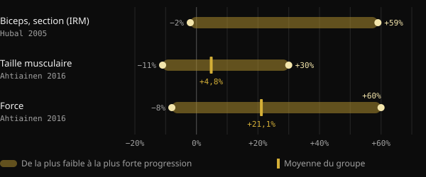
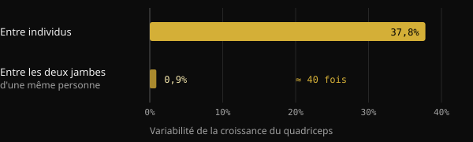
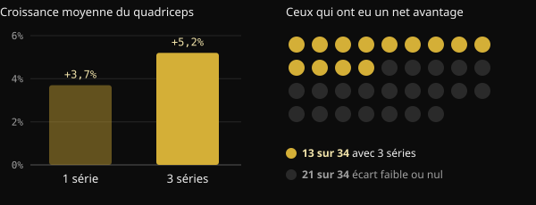

# Faible répondeur : quel est le vrai poids de la génétique dans la prise de muscle ?

Tu t'entraînes depuis des mois, tu suis ton programme, et pourtant ton partenaire de salle progresse deux fois plus vite. La tentation est grande de clore le débat en un mot : la génétique. Voici ce que mesurent réellement les études sur les « high responders » et les « low responders » (forts et faibles répondeurs), ce que pèse l'ADN et pourquoi il est si difficile de savoir comment tu réponds, toi.

## En bref

- Avec le même programme, la prise de muscle varie énormément : dans une étude menée sur 585 personnes, la section du biceps évolue de −2 % à +59 %.
- La génétique compte : environ la moitié des différences de force entre personnes sédentaires s'explique par des facteurs héréditaires. L'autre moitié, non.
- Une partie de ce qui ressemble à une « absence de réponse » n'est que du bruit : erreur de mesure, variations d'un jour à l'autre, programmes trop courts.
- Celui qui répond peu sur un paramètre progresse souvent sur un autre. Dans une étude sur 110 personnes de plus de 65 ans, personne n'est resté sans bénéfice.
- Augmenter le volume aide une partie des pratiquants, mais pas tous : avant de parler de génétique, mieux vaut vérifier le programme, la durée et les mesures.

## Pourquoi un physique abouti ne dit rien de la génétique

Face à un physique très développé, on raisonne à l'envers : on part du résultat et on devine la cause. Or ce résultat est la somme d'années d'entraînement, d'alimentation, de sommeil, d'erreurs corrigées et de régularité. Une photo ne permet pas de démêler ces facteurs.

Le point de départ de cet article est une publication du coach Valerio Acri. Il y compare deux photos de lui, la première à vingt ans et la seconde après 24 ans de musculation, et invite à se demander si, devant la première, quelqu'un aurait parlé de « génétique incroyable ». Son propos tient la route : la génétique compte, mais une contribution génétique n'est pas un destin.

## À quel point les réponses à l'entraînement varient vraiment

Les plus grandes études le confirment : les différences d'une personne à l'autre sont énormes, même avec des protocoles identiques et encadrés.

Dans l'étude FAMuSS, 585 hommes et femmes ont entraîné pendant 12 semaines les fléchisseurs du coude d'un seul bras. La section transversale du biceps, mesurée par IRM, a évolué de −2 % à +59 %. La force maximale sur une répétition (1RM) a augmenté de 0 % à +250 %.

Une analyse finlandaise portant sur 287 adultes de 19 à 78 ans, dont 72 témoins, a relevé une augmentation moyenne de la taille musculaire de 4,8 %. Mais d'un participant à l'autre, on allait de −11 % à +30 %. Pour la force, la moyenne était de +21,1 %, avec des valeurs comprises entre −8 % et +60 %. Ni l'âge ni le sexe n'expliquaient ces écarts.

*Sources : Hubal et al., Med Sci Sports Exerc 2005 (biceps, IRM) ; Ahtiainen et al., Age 2016 (taille musculaire et force). Hubal ne donne pas la moyenne dans le résumé. Graphique Nurvan.*

## Ce que pèse la génétique

Une méta-analyse japonaise a rassemblé 24 études sur l'héritabilité de la force, soit 58 mesures. L'héritabilité moyenne de la force, c'est-à-dire la part des différences entre individus attribuable à des facteurs génétiques, était de 0,52. Dit simplement : gènes et environnement pèsent à peu près autant, et avec l'âge le poids de l'environnement augmente.

Attention à la lecture de ce chiffre. Il concerne la force de base chez des personnes sédentaires, pas l'ampleur des progrès à l'entraînement. Il montre toutefois que la biologie individuelle est bien réelle, et qu'elle n'explique pas tout.

Une étude brésilienne le met en évidence. Vingt jeunes hommes déjà entraînés ont travaillé pendant 8 semaines une jambe avec un programme progressif classique et l'autre avec un programme qui modifiait sans cesse la charge, le volume, le type de contraction et les temps de repos. Les deux jambes ont grossi de façon presque identique. L'écart d'une personne à l'autre, lui, était environ 40 fois plus grand que l'écart entre les deux jambes d'une même personne.

*Source : Damas et al., J Appl Physiol 2019 (n = 20, section transversale du vaste latéral). Graphique Nurvan.*

Ce résultat ne dit pas que le programme ne compte pas. Il dit qu'entre deux programmes bien construits la différence est faible, alors que les caractéristiques de la personne pèsent lourd.

## Faible répondeur par rapport à quoi ?

C'est ici que le sujet devient intéressant. On est « faible répondeur » pour une mesure, une dose et une durée précises. Change l'un de ces éléments, et le classement peut changer.

**Le volume.** Dans une étude norvégienne, 34 personnes non entraînées ont travaillé pendant 12 semaines une jambe avec 1 série par exercice et l'autre avec 3 séries. Avec 3 séries, la section du quadriceps a augmenté en moyenne de 5,2 %, contre 3,7 % avec une seule série. Mais seuls 13 participants sur 34 ont tiré un avantage net du volume plus élevé en matière d'hypertrophie. Pour les autres, la différence était faible ou inexistante.

*Source : Hammarström et al., J Physiol 2020 (n = 34, 12 semaines, entraînement controlatéral). Graphique Nurvan.*

Chez les pratiquants entraînés, une étude brésilienne a comparé, sur 16 personnes, un volume standard de 22 séries par semaine à un volume égal à 1,2 fois celui que chacun réalisait déjà. Le volume personnalisé a produit davantage de croissance : en moyenne 1,08 cm² de section en plus.

**La charge.** Ici, la réponse est différente. Chez 27 femmes âgées d'environ 68 ans, s'entraîner à 10 ou à 15 répétitions maximales a donné des résultats similaires. Trois participantes sur quatre ont conservé le même statut, répondeuse ou non-répondeuse, avec les deux charges. Changer de charge n'a pas « débloqué » celles qui répondaient peu.

**La durée et le critère mesuré.** Une étude néerlandaise sur 110 personnes de plus de 65 ans l'annonce dès son titre : il n'existe pas de non-répondeurs à l'entraînement en résistance. En passant de 12 à 24 semaines d'entraînement, les réponses positives ont augmenté. Et chaque participant a progressé sur au moins un critère parmi la masse maigre, la taille des fibres, la force et la capacité fonctionnelle.

## Pourquoi il est si difficile de savoir comment tu réponds

Même avec du matériel de laboratoire, distinguer une vraie réponse du bruit est compliqué. Une revue publiée dans le Journal of Applied Physiology explique que l'erreur de mesure et les fluctuations normales de l'organisme gonflent la variabilité apparente. Pour les séparer, il faudrait répéter les interventions sur la même personne. C'est pourquoi des chercheurs brésiliens ont proposé en 2025 un protocole avec une jambe entraînée et l'autre servant de comparaison : beaucoup d'études ne parviennent pas à isoler la vraie réponse de chacun.

Dans l'étude finlandaise, en comparant les résultats à ceux des personnes qui ne s'entraînaient pas, 29 % des participants se classaient parmi les faibles répondeurs pour la masse, mais seulement 7 % pour la force. Même personne, réponses différentes selon ce que l'on mesure.

Si c'est difficile en laboratoire, ça l'est encore plus avec le miroir et la balance de la maison.

## Ce que dit vraiment la recherche

Le point de départ est la publication de Valerio Acri. Voici ses principales affirmations, confrontées aux sources.

- **Confirmé** — « La génétique compte. » L'héritabilité de la force est d'environ 0,52 et la variabilité entre individus est large, même avec des programmes identiques.
- **Confirmé** — « Contribution génétique ne veut pas dire déterminisme. » Dans la même méta-analyse, gènes et environnement pèsent de façon comparable, et l'environnement compte davantage avec l'âge.
- **À nuancer** — « Une réponse observée dans certaines conditions n'est pas une caractéristique immuable. » C'est vrai pour le volume et la durée : plus de séries et plus de semaines changent la donne pour une partie des personnes. Mais changer la charge ou varier le programme n'a pas modifié le statut de la majorité des participants.
- **À nuancer** — « Si tu ne progresses pas, te faut-il plus de volume ? » En moyenne, plus de volume donne plus de croissance, mais un avantage net ne s'observe que chez environ 4 personnes sur 10.
- **Non vérifiable** — « Tu ne le saurais même pas au bout de deux ou trois ans. » C'est plausible, vu les limites de mesure, mais les études durent de 8 à 24 semaines. Sur plusieurs années, il n'existe pas de données contrôlées.

## Comment l'appliquer

1. **Mesure plus d'une chose.** Charges et répétitions, poids, tours de mensurations et photos prises dans les mêmes conditions. Un paramètre qui stagne ne signifie pas que tout stagne.
2. **Raisonne par blocs, pas par semaines.** Évalue tes progrès sur 8 à 12 semaines, avec un programme constant.
3. **Vérifie les bases avant d'accuser la génétique.** Progression des charges, séries proches de l'échec, protéines et calories suffisantes, sommeil.
4. **Essaie d'augmenter le volume progressivement.** Dans les études, partir du volume que tu fais déjà et l'augmenter a mieux fonctionné qu'un chiffre standard.
5. **Change une seule variable à la fois.** Si tu modifies tout en même temps, tu ne sauras jamais ce qui a marché.

<h3>Découvre comment tu réponds, données à l'appui</h3>

Nurvan enregistre les charges, les répétitions et le RIR de chaque série, ainsi que le poids, les mensurations et l'alimentation. Tu peux ainsi comparer des blocs d'entraînement à volumes différents et voir ta réponse sur des mois de données, pas sur une impression devant le miroir.

<a href="https://nurvan.app">Essayer Nurvan</a>

## Questions fréquentes

### Comment savoir si je suis un faible répondeur ?

Pas avec certitude. Il faut un programme bien construit, suivi avec régularité pendant de nombreux mois et évalué sur plusieurs paramètres. Même dans ce cas, le résultat vaut pour ce programme, ce volume et cette période de ta vie.

### Si je ne progresse pas, dois-je faire plus de séries ?

Ça peut aider : en moyenne, plus de volume apporte plus de croissance, et un volume personnalisé a donné de meilleurs résultats qu'un volume standard. Mais ce n'est pas vrai pour tout le monde. Vérifie d'abord la progression des charges, l'intensité, l'alimentation et le sommeil.

### Quelle part de la prise de muscle dépend de l'ADN ?

Pour la force de base, l'héritabilité moyenne estimée est d'environ 50 %. Il n'existe pas de chiffre précis pour la réponse à l'entraînement, et les écarts dépendent aussi des mesures, de la durée et du programme.

### Devient-on faible répondeur avec l'âge ?

Dans les études citées, l'âge et le sexe n'expliquaient pas les différences individuelles. Chez les plus de 65 ans suivis pendant 24 semaines, chaque participant a progressé sur au moins un paramètre.

## Sources

1. Hubal MJ et al., 2005. Variability in muscle size and strength gain after unilateral resistance training. *Med Sci Sports Exerc* 37(6):964–72. [PMID 15947721](https://pubmed.ncbi.nlm.nih.gov/15947721/)
2. Ahtiainen JP et al., 2016. Heterogeneity in resistance training-induced muscle strength and mass responses in men and women of different ages. *Age (Dordr)* 38(1):10. [PMID 26767377](https://pubmed.ncbi.nlm.nih.gov/26767377/) · [DOI 10.1007/s11357-015-9870-1](https://doi.org/10.1007/s11357-015-9870-1)
3. Zempo H et al., 2017. Heritability estimates of muscle strength-related phenotypes: A systematic review and meta-analysis. *Scand J Med Sci Sports* 27(12):1537–1546. [PMID 27882617](https://pubmed.ncbi.nlm.nih.gov/27882617/) · [DOI 10.1111/sms.12804](https://doi.org/10.1111/sms.12804)
4. Damas F et al., 2019. Myofibrillar protein synthesis and muscle hypertrophy individualized responses to systematically changing resistance training variables in trained young men. *J Appl Physiol* 127(3):806–815. [PMID 31268828](https://pubmed.ncbi.nlm.nih.gov/31268828/) · [DOI 10.1152/japplphysiol.00350.2019](https://doi.org/10.1152/japplphysiol.00350.2019)
5. Hammarström D et al., 2020. Benefits of higher resistance-training volume are related to ribosome biogenesis. *J Physiol* 598(3):543–565. [PMID 31813190](https://pubmed.ncbi.nlm.nih.gov/31813190/) · [DOI 10.1113/JP278455](https://doi.org/10.1113/JP278455)
6. Scarpelli MC et al., 2022. Muscle Hypertrophy Response Is Affected by Previous Resistance Training Volume in Trained Individuals. *J Strength Cond Res* 36(4):1153–1157. [PMID 32108724](https://pubmed.ncbi.nlm.nih.gov/32108724/) · [DOI 10.1519/JSC.0000000000003558](https://doi.org/10.1519/JSC.0000000000003558)
7. Ribeiro AS et al., 2026. Responsiveness of muscle mass gain to different load intensities of resistance training in older women: A randomized crossover study. *Exp Gerontol* 223:113261. [PMID 42551773](https://pubmed.ncbi.nlm.nih.gov/42551773/) · [DOI 10.1016/j.exger.2026.113261](https://doi.org/10.1016/j.exger.2026.113261)
8. Churchward-Venne TA et al., 2015. There Are No Nonresponders to Resistance-Type Exercise Training in Older Men and Women. *J Am Med Dir Assoc* 16(5):400–11. [PMID 25717010](https://pubmed.ncbi.nlm.nih.gov/25717010/) · [DOI 10.1016/j.jamda.2015.01.071](https://doi.org/10.1016/j.jamda.2015.01.071)
9. Hecksteden A et al., 2015. Individual response to exercise training - a statistical perspective. *J Appl Physiol* 118(12):1450–9. [PMID 25663672](https://pubmed.ncbi.nlm.nih.gov/25663672/) · [DOI 10.1152/japplphysiol.00714.2014](https://doi.org/10.1152/japplphysiol.00714.2014)
10. Chaves TS et al., 2025. Within-individual design for assessing true individual responses in resistance training-induced muscle hypertrophy. *Front Sports Act Living* 7:1517190. [PMID 39958513](https://pubmed.ncbi.nlm.nih.gov/39958513/) · [DOI 10.3389/fspor.2025.1517190](https://doi.org/10.3389/fspor.2025.1517190)

Article inspiré d'une publication de [Dott. & Coach Valerio Acri (@valerio_acri)](https://www.instagram.com/p/Ddf-0MRF7p0/). Sources consultées via PubMed.

> Note : contenu à visée informative, qui ne remplace pas l'avis d'un médecin ou d'un professionnel qualifié.
