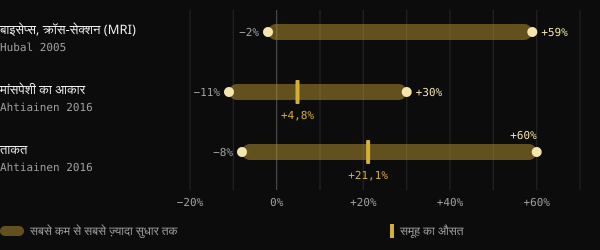
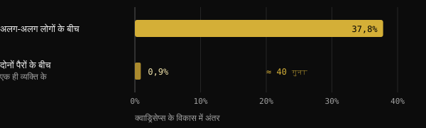
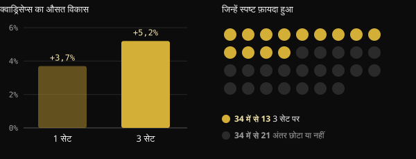

# लो रेस्पॉन्डर: मांसपेशियों के विकास में जेनेटिक्स की असल भूमिका क्या है?

आप महीनों से ट्रेनिंग कर रहे हैं, प्रोग्राम का पालन भी कर रहे हैं, फिर भी जिम में आपका साथी आपसे दोगुना तेज़ी से बढ़ रहा है। बात को एक शब्द में निपटा देने का मन होता है: जेनेटिक्स। यहाँ देखिए कि "हाई रेस्पॉन्डर" और "लो रेस्पॉन्डर" पर हुए अध्ययन असल में क्या मापते हैं, DNA की कितनी भूमिका है और आप खुद कैसे रेस्पॉन्ड करते हैं, यह जानना इतना मुश्किल क्यों है।

## संक्षेप में

- एक ही प्रोग्राम पर मांसपेशियों का विकास बहुत अलग-अलग होता है: 585 लोगों के एक अध्ययन में बाइसेप्स का क्रॉस-सेक्शन −2% से +59% तक बदला।
- जेनेटिक्स मायने रखती है: निष्क्रिय (सेडेंटरी) लोगों में ताकत के अंतर का लगभग आधा हिस्सा आनुवंशिक कारकों से जुड़ा है। बाकी आधा नहीं।
- जो "रेस्पॉन्ड न करना" लगता है, उसका एक हिस्सा सिर्फ़ शोर है: माप की गलती, रोज़ के उतार-चढ़ाव, बहुत छोटे प्रोग्राम।
- जो व्यक्ति एक पैमाने पर कम रेस्पॉन्ड करता है, वह अक्सर दूसरे पर सुधरता है। 65 से अधिक उम्र के 110 लोगों के एक अध्ययन में कोई भी बिना लाभ के नहीं रहा।
- ज़्यादा वॉल्यूम कुछ लोगों की मदद करता है, सबकी नहीं: जेनेटिक्स की बात करने से पहले प्रोग्राम, अवधि और माप जाँच लेना बेहतर है।

## तैयार शरीर जेनेटिक्स के बारे में कुछ क्यों नहीं बताता

बहुत विकसित शरीर देखकर हम उल्टा सोचते हैं: नतीजे से शुरू करके कारण का अंदाज़ा लगाते हैं। लेकिन नतीजा सालों की ट्रेनिंग, खान-पान, नींद, सुधारी गई गलतियों और निरंतरता का जोड़ होता है। एक तस्वीर से इन कारकों को अलग नहीं किया जा सकता।

इस लेख की प्रेरणा कोच Valerio Acri की एक पोस्ट है। उसमें उनकी दो तस्वीरें हैं: पहली बीस साल की उम्र की और दूसरी 24 साल वेट ट्रेनिंग के बाद की। वे पूछते हैं कि क्या पहली तस्वीर देखकर कोई "ज़बरदस्त जेनेटिक्स" की बात करता। उनकी बात वाजिब है: जेनेटिक्स मायने रखती है, लेकिन आनुवंशिक योगदान का मतलब तक़दीर नहीं है।

## ट्रेनिंग पर प्रतिक्रियाएँ असल में कितनी अलग होती हैं

सबसे बड़े अध्ययन पुष्टि करते हैं कि लोगों के बीच अंतर बहुत बड़े हैं, भले ही प्रोटोकॉल एक जैसे और निगरानी में हों।

FAMuSS अध्ययन में 585 पुरुषों और महिलाओं ने 12 हफ़्ते तक सिर्फ़ एक बाँह की कोहनी मोड़ने वाली मांसपेशियों की ट्रेनिंग की। MRI से मापा गया बाइसेप्स का क्रॉस-सेक्शन −2% से +59% के बीच बदला। एक रेप की अधिकतम ताकत (1RM) 0% से +250% तक बढ़ी।

फ़िनलैंड के एक विश्लेषण में 19 से 78 साल के 287 वयस्क थे, जिनमें 72 कंट्रोल थे। इसमें मांसपेशियों के आकार में औसतन 4,8% की वृद्धि मिली। पर किसी एक प्रतिभागी में यह −11% से +30% तक हो सकती थी। ताकत के लिए औसत +21,1% था, और मान −8% से +60% के बीच थे। उम्र और लिंग इन अंतरों की व्याख्या नहीं करते थे।

*स्रोत: Hubal et al., Med Sci Sports Exerc 2005 (बाइसेप्स, MRI); Ahtiainen et al., Age 2016 (मांसपेशी का आकार और ताकत)। Hubal ने abstract में औसत नहीं दिया है। ग्राफ़: Nurvan।*

## जेनेटिक्स का वज़न कितना है

जापान के एक मेटा-विश्लेषण ने ताकत की आनुवंशिकता (heritability) पर 24 अध्ययन इकट्ठा किए, जिनमें 58 माप थे। ताकत की औसत आनुवंशिकता 0,52 थी, यानी लोगों के बीच के अंतर का वह हिस्सा जो आनुवंशिक कारकों से जुड़ा है। सीधे शब्दों में: जीन और वातावरण का वज़न लगभग बराबर है, और उम्र के साथ वातावरण का वज़न बढ़ता है।

इस आँकड़े को सही ढंग से पढ़ना ज़रूरी है। यह निष्क्रिय लोगों की बुनियादी ताकत के बारे में है, इस बारे में नहीं कि ट्रेनिंग से कितना सुधार होता है। फिर भी यह दिखाता है कि व्यक्तिगत जीव-विज्ञान असली है, और वह सब कुछ नहीं समझाता।

ब्राज़ील का एक अध्ययन इसे साफ़ कर देता है। पहले से ट्रेन किए हुए बीस युवाओं ने 8 हफ़्ते तक एक पैर पर क्लासिक प्रोग्रेसिव प्रोग्राम किया और दूसरे पर ऐसा प्रोग्राम जिसमें लोड, वॉल्यूम, संकुचन का प्रकार और रिकवरी लगातार बदलते रहे। दोनों पैर लगभग एक जैसे बढ़े। लेकिन एक व्यक्ति और दूसरे व्यक्ति के बीच का अंतर, एक ही व्यक्ति के दोनों पैरों के बीच के अंतर से लगभग 40 गुना बड़ा था।

*स्रोत: Damas et al., J Appl Physiol 2019 (n = 20, vastus lateralis का क्रॉस-सेक्शन)। ग्राफ़: Nurvan।*

इस आँकड़े का मतलब यह नहीं कि प्रोग्राम मायने नहीं रखता। इसका मतलब है कि दो अच्छे ढंग से बने प्रोग्रामों के बीच अंतर छोटा होता है, जबकि व्यक्ति की अपनी विशेषताओं का वज़न बहुत होता है।

## किसके मुकाबले लो रेस्पॉन्डर?

यहाँ बात दिलचस्प हो जाती है। "लो रेस्पॉन्डर" एक खास माप, एक खास डोज़ और एक खास अवधि के लिए ही होता है। इनमें से कुछ भी बदलने पर वर्गीकरण बदल सकता है।

**वॉल्यूम।** नॉर्वे के एक अध्ययन में 34 अप्रशिक्षित लोगों ने 12 हफ़्ते तक एक पैर को हर एक्सरसाइज़ में 1 सेट से और दूसरे को 3 सेट से ट्रेन किया। 3 सेट पर क्वाड्रिसेप्स का क्रॉस-सेक्शन औसतन 5,2% बढ़ा, जबकि एक सेट पर 3,7%। लेकिन 34 में से सिर्फ़ 13 प्रतिभागियों में ज़्यादा वॉल्यूम का हाइपरट्रॉफी पर साफ़ फ़ायदा दिखा। बाकी में अंतर छोटा था या था ही नहीं।

*स्रोत: Hammarström et al., J Physiol 2020 (n = 34, 12 हफ़्ते, कॉन्ट्रालेटरल ट्रेनिंग)। ग्राफ़: Nurvan।*

पहले से ट्रेन किए लोगों में, ब्राज़ील के एक अध्ययन ने 16 लोगों पर हफ़्ते में 22 सेट के मानक वॉल्यूम की तुलना ऐसे वॉल्यूम से की जो हर व्यक्ति के पहले से किए जा रहे वॉल्यूम का 1,2 गुना था। व्यक्तिगत वॉल्यूम से ज़्यादा विकास हुआ: औसतन 1,08 cm² ज़्यादा क्रॉस-सेक्शन।

**लोड।** यहाँ जवाब अलग है। लगभग 68 साल की 27 महिलाओं में 10 या 15 अधिकतम रेप्स पर ट्रेनिंग से मिलते-जुलते नतीजे मिले। चार में से तीन प्रतिभागियों की स्थिति, रेस्पॉन्डर या नॉन-रेस्पॉन्डर, दोनों लोड पर वही रही। लोड बदलने से कम रेस्पॉन्ड करने वालों की स्थिति "खुली" नहीं।

**अवधि और मापा गया नतीजा।** नीदरलैंड का 65 से अधिक उम्र के 110 लोगों पर अध्ययन अपने शीर्षक में ही कह देता है: रेसिस्टेंस ट्रेनिंग पर कोई नॉन-रेस्पॉन्डर नहीं होता। ट्रेनिंग 12 से 24 हफ़्ते करने पर सकारात्मक प्रतिक्रियाएँ बढ़ीं। और हर प्रतिभागी लीन मास, फ़ाइबर के आकार, ताकत और कार्यात्मक क्षमता में से कम से कम एक में सुधरा।

## आप कैसे रेस्पॉन्ड करते हैं, यह जानना इतना मुश्किल क्यों है

प्रयोगशाला के उपकरणों के साथ भी असली प्रतिक्रिया को शोर से अलग करना जटिल है। Journal of Applied Physiology में छपी एक रिव्यू बताती है कि माप की गलती और शरीर के सामान्य उतार-चढ़ाव दिखावटी विविधता को फुला देते हैं। इन्हें अलग करने के लिए एक ही व्यक्ति पर दोहराए गए हस्तक्षेप चाहिए होंगे। इसी वजह से 2025 में ब्राज़ील के शोधकर्ताओं ने ऐसा डिज़ाइन सुझाया जिसमें एक पैर ट्रेन होता है और दूसरा तुलना के लिए रहता है, क्योंकि कई अध्ययन हर व्यक्ति की असली प्रतिक्रिया को अलग नहीं कर पाते।

फ़िनलैंड के अध्ययन में, ट्रेनिंग न करने वालों से नतीजों की तुलना करने पर 29% प्रतिभागी मांसपेशी द्रव्यमान के लिए लो रेस्पॉन्डर निकले, पर ताकत के लिए सिर्फ़ 7%। वही व्यक्ति, अलग प्रतिक्रियाएँ, इस पर निर्भर कि आप क्या माप रहे हैं।

जब प्रयोगशाला में यह मुश्किल है, तो घर के शीशे और वज़न की मशीन के साथ यह और भी मुश्किल है।

## रिसर्च असल में क्या कहती है

प्रेरणा Valerio Acri की पोस्ट है। यहाँ उनके मुख्य दावे हैं, स्रोतों से मिलाकर।

- **पुष्ट** — "जेनेटिक्स मायने रखती है।" ताकत की आनुवंशिकता लगभग 0,52 है और एक जैसे प्रोग्रामों पर भी लोगों के बीच विविधता बड़ी है।
- **पुष्ट** — "आनुवंशिक योगदान का मतलब नियतिवाद नहीं।" उसी मेटा-विश्लेषण में जीन और वातावरण का वज़न तुलनीय है, और उम्र के साथ वातावरण ज़्यादा मायने रखता है।
- **स्पष्टीकरण ज़रूरी** — "कुछ खास परिस्थितियों में देखी गई प्रतिक्रिया कोई अपरिवर्तनीय विशेषता नहीं है।" यह वॉल्यूम और अवधि के लिए सही है: ज़्यादा सेट और ज़्यादा हफ़्ते कुछ लोगों की तस्वीर बदल देते हैं। लेकिन लोड बदलने या प्रोग्राम में विविधता लाने से ज़्यादातर प्रतिभागियों की स्थिति नहीं बदली।
- **स्पष्टीकरण ज़रूरी** — "अगर आप नहीं बढ़ रहे, तो क्या ज़्यादा वॉल्यूम चाहिए?" औसतन ज़्यादा वॉल्यूम से ज़्यादा विकास होता है, लेकिन साफ़ फ़ायदा लगभग 10 में से 4 लोगों में दिखता है।
- **सत्यापित नहीं हो सकता** — "दो-तीन साल बाद भी आपको पता नहीं चलता।" माप की सीमाओं को देखते हुए यह संभव है, पर अध्ययन 8 से 24 हफ़्ते के हैं। सालों के लिए नियंत्रित आँकड़े नहीं हैं।

## इसे कैसे लागू करें

1. **एक से ज़्यादा चीज़ें मापें।** लोड और रेप्स, वज़न, माप और एक जैसी परिस्थितियों में तस्वीरें। एक पैमाने का रुक जाना यह नहीं कि सब कुछ रुक गया।
2. **हफ़्तों में नहीं, ब्लॉक में सोचें।** स्थिर प्रोग्राम के साथ 8–12 हफ़्तों में प्रगति आँकें।
3. **जेनेटिक्स से पहले बुनियादी बातें जाँचें।** लोड की प्रगति, फ़ेल्योर के करीब सेट, पर्याप्त प्रोटीन और कैलोरी, नींद।
4. **वॉल्यूम धीरे-धीरे बढ़ाकर देखें।** अध्ययनों में, जो आप पहले से करते हैं वहीं से शुरू करके उसे बढ़ाना, किसी मानक संख्या से बेहतर रहा।
5. **एक समय में एक ही चर बदलें।** अगर सब कुछ एक साथ बदलेंगे, तो कभी पता नहीं चलेगा कि क्या काम किया।

<h3>आँकड़ों के साथ जानिए कि आप कैसे रेस्पॉन्ड करते हैं</h3>

Nurvan हर सेट का लोड, रेप्स और RIR, वज़न, माप और खान-पान के साथ दर्ज करता है। इस तरह आप अलग-अलग वॉल्यूम वाले ट्रेनिंग ब्लॉकों की तुलना करते हैं और अपनी प्रतिक्रिया महीनों के डेटा पर देखते हैं, शीशे के सामने के अंदाज़े पर नहीं।

<a href="https://nurvan.app">Nurvan आज़माएँ</a>

## अक्सर पूछे जाने वाले सवाल

### मुझे कैसे पता चलेगा कि मैं लो रेस्पॉन्डर हूँ?

पक्के तौर पर नहीं। इसके लिए एक अच्छा प्रोग्राम चाहिए, जिसे कई महीनों तक निरंतरता से किया जाए और कई पैमानों पर मापा जाए। तब भी नतीजा उसी प्रोग्राम, उसी वॉल्यूम और आपके जीवन के उसी दौर के लिए मान्य है।

### अगर मैं नहीं बढ़ रहा, तो क्या ज़्यादा सेट करने चाहिए?

मदद कर सकता है: औसतन ज़्यादा वॉल्यूम से ज़्यादा विकास होता है और व्यक्तिगत वॉल्यूम ने मानक वॉल्यूम से बेहतर नतीजे दिए। लेकिन यह सब पर लागू नहीं होता। पहले लोड की प्रगति, इंटेंसिटी, खान-पान और नींद जाँचें।

### मांसपेशियों का कितना विकास DNA पर निर्भर है?

बुनियादी ताकत के लिए अनुमानित औसत आनुवंशिकता लगभग 50% है। ट्रेनिंग पर प्रतिक्रिया के लिए कोई सटीक संख्या नहीं है, और अंतर माप, अवधि और प्रोग्राम पर भी निर्भर करते हैं।

### क्या उम्र के साथ इंसान लो रेस्पॉन्डर बन जाता है?

उद्धृत अध्ययनों में उम्र और लिंग व्यक्तिगत अंतरों की व्याख्या नहीं करते थे। 24 हफ़्ते तक फ़ॉलो किए गए 65 से अधिक उम्र के लोगों में हर प्रतिभागी कम से कम एक पैमाने पर सुधरा।

## स्रोत

1. Hubal MJ et al., 2005. Variability in muscle size and strength gain after unilateral resistance training. *Med Sci Sports Exerc* 37(6):964–72. [PMID 15947721](https://pubmed.ncbi.nlm.nih.gov/15947721/)
2. Ahtiainen JP et al., 2016. Heterogeneity in resistance training-induced muscle strength and mass responses in men and women of different ages. *Age (Dordr)* 38(1):10. [PMID 26767377](https://pubmed.ncbi.nlm.nih.gov/26767377/) · [DOI 10.1007/s11357-015-9870-1](https://doi.org/10.1007/s11357-015-9870-1)
3. Zempo H et al., 2017. Heritability estimates of muscle strength-related phenotypes: A systematic review and meta-analysis. *Scand J Med Sci Sports* 27(12):1537–1546. [PMID 27882617](https://pubmed.ncbi.nlm.nih.gov/27882617/) · [DOI 10.1111/sms.12804](https://doi.org/10.1111/sms.12804)
4. Damas F et al., 2019. Myofibrillar protein synthesis and muscle hypertrophy individualized responses to systematically changing resistance training variables in trained young men. *J Appl Physiol* 127(3):806–815. [PMID 31268828](https://pubmed.ncbi.nlm.nih.gov/31268828/) · [DOI 10.1152/japplphysiol.00350.2019](https://doi.org/10.1152/japplphysiol.00350.2019)
5. Hammarström D et al., 2020. Benefits of higher resistance-training volume are related to ribosome biogenesis. *J Physiol* 598(3):543–565. [PMID 31813190](https://pubmed.ncbi.nlm.nih.gov/31813190/) · [DOI 10.1113/JP278455](https://doi.org/10.1113/JP278455)
6. Scarpelli MC et al., 2022. Muscle Hypertrophy Response Is Affected by Previous Resistance Training Volume in Trained Individuals. *J Strength Cond Res* 36(4):1153–1157. [PMID 32108724](https://pubmed.ncbi.nlm.nih.gov/32108724/) · [DOI 10.1519/JSC.0000000000003558](https://doi.org/10.1519/JSC.0000000000003558)
7. Ribeiro AS et al., 2026. Responsiveness of muscle mass gain to different load intensities of resistance training in older women: A randomized crossover study. *Exp Gerontol* 223:113261. [PMID 42551773](https://pubmed.ncbi.nlm.nih.gov/42551773/) · [DOI 10.1016/j.exger.2026.113261](https://doi.org/10.1016/j.exger.2026.113261)
8. Churchward-Venne TA et al., 2015. There Are No Nonresponders to Resistance-Type Exercise Training in Older Men and Women. *J Am Med Dir Assoc* 16(5):400–11. [PMID 25717010](https://pubmed.ncbi.nlm.nih.gov/25717010/) · [DOI 10.1016/j.jamda.2015.01.071](https://doi.org/10.1016/j.jamda.2015.01.071)
9. Hecksteden A et al., 2015. Individual response to exercise training - a statistical perspective. *J Appl Physiol* 118(12):1450–9. [PMID 25663672](https://pubmed.ncbi.nlm.nih.gov/25663672/) · [DOI 10.1152/japplphysiol.00714.2014](https://doi.org/10.1152/japplphysiol.00714.2014)
10. Chaves TS et al., 2025. Within-individual design for assessing true individual responses in resistance training-induced muscle hypertrophy. *Front Sports Act Living* 7:1517190. [PMID 39958513](https://pubmed.ncbi.nlm.nih.gov/39958513/) · [DOI 10.3389/fspor.2025.1517190](https://doi.org/10.3389/fspor.2025.1517190)

यह लेख [Dott. & Coach Valerio Acri (@valerio_acri)](https://www.instagram.com/p/Ddf-0MRF7p0/) की एक पोस्ट से प्रेरित है। स्रोत PubMed के माध्यम से देखे गए।

> नोट: यह जानकारी केवल सूचनात्मक है, डॉक्टर या किसी योग्य विशेषज्ञ की सलाह का विकल्प नहीं है।
