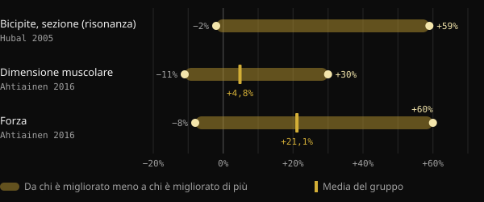
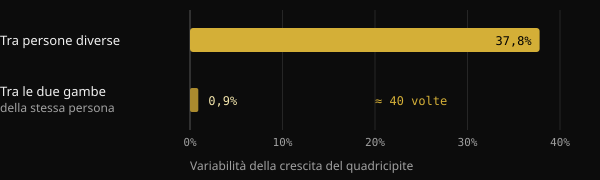
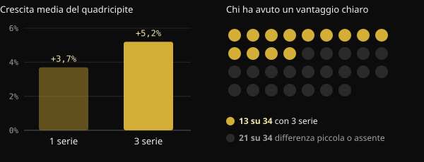

# Low responder: quanto conta davvero la genetica nella crescita muscolare?

Ti alleni da mesi, segui il programma, eppure il compagno di palestra cresce il doppio. La tentazione è chiudere il discorso con una parola: genetica. Qui vedi cosa misurano davvero gli studi sugli "high responder" e i "low responder", quanto pesa il DNA e perché è difficile sapere come rispondi tu.

## In breve

- Con lo stesso programma, la crescita muscolare varia moltissimo: in uno studio su 585 persone si va da −2% a +59% di sezione del bicipite.
- La genetica conta: circa metà delle differenze di forza tra persone sedentarie è attribuibile a fattori ereditari. L'altra metà no.
- Parte di quello che sembra "non rispondere" è rumore: errore di misura, variazioni giornaliere, programmi troppo brevi.
- Chi risponde poco su un parametro spesso migliora su un altro. In uno studio su 110 over 65, nessuno è rimasto senza benefici.
- Più volume aiuta una parte delle persone, ma non tutte: prima di parlare di genetica conviene verificare programma, durata e misure.

## Perché un fisico finito non ti dice nulla sulla genetica

Davanti a un fisico molto sviluppato ragioniamo al contrario: partiamo dal risultato e indoviniamo la causa. Ma il risultato è la somma di anni di allenamento, alimentazione, sonno, errori corretti e costanza. Da una fotografia non si possono separare questi fattori.

Lo spunto di questo articolo è un post del coach Valerio Acri. Mette a confronto due sue foto, la prima da ventenne e la seconda dopo 24 anni di pesi, e invita a chiedersi se dalla prima qualcuno avrebbe parlato di "genetica incredibile". Il suo punto è condivisibile: la genetica conta, ma un contributo genetico non è un destino.

## Quanto variano davvero le risposte all'allenamento

Gli studi più grandi confermano che le differenze tra persone sono enormi, anche con protocolli identici e supervisionati.

Nello studio FAMuSS, 585 uomini e donne hanno allenato per 12 settimane i flessori del gomito di un solo braccio. La sezione trasversa del bicipite, misurata con la risonanza magnetica, è cambiata tra −2% e +59%. La forza massimale su una ripetizione (1RM) è aumentata tra 0% e +250%.

Un'analisi finlandese su 287 adulti tra 19 e 78 anni, di cui 72 di controllo, ha trovato un aumento medio della dimensione muscolare del 4,8%. Il singolo partecipante poteva però andare da −11% a +30%. Per la forza, la media era +21,1%, con valori tra −8% e +60%. Età e sesso non spiegavano queste differenze.

*Fonti: Hubal et al., Med Sci Sports Exerc 2005 (bicipite, risonanza magnetica); Ahtiainen et al., Age 2016 (dimensione muscolare e forza). Hubal non riporta la media nell'abstract. Grafico Nurvan.*

## Quanto pesa la genetica

Una meta-analisi giapponese ha raccolto 24 studi sull'ereditabilità della forza, con 58 misurazioni. L'ereditabilità media della forza, cioè la quota di differenze tra persone attribuibile a fattori genetici, era 0,52. Detto in modo semplice: geni e ambiente pesano più o meno allo stesso modo, e con l'età il peso dell'ambiente cresce.

Attenzione a come leggere il dato. Riguarda la forza di base in persone sedentarie, non quanto si migliora con l'allenamento. Mostra però che la biologia individuale è reale, e che non spiega tutto.

Uno studio brasiliano lo rende evidente. Venti giovani già allenati hanno lavorato per 8 settimane con una gamba su un programma progressivo classico e con l'altra su un programma che cambiava continuamente carico, volume, tipo di contrazione e recuperi. Le due gambe sono cresciute in modo quasi identico. La differenza tra una persona e l'altra, invece, era circa 40 volte più grande di quella tra le due gambe della stessa persona.

*Fonte: Damas et al., J Appl Physiol 2019 (n = 20, sezione trasversa del vasto laterale). Grafico Nurvan.*

Il dato non dice che il programma non conta. Dice che tra due programmi ben costruiti la differenza è piccola, mentre le caratteristiche della persona pesano molto.

## Low responder rispetto a cosa?

Qui il discorso si fa interessante. Un "low responder" è tale per una misura, una dose e una durata precise. Cambiando una di queste cose, la classificazione può cambiare.

**Il volume.** In uno studio norvegese, 34 persone non allenate hanno allenato per 12 settimane una gamba con 1 serie per esercizio e l'altra con 3 serie. Con 3 serie la sezione del quadricipite è cresciuta in media del 5,2%, contro il 3,7% con una serie. Ma solo 13 partecipanti su 34 hanno mostrato un vantaggio chiaro del volume maggiore sull'ipertrofia. Per gli altri la differenza era piccola o assente.

*Fonte: Hammarström et al., J Physiol 2020 (n = 34, 12 settimane, allenamento contro-laterale). Grafico Nurvan.*

Negli allenati, uno studio brasiliano ha confrontato su 16 persone un volume standard di 22 serie a settimana con un volume pari a 1,2 volte quello che ciascuno faceva già. Il volume personalizzato ha prodotto più crescita: in media 1,08 cm² di sezione in più.

**Il carico.** Qui la risposta è diversa. In 27 donne intorno ai 68 anni, allenarsi a 10 o a 15 ripetizioni massime ha dato risultati simili. Tre partecipanti su quattro hanno mantenuto lo stesso status, responder o non-responder, con entrambi i carichi. Cambiare carico non ha "sbloccato" chi rispondeva poco.

**La durata e l'esito misurato.** Uno studio olandese su 110 over 65 lo dice già nel titolo: non esistono non-responder all'allenamento contro resistenza. Passando da 12 a 24 settimane di allenamento, le risposte positive sono aumentate. E ogni partecipante è migliorato in almeno uno tra massa magra, dimensione delle fibre, forza e capacità funzionale.

## Perché è così difficile sapere come rispondi

Anche con macchinari da laboratorio, distinguere una risposta vera dal rumore è complicato. Una review pubblicata sul Journal of Applied Physiology spiega che l'errore di misura e le normali oscillazioni dell'organismo gonfiano la variabilità apparente. Per separarle servirebbero interventi ripetuti sulla stessa persona. Ricercatori brasiliani nel 2025 hanno proposto per questo un disegno con una gamba allenata e l'altra di confronto, perché molti studi non riescono a isolare la risposta vera di ciascuno.

Nello studio finlandese, confrontando i risultati con chi non si allenava, il 29% dei partecipanti rientrava tra i low responder per la massa, ma solo il 7% per la forza. Stessa persona, risposte diverse a seconda di cosa misuri.

Se è difficile in laboratorio, lo è ancora di più con lo specchio e la bilancia di casa.

## Cosa dice davvero la ricerca

Lo spunto è il post di Valerio Acri. Ecco le sue affermazioni principali, confrontate con le fonti.

- **Confermato** — "La genetica conta." L'ereditabilità della forza è circa 0,52 e la variabilità tra persone è ampia anche con programmi identici.
- **Confermato** — "Contributo genetico non vuol dire determinismo." Nella stessa meta-analisi, geni e ambiente pesano in modo comparabile, e l'ambiente conta di più con l'età.
- **Da precisare** — "Una risposta osservata in certe condizioni non è una caratteristica immutabile." Vale per volume e durata: più serie e più settimane cambiano il quadro per una parte delle persone. Ma cambiare il carico o variare il programma non ha cambiato lo status della maggior parte dei partecipanti.
- **Da precisare** — "Se non cresci, ti serve più volume?" In media più volume dà più crescita, ma un vantaggio chiaro si vede in circa 4 persone su 10.
- **Non verificabile** — "Non lo sapresti nemmeno dopo due o tre anni." È plausibile, visti i limiti di misura, ma gli studi durano da 8 a 24 settimane. Su anni non ci sono dati controllati.

## Come applicarlo

1. **Misura più di una cosa.** Carichi e ripetizioni, peso, circonferenze e foto nelle stesse condizioni. Un parametro fermo non significa che tutto sia fermo.
2. **Ragiona per blocchi, non per settimane.** Valuta i progressi su 8–12 settimane, con un programma costante.
3. **Controlla le basi prima della genetica.** Progressione dei carichi, serie vicine al cedimento, proteine e calorie sufficienti, sonno.
4. **Prova ad aumentare il volume in modo graduale.** Negli studi, partire dal volume che fai già e aumentarlo ha funzionato meglio di un numero standard.
5. **Cambia una variabile alla volta.** Se modifichi tutto insieme non saprai mai cosa ha funzionato.

<h3>Scopri come rispondi tu, con i dati</h3>

Nurvan registra carichi, ripetizioni e RIR di ogni serie insieme a peso, misure e alimentazione. Così confronti blocchi di allenamento con volumi diversi e vedi la tua risposta su mesi di dati, non su un'impressione allo specchio.

<a href="https://nurvan.app">Prova Nurvan</a>

## Domande frequenti

### Come faccio a capire se sono un low responder?

Non con certezza. Serve un programma ben costruito, seguito con costanza per molti mesi e misurato su più parametri. Anche allora il risultato vale per quel programma, quel volume e quel periodo della tua vita.

### Se non cresco, devo fare più serie?

Può aiutare: in media più volume porta più crescita e un volume personalizzato ha dato risultati migliori di uno standard. Però non vale per tutti. Prima verifica progressione dei carichi, intensità, alimentazione e sonno.

### Quanto della crescita muscolare dipende dal DNA?

Per la forza di base l'ereditabilità media stimata è circa il 50%. Non esiste un numero preciso per la risposta all'allenamento, e le differenze dipendono anche da misure, durata e programma.

### Con l'età si diventa low responder?

Negli studi citati età e sesso non spiegavano le differenze individuali. Negli over 65 seguiti per 24 settimane ogni partecipante è migliorato in almeno un parametro.

## Fonti

1. Hubal MJ et al., 2005. Variability in muscle size and strength gain after unilateral resistance training. *Med Sci Sports Exerc* 37(6):964–72. [PMID 15947721](https://pubmed.ncbi.nlm.nih.gov/15947721/)
2. Ahtiainen JP et al., 2016. Heterogeneity in resistance training-induced muscle strength and mass responses in men and women of different ages. *Age (Dordr)* 38(1):10. [PMID 26767377](https://pubmed.ncbi.nlm.nih.gov/26767377/) · [DOI 10.1007/s11357-015-9870-1](https://doi.org/10.1007/s11357-015-9870-1)
3. Zempo H et al., 2017. Heritability estimates of muscle strength-related phenotypes: A systematic review and meta-analysis. *Scand J Med Sci Sports* 27(12):1537–1546. [PMID 27882617](https://pubmed.ncbi.nlm.nih.gov/27882617/) · [DOI 10.1111/sms.12804](https://doi.org/10.1111/sms.12804)
4. Damas F et al., 2019. Myofibrillar protein synthesis and muscle hypertrophy individualized responses to systematically changing resistance training variables in trained young men. *J Appl Physiol* 127(3):806–815. [PMID 31268828](https://pubmed.ncbi.nlm.nih.gov/31268828/) · [DOI 10.1152/japplphysiol.00350.2019](https://doi.org/10.1152/japplphysiol.00350.2019)
5. Hammarström D et al., 2020. Benefits of higher resistance-training volume are related to ribosome biogenesis. *J Physiol* 598(3):543–565. [PMID 31813190](https://pubmed.ncbi.nlm.nih.gov/31813190/) · [DOI 10.1113/JP278455](https://doi.org/10.1113/JP278455)
6. Scarpelli MC et al., 2022. Muscle Hypertrophy Response Is Affected by Previous Resistance Training Volume in Trained Individuals. *J Strength Cond Res* 36(4):1153–1157. [PMID 32108724](https://pubmed.ncbi.nlm.nih.gov/32108724/) · [DOI 10.1519/JSC.0000000000003558](https://doi.org/10.1519/JSC.0000000000003558)
7. Ribeiro AS et al., 2026. Responsiveness of muscle mass gain to different load intensities of resistance training in older women: A randomized crossover study. *Exp Gerontol* 223:113261. [PMID 42551773](https://pubmed.ncbi.nlm.nih.gov/42551773/) · [DOI 10.1016/j.exger.2026.113261](https://doi.org/10.1016/j.exger.2026.113261)
8. Churchward-Venne TA et al., 2015. There Are No Nonresponders to Resistance-Type Exercise Training in Older Men and Women. *J Am Med Dir Assoc* 16(5):400–11. [PMID 25717010](https://pubmed.ncbi.nlm.nih.gov/25717010/) · [DOI 10.1016/j.jamda.2015.01.071](https://doi.org/10.1016/j.jamda.2015.01.071)
9. Hecksteden A et al., 2015. Individual response to exercise training - a statistical perspective. *J Appl Physiol* 118(12):1450–9. [PMID 25663672](https://pubmed.ncbi.nlm.nih.gov/25663672/) · [DOI 10.1152/japplphysiol.00714.2014](https://doi.org/10.1152/japplphysiol.00714.2014)
10. Chaves TS et al., 2025. Within-individual design for assessing true individual responses in resistance training-induced muscle hypertrophy. *Front Sports Act Living* 7:1517190. [PMID 39958513](https://pubmed.ncbi.nlm.nih.gov/39958513/) · [DOI 10.3389/fspor.2025.1517190](https://doi.org/10.3389/fspor.2025.1517190)

Articolo ispirato a un post di [Dott. & Coach Valerio Acri (@valerio_acri)](https://www.instagram.com/p/Ddf-0MRF7p0/). Fonti consultate tramite PubMed.

> Nota: contenuto informativo, non sostituisce il parere di un medico o di un professionista qualificato.
