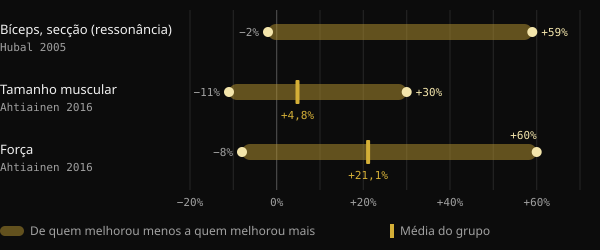
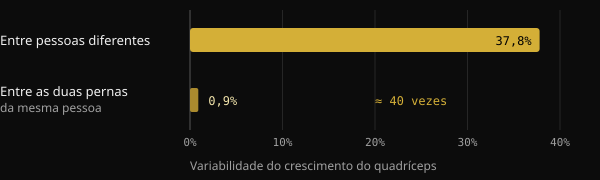
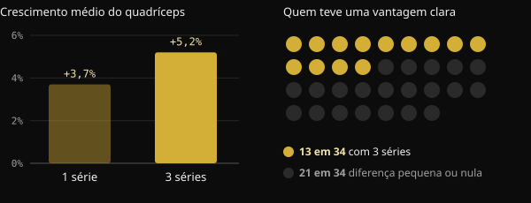

# Low responder: quanto a genética pesa de verdade no crescimento muscular?

Você treina há meses, segue o programa, e mesmo assim o colega de academia cresce o dobro. A tentação é encerrar o assunto com uma palavra: genética. Aqui você vê o que os estudos sobre "high responders" e "low responders" realmente medem, quanto pesa o DNA e por que é difícil saber como você responde.

## Resumindo

- Com o mesmo programa, o crescimento muscular varia enormemente: em um estudo com 585 pessoas, a área de secção do bíceps foi de −2% a +59%.
- A genética conta: cerca de metade das diferenças de força entre pessoas sedentárias é atribuível a fatores hereditários. A outra metade, não.
- Parte do que parece "não responder" é ruído: erro de medição, variações diárias, programas curtos demais.
- Quem responde pouco em um parâmetro muitas vezes melhora em outro. Em um estudo com 110 pessoas com mais de 65 anos, ninguém ficou sem benefícios.
- Mais volume ajuda parte das pessoas, mas não todas: antes de falar em genética, vale verificar programa, duração e medidas.

## Por que um físico pronto não diz nada sobre genética

Diante de um físico muito desenvolvido, raciocinamos ao contrário: partimos do resultado e adivinhamos a causa. Mas o resultado é a soma de anos de treino, alimentação, sono, erros corrigidos e constância. Numa fotografia não dá para separar esses fatores.

O ponto de partida deste artigo é um post do coach Valerio Acri. Ele compara duas fotos suas, a primeira aos vinte anos e a segunda depois de 24 anos de musculação, e convida a pensar se alguém, olhando a primeira, teria falado em "genética incrível". O argumento dele faz sentido: a genética conta, mas uma contribuição genética não é destino.

## Quanto as respostas ao treino realmente variam

Os maiores estudos confirmam que as diferenças entre pessoas são enormes, mesmo com protocolos idênticos e supervisionados.

No estudo FAMuSS, 585 homens e mulheres treinaram por 12 semanas os flexores do cotovelo de um único braço. A área de secção transversa do bíceps, medida por ressonância magnética, variou entre −2% e +59%. A força máxima em uma repetição (1RM) aumentou entre 0% e +250%.

Uma análise finlandesa com 287 adultos entre 19 e 78 anos, 72 deles do grupo controle, encontrou um aumento médio do tamanho muscular de 4,8%. Cada participante, porém, podia ir de −11% a +30%. Para a força, a média foi +21,1%, com valores entre −8% e +60%. Idade e sexo não explicavam essas diferenças.

*Fontes: Hubal et al., Med Sci Sports Exerc 2005 (bíceps, ressonância magnética); Ahtiainen et al., Age 2016 (tamanho muscular e força). O resumo de Hubal não informa a média. Gráfico Nurvan.*

## Quanto pesa a genética

Uma meta-análise japonesa reuniu 24 estudos sobre a herdabilidade da força, com 58 medições. A herdabilidade média da força, isto é, a parcela das diferenças entre pessoas atribuível a fatores genéticos, era de 0,52. Em termos simples: genes e ambiente pesam mais ou menos o mesmo, e com a idade o peso do ambiente aumenta.

Cuidado ao interpretar esse dado. Ele diz respeito à força basal em pessoas sedentárias, não ao quanto se melhora com o treino. Mas mostra que a biologia individual é real e que não explica tudo.

Um estudo brasileiro deixa isso evidente. Vinte jovens já treinados trabalharam por 8 semanas com uma perna em um programa progressivo clássico e com a outra em um programa que mudava continuamente carga, volume, tipo de contração e descansos. As duas pernas cresceram de forma quase idêntica. Já a diferença entre uma pessoa e outra era cerca de 40 vezes maior que a diferença entre as duas pernas da mesma pessoa.

*Fonte: Damas et al., J Appl Physiol 2019 (n = 20, área de secção transversa do vasto lateral). Gráfico Nurvan.*

O dado não diz que o programa não importa. Diz que, entre dois programas bem montados, a diferença é pequena, enquanto as características da pessoa pesam muito.

## Low responder em relação a quê?

Aqui o assunto fica interessante. Um "low responder" é assim para uma medida, uma dose e uma duração precisas. Mudando uma dessas coisas, a classificação pode mudar.

**O volume.** Em um estudo norueguês, 34 pessoas não treinadas treinaram por 12 semanas uma perna com 1 série por exercício e a outra com 3 séries. Com 3 séries, a área do quadríceps cresceu em média 5,2%, contra 3,7% com uma série. Mas só 13 dos 34 participantes mostraram uma vantagem clara do volume maior sobre a hipertrofia. Para os demais, a diferença foi pequena ou nula.

*Fonte: Hammarström et al., J Physiol 2020 (n = 34, 12 semanas, treino contralateral). Gráfico Nurvan.*

Em pessoas treinadas, um estudo brasileiro comparou, em 16 participantes, um volume padrão de 22 séries por semana com um volume equivalente a 1,2 vez o que cada um já fazia. O volume personalizado produziu mais crescimento: em média, 1,08 cm² a mais de área de secção.

**A carga.** Aqui a resposta é diferente. Em 27 mulheres com cerca de 68 anos, treinar a 10 ou a 15 repetições máximas deu resultados semelhantes. Três em cada quatro participantes mantiveram o mesmo status, responder ou não responder, com as duas cargas. Mudar a carga não "destravou" quem respondia pouco.

**A duração e o desfecho medido.** Um estudo holandês com 110 pessoas acima de 65 anos já diz tudo no título: não existem não respondedores ao treinamento resistido. Passando de 12 para 24 semanas de treino, as respostas positivas aumentaram. E todos os participantes melhoraram em pelo menos um entre massa magra, tamanho das fibras, força e capacidade funcional.

## Por que é tão difícil saber como você responde

Mesmo com equipamentos de laboratório, distinguir uma resposta verdadeira de ruído é complicado. Uma revisão publicada no Journal of Applied Physiology explica que o erro de medição e as oscilações normais do organismo inflam a variabilidade aparente. Para separá-los, seriam necessárias intervenções repetidas na mesma pessoa. Por isso, pesquisadores brasileiros propuseram em 2025 um desenho com uma perna treinada e a outra de comparação, porque muitos estudos não conseguem isolar a resposta verdadeira de cada indivíduo.

No estudo finlandês, comparando os resultados com os de quem não treinava, 29% dos participantes entraram entre os low responders para massa, mas só 7% para força. Mesma pessoa, respostas diferentes conforme o que você mede.

Se é difícil no laboratório, é ainda mais difícil com o espelho e a balança de casa.

## O que a pesquisa realmente diz

O ponto de partida é o post de Valerio Acri. Estas são as principais afirmações dele, confrontadas com as fontes.

- **Confirmado** — "A genética conta." A herdabilidade da força é cerca de 0,52 e a variabilidade entre pessoas é ampla mesmo com programas idênticos.
- **Confirmado** — "Contribuição genética não significa determinismo." Na mesma meta-análise, genes e ambiente pesam de forma comparável, e o ambiente conta mais com a idade.
- **A esclarecer** — "Uma resposta observada em certas condições não é uma característica imutável." Vale para volume e duração: mais séries e mais semanas mudam o quadro para parte das pessoas. Mas mudar a carga ou variar o programa não alterou o status da maioria dos participantes.
- **A esclarecer** — "Se você não cresce, precisa de mais volume?" Em média, mais volume dá mais crescimento, mas uma vantagem clara aparece em cerca de 4 pessoas em 10.
- **Não verificável** — "Você não saberia nem depois de dois ou três anos." É plausível, dados os limites de medição, mas os estudos duram de 8 a 24 semanas. Ao longo de anos, não há dados controlados.

## Como aplicar

1. **Meça mais de uma coisa.** Cargas e repetições, peso, circunferências e fotos nas mesmas condições. Um parâmetro parado não significa que tudo esteja parado.
2. **Pense em blocos, não em semanas.** Avalie o progresso em 8–12 semanas, com um programa constante.
3. **Cheque o básico antes da genética.** Progressão das cargas, séries próximas da falha, proteínas e calorias suficientes, sono.
4. **Tente aumentar o volume de forma gradual.** Nos estudos, partir do volume que você já faz e aumentá-lo funcionou melhor do que um número padrão.
5. **Mude uma variável de cada vez.** Se você modificar tudo junto, nunca vai saber o que funcionou.

<h3>Descubra como você responde, com dados</h3>

O Nurvan registra cargas, repetições e RIR de cada série junto com peso, medidas e alimentação. Assim você compara blocos de treino com volumes diferentes e vê sua resposta em meses de dados, não numa impressão diante do espelho.

<a href="https://nurvan.app">Experimente o Nurvan</a>

## Perguntas frequentes

### Como saber se sou um low responder?

Com certeza, não dá. É preciso um programa bem montado, seguido com constância por muitos meses e medido em vários parâmetros. Mesmo assim, o resultado vale para aquele programa, aquele volume e aquele período da sua vida.

### Se eu não cresço, preciso fazer mais séries?

Pode ajudar: em média, mais volume leva a mais crescimento, e um volume personalizado deu resultados melhores que um padrão. Mas não vale para todo mundo. Antes, verifique progressão das cargas, intensidade, alimentação e sono.

### Quanto do crescimento muscular depende do DNA?

Para a força basal, a herdabilidade média estimada é de cerca de 50%. Não existe um número preciso para a resposta ao treino, e as diferenças dependem também de medidas, duração e programa.

### Com a idade a pessoa vira low responder?

Nos estudos citados, idade e sexo não explicavam as diferenças individuais. Entre os maiores de 65 acompanhados por 24 semanas, todos os participantes melhoraram em pelo menos um parâmetro.

## Fontes

1. Hubal MJ et al., 2005. Variability in muscle size and strength gain after unilateral resistance training. *Med Sci Sports Exerc* 37(6):964–72. [PMID 15947721](https://pubmed.ncbi.nlm.nih.gov/15947721/)
2. Ahtiainen JP et al., 2016. Heterogeneity in resistance training-induced muscle strength and mass responses in men and women of different ages. *Age (Dordr)* 38(1):10. [PMID 26767377](https://pubmed.ncbi.nlm.nih.gov/26767377/) · [DOI 10.1007/s11357-015-9870-1](https://doi.org/10.1007/s11357-015-9870-1)
3. Zempo H et al., 2017. Heritability estimates of muscle strength-related phenotypes: A systematic review and meta-analysis. *Scand J Med Sci Sports* 27(12):1537–1546. [PMID 27882617](https://pubmed.ncbi.nlm.nih.gov/27882617/) · [DOI 10.1111/sms.12804](https://doi.org/10.1111/sms.12804)
4. Damas F et al., 2019. Myofibrillar protein synthesis and muscle hypertrophy individualized responses to systematically changing resistance training variables in trained young men. *J Appl Physiol* 127(3):806–815. [PMID 31268828](https://pubmed.ncbi.nlm.nih.gov/31268828/) · [DOI 10.1152/japplphysiol.00350.2019](https://doi.org/10.1152/japplphysiol.00350.2019)
5. Hammarström D et al., 2020. Benefits of higher resistance-training volume are related to ribosome biogenesis. *J Physiol* 598(3):543–565. [PMID 31813190](https://pubmed.ncbi.nlm.nih.gov/31813190/) · [DOI 10.1113/JP278455](https://doi.org/10.1113/JP278455)
6. Scarpelli MC et al., 2022. Muscle Hypertrophy Response Is Affected by Previous Resistance Training Volume in Trained Individuals. *J Strength Cond Res* 36(4):1153–1157. [PMID 32108724](https://pubmed.ncbi.nlm.nih.gov/32108724/) · [DOI 10.1519/JSC.0000000000003558](https://doi.org/10.1519/JSC.0000000000003558)
7. Ribeiro AS et al., 2026. Responsiveness of muscle mass gain to different load intensities of resistance training in older women: A randomized crossover study. *Exp Gerontol* 223:113261. [PMID 42551773](https://pubmed.ncbi.nlm.nih.gov/42551773/) · [DOI 10.1016/j.exger.2026.113261](https://doi.org/10.1016/j.exger.2026.113261)
8. Churchward-Venne TA et al., 2015. There Are No Nonresponders to Resistance-Type Exercise Training in Older Men and Women. *J Am Med Dir Assoc* 16(5):400–11. [PMID 25717010](https://pubmed.ncbi.nlm.nih.gov/25717010/) · [DOI 10.1016/j.jamda.2015.01.071](https://doi.org/10.1016/j.jamda.2015.01.071)
9. Hecksteden A et al., 2015. Individual response to exercise training - a statistical perspective. *J Appl Physiol* 118(12):1450–9. [PMID 25663672](https://pubmed.ncbi.nlm.nih.gov/25663672/) · [DOI 10.1152/japplphysiol.00714.2014](https://doi.org/10.1152/japplphysiol.00714.2014)
10. Chaves TS et al., 2025. Within-individual design for assessing true individual responses in resistance training-induced muscle hypertrophy. *Front Sports Act Living* 7:1517190. [PMID 39958513](https://pubmed.ncbi.nlm.nih.gov/39958513/) · [DOI 10.3389/fspor.2025.1517190](https://doi.org/10.3389/fspor.2025.1517190)

Artigo inspirado em um post de [Dott. & Coach Valerio Acri (@valerio_acri)](https://www.instagram.com/p/Ddf-0MRF7p0/). Fontes consultadas via PubMed.

> Nota: conteúdo informativo, não substitui a opinião de um médico ou de um profissional qualificado.
