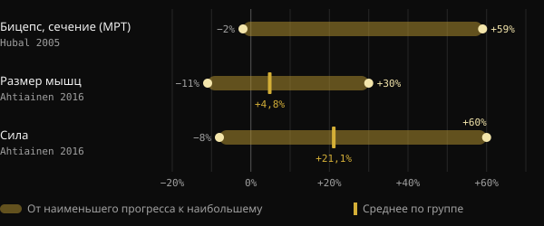
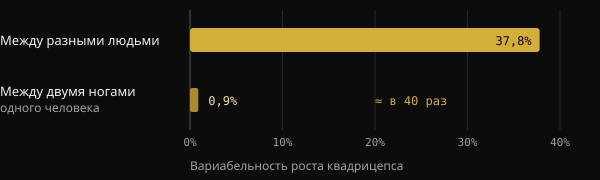
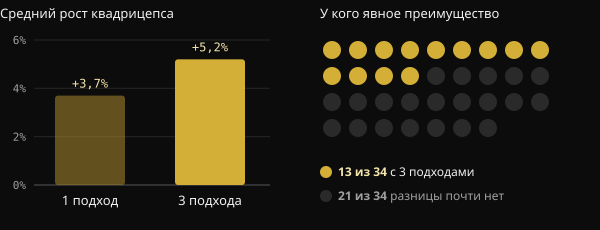

# Low responder: насколько на самом деле генетика влияет на рост мышц?

Ты тренируешься уже несколько месяцев, придерживаешься программы, а партнёр по залу растёт вдвое быстрее. Так и хочется закрыть тему одним словом: генетика. Давай разберём, что на самом деле измеряют исследования «high responder» и «low responder», какую роль играет ДНК и почему так трудно узнать, как отвечаешь на нагрузку именно ты.

## Коротко

- При одной и той же программе рост мышц сильно различается: в исследовании на 585 людях площадь сечения бицепса изменилась от −2% до +59%.
- Генетика важна: примерно половина различий в силе между людьми, которые не тренируются, объясняется наследственными факторами. Другая половина — нет.
- Часть того, что выглядит как «отсутствие ответа», — это шум: погрешность измерений, колебания от дня ко дню, слишком короткие программы.
- Тот, кто слабо отвечает по одному показателю, часто улучшается по другому. В исследовании 110 людей старше 65 лет без пользы не остался никто.
- Больший объём помогает части людей, но не всем: прежде чем говорить о генетике, стоит проверить программу, длительность и способы измерения.

## Почему готовое тело ничего не говорит о генетике

Глядя на очень развитое тело, мы рассуждаем наоборот: берём результат и угадываем причину. Но результат — это сумма лет тренировок, питания, сна, исправленных ошибок и постоянства. По одной фотографии эти факторы не разделить.

Поводом для этой статьи стал пост тренера Валерио Акри. Он сравнивает две свои фотографии: на первой ему двадцать лет, на второй — 24 года занятий с отягощениями, — и предлагает задуматься, сказал бы кто-нибудь по первой о «невероятной генетике». С его мыслью трудно спорить: генетика важна, но генетический вклад — это не приговор.

## Насколько на самом деле различается ответ на тренировки

Самые крупные исследования подтверждают: различия между людьми огромны, даже при одинаковых протоколах под контролем.

В исследовании FAMuSS 585 мужчин и женщин 12 недель тренировали сгибатели локтя только одной руки. Площадь поперечного сечения бицепса, измеренная магнитно-резонансной томографией, изменилась от −2% до +59%. Максимальная сила в одном повторении (1ПМ) выросла от 0% до +250%.

Финский анализ 287 взрослых от 19 до 78 лет, среди которых было 72 человека в контрольной группе, показал среднее увеличение размера мышц на 4,8%. Но у отдельного участника результат мог составлять от −11% до +30%. По силе среднее значение было +21,1%, а разброс — от −8% до +60%. Возраст и пол этих различий не объясняли.

*Источники: Hubal et al., Med Sci Sports Exerc 2005 (бицепс, МРТ); Ahtiainen et al., Age 2016 (размер мышц и сила). Hubal не приводит среднее значение в абстракте. График Nurvan.*

## Какую роль играет генетика

Японский метаанализ собрал 24 исследования наследуемости силы с 58 измерениями. Средняя наследуемость силы, то есть доля различий между людьми, объясняемая генетическими факторами, составила 0,52. Проще говоря, гены и среда вносят примерно равный вклад, а с возрастом вклад среды растёт.

Важно правильно читать эту цифру. Она относится к исходной силе у людей, которые не тренируются, а не к тому, насколько они улучшаются благодаря тренировкам. Но она показывает, что индивидуальная биология реальна и что она объясняет не всё.

Бразильское исследование делает это очень наглядным. Двадцать молодых людей с тренировочным опытом 8 недель тренировали одну ногу по классической прогрессивной программе, а другую — по программе, где постоянно менялись нагрузка, объём, тип сокращения и отдых. Обе ноги выросли почти одинаково. А вот разница между одним человеком и другим была примерно в 40 раз больше, чем между двумя ногами одного и того же человека.

*Источник: Damas et al., J Appl Physiol 2019 (n = 20, площадь поперечного сечения широкой латеральной мышцы бедра). График Nurvan.*

Это не значит, что программа не важна. Это значит, что между двумя хорошо составленными программами разница невелика, а особенности самого человека значат очень много.

## Low responder по сравнению с чем?

Вот тут становится интересно. «Low responder» — это человек с низким ответом по конкретному показателю, при конкретной дозе и за конкретный срок. Изменишь что-то одно из этого — и классификация может измениться.

**Объём.** В норвежском исследовании 34 нетренированных человека 12 недель тренировали одну ногу с 1 подходом на упражнение, а другую — с 3 подходами. При 3 подходах площадь сечения квадрицепса выросла в среднем на 5,2% против 3,7% при одном подходе. Но чёткое преимущество большего объёма по гипертрофии проявилось лишь у 13 участников из 34. У остальных разница была небольшой или отсутствовала.

*Источник: Hammarström et al., J Physiol 2020 (n = 34, 12 недель, контралатеральная тренировка). График Nurvan.*

У тренированных людей бразильское исследование на 16 участниках сравнило стандартный объём в 22 подхода в неделю с объёмом, в 1,2 раза превышающим тот, что каждый делал раньше. Персонализированный объём дал больший рост: в среднем на 1,08 см² площади сечения больше.

**Нагрузка.** Здесь ответ другой. У 27 женщин около 68 лет тренировки в 10 или в 15 повторных максимумах дали сходные результаты. Трое из четырёх участниц сохранили свой статус, респондер или нон-респондер, при обоих вариантах нагрузки. Смена нагрузки не «разблокировала» тех, кто отвечал слабо.

**Длительность и измеряемый результат.** Голландское исследование на 110 людях старше 65 лет говорит об этом уже в названии: нон-респондеров на силовые тренировки не существует. При переходе от 12 к 24 неделям тренировок число положительных ответов выросло. И каждый участник улучшился хотя бы по одному из показателей: тощая масса, размер волокон, сила, функциональные способности.

## Почему так трудно узнать, как отвечаешь именно ты

Даже с лабораторным оборудованием отличить настоящий ответ от шума непросто. Обзор в Journal of Applied Physiology объясняет, что погрешность измерений и обычные колебания организма раздувают кажущуюся вариабельность. Чтобы их разделить, нужны повторные вмешательства на одном и том же человеке. Именно поэтому бразильские исследователи в 2025 году предложили схему, где одна нога тренируется, а другая служит контролем, ведь многие исследования не способны выделить истинный ответ каждого участника.

В финском исследовании при сравнении с теми, кто не тренировался, 29% участников оказались low responder по массе, но только 7% — по силе. Один и тот же человек, разные ответы в зависимости от того, что измерять.

Если это трудно в лаборатории, то перед домашним зеркалом и весами — тем более.

## Что на самом деле говорят исследования

Отправная точка — пост Валерио Акри. Вот его основные утверждения, сверенные с источниками.

- **Подтверждено** — «Генетика имеет значение». Наследуемость силы около 0,52, а различия между людьми велики даже при одинаковых программах.
- **Подтверждено** — «Генетический вклад не означает детерминизм». В том же метаанализе гены и среда вносят сопоставимый вклад, а с возрастом среда значит больше.
- **Требует уточнения** — «Ответ, наблюдаемый в определённых условиях, — не неизменная характеристика». Это верно для объёма и длительности: больше подходов и больше недель меняют картину для части людей. Но смена нагрузки или разнообразие программы не изменили статус большинства участников.
- **Требует уточнения** — «Если не растёшь, нужно больше объёма?» В среднем больший объём даёт больший рост, но чёткое преимущество видно примерно у 4 человек из 10.
- **Невозможно проверить** — «Ты бы не узнал этого даже через два-три года». Это правдоподобно, учитывая ограничения измерений, но исследования длятся от 8 до 24 недель. Контролируемых данных за годы нет.

## Как это применить

1. **Измеряй не один показатель.** Рабочие веса и повторения, вес тела, обхваты и фото в одинаковых условиях. Если стоит один показатель, это не значит, что стоит всё.
2. **Думай блоками, а не неделями.** Оценивай прогресс за 8–12 недель при неизменной программе.
3. **Сначала проверь основы, потом вини генетику.** Прогрессия нагрузок, подходы близко к отказу, достаточно белка и калорий, сон.
4. **Попробуй повышать объём постепенно.** В исследованиях лучше всего сработало начинать с объёма, который ты уже делаешь, и увеличивать его, а не брать стандартное число.
5. **Меняй одну переменную за раз.** Если поменять всё сразу, ты никогда не узнаешь, что сработало.

<h3>Узнай, как отвечаешь ты, по данным</h3>

Nurvan записывает рабочие веса, повторения и RIR каждого подхода вместе с весом тела, замерами и питанием. Так ты сравниваешь тренировочные блоки с разным объёмом и видишь свой ответ по данным за месяцы, а не по впечатлению от зеркала.

<a href="https://nurvan.app">Попробуй Nurvan</a>

## Частые вопросы

### Как понять, что я low responder?

С уверенностью — никак. Нужна хорошо составленная программа, которую ты стабильно выполняешь много месяцев, и измерения по нескольким показателям. Но и тогда результат справедлив для этой программы, этого объёма и этого периода твоей жизни.

### Если я не расту, нужно делать больше подходов?

Это может помочь: в среднем больший объём даёт больший рост, а персонализированный объём работал лучше стандартного. Но это подходит не всем. Сначала проверь прогрессию нагрузок, интенсивность, питание и сон.

### Какая доля роста мышц зависит от ДНК?

Для исходной силы средняя оценка наследуемости — около 50%. Точной цифры для ответа на тренировки нет, а различия зависят и от измерений, длительности и программы.

### С возрастом становятся low responder?

В упомянутых исследованиях возраст и пол индивидуальных различий не объясняли. У людей старше 65 лет, за которыми наблюдали 24 недели, каждый участник улучшился хотя бы по одному показателю.

## Источники

1. Hubal MJ et al., 2005. Variability in muscle size and strength gain after unilateral resistance training. *Med Sci Sports Exerc* 37(6):964–72. [PMID 15947721](https://pubmed.ncbi.nlm.nih.gov/15947721/)
2. Ahtiainen JP et al., 2016. Heterogeneity in resistance training-induced muscle strength and mass responses in men and women of different ages. *Age (Dordr)* 38(1):10. [PMID 26767377](https://pubmed.ncbi.nlm.nih.gov/26767377/) · [DOI 10.1007/s11357-015-9870-1](https://doi.org/10.1007/s11357-015-9870-1)
3. Zempo H et al., 2017. Heritability estimates of muscle strength-related phenotypes: A systematic review and meta-analysis. *Scand J Med Sci Sports* 27(12):1537–1546. [PMID 27882617](https://pubmed.ncbi.nlm.nih.gov/27882617/) · [DOI 10.1111/sms.12804](https://doi.org/10.1111/sms.12804)
4. Damas F et al., 2019. Myofibrillar protein synthesis and muscle hypertrophy individualized responses to systematically changing resistance training variables in trained young men. *J Appl Physiol* 127(3):806–815. [PMID 31268828](https://pubmed.ncbi.nlm.nih.gov/31268828/) · [DOI 10.1152/japplphysiol.00350.2019](https://doi.org/10.1152/japplphysiol.00350.2019)
5. Hammarström D et al., 2020. Benefits of higher resistance-training volume are related to ribosome biogenesis. *J Physiol* 598(3):543–565. [PMID 31813190](https://pubmed.ncbi.nlm.nih.gov/31813190/) · [DOI 10.1113/JP278455](https://doi.org/10.1113/JP278455)
6. Scarpelli MC et al., 2022. Muscle Hypertrophy Response Is Affected by Previous Resistance Training Volume in Trained Individuals. *J Strength Cond Res* 36(4):1153–1157. [PMID 32108724](https://pubmed.ncbi.nlm.nih.gov/32108724/) · [DOI 10.1519/JSC.0000000000003558](https://doi.org/10.1519/JSC.0000000000003558)
7. Ribeiro AS et al., 2026. Responsiveness of muscle mass gain to different load intensities of resistance training in older women: A randomized crossover study. *Exp Gerontol* 223:113261. [PMID 42551773](https://pubmed.ncbi.nlm.nih.gov/42551773/) · [DOI 10.1016/j.exger.2026.113261](https://doi.org/10.1016/j.exger.2026.113261)
8. Churchward-Venne TA et al., 2015. There Are No Nonresponders to Resistance-Type Exercise Training in Older Men and Women. *J Am Med Dir Assoc* 16(5):400–11. [PMID 25717010](https://pubmed.ncbi.nlm.nih.gov/25717010/) · [DOI 10.1016/j.jamda.2015.01.071](https://doi.org/10.1016/j.jamda.2015.01.071)
9. Hecksteden A et al., 2015. Individual response to exercise training - a statistical perspective. *J Appl Physiol* 118(12):1450–9. [PMID 25663672](https://pubmed.ncbi.nlm.nih.gov/25663672/) · [DOI 10.1152/japplphysiol.00714.2014](https://doi.org/10.1152/japplphysiol.00714.2014)
10. Chaves TS et al., 2025. Within-individual design for assessing true individual responses in resistance training-induced muscle hypertrophy. *Front Sports Act Living* 7:1517190. [PMID 39958513](https://pubmed.ncbi.nlm.nih.gov/39958513/) · [DOI 10.3389/fspor.2025.1517190](https://doi.org/10.3389/fspor.2025.1517190)

Статья написана по мотивам поста [Dott. & Coach Valerio Acri (@valerio_acri)](https://www.instagram.com/p/Ddf-0MRF7p0/). Источники изучены через PubMed.

> Примечание: материал носит информационный характер и не заменяет консультацию врача или квалифицированного специалиста.
