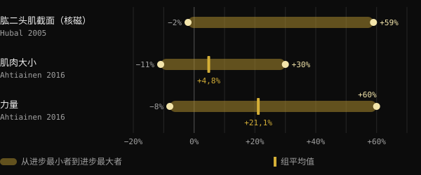
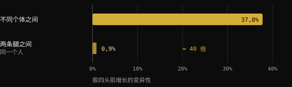
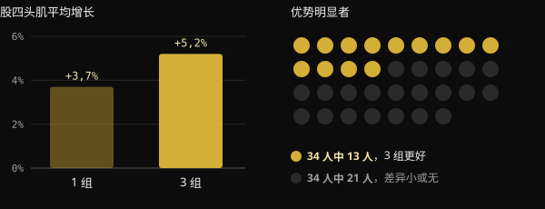

# 低反应者：基因对肌肉生长究竟有多大影响？

你已经训练了好几个月，严格执行计划，可健身房里的同伴却长得比你快一倍。这时人们很容易用一个词来结束讨论：基因。本文带你看看，关于“高反应者”和“低反应者”，研究到底测量了什么，DNA 的影响有多大，以及为什么很难确切知道自己属于哪一类。

## 要点速览

- 同一个训练计划，肌肉增长的差异极大：在一项纳入 585 人的研究中，肱二头肌横截面积的变化从 −2% 到 +59%。
- 基因确实重要：久坐人群之间的力量差异，大约一半可归因于遗传因素，另一半则不能。
- 看似“没有反应”的情况，有一部分只是噪声：测量误差、每日波动、训练周期太短。
- 在某一项指标上反应不佳的人，往往在另一项指标上有进步。在一项针对 65 岁以上人群的 110 人研究中，没有人毫无获益。
- 增加训练量对一部分人有帮助，但并非对所有人：在谈论基因之前，最好先检查计划、周期和测量方法。

## 为什么一副成型的身材说明不了基因

面对一副发达的身材，我们习惯倒着推理：从结果出发去猜原因。但结果是多年训练、饮食、睡眠、纠正过的错误和长期坚持的总和。仅凭一张照片，无法把这些因素区分开来。

本文的灵感来自教练 Valerio Acri 的一篇帖子。他把自己的两张照片放在一起对比，第一张是二十岁时的样子，第二张是练了 24 年力量之后，并请大家想一想，看到第一张照片时，会不会有人说“这基因太逆天了”。他的观点值得认同：基因确实重要，但基因的贡献并不等于命中注定。

## 对训练的反应究竟差异多大

规模最大的几项研究证实，即使采用相同且有监督的训练方案，人与人之间的差异仍然非常大。

在 FAMuSS 研究中，585 名男女只训练一侧手臂的肘屈肌，持续 12 周。用核磁共振测得的肱二头肌横截面积，变化范围为 −2% 到 +59%。单次重复最大力量（1RM）的增幅为 0% 到 +250%。

芬兰的一项分析纳入 287 名 19 至 78 岁的成年人（其中 72 人为对照组），发现肌肉尺寸平均增加 4.8%，但个体参与者的变化可以从 −11% 到 +30%。力量方面，平均增幅为 +21.1%，个体范围为 −8% 到 +60%。年龄和性别都解释不了这些差异。

*来源：Hubal et al., Med Sci Sports Exerc 2005（肱二头肌，核磁共振）；Ahtiainen et al., Age 2016（肌肉尺寸与力量）。Hubal 的摘要未报告平均值。图表由 Nurvan 制作。*

## 基因的影响有多大

一项日本的荟萃分析汇总了 24 项关于力量遗传度的研究，共 58 次测量。力量的平均遗传度，即人与人之间差异中可归因于遗传因素的比例，为 0.52。简单来说：基因和环境的影响大致相当，而且随着年龄增长，环境的影响会变大。

解读这个数据时要小心。它说的是久坐人群的基础力量，而不是训练能带来多大进步。不过它表明，个体生物学差异是真实存在的，但并不能解释一切。

巴西的一项研究把这一点展现得很清楚。20 名已有训练基础的年轻人训练了 8 周：一条腿采用经典的渐进式计划，另一条腿则采用不断变化负荷、训练量、收缩类型和休息时间的计划。两条腿的增长几乎完全相同。而人与人之间的差异，大约是同一个人两条腿之间差异的 40 倍。

*来源：Damas et al., J Appl Physiol 2019（n = 20，股外侧肌横截面积）。图表由 Nurvan 制作。*

这个数据并不是说训练计划不重要。它说的是：在两个设计合理的计划之间，差异很小，而个人自身的特点影响很大。

## 相对于什么而言的“低反应者”？

问题在这里变得有意思了。“低反应者”是针对某一项特定的测量、某一个特定的剂量和某一个特定的时长而言的。只要改变其中任何一项，分类就可能改变。

**训练量。** 在挪威的一项研究中，34 名没有训练基础的人用 12 周训练：一条腿每个动作做 1 组，另一条腿做 3 组。做 3 组时，股四头肌横截面积平均增长 5.2%，做 1 组时为 3.7%。但 34 名参与者中，只有 13 人在肌肥大方面表现出较大训练量带来的明确优势。对其他人来说，差异很小，甚至没有差异。

*来源：Hammarström et al., J Physiol 2020（n = 34，12 周，单侧对照训练）。图表由 Nurvan 制作。*

在有训练基础的人群中，巴西的一项研究对 16 人比较了每周 22 组的标准训练量，与相当于每个人原有训练量 1.2 倍的训练量。个体化的训练量带来了更多增长：横截面积平均多出 1.08 cm²。

**负荷。** 这方面的答案不同。在 27 名 68 岁左右的女性中，以 10 次最大重复或 15 次最大重复训练，结果相近。四分之三的参与者在两种负荷下保持了相同的状态，无论是反应者还是无反应者。改变负荷并没有“解锁”那些反应不佳的人。

**时长与所测量的结果。** 荷兰一项针对 65 岁以上 110 人的研究，从标题上就说明了一切：抗阻训练不存在无反应者。训练从 12 周延长到 24 周后，积极反应增加了。而且每位参与者在瘦体重、肌纤维大小、力量和功能能力这几项中，至少有一项得到了改善。

## 为什么很难知道自己属于哪一类

即使有实验室设备，要把真实的反应与噪声区分开也很复杂。发表在 Journal of Applied Physiology 上的一篇综述指出，测量误差和机体的正常波动会放大表面上的变异。要把两者分开，就需要在同一个人身上重复干预。为此，巴西研究人员在 2025 年提出了一种设计：一条腿训练，另一条腿作为对照，因为许多研究无法分离出每个人的真实反应。

在芬兰的研究中，与不训练的人相比，29% 的参与者在肌肉量上属于低反应者，而在力量上只有 7%。同一个人，测量的内容不同，反应就不同。

如果在实验室里都这么难，那么靠家里的镜子和体重秤就更难了。

## 研究到底怎么说

灵感来自 Valerio Acri 的帖子。以下是他的主要观点，并与文献来源进行对照。

- **已证实** — “基因很重要。” 力量的遗传度约为 0.52，即使采用相同的计划，人与人之间的差异也很大。
- **已证实** — “有遗传贡献，不等于宿命论。” 在同一项荟萃分析中，基因与环境的影响相当，而且随着年龄增长，环境的作用更大。
- **需要补充说明** — “在某些条件下观察到的反应，并不是一成不变的特征。” 这对训练量和时长成立：更多组数、更长周期，会让一部分人的情况发生变化。但改变负荷或变换计划，并没有改变大多数参与者的状态。
- **需要补充说明** — “如果不长肌肉，是不是需要更多训练量？” 平均而言，训练量越大增长越多，但明确的优势大约只出现在每 10 人中的 4 人身上。
- **无法验证** — “即使过了两三年，你也不会知道。” 考虑到测量的局限，这是合理的，但研究的时长是 8 到 24 周。关于多年期的情况，没有对照数据。

## 如何应用

1. **不要只测一项。** 记录负荷和次数、体重、围度，并在相同条件下拍照。某一项指标停滞，并不意味着一切都停滞了。
2. **以训练周期为单位思考，而不是按周。** 在保持计划不变的前提下，用 8 到 12 周来评估进步。
3. **先检查基础，再谈基因。** 负荷递增、接近力竭的组数、足够的蛋白质和热量、睡眠。
4. **尝试逐步增加训练量。** 在研究中，从你目前的训练量出发再逐步增加，比采用一个标准数字效果更好。
5. **一次只改变一个变量。** 如果同时改动所有内容，你永远不会知道是什么起了作用。

<h3>用数据了解你自己的反应</h3>

Nurvan 会记录每一组的负荷、次数和 RIR，以及体重、围度和饮食。这样你就可以比较不同训练量的训练周期，通过数月的数据来看自己的反应，而不是凭镜子里的印象。

<a href="https://nurvan.app">试用 Nurvan</a>

## 常见问题

### 我怎么知道自己是不是低反应者？

无法确定。你需要一个设计合理的计划，坚持执行许多个月，并用多项指标来衡量。即便如此，结论也只适用于那个计划、那个训练量和你人生中的那一段时期。

### 如果不长肌肉，我就该多做几组吗？

可能有帮助：平均而言，训练量越大增长越多，个体化的训练量也比标准训练量取得了更好的效果。但这并不适用于所有人。请先检查负荷递增、强度、饮食和睡眠。

### 肌肉增长有多少取决于 DNA？

就基础力量而言，估计的平均遗传度约为 50%。对于训练反应，并没有一个确切的数字，差异还取决于测量方法、时长和计划。

### 随着年龄增长会变成低反应者吗？

在文中引用的研究里，年龄和性别都解释不了个体差异。在 65 岁以上、随访 24 周的人群中，每位参与者至少有一项指标得到了改善。

## 参考文献

1. Hubal MJ et al., 2005. Variability in muscle size and strength gain after unilateral resistance training. *Med Sci Sports Exerc* 37(6):964–72. [PMID 15947721](https://pubmed.ncbi.nlm.nih.gov/15947721/)
2. Ahtiainen JP et al., 2016. Heterogeneity in resistance training-induced muscle strength and mass responses in men and women of different ages. *Age (Dordr)* 38(1):10. [PMID 26767377](https://pubmed.ncbi.nlm.nih.gov/26767377/) · [DOI 10.1007/s11357-015-9870-1](https://doi.org/10.1007/s11357-015-9870-1)
3. Zempo H et al., 2017. Heritability estimates of muscle strength-related phenotypes: A systematic review and meta-analysis. *Scand J Med Sci Sports* 27(12):1537–1546. [PMID 27882617](https://pubmed.ncbi.nlm.nih.gov/27882617/) · [DOI 10.1111/sms.12804](https://doi.org/10.1111/sms.12804)
4. Damas F et al., 2019. Myofibrillar protein synthesis and muscle hypertrophy individualized responses to systematically changing resistance training variables in trained young men. *J Appl Physiol* 127(3):806–815. [PMID 31268828](https://pubmed.ncbi.nlm.nih.gov/31268828/) · [DOI 10.1152/japplphysiol.00350.2019](https://doi.org/10.1152/japplphysiol.00350.2019)
5. Hammarström D et al., 2020. Benefits of higher resistance-training volume are related to ribosome biogenesis. *J Physiol* 598(3):543–565. [PMID 31813190](https://pubmed.ncbi.nlm.nih.gov/31813190/) · [DOI 10.1113/JP278455](https://doi.org/10.1113/JP278455)
6. Scarpelli MC et al., 2022. Muscle Hypertrophy Response Is Affected by Previous Resistance Training Volume in Trained Individuals. *J Strength Cond Res* 36(4):1153–1157. [PMID 32108724](https://pubmed.ncbi.nlm.nih.gov/32108724/) · [DOI 10.1519/JSC.0000000000003558](https://doi.org/10.1519/JSC.0000000000003558)
7. Ribeiro AS et al., 2026. Responsiveness of muscle mass gain to different load intensities of resistance training in older women: A randomized crossover study. *Exp Gerontol* 223:113261. [PMID 42551773](https://pubmed.ncbi.nlm.nih.gov/42551773/) · [DOI 10.1016/j.exger.2026.113261](https://doi.org/10.1016/j.exger.2026.113261)
8. Churchward-Venne TA et al., 2015. There Are No Nonresponders to Resistance-Type Exercise Training in Older Men and Women. *J Am Med Dir Assoc* 16(5):400–11. [PMID 25717010](https://pubmed.ncbi.nlm.nih.gov/25717010/) · [DOI 10.1016/j.jamda.2015.01.071](https://doi.org/10.1016/j.jamda.2015.01.071)
9. Hecksteden A et al., 2015. Individual response to exercise training - a statistical perspective. *J Appl Physiol* 118(12):1450–9. [PMID 25663672](https://pubmed.ncbi.nlm.nih.gov/25663672/) · [DOI 10.1152/japplphysiol.00714.2014](https://doi.org/10.1152/japplphysiol.00714.2014)
10. Chaves TS et al., 2025. Within-individual design for assessing true individual responses in resistance training-induced muscle hypertrophy. *Front Sports Act Living* 7:1517190. [PMID 39958513](https://pubmed.ncbi.nlm.nih.gov/39958513/) · [DOI 10.3389/fspor.2025.1517190](https://doi.org/10.3389/fspor.2025.1517190)

本文灵感来自 [Dott. & Coach Valerio Acri (@valerio_acri)](https://www.instagram.com/p/Ddf-0MRF7p0/) 的一篇帖子。参考文献通过 PubMed 查阅。

> 注：本文仅供参考，不能替代医生或合格专业人士的意见。
