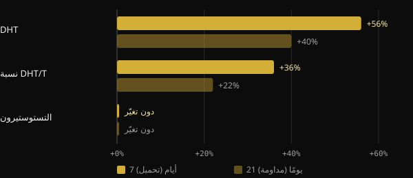
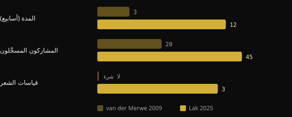

# هل يسبب الكرياتين تساقط الشعر؟ ما تُظهره الدراسات فعلًا

الكرياتين من أكثر المكملات دراسةً على الإطلاق، ومع ذلك يتكرر سؤال واحد: "هل سيجعل شعري يتساقط؟". ولهذا القلق أصل محدد، هو دراسة صغيرة من عام 2009 لم تكن تقيس الشعر أصلًا. سنعيد هنا بناء ما كانت تقيسه تلك الدراسة، وما وجدته أول تجربة صُممت خصيصًا لذلك عام 2025، وكيف تقرأ دراسة بنفسك قبل أن يخيفك عنوان.

## باختصار

- ينشأ القلق من دراسة عام 2009 على 20 لاعب رجبي: خلال 3 أسابيع ارتفع DHT في الدم، لكن الشعر لم يُقَس قط.
- DHT هرمون له دور في الصلع الذكوري، لكن ارتفاعه في الدم لا يعادل فقدان الشعر.
- في عام 2025 قاست تجربة عشوائية مدتها 12 أسبوعًا مباشرةً كثافة الشعر وعدد الوحدات الجريبية وسماكة الشعر: لا فرق بين الكرياتين والدواء الوهمي.
- وفي التجربة نفسها لم يختلف DHT ونسبة DHT/التستوستيرون بين المجموعتين.
- تعتبر مراجعات الجمعية الدولية للتغذية الرياضية (ISSN) الكرياتين مونوهيدرات آمنًا ومحتمَلًا جيدًا لدى الأصحاء بالجرعات المدروسة.

## من أين ينشأ القلق

في عام 2009 أعطى فريق من جامعة ستيلينبوش في جنوب أفريقيا الكرياتين لـ20 لاعب رجبي جامعيًا خلال الموسم. كان التصميم تبادليًا (crossover) ومزدوج التعمية: تناول كل رياضي الكرياتين والدواء الوهمي، في فترتين مختلفتين يفصل بينهما انقطاع 6 أسابيع. ودامت مرحلة الكرياتين 3 أسابيع: 7 أيام من التحميل بجرعة 25 غ يوميًا، ثم 14 يومًا بجرعة 5 غ.

قاس المؤلفون في الدم التستوستيرون وثنائي هيدروتستوستيرون (DHT)، وهو هرمون ينشأ من التستوستيرون بفعل إنزيم 5-ألفا ريدوكتاز وهو أقوى أثرًا على مستقبِلات الأندروجين.

*المصدر: van der Merwe et al., Clin J Sport Med 2009 (n = 20، crossover). التغيرات مقارنةً بالبداية كما وردت في الملخص. رسم Nurvan.*

لم يتغير التستوستيرون. أما DHT فارتفع 56% بعد أسبوع التحميل، وظل أعلى من قيمته الأولية بنسبة 40% بعد أسبوعي المحافظة. وارتفعت نسبة DHT/التستوستيرون 36% ثم 22%. وخلص المؤلفون أنفسهم إلى الحاجة إلى مزيد من الدراسات.

أما الخطوة التالية فصنعها تداول الكلام بين الناس. فـDHT محوري في الصلع الأندروجيني الذكوري، حتى إن دواء فيناستيريد يعمل تحديدًا بحجب 5-ألفا ريدوكتاز. ومن "الكرياتين يرفع DHT" إلى "الكرياتين يسبب تساقط الشعر" كانت القفزة قصيرة. لكن أحدًا في الدراسة لم يعدّ شعرة واحدة.

## لماذا لا يكفي DHT في الدم

الصلع الأندروجيني هو تصغّر تدريجي للجريبات، تقوده عوامل وراثية والأندروجينات. وبحسب مراجعات الأمراض الجلدية، فالمهم هو حساسية الجريب، لا مقدار DHT المتداول فحسب. وارتفاع مؤقت في الدم قرينة تستحق التقصّي، لا دليلًا على ضرر بالشعر.

ثم هناك حدود الدراسة: مجموعة واحدة من الرياضيين، وثلاثة أسابيع فقط، وجرعة تحميل عالية. كما أن النتيجة لم تُكرَّر قط. وتتناول مراجعة ISSN لعام 2021 عن أسئلة الكرياتين وخرافاته هذه النقطة تحديدًا، وتخلص إلى أن البيانات الحالية لا تشير إلى أن الكرياتين يسبب تساقط الشعر أو الصلع.

## دراسة 2025: أخيرًا يُقاس الشعر

في عام 2025 نشر فريق من باحثين إيرانيين وكنديين وأمريكيين في Journal of the International Society of Sports Nutrition أول تجربة صُممت للإجابة عن السؤال مباشرة. جنّدوا 45 رجلًا بين 18 و40 عامًا يتدربون بالأثقال أصلًا، وقسّموهم عشوائيًا إلى مجموعتين لمدة 12 أسبوعًا: 5 غ يوميًا من الكرياتين مونوهيدرات أو 5 غ من المالتوديكسترين كدواء وهمي. وأتمّ الدراسة 38 منهم.

هذه المرة قيست الهرمونات والشعر معًا. كانت الهرمونات: التستوستيرون الكلي والتستوستيرون الحر وDHT. وبالنسبة إلى الشعر، بواسطة تريكوغرام ونظام FotoFinder، قيست الكثافة وعدد الوحدات الجريبية والسماكة التراكمية.

*المصادر: van der Merwe et al. 2009؛ Lak et al. 2025. البيانات من الملخصات. رسم Nurvan.*

النتيجة: لا فرق بين الكرياتين والدواء الوهمي في أي هرمون ولا في أي مؤشر للشعر. ارتفع التستوستيرون الكلي وانخفض الحر في المجموعتين، أي بمعزل عن الكرياتين. كما أن DHT ونسبة DHT/التستوستيرون لم يتحركا بصورة مختلفة بين المجموعتين.

وللدراسة حدود ينبغي استحضارها: 38 شخصًا، رجال شباب فقط، و12 أسبوعًا، ومركز واحد. وهي لا تقول شيئًا عن النساء، ولا عمّن يعانون صلعًا متقدمًا بالفعل، ولا عن سنوات من الاستخدام. لكنها المرة الأولى التي يُختبر فيها السؤال بقياس الشيء الصحيح.

## ثلاثة أسئلة تطرحها على أي دراسة

هذه القصة تمرين جيد على قراءة البحث. قبل أن تشارك عنوانًا، جرّب أن تسأل نفسك هذه الأسئلة الثلاثة.

1. **ما الذي قيس بالضبط؟** هرمون في الدم، أم مؤشر وسيط، أم النتيجة التي تهمك فعلًا؟ في عام 2009 قيس DHT، لا تساقط الشعر. وإذا لم تُقَس النتيجة فلا تستطيع الدراسة الإجابة عن السؤال.
2. **على من ولكم من الوقت؟** عشرون لاعب رجبي لمدة ثلاثة أسابيع ليسوا عموم السكان على مدى سنوات. فعدد الأشخاص والمدة والعمر والجنس والجرعات تحدد إلى أي مدى يمكن تعميم النتائج.
3. **هل كُررت، وكيف تنسجم مع بقية الأدلة؟** الدراسة الواحدة نقطة انطلاق. المهم هل وجدت مجموعات أخرى النتيجة نفسها، وهل تسير المراجعات التي تجمع كل البيانات في الاتجاه نفسه.

## ماذا يقول البحث حقًا

منطلق هذا المقال منشور لـ Marco Guercioni (@the___doc) عن تاريخ العلاقة بين الكرياتين والشعر. وهذه أبرز ادعاءاته، مقارَنةً بالمصادر.

- **مؤكَّد** — "دراسة 2009 قاست DHT في الدم، لا الشعر." لا يورد الملخص سوى التستوستيرون وDHT ونسبة DHT/T وتركيب الجسم.
- **مؤكَّد** — "دامت الدراسة ثلاثة أسابيع." أسبوع تحميل وأسبوعان محافظة.
- **يحتاج إلى توضيح** — "كان المشاركون 16 لاعب رجبي." يذكر الملخص 20 متطوعًا. أما عدد من أكملوا الدراسة فلا يرد في الملخص، ولذلك لا يمكن التحقق من رقم 16 من هناك.
- **يحتاج إلى توضيح** — "من تلك الدراسة وُلدت الخرافة." هي الدراسة الوحيدة على البشر التي أبلغت عن ارتفاع DHT مع الكرياتين، وهي التي نوقشت في مراجعة ISSN لعام 2021. أن تكون أصل ما تداوله الناس تفسير معقول، لا معطًى قابلًا للقياس.
- **مؤكَّد** — "في عام 2025 صدرت أول دراسة صُممت لقياس تساقط الشعر مع الكرياتين." يصرّح المؤلفون أنفسهم بأنهم الأوائل في تقييم صحة الجريب مباشرة بعد الكرياتين.

## كيف تطبّق ذلك

- **إن كنت تستخدم الكرياتين وتخشى على شعرك:** الأدلة المباشرة المتاحة اليوم لا تُظهر أثرًا في الشعر ولا في DHT خلال 12 أسبوعًا. والمعطى متين لدى الرجال الشباب المتدربين، وأقل متانة لدى فئات أخرى.
- **الجرعات المستخدمة في الدراسات:** استخدمت تجربة 2025 جرعة 5 غ يوميًا. وتوصي مراجعة ISSN لعام 2021 بجرعات 3–5 غ يوميًا، أو 0,1 غ لكل كغ من الوزن. أما مرحلة التحميل في 2009 (25 غ يوميًا) فلا حاجة إليها بحسب المراجعة نفسها. هذه بيانات من الأدبيات العلمية، لا وصفة شخصية.
- **إن كان في عائلتك تاريخ مع الصلع:** تبقى الوراثة العامل الرئيسي. وإن لاحظت ترققًا فاستشر طبيب أمراض جلدية، فهو يستطيع تقييم الحالة بمعزل عن الكرياتين.
- **إن كنت تعاني أمراض الكلى أو حالات طبية أخرى،** فاستشر طبيبك قبل البدء بأي مكمل.

<h3>مكملات يتابعها مدربك</h3>

في Nurvan يمكنك أن تطلب من مدربك بروتوكول مكملات مباشرة من التطبيق. يبنيه المدرب باختيار المنتجات من كتالوج المكملات في التطبيق، مع الجرعة ووقت التناول لكل منتج، ويضيفه إلى خطتك بجانب التدريب والتغذية. وهكذا يكون لكل مكمل سبب، وشخص يتابعه معك.

<a href="https://nurvan.app">جرّب Nurvan</a>

## أسئلة شائعة

### هل يرفع الكرياتين DHT؟

رصدت دراسة عام 2009 على 20 لاعب رجبي ارتفاعًا في DHT في الدم خلال 3 أسابيع. أما تجربة 2025، وهي أطول وتشمل أشخاصًا أكثر، فلم تجد فرقًا بين الكرياتين والدواء الوهمي. ولم تُكرَّر نتيجة 2009.

### هل يضر الكرياتين بشعر النساء؟

لا توجد دراسات مباشرة عن شعر النساء. فقد شملت تجربة 2025 رجالًا فقط. وتعتبر مراجعات ISSN الكرياتين فعّالًا ومحتمَلًا جيدًا لدى النساء أيضًا، لكن المعطى عن الشعر النسائي غير متوفر.

### هل مرحلة التحميل ضرورية؟

بحسب مراجعة ISSN لعام 2021، لا: فمرحلة التحميل تُشبع العضلات أسرع، لكن الجرعات اليومية الأقل تبلغ ذلك أيضًا خلال بضعة أسابيع. واستخدمت تجربة 2025 جرعة 5 غ يوميًا دون تحميل.

### لديّ صلع قائم بالفعل: هل عليّ التوقف؟

لا تشير الأدلة المتاحة إلى أن الكرياتين يسرّعه، لكن لا توجد دراسات خاصة بمن لديهم صلع متقدم. وفي هذه الحالة من المعقول استشارة طبيب أمراض جلدية.

## المصادر

1. van der Merwe J, Brooks NE, Myburgh KH, 2009. Three weeks of creatine monohydrate supplementation affects dihydrotestosterone to testosterone ratio in college-aged rugby players. *Clin J Sport Med* 19(5):399–404. [PMID 19741313](https://pubmed.ncbi.nlm.nih.gov/19741313/) · [DOI 10.1097/JSM.0b013e3181b8b52f](https://doi.org/10.1097/JSM.0b013e3181b8b52f)
2. Lak M, Forbes SC, Ashtary-Larky D et al., 2025. Does creatine cause hair loss? A 12-week randomized controlled trial. *J Int Soc Sports Nutr* 22(sup1):2495229. [PMID 40265319](https://pubmed.ncbi.nlm.nih.gov/40265319/) · [DOI 10.1080/15502783.2025.2495229](https://doi.org/10.1080/15502783.2025.2495229)
3. Antonio J, Candow DG, Forbes SC et al., 2021. Common questions and misconceptions about creatine supplementation: what does the scientific evidence really show? *J Int Soc Sports Nutr* 18(1):13. [PMID 33557850](https://pubmed.ncbi.nlm.nih.gov/33557850/) · [DOI 10.1186/s12970-021-00412-w](https://doi.org/10.1186/s12970-021-00412-w)
4. Kreider RB, Kalman DS, Antonio J et al., 2017. International Society of Sports Nutrition position stand: safety and efficacy of creatine supplementation in exercise, sport, and medicine. *J Int Soc Sports Nutr* 14:18. [PMID 28615996](https://pubmed.ncbi.nlm.nih.gov/28615996/) · [DOI 10.1186/s12970-017-0173-z](https://doi.org/10.1186/s12970-017-0173-z)
5. York K, Meah N, Bhoyrul B, Sinclair R, 2020. A review of the treatment of male pattern hair loss. *Expert Opin Pharmacother* 21(5):603–612. [PMID 32066284](https://pubmed.ncbi.nlm.nih.gov/32066284/) · [DOI 10.1080/14656566.2020.1721463](https://doi.org/10.1080/14656566.2020.1721463)

مقال مستوحى من منشور لـ [Marco Guercioni (@the___doc)](https://www.instagram.com/p/Dd169MICJ8G/). المصادر مُراجَعة عبر PubMed.

> ملاحظة: محتوى إعلامي، ولا يغني عن رأي الطبيب أو المختص المؤهل.
