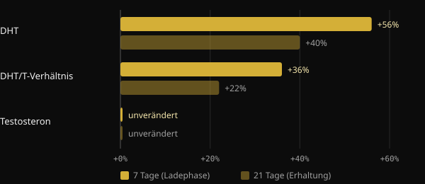
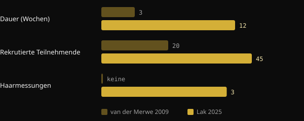

# Verursacht Kreatin Haarausfall? Was die Studien wirklich zeigen

Kreatin gehört zu den am besten untersuchten Nahrungsergänzungsmitteln überhaupt, und doch taucht eine Frage immer wieder auf: „Fallen mir davon die Haare aus?“ Die Sorge hat einen klaren Ursprung – eine kleine Studie von 2009, in der es gar nicht um Haare ging. Hier zeichnen wir nach, was diese Studie gemessen hat, was die erste eigens dafür konzipierte Studie 2025 ergab und wie du eine Studie selbst liest, bevor dich eine Schlagzeile verunsichert.

## Kurz gefasst

- Die Sorge geht auf eine Studie von 2009 mit 20 Rugbyspielern zurück: Innerhalb von 3 Wochen stieg das DHT im Blut, die Haare wurden aber nie untersucht.
- DHT ist ein Hormon, das am erblich bedingten Haarausfall bei Männern beteiligt ist; ein Anstieg im Blut ist aber nicht dasselbe wie Haarverlust.
- 2025 hat eine randomisierte Studie über 12 Wochen Haardichte, Anzahl der follikulären Einheiten und Haardicke direkt gemessen: kein Unterschied zwischen Kreatin und Placebo.
- In derselben Studie unterschieden sich auch das DHT und das Verhältnis von DHT zu Testosteron nicht zwischen den Gruppen.
- Die Übersichtsarbeiten der International Society of Sports Nutrition (ISSN) stufen Kreatin-Monohydrat bei gesunden Menschen in den untersuchten Dosierungen als sicher und gut verträglich ein.

## Woher die Sorge kommt

2009 gab eine Arbeitsgruppe der Universität Stellenbosch in Südafrika 20 Rugbyspielern einer Universitätsmannschaft während der Saison Kreatin. Das Design war ein doppelblindes Crossover: Jeder Athlet nahm sowohl Kreatin als auch Placebo, in unterschiedlichen Phasen, getrennt durch 6 Wochen Pause. Die Kreatinphase dauerte 3 Wochen: 7 Tage Ladephase mit 25 g pro Tag, danach 14 Tage mit 5 g.

Die Autoren bestimmten im Blut Testosteron und Dihydrotestosteron (DHT), ein Hormon, das durch das Enzym 5-Alpha-Reduktase aus Testosteron entsteht und an den Androgenrezeptoren stärker wirkt.

*Quelle: van der Merwe et al., Clin J Sport Med 2009 (n = 20, Crossover). Veränderungen gegenüber dem Ausgangswert laut Abstract. Grafik: Nurvan.*

Das Testosteron veränderte sich nicht. Das DHT stieg dagegen nach der Ladewoche um 56 % und lag nach den zwei Wochen Erhaltungsphase noch 40 % über dem Ausgangswert. Das Verhältnis von DHT zu Testosteron nahm um 36 % und danach um 22 % zu. Die Autoren selbst kamen zu dem Schluss, dass weitere Studien nötig seien.

Den nächsten Schritt übernahm die Mundpropaganda. DHT spielt beim androgenetischen Haarausfall des Mannes eine zentrale Rolle – so sehr, dass das Medikament Finasterid genau über die Hemmung der 5-Alpha-Reduktase wirkt. Von „Kreatin erhöht das DHT“ zu „Kreatin lässt die Haare ausfallen“ war es nur ein kleiner Sprung. In der Studie hat aber niemand auch nur ein einziges Haar gezählt.

## Warum das DHT im Blut nicht reicht

Der androgenetische Haarausfall ist eine fortschreitende Miniaturisierung der Follikel, getrieben von genetischen Faktoren und Androgenen. Dermatologischen Übersichtsarbeiten zufolge kommt es auf die Empfindlichkeit des Follikels an, nicht nur darauf, wie viel DHT im Blut zirkuliert. Ein vorübergehender Anstieg im Blut ist ein Hinweis, dem man nachgehen sollte – kein Beweis für einen Schaden an den Haaren.

Dazu kommen die Grenzen der Studie: eine einzige Gruppe von Sportlern, insgesamt drei Wochen und eine hohe Ladedosis. Außerdem wurde das Ergebnis nie repliziert. Die ISSN-Übersichtsarbeit von 2021 zu häufigen Fragen und Irrtümern rund um Kreatin behandelt genau diesen Punkt und kommt zu dem Schluss, dass die aktuelle Datenlage nicht darauf hindeutet, dass Kreatin Haarausfall oder Glatzenbildung verursacht.

## Die Studie von 2025: Endlich werden die Haare gemessen

2025 hat eine Gruppe iranischer, kanadischer und US-amerikanischer Forscher im Journal of the International Society of Sports Nutrition die erste Studie veröffentlicht, die darauf angelegt war, die Frage direkt zu beantworten. Sie rekrutierten 45 Männer zwischen 18 und 40 Jahren mit Krafttrainingserfahrung und teilten sie per Zufall für 12 Wochen in zwei Gruppen ein: 5 g Kreatin-Monohydrat pro Tag oder 5 g Maltodextrin als Placebo. 38 schlossen die Studie ab.

Diesmal wurden sowohl die Hormone als auch die Haare gemessen. Bei den Hormonen waren es Gesamttestosteron, freies Testosteron und DHT. Bei den Haaren, mittels Trichogramm und dem FotoFinder-System, Dichte, Anzahl der follikulären Einheiten und kumulative Haardicke.

*Quellen: van der Merwe et al. 2009; Lak et al. 2025. Daten aus den Abstracts. Grafik: Nurvan.*

Das Ergebnis: kein Unterschied zwischen Kreatin und Placebo, bei keinem Hormon und bei keinem Haarparameter. Das Gesamttestosteron stieg und das freie Testosteron sank in beiden Gruppen, also unabhängig vom Kreatin. Auch das DHT und das Verhältnis von DHT zu Testosteron entwickelten sich in den Gruppen nicht unterschiedlich.

Die Studie hat Grenzen, die man im Blick behalten sollte: 38 Personen, nur junge Männer, 12 Wochen und ein einziges Studienzentrum. Sie sagt nichts über Frauen, über Menschen mit bereits fortgeschrittenem Haarausfall oder über jahrelange Einnahme. Aber es ist das erste Mal, dass die Frage überprüft wurde, indem man das Richtige gemessen hat.

## Drei Fragen, die du jeder Studie stellen solltest

Diese Geschichte ist eine gute Übung im Lesen von Forschung. Bevor du eine Schlagzeile teilst, stell dir diese drei Fragen.

1. **Was wurde genau gemessen?** Ein Hormon im Blut, ein Marker oder die Zielgröße, die dich wirklich interessiert? 2009 wurde das DHT gemessen, nicht der Haarausfall. Wurde die Zielgröße nicht gemessen, kann die Studie die Frage nicht beantworten.
2. **An wem und wie lange?** Zwanzig Rugbyspieler über drei Wochen sind nicht die Allgemeinbevölkerung über Jahre. Teilnehmerzahl, Dauer, Alter, Geschlecht und Dosierung zeigen, wie weit sich die Ergebnisse übertragen lassen.
3. **Wurde das Ergebnis repliziert, und wie fügt es sich in die übrige Evidenz ein?** Eine einzelne Studie ist ein Ausgangspunkt. Entscheidend ist, ob andere Arbeitsgruppen dasselbe gefunden haben und ob die Übersichtsarbeiten, die alle Daten zusammenführen, in dieselbe Richtung weisen.

## Was die Forschung wirklich sagt

Der Anstoß für diesen Artikel ist ein Post von Marco Guercioni (@the___doc) über die Geschichte des Zusammenhangs zwischen Kreatin und Haaren. Hier die wichtigsten Aussagen im Abgleich mit den Quellen.

- **Bestätigt** — „Die Studie von 2009 hat das DHT im Blut gemessen, nicht die Haare.“ Der Abstract nennt nur Testosteron, DHT, das DHT/T-Verhältnis und die Körperzusammensetzung.
- **Bestätigt** — „Die Studie dauerte drei Wochen.“ Eine Woche Ladephase plus zwei Wochen Erhaltungsphase.
- **Zu präzisieren** — „Die Teilnehmer waren 16 Rugbyspieler.“ Der Abstract nennt 20 Freiwillige. Wie viele die Studie abgeschlossen haben, steht dort nicht, die Zahl 16 lässt sich daraus also nicht überprüfen.
- **Zu präzisieren** — „Aus dieser Studie ist der Mythos entstanden.“ Es ist die einzige Humanstudie, die einen DHT-Anstieg unter Kreatin berichtet hat, und genau sie wird in der ISSN-Übersichtsarbeit von 2021 diskutiert. Dass sie der Ursprung der Mundpropaganda ist, ist eine plausible Rekonstruktion, keine messbare Tatsache.
- **Bestätigt** — „2025 erschien die erste Studie, die darauf angelegt war, Haarausfall unter Kreatin zu messen.“ Die Autoren geben selbst an, als Erste die Follikelgesundheit nach Kreatineinnahme direkt untersucht zu haben.

## So setzt du es um

- **Wenn du Kreatin nimmst und dir Sorgen um deine Haare machst:** Die bisher verfügbaren direkten Belege zeigen über 12 Wochen keine Effekte auf die Haare und keine auf das DHT. Für junge, trainierte Männer ist die Datenlage solide, für andere Gruppen weniger.
- **In den Studien verwendete Dosierungen:** Die Studie von 2025 arbeitete mit 5 g pro Tag. Die ISSN-Übersichtsarbeit von 2021 nennt als empfohlene Dosis 3–5 g pro Tag oder 0,1 g pro kg Körpergewicht. Die Ladephase von 2009 (25 g pro Tag) ist derselben Übersichtsarbeit zufolge nicht nötig. Das sind Angaben aus der Literatur, keine persönliche Verordnung.
- **Wenn Haarausfall bei dir in der Familie liegt:** Die Genetik bleibt der wichtigste Faktor. Wenn dir auffällt, dass dein Haar lichter wird, sprich mit einer Dermatologin oder einem Dermatologen – dort lässt sich die Situation unabhängig vom Kreatin beurteilen.
- **Wenn du eine Nierenerkrankung oder andere Vorerkrankungen hast,** sprich mit deiner Ärztin oder deinem Arzt, bevor du mit irgendeinem Nahrungsergänzungsmittel beginnst.

<h3>Supplementierung, begleitet von deinem Coach</h3>

In Nurvan kannst du deinen Coach direkt in der App um einen Supplementplan bitten. Der Coach stellt ihn aus dem Supplementkatalog der App zusammen, mit Dosis und Einnahmezeitpunkt für jedes Produkt, und weist ihn deinem Plan neben Training und Ernährung zu. So hat jedes Supplement einen Grund – und jemanden, der es mit dir im Blick behält.

<a href="https://nurvan.app">Nurvan ausprobieren</a>

## Häufige Fragen

### Erhöht Kreatin das DHT?

Eine Studie von 2009 mit 20 Rugbyspielern beobachtete innerhalb von 3 Wochen einen Anstieg des DHT im Blut. Die Studie von 2025, länger und mit mehr Teilnehmern, fand keine Unterschiede zwischen Kreatin und Placebo. Das Ergebnis von 2009 wurde nicht repliziert.

### Schadet Kreatin den Haaren von Frauen?

Direkte Studien zu den Haaren von Frauen gibt es nicht. An der Studie von 2025 nahmen nur Männer teil. Die ISSN-Übersichtsarbeiten stufen Kreatin auch bei Frauen als wirksam und gut verträglich ein, zu den Haaren von Frauen fehlen aber Daten.

### Brauche ich eine Ladephase?

Laut der ISSN-Übersichtsarbeit von 2021 nicht: Die Ladephase sättigt die Muskeln schneller, niedrigere Tagesdosen kommen aber innerhalb einiger Wochen ebenfalls ans Ziel. Die Studie von 2025 verwendete 5 g pro Tag ohne Ladephase.

### Ich habe bereits Haarausfall: Soll ich aufhören?

Die verfügbaren Belege deuten nicht darauf hin, dass Kreatin ihn beschleunigt, es gibt aber keine eigenen Studien an Menschen mit bereits fortgeschrittenem Haarausfall. In diesem Fall ist es sinnvoll, dich dermatologisch beraten zu lassen.

## Quellen

1. van der Merwe J, Brooks NE, Myburgh KH, 2009. Three weeks of creatine monohydrate supplementation affects dihydrotestosterone to testosterone ratio in college-aged rugby players. *Clin J Sport Med* 19(5):399–404. [PMID 19741313](https://pubmed.ncbi.nlm.nih.gov/19741313/) · [DOI 10.1097/JSM.0b013e3181b8b52f](https://doi.org/10.1097/JSM.0b013e3181b8b52f)
2. Lak M, Forbes SC, Ashtary-Larky D et al., 2025. Does creatine cause hair loss? A 12-week randomized controlled trial. *J Int Soc Sports Nutr* 22(sup1):2495229. [PMID 40265319](https://pubmed.ncbi.nlm.nih.gov/40265319/) · [DOI 10.1080/15502783.2025.2495229](https://doi.org/10.1080/15502783.2025.2495229)
3. Antonio J, Candow DG, Forbes SC et al., 2021. Common questions and misconceptions about creatine supplementation: what does the scientific evidence really show? *J Int Soc Sports Nutr* 18(1):13. [PMID 33557850](https://pubmed.ncbi.nlm.nih.gov/33557850/) · [DOI 10.1186/s12970-021-00412-w](https://doi.org/10.1186/s12970-021-00412-w)
4. Kreider RB, Kalman DS, Antonio J et al., 2017. International Society of Sports Nutrition position stand: safety and efficacy of creatine supplementation in exercise, sport, and medicine. *J Int Soc Sports Nutr* 14:18. [PMID 28615996](https://pubmed.ncbi.nlm.nih.gov/28615996/) · [DOI 10.1186/s12970-017-0173-z](https://doi.org/10.1186/s12970-017-0173-z)
5. York K, Meah N, Bhoyrul B, Sinclair R, 2020. A review of the treatment of male pattern hair loss. *Expert Opin Pharmacother* 21(5):603–612. [PMID 32066284](https://pubmed.ncbi.nlm.nih.gov/32066284/) · [DOI 10.1080/14656566.2020.1721463](https://doi.org/10.1080/14656566.2020.1721463)

Dieser Artikel ist von einem Post von [Marco Guercioni (@the___doc)](https://www.instagram.com/p/Dd169MICJ8G/) inspiriert. Quellen über PubMed recherchiert.

> Hinweis: Dieser Inhalt dient der Information und ersetzt nicht den Rat einer Ärztin, eines Arztes oder einer qualifizierten Fachperson.
