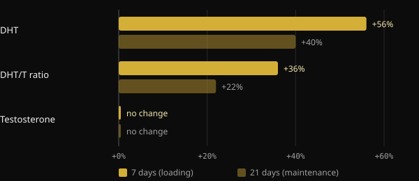
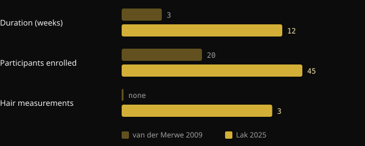

# Does creatine cause hair loss? What the studies actually show

Creatine is one of the most researched supplements there is, yet one question keeps coming back: "Will it make my hair fall out?". The worry has a precise origin, a small 2009 study that never looked at hair. Here we unpack what that study measured, what the first trial designed for the question found in 2025, and how to read a study yourself before a headline scares you.

## Key takeaways

- The worry comes from a 2009 study of 20 rugby players: blood DHT rose over 3 weeks, but hair was never measured.
- DHT is a hormone involved in male pattern baldness, but higher DHT in the blood is not the same as losing hair.
- In 2025 a 12-week randomized trial measured hair density, follicular unit count and hair thickness directly: no difference between creatine and placebo.
- In the same trial, DHT and the DHT-to-testosterone ratio did not differ between groups either.
- Reviews from the International Society of Sports Nutrition (ISSN) consider creatine monohydrate safe and well tolerated in healthy people at the doses studied.

## Where the worry comes from

In 2009 a team at Stellenbosch University in South Africa gave creatine to 20 college rugby players during their season. The design was a double-blind crossover: every player took both creatine and placebo, in separate periods with a 6-week washout in between. The creatine phase lasted 3 weeks: 7 days of loading at 25 g a day, then 14 days at 5 g.

The researchers measured blood testosterone and dihydrotestosterone (DHT), a hormone made from testosterone by the enzyme 5-alpha-reductase that acts more strongly on androgen receptors.

*Source: van der Merwe et al., Clin J Sport Med 2009 (n = 20, crossover). Changes from baseline as reported in the abstract. Nurvan chart.*

Testosterone did not change. DHT, however, rose 56% after the loading week and was still 40% above baseline after two weeks of maintenance. The DHT-to-testosterone ratio rose 36% and then 22%. The authors themselves concluded that more research was needed.

Word of mouth did the rest. DHT plays a central role in male androgenetic alopecia, which is why the drug finasteride works by blocking 5-alpha-reductase. From "creatine raises DHT" to "creatine makes your hair fall out" was a short jump. But nobody in that study counted a single hair.

## Why blood DHT is not enough

Androgenetic alopecia is a gradual miniaturization of hair follicles, driven by genetics and androgens. According to dermatology reviews, how sensitive the follicle is matters, not just how much DHT is circulating. A temporary rise in the blood is a lead worth following, not proof of hair damage.

The study also had limits: one group of athletes, three weeks in total and a high loading dose. And the result has never been replicated. The 2021 ISSN review on common questions and misconceptions about creatine addresses exactly this point and concludes that current data do not indicate that creatine causes hair loss or baldness.

## The 2025 trial: finally, someone measured hair

In 2025 a team of Iranian, Canadian and American researchers published, in the Journal of the International Society of Sports Nutrition, the first trial designed to answer the question directly. They recruited 45 resistance-trained men aged 18 to 40 and randomly split them into two groups for 12 weeks: 5 g a day of creatine monohydrate or 5 g of maltodextrin as placebo. Thirty-eight completed the study.

This time both hormones and hair were measured. The hormones were total testosterone, free testosterone and DHT. For hair, using the trichogram and the FotoFinder system: density, follicular unit count and cumulative thickness.

*Sources: van der Merwe et al. 2009; Lak et al. 2025. Data from the abstracts. Nurvan chart.*

Result: no difference between creatine and placebo for any hormone or any hair measure. Total testosterone went up and free testosterone went down in both groups, so independently of creatine. DHT and the DHT-to-testosterone ratio did not change differently between groups either.

The trial has limits worth keeping in mind: 38 people, young men only, 12 weeks and a single site. It says nothing about women, people with advanced hair loss or years of use. But it is the first time the question was tested by measuring the right thing.

## Three questions to ask any study

This story is good practice for reading research. Before sharing a headline, ask yourself these three questions.

1. **What exactly was measured?** A hormone in the blood, a marker, or the outcome you actually care about? In 2009 they measured DHT, not hair loss. If the outcome was not measured, the study cannot answer the question.
2. **In whom, and for how long?** Twenty rugby players for three weeks are not the general population over years. Sample size, duration, age, sex and doses tell you how far the results can stretch.
3. **Has it been replicated, and how does it fit with the rest of the evidence?** A single study is a starting point. What matters is whether other teams found the same, and whether the reviews that pool all the data point the same way.

## What the research actually says

This article was inspired by a post from Marco Guercioni (@the___doc) on the history of the creatine and hair link. Here are its main claims, checked against the sources.

- **Confirmed** — "The 2009 study measured DHT in the blood, not hair." The abstract reports only testosterone, DHT, the DHT/T ratio and body composition.
- **Confirmed** — "The study lasted three weeks." One week of loading plus two of maintenance.
- **Needs context** — "The participants were 16 rugby players." The abstract reports 20 volunteers. The number who completed is not given in the abstract, so the figure of 16 cannot be verified from it.
- **Needs context** — "That study is where the myth started." It is the only human study to report a DHT rise with creatine and the one discussed in the 2021 ISSN review. That it sparked the rumor is a plausible reconstruction, not a measurable fact.
- **Confirmed** — "In 2025 the first study designed to measure hair loss with creatine came out." The authors state they are the first to directly assess hair follicle health after creatine.

## How to apply it

- **If you take creatine and worry about your hair:** the direct evidence available today shows no effect on hair or DHT over 12 weeks. The data are solid for young trained men, less so for other groups.
- **Doses used in the studies:** the 2025 trial used 5 g a day. The 2021 ISSN review lists 3–5 g a day, or 0.1 g per kg of body weight, as recommended doses. The 2009 loading phase (25 g a day) is not required according to the same review. These are figures from the literature, not a personal prescription.
- **If baldness runs in your family:** genetics remains the main factor. If you notice thinning, talk to a dermatologist, who can assess it regardless of creatine.
- **If you have kidney disease or other medical conditions,** talk to your doctor before starting any supplement.

<h3>Supplements guided by your coach</h3>

In Nurvan you can ask your coach for a supplement protocol straight from the app. Your coach builds it from the app's supplement catalog, with a dose and timing for each product, and assigns it in your plan next to training and nutrition. That way every supplement has a reason and someone following it with you.

<a href="https://nurvan.app">Try Nurvan</a>

## FAQ

### Does creatine increase DHT?

A 2009 study of 20 rugby players saw blood DHT rise over 3 weeks. The 2025 trial, longer and with more people, found no difference between creatine and placebo. The 2009 result has not been replicated.

### Does creatine affect women's hair?

There are no direct studies on women's hair. The 2025 trial included only men. ISSN reviews consider creatine effective and well tolerated in women too, but data on female hair are missing.

### Do I need a loading phase?

According to the 2021 ISSN review, no: loading saturates muscles faster, but lower daily doses get there within a few weeks anyway. The 2025 trial used 5 g a day with no loading.

### I am already losing hair: should I stop?

The available evidence does not suggest creatine speeds it up, but there are no studies specifically in people with advanced hair loss. In that case it makes sense to talk to a dermatologist.

## Sources

1. van der Merwe J, Brooks NE, Myburgh KH, 2009. Three weeks of creatine monohydrate supplementation affects dihydrotestosterone to testosterone ratio in college-aged rugby players. *Clin J Sport Med* 19(5):399–404. [PMID 19741313](https://pubmed.ncbi.nlm.nih.gov/19741313/) · [DOI 10.1097/JSM.0b013e3181b8b52f](https://doi.org/10.1097/JSM.0b013e3181b8b52f)
2. Lak M, Forbes SC, Ashtary-Larky D et al., 2025. Does creatine cause hair loss? A 12-week randomized controlled trial. *J Int Soc Sports Nutr* 22(sup1):2495229. [PMID 40265319](https://pubmed.ncbi.nlm.nih.gov/40265319/) · [DOI 10.1080/15502783.2025.2495229](https://doi.org/10.1080/15502783.2025.2495229)
3. Antonio J, Candow DG, Forbes SC et al., 2021. Common questions and misconceptions about creatine supplementation: what does the scientific evidence really show? *J Int Soc Sports Nutr* 18(1):13. [PMID 33557850](https://pubmed.ncbi.nlm.nih.gov/33557850/) · [DOI 10.1186/s12970-021-00412-w](https://doi.org/10.1186/s12970-021-00412-w)
4. Kreider RB, Kalman DS, Antonio J et al., 2017. International Society of Sports Nutrition position stand: safety and efficacy of creatine supplementation in exercise, sport, and medicine. *J Int Soc Sports Nutr* 14:18. [PMID 28615996](https://pubmed.ncbi.nlm.nih.gov/28615996/) · [DOI 10.1186/s12970-017-0173-z](https://doi.org/10.1186/s12970-017-0173-z)
5. York K, Meah N, Bhoyrul B, Sinclair R, 2020. A review of the treatment of male pattern hair loss. *Expert Opin Pharmacother* 21(5):603–612. [PMID 32066284](https://pubmed.ncbi.nlm.nih.gov/32066284/) · [DOI 10.1080/14656566.2020.1721463](https://doi.org/10.1080/14656566.2020.1721463)

Inspired by a post from [Marco Guercioni (@the___doc)](https://www.instagram.com/p/Dd169MICJ8G/). Sources reviewed via PubMed.

> Note: this content is for information only and does not replace advice from a doctor or qualified professional.
