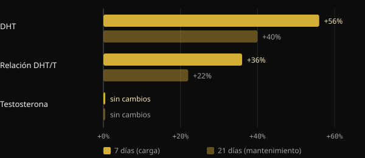
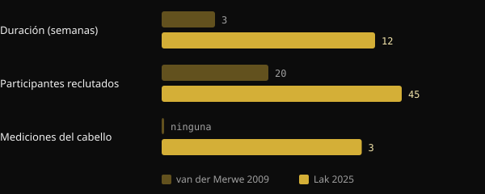

# ¿La creatina provoca caída del cabello? Qué dicen de verdad los estudios

La creatina es uno de los suplementos más estudiados que existen y, aun así, hay una pregunta que siempre vuelve: «¿Se me va a caer el pelo?». El temor tiene un origen concreto: un pequeño estudio de 2009 que no se fijaba en el cabello. Aquí reconstruimos qué medía ese estudio, qué encontró en 2025 el primer ensayo diseñado expresamente para ello y cómo leer por tu cuenta un estudio antes de dejarte asustar por un titular.

## En resumen

- El temor nace de un estudio de 2009 con 20 jugadores de rugby: en 3 semanas la DHT en sangre subió, pero el cabello no se midió en ningún momento.
- La DHT es una hormona implicada en la calvicie masculina, pero que aumente en sangre no equivale a perder pelo.
- En 2025, un ensayo aleatorizado de 12 semanas midió directamente la densidad, el número de unidades foliculares y el grosor del cabello: ninguna diferencia entre creatina y placebo.
- En ese mismo ensayo, tampoco la DHT ni la relación DHT/testosterona difirieron entre los grupos.
- Las revisiones de la International Society of Sports Nutrition (ISSN) consideran la creatina monohidrato segura y bien tolerada en personas sanas a las dosis estudiadas.

## De dónde viene el temor

En 2009, un grupo de la Universidad de Stellenbosch, en Sudáfrica, dio creatina a 20 jugadores de rugby universitarios durante la temporada. El diseño era cruzado y a doble ciego: cada deportista tomó tanto creatina como placebo, en periodos distintos separados por 6 semanas de pausa. La fase con creatina duraba 3 semanas: 7 días de carga a 25 g al día y después 14 días a 5 g.

Los autores midieron en sangre la testosterona y la dihidrotestosterona (DHT), una hormona que deriva de la testosterona gracias a la enzima 5-alfa-reductasa y que actúa con más potencia sobre los receptores de andrógenos.

*Fuente: van der Merwe et al., Clin J Sport Med 2009 (n = 20, cruzado). Variaciones respecto al inicio indicadas en el abstract. Gráfico de Nurvan.*

La testosterona no cambió. La DHT, en cambio, subió un 56% tras la semana de carga y seguía un 40% por encima del valor inicial después de las dos semanas de mantenimiento. La relación DHT/testosterona aumentó un 36% y luego un 22%. Los propios autores concluían que hacían falta más estudios.

El paso siguiente lo dio el boca a boca. La DHT es clave en la alopecia androgenética masculina, hasta el punto de que el fármaco finasterida actúa precisamente bloqueando la 5-alfa-reductasa. De «la creatina sube la DHT» a «la creatina hace que se caiga el pelo» hubo un salto muy corto. Pero en el estudio nadie contó un solo cabello.

## Por qué la DHT en sangre no basta

La alopecia androgenética es una miniaturización progresiva de los folículos, impulsada por factores genéticos y por los andrógenos. Según las revisiones de dermatología, lo que cuenta es la sensibilidad del folículo, no solo cuánta DHT circula. Un aumento temporal en sangre es un indicio que merece estudiarse, no una prueba de daño capilar.

Están además las limitaciones del estudio: un único grupo de deportistas, tres semanas en total y una dosis de carga alta. Y el resultado nunca se ha replicado. La revisión de la ISSN de 2021 sobre preguntas y falsos mitos en torno a la creatina aborda justamente este punto y concluye que los datos actuales no indican que la creatina cause pérdida de cabello ni calvicie.

## El estudio de 2025: por fin se mide el cabello

En 2025, un grupo de investigadores iraníes, canadienses y estadounidenses publicó en el Journal of the International Society of Sports Nutrition el primer ensayo diseñado para responder directamente a la pregunta. Reclutaron a 45 hombres de entre 18 y 40 años, ya entrenados con pesas, y los repartieron al azar en dos grupos durante 12 semanas: 5 g diarios de creatina monohidrato o 5 g de maltodextrina como placebo. Completaron el estudio 38.

Esta vez se midieron tanto las hormonas como el cabello. Las hormonas fueron la testosterona total, la testosterona libre y la DHT. En cuanto al cabello, con el tricograma y el sistema FotoFinder se midieron la densidad, el número de unidades foliculares y el grosor acumulado.

*Fuentes: van der Merwe et al. 2009; Lak et al. 2025. Datos de los abstracts. Gráfico de Nurvan.*

Resultado: ninguna diferencia entre creatina y placebo en ninguna hormona ni en ningún parámetro del cabello. La testosterona total subió y la libre bajó en ambos grupos, es decir, con independencia de la creatina. Tampoco la DHT ni la relación DHT/testosterona se movieron de forma distinta entre los grupos.

El estudio tiene limitaciones que conviene tener presentes: 38 personas, solo hombres jóvenes, 12 semanas y un único centro. No dice nada sobre mujeres, sobre quienes ya tienen una calvicie avanzada ni sobre años de uso. Pero es la primera vez que la pregunta se pone a prueba midiendo lo que había que medir.

## Tres preguntas que hacerle a cualquier estudio

Esta historia es un buen ejercicio para aprender a leer la investigación. Antes de compartir un titular, prueba a hacerte estas tres preguntas.

1. **¿Qué se midió exactamente?** ¿Una hormona en sangre, un marcador o el resultado que de verdad te interesa? En 2009 se midió la DHT, no la caída del cabello. Si el resultado no se midió, el estudio no puede responder a la pregunta.
2. **¿En quién y durante cuánto tiempo?** Veinte jugadores de rugby durante tres semanas no son la población general durante años. El número de personas, la duración, la edad, el sexo y las dosis indican hasta dónde se pueden extrapolar los resultados.
3. **¿Se ha replicado, y cómo encaja con el resto de las pruebas?** Un solo estudio es un punto de partida. Importa si otros grupos han encontrado lo mismo y si las revisiones que reúnen todos los datos apuntan en la misma dirección.

## Qué dice de verdad la investigación

Este artículo nace de una publicación de Marco Guercioni (@the___doc) sobre la historia del vínculo entre creatina y cabello. Estas son las afirmaciones principales, contrastadas con las fuentes.

- **Confirmado** — «El estudio de 2009 midió la DHT en sangre, no el cabello». El abstract solo recoge testosterona, DHT, relación DHT/T y composición corporal.
- **Confirmado** — «El estudio duró tres semanas». Una semana de carga más dos de mantenimiento.
- **Con matices** — «Los participantes eran 16 jugadores de rugby». El abstract indica 20 voluntarios. El número de quienes lo completaron no aparece en el abstract, así que la cifra de 16 no se puede verificar a partir de él.
- **Con matices** — «De ese estudio nació el mito». Es el único estudio en humanos que ha descrito un aumento de la DHT con la creatina y es el que se analiza en la revisión de la ISSN de 2021. Que sea el origen del boca a boca es una reconstrucción plausible, no un dato medible.
- **Confirmado** — «En 2025 se publicó el primer estudio diseñado para medir la caída del cabello con la creatina». Los propios autores afirman ser los primeros en evaluar directamente la salud del folículo tras tomar creatina.

## Cómo aplicarlo

- **Si tomas creatina y te preocupa el pelo:** las pruebas directas disponibles hoy no muestran efectos sobre el cabello ni sobre la DHT en 12 semanas. El dato es sólido para hombres jóvenes entrenados, menos para otros grupos.
- **Dosis usadas en los estudios:** el ensayo de 2025 usó 5 g al día. La revisión de la ISSN de 2021 señala como dosis recomendadas 3–5 g al día, o 0,1 g por kg de peso. La fase de carga de 2009 (25 g al día) no es necesaria según esa misma revisión. Son datos de la literatura científica, no una prescripción personal.
- **Si tienes antecedentes familiares de calvicie:** la genética sigue siendo el factor principal. Si notas que pierdes densidad, coméntalo con un dermatólogo, que puede valorar tu caso con independencia de la creatina.
- **Si tienes una enfermedad renal u otra afección médica,** habla con tu médico antes de empezar a tomar cualquier suplemento.

<h3>Suplementación supervisada por tu coach</h3>

En Nurvan puedes pedirle a tu coach un protocolo de suplementación directamente desde la app. El coach lo prepara eligiendo del catálogo de suplementos de la app, con la dosis y el momento de toma de cada producto, y lo asigna a tu plan junto al entrenamiento y la alimentación. Así cada suplemento tiene un motivo y alguien que lo sigue contigo.

<a href="https://nurvan.app">Prueba Nurvan</a>

## Preguntas frecuentes

### ¿La creatina aumenta la DHT?

Un estudio de 2009 con 20 jugadores de rugby observó un aumento de la DHT en sangre en 3 semanas. El ensayo de 2025, más largo y con más personas, no encontró diferencias entre creatina y placebo. El resultado de 2009 no se ha replicado.

### ¿La creatina perjudica el cabello de las mujeres?

No hay estudios directos sobre el cabello de las mujeres. En el ensayo de 2025 solo participaron hombres. Las revisiones de la ISSN consideran la creatina eficaz y bien tolerada también en mujeres, pero sobre el cabello femenino falta el dato.

### ¿Hace falta la fase de carga?

Según la revisión de la ISSN de 2021, no: la fase de carga satura los músculos más rápido, pero con dosis diarias más bajas se llega igualmente en unas semanas. El ensayo de 2025 usó 5 g al día sin carga.

### Ya tengo una calvicie en curso: ¿debo dejarla?

Las pruebas disponibles no indican que la creatina la acelere, pero no hay estudios específicos en personas con una calvicie ya avanzada. En ese caso, lo sensato es consultarlo con un dermatólogo.

## Fuentes

1. van der Merwe J, Brooks NE, Myburgh KH, 2009. Three weeks of creatine monohydrate supplementation affects dihydrotestosterone to testosterone ratio in college-aged rugby players. *Clin J Sport Med* 19(5):399–404. [PMID 19741313](https://pubmed.ncbi.nlm.nih.gov/19741313/) · [DOI 10.1097/JSM.0b013e3181b8b52f](https://doi.org/10.1097/JSM.0b013e3181b8b52f)
2. Lak M, Forbes SC, Ashtary-Larky D et al., 2025. Does creatine cause hair loss? A 12-week randomized controlled trial. *J Int Soc Sports Nutr* 22(sup1):2495229. [PMID 40265319](https://pubmed.ncbi.nlm.nih.gov/40265319/) · [DOI 10.1080/15502783.2025.2495229](https://doi.org/10.1080/15502783.2025.2495229)
3. Antonio J, Candow DG, Forbes SC et al., 2021. Common questions and misconceptions about creatine supplementation: what does the scientific evidence really show? *J Int Soc Sports Nutr* 18(1):13. [PMID 33557850](https://pubmed.ncbi.nlm.nih.gov/33557850/) · [DOI 10.1186/s12970-021-00412-w](https://doi.org/10.1186/s12970-021-00412-w)
4. Kreider RB, Kalman DS, Antonio J et al., 2017. International Society of Sports Nutrition position stand: safety and efficacy of creatine supplementation in exercise, sport, and medicine. *J Int Soc Sports Nutr* 14:18. [PMID 28615996](https://pubmed.ncbi.nlm.nih.gov/28615996/) · [DOI 10.1186/s12970-017-0173-z](https://doi.org/10.1186/s12970-017-0173-z)
5. York K, Meah N, Bhoyrul B, Sinclair R, 2020. A review of the treatment of male pattern hair loss. *Expert Opin Pharmacother* 21(5):603–612. [PMID 32066284](https://pubmed.ncbi.nlm.nih.gov/32066284/) · [DOI 10.1080/14656566.2020.1721463](https://doi.org/10.1080/14656566.2020.1721463)

Artículo inspirado en una publicación de [Marco Guercioni (@the___doc)](https://www.instagram.com/p/Dd169MICJ8G/). Fuentes consultadas a través de PubMed.

> Nota: contenido informativo; no sustituye la opinión de un médico ni de un profesional cualificado.
