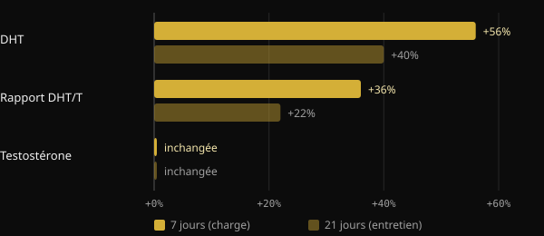

# La créatine fait-elle perdre les cheveux ? Ce que disent vraiment les études

La créatine est l'un des compléments alimentaires les plus étudiés qui soient, et pourtant une question revient sans cesse : « Est-ce qu'elle va me faire perdre mes cheveux ? ». Cette crainte a une origine précise : une petite étude de 2009 qui ne s'intéressait pas aux cheveux. Nous retraçons ici ce que mesurait cette étude, ce qu'a trouvé en 2025 le premier essai conçu exprès pour la question, et comment lire soi-même une étude avant de se laisser effrayer par un titre.

## En bref

- La crainte vient d'une étude de 2009 menée sur 20 joueurs de rugby : en 3 semaines, la DHT sanguine a augmenté, mais les cheveux n'ont jamais été mesurés.
- La DHT est une hormone impliquée dans la calvitie masculine, mais son augmentation dans le sang n'équivaut pas à une perte de cheveux.
- En 2025, un essai randomisé de 12 semaines a mesuré directement la densité, le nombre d'unités folliculaires et l'épaisseur des cheveux : aucune différence entre créatine et placebo.
- Dans ce même essai, la DHT et le rapport DHT/testostérone ne différaient pas non plus entre les groupes.
- Les revues de l'International Society of Sports Nutrition (ISSN) considèrent la créatine monohydrate comme sûre et bien tolérée chez les personnes en bonne santé, aux doses étudiées.

## D'où vient cette crainte

En 2009, une équipe de l'université de Stellenbosch, en Afrique du Sud, a donné de la créatine à 20 joueurs de rugby universitaires pendant la saison. Le protocole était croisé (crossover) et en double aveugle : chaque athlète a pris à la fois de la créatine et un placebo, sur des périodes différentes séparées par 6 semaines de pause. La phase sous créatine durait 3 semaines : 7 jours de charge à 25 g par jour, puis 14 jours à 5 g.

Les auteurs ont dosé dans le sang la testostérone et la dihydrotestostérone (DHT), une hormone issue de la testostérone sous l'action de l'enzyme 5-alpha-réductase et plus puissante sur les récepteurs des androgènes.

*Source : van der Merwe et al., Clin J Sport Med 2009 (n = 20, crossover). Variations par rapport au début, telles que rapportées dans le résumé. Graphique Nurvan.*

La testostérone n'a pas bougé. La DHT, en revanche, a augmenté de 56 % après la semaine de charge et restait encore 40 % au-dessus de sa valeur initiale après les deux semaines d'entretien. Le rapport DHT/testostérone a augmenté de 36 %, puis de 22 %. Les auteurs eux-mêmes concluaient que d'autres études étaient nécessaires.

L'étape suivante, c'est le bouche-à-oreille qui s'en est chargé. La DHT joue un rôle central dans la calvitie androgénétique masculine, au point que le finastéride, un médicament, agit justement en bloquant la 5-alpha-réductase. De « la créatine augmente la DHT » à « la créatine fait tomber les cheveux », il n'y avait qu'un pas. Sauf que dans l'étude, personne n'a compté le moindre cheveu.

## Pourquoi la DHT sanguine ne suffit pas

La calvitie androgénétique est une miniaturisation progressive des follicules, pilotée par des facteurs génétiques et par les androgènes. D'après les revues de dermatologie, c'est la sensibilité du follicule qui compte, pas seulement la quantité de DHT en circulation. Une hausse temporaire dans le sang est un indice à creuser, pas une preuve de dommage pour les cheveux.

Il y a ensuite les limites de l'étude : un seul groupe d'athlètes, trois semaines au total et une dose de charge élevée. De plus, le résultat n'a jamais été reproduit. La revue de l'ISSN de 2021 consacrée aux questions et aux idées reçues sur la créatine traite précisément ce point et conclut que les données actuelles n'indiquent pas que la créatine provoque une perte de cheveux ou une calvitie.

## L'étude de 2025 : on mesure enfin les cheveux

En 2025, une équipe de chercheurs iraniens, canadiens et américains a publié dans le Journal of the International Society of Sports Nutrition le premier essai conçu pour répondre directement à la question. Ils ont recruté 45 hommes de 18 à 40 ans, déjà pratiquants de musculation, et les ont répartis au hasard en deux groupes pendant 12 semaines : 5 g par jour de créatine monohydrate ou 5 g de maltodextrine comme placebo. 38 d'entre eux sont allés au bout de l'étude.

Cette fois, les hormones comme les cheveux ont été mesurés. Côté hormones : testostérone totale, testostérone libre et DHT. Côté cheveux, à l'aide du trichogramme et du système FotoFinder : densité, nombre d'unités folliculaires et épaisseur cumulée.

*Sources : van der Merwe et al. 2009 ; Lak et al. 2025. Données issues des résumés. Graphique Nurvan.*

Résultat : aucune différence entre créatine et placebo, pour aucune hormone ni aucun paramètre capillaire. La testostérone totale a augmenté et la testostérone libre a baissé dans les deux groupes, donc indépendamment de la créatine. La DHT et le rapport DHT/testostérone n'ont pas non plus évolué différemment d'un groupe à l'autre.

L'étude a des limites à garder en tête : 38 personnes, uniquement des hommes jeunes, 12 semaines et un seul centre. Elle ne dit rien des femmes, des personnes dont la calvitie est déjà avancée ni d'une utilisation sur plusieurs années. Mais c'est la première fois que la question est testée en mesurant la bonne chose.

## Trois questions à poser à n'importe quelle étude

Cette histoire est un bon exercice de lecture de la recherche. Avant de partager un titre, essaie de te poser ces trois questions.

1. **Qu'a-t-on mesuré, exactement ?** Une hormone dans le sang, un marqueur ou le critère qui t'intéresse vraiment ? En 2009, on mesurait la DHT, pas la chute des cheveux. Si le critère n'a pas été mesuré, l'étude ne peut pas répondre à la question.
2. **Sur qui et pendant combien de temps ?** Vingt rugbymen suivis trois semaines, ce n'est pas la population générale suivie pendant des années. Le nombre de personnes, la durée, l'âge, le sexe et les doses indiquent jusqu'où l'on peut étendre les résultats.
3. **A-t-elle été reproduite, et comment s'inscrit-elle dans l'ensemble des preuves ?** Une étude isolée est un point de départ. Ce qui compte, c'est de savoir si d'autres équipes ont trouvé la même chose et si les revues qui rassemblent toutes les données vont dans le même sens.

## Ce que dit vraiment la recherche

Le point de départ de cet article est une publication de Marco Guercioni (@the___doc) sur l'histoire du lien entre créatine et cheveux. Voici ses principales affirmations, confrontées aux sources.

- **Confirmé** — « L'étude de 2009 a mesuré la DHT dans le sang, pas les cheveux. » Le résumé ne rapporte que la testostérone, la DHT, le rapport DHT/T et la composition corporelle.
- **Confirmé** — « L'étude durait trois semaines. » Une semaine de charge suivie de deux semaines d'entretien.
- **À nuancer** — « Les participants étaient 16 rugbymen. » Le résumé indique 20 volontaires. Le nombre de ceux qui ont terminé l'étude n'y figure pas ; le chiffre de 16 n'est donc pas vérifiable à partir de là.
- **À nuancer** — « C'est de cette étude qu'est né le mythe. » C'est la seule étude chez l'être humain à avoir rapporté une hausse de la DHT sous créatine, et c'est celle que discute la revue de l'ISSN de 2021. Qu'elle soit à l'origine du bouche-à-oreille est une reconstitution plausible, pas une donnée mesurable.
- **Confirmé** — « En 2025 est parue la première étude conçue pour mesurer la chute des cheveux sous créatine. » Les auteurs déclarent eux-mêmes être les premiers à évaluer directement la santé du follicule après une prise de créatine.

## Comment l'appliquer

- **Si tu prends de la créatine et que tu t'inquiètes pour tes cheveux :** les preuves directes disponibles aujourd'hui ne montrent aucun effet sur les cheveux ni sur la DHT en 12 semaines. Le résultat est solide pour des hommes jeunes et entraînés, moins pour les autres groupes.
- **Doses utilisées dans les études :** l'essai de 2025 a utilisé 5 g par jour. La revue de l'ISSN de 2021 donne comme doses recommandées 3 à 5 g par jour, ou 0,1 g par kg de poids. La phase de charge de 2009 (25 g par jour) n'est pas nécessaire selon cette même revue. Ce sont des données issues de la littérature, pas une prescription personnelle.
- **Si tu as des antécédents familiaux de calvitie :** la génétique reste le facteur principal. Si tu constates que tes cheveux s'éclaircissent, parles-en à un dermatologue, qui pourra évaluer la situation indépendamment de la créatine.
- **Si tu souffres d'une maladie rénale ou d'un autre problème de santé,** parles-en à ton médecin avant de commencer un complément, quel qu'il soit.

<h3>Une supplémentation suivie par ton coach</h3>

Dans Nurvan, tu peux demander à ton coach un protocole de supplémentation directement depuis l'application. Le coach le construit en choisissant dans le catalogue de compléments de l'application, avec la dose et le moment de prise de chaque produit, puis l'intègre à ton plan, à côté de l'entraînement et de l'alimentation. Chaque complément a ainsi une raison d'être et quelqu'un pour le suivre avec toi.

<a href="https://nurvan.app">Essayer Nurvan</a>

## Questions fréquentes

### La créatine augmente-t-elle la DHT ?

Une étude de 2009 sur 20 rugbymen a observé une hausse de la DHT sanguine en 3 semaines. L'essai de 2025, plus long et mené sur davantage de personnes, n'a trouvé aucune différence entre créatine et placebo. Le résultat de 2009 n'a pas été reproduit.

### La créatine abîme-t-elle les cheveux des femmes ?

Il n'existe pas d'étude directe sur les cheveux des femmes. L'essai de 2025 n'a inclus que des hommes. Les revues de l'ISSN considèrent la créatine comme efficace et bien tolérée chez les femmes aussi, mais sur les cheveux féminins, les données manquent.

### La phase de charge est-elle nécessaire ?

D'après la revue de l'ISSN de 2021, non : la phase de charge sature les muscles plus vite, mais des doses quotidiennes plus faibles y parviennent tout de même en quelques semaines. L'essai de 2025 a utilisé 5 g par jour sans phase de charge.

### J'ai déjà une calvitie en cours : dois-je arrêter ?

Les preuves disponibles n'indiquent pas que la créatine l'accélère, mais il n'existe pas d'étude spécifique sur les personnes dont la calvitie est déjà avancée. Dans ce cas, il est raisonnable d'en discuter avec un dermatologue.

## Sources

1. van der Merwe J, Brooks NE, Myburgh KH, 2009. Three weeks of creatine monohydrate supplementation affects dihydrotestosterone to testosterone ratio in college-aged rugby players. *Clin J Sport Med* 19(5):399–404. [PMID 19741313](https://pubmed.ncbi.nlm.nih.gov/19741313/) · [DOI 10.1097/JSM.0b013e3181b8b52f](https://doi.org/10.1097/JSM.0b013e3181b8b52f)
2. Lak M, Forbes SC, Ashtary-Larky D et al., 2025. Does creatine cause hair loss? A 12-week randomized controlled trial. *J Int Soc Sports Nutr* 22(sup1):2495229. [PMID 40265319](https://pubmed.ncbi.nlm.nih.gov/40265319/) · [DOI 10.1080/15502783.2025.2495229](https://doi.org/10.1080/15502783.2025.2495229)
3. Antonio J, Candow DG, Forbes SC et al., 2021. Common questions and misconceptions about creatine supplementation: what does the scientific evidence really show? *J Int Soc Sports Nutr* 18(1):13. [PMID 33557850](https://pubmed.ncbi.nlm.nih.gov/33557850/) · [DOI 10.1186/s12970-021-00412-w](https://doi.org/10.1186/s12970-021-00412-w)
4. Kreider RB, Kalman DS, Antonio J et al., 2017. International Society of Sports Nutrition position stand: safety and efficacy of creatine supplementation in exercise, sport, and medicine. *J Int Soc Sports Nutr* 14:18. [PMID 28615996](https://pubmed.ncbi.nlm.nih.gov/28615996/) · [DOI 10.1186/s12970-017-0173-z](https://doi.org/10.1186/s12970-017-0173-z)
5. York K, Meah N, Bhoyrul B, Sinclair R, 2020. A review of the treatment of male pattern hair loss. *Expert Opin Pharmacother* 21(5):603–612. [PMID 32066284](https://pubmed.ncbi.nlm.nih.gov/32066284/) · [DOI 10.1080/14656566.2020.1721463](https://doi.org/10.1080/14656566.2020.1721463)

Article inspiré d'une publication de [Marco Guercioni (@the___doc)](https://www.instagram.com/p/Dd169MICJ8G/). Sources consultées via PubMed.

> Note : contenu à visée informative, qui ne remplace pas l'avis d'un médecin ou d'un professionnel qualifié.
