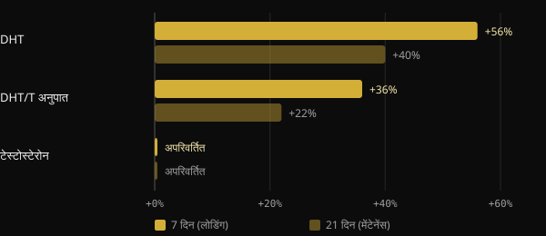
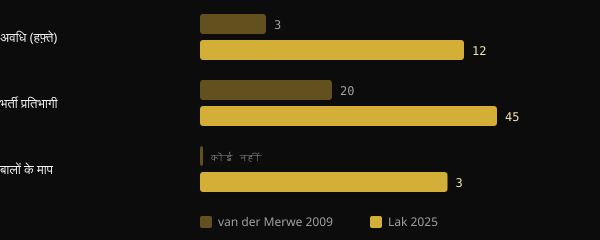

# क्या क्रिएटिन से बाल झड़ते हैं? अध्ययन असल में क्या कहते हैं

क्रिएटिन सबसे ज़्यादा अध्ययन किए गए सप्लीमेंट्स में से एक है, फिर भी एक सवाल बार-बार लौट आता है: "क्या इससे मेरे बाल झड़ेंगे?" इस डर की एक ठोस जड़ है: 2009 का एक छोटा अध्ययन, जिसने बालों को देखा ही नहीं था। यहाँ हम समझते हैं कि उस अध्ययन ने क्या मापा था, 2025 में खास इसी सवाल के लिए बने पहले ट्रायल में क्या मिला, और किसी सुर्खी से डरने से पहले कोई अध्ययन खुद कैसे पढ़ें।

## संक्षेप में

- डर 2009 के 20 रग्बी खिलाड़ियों वाले एक अध्ययन से शुरू हुआ: 3 हफ़्ते में खून में DHT बढ़ा, लेकिन बालों को कभी मापा ही नहीं गया।
- DHT एक हॉर्मोन है जो पुरुषों के गंजेपन में शामिल होता है, लेकिन खून में उसका बढ़ना बाल झड़ने के बराबर नहीं है।
- 2025 में 12 हफ़्ते के एक रैंडमाइज़्ड ट्रायल ने बालों की घनत्व, फ़ॉलिक्युलर यूनिट की संख्या और बालों की मोटाई सीधे मापी: क्रिएटिन और प्लेसबो में कोई अंतर नहीं मिला।
- उसी ट्रायल में DHT और DHT/टेस्टोस्टेरोन अनुपात भी समूहों के बीच अलग नहीं थे।
- International Society of Sports Nutrition (ISSN) की रिव्यू क्रिएटिन मोनोहाइड्रेट को स्वस्थ लोगों में अध्ययन की गई मात्राओं पर सुरक्षित और अच्छी तरह सहन किया जाने वाला मानती हैं।

## डर कहाँ से आया

2009 में दक्षिण अफ़्रीका की Stellenbosch University के एक समूह ने सीज़न के दौरान 20 यूनिवर्सिटी रग्बी खिलाड़ियों को क्रिएटिन दी। डिज़ाइन क्रॉसओवर और डबल-ब्लाइंड था: हर खिलाड़ी ने क्रिएटिन भी ली और प्लेसबो भी, अलग-अलग अवधियों में, जिनके बीच 6 हफ़्ते का अंतराल था। क्रिएटिन वाला चरण 3 हफ़्ते का था: 7 दिन लोडिंग, रोज़ 25 g, फिर 14 दिन रोज़ 5 g।

लेखकों ने खून में टेस्टोस्टेरोन और डाइहाइड्रोटेस्टोस्टेरोन (DHT) मापा। DHT एक हॉर्मोन है जो 5-अल्फ़ा-रिडक्टेस एंज़ाइम की मदद से टेस्टोस्टेरोन से बनता है और एंड्रोजन रिसेप्टरों पर ज़्यादा शक्तिशाली होता है।

*स्रोत: van der Merwe et al., Clin J Sport Med 2009 (n = 20, क्रॉसओवर)। शुरुआती मान के मुकाबले बदलाव, abstract के अनुसार। ग्राफ़: Nurvan।*

टेस्टोस्टेरोन नहीं बदला। DHT लोडिंग के हफ़्ते के बाद 56% बढ़ा और मेंटेनेंस के दो हफ़्ते बाद भी शुरुआती मान से 40% ऊपर था। DHT/टेस्टोस्टेरोन अनुपात 36% और फिर 22% बढ़ा। लेखकों ने खुद निष्कर्ष निकाला कि और अध्ययन चाहिए।

अगला कदम लोगों की ज़ुबानी बातों ने उठाया। DHT पुरुषों के एंड्रोजेनेटिक गंजेपन में केंद्रीय है, इतना कि दवा finasteride 5-अल्फ़ा-रिडक्टेस को रोककर ही काम करती है। "क्रिएटिन DHT बढ़ाती है" से "क्रिएटिन से बाल झड़ते हैं" तक पहुँचने में देर नहीं लगी। लेकिन उस अध्ययन में किसी ने एक भी बाल नहीं गिना था।

## खून में DHT काफ़ी क्यों नहीं है

एंड्रोजेनेटिक गंजापन फ़ॉलिकल्स का धीरे-धीरे छोटा होते जाना है, जो आनुवंशिक कारकों और एंड्रोजन से तय होता है। त्वचा-रोग विज्ञान की रिव्यू के अनुसार फ़ॉलिकल की संवेदनशीलता मायने रखती है, सिर्फ़ यह नहीं कि कितना DHT घूम रहा है। खून में अस्थायी वृद्धि आगे जाँचने का संकेत है, बालों को नुकसान का सबूत नहीं।

फिर अध्ययन की सीमाएँ भी हैं: खिलाड़ियों का सिर्फ़ एक समूह, कुल तीन हफ़्ते और लोडिंग की ऊँची मात्रा। इसके अलावा यह नतीजा कभी दोहराया नहीं गया। क्रिएटिन के सवालों और भ्रांतियों पर 2021 की ISSN रिव्यू ठीक इसी बिंदु पर बात करती है और निष्कर्ष निकालती है कि मौजूदा आँकड़े नहीं बताते कि क्रिएटिन से बाल झड़ते हैं या गंजापन होता है।

## 2025 का अध्ययन: आख़िरकार बालों को मापा गया

2025 में ईरान, कनाडा और अमेरिका के शोधकर्ताओं के एक समूह ने Journal of the International Society of Sports Nutrition में पहला ट्रायल प्रकाशित किया जो इस सवाल का सीधा जवाब देने के लिए बना था। उन्होंने 18 से 40 साल के 45 पुरुष भर्ती किए, जो पहले से वेट ट्रेनिंग करते थे, और उन्हें 12 हफ़्ते के लिए बेतरतीब ढंग से दो समूहों में बाँटा: रोज़ 5 g क्रिएटिन मोनोहाइड्रेट या प्लेसबो के रूप में 5 g माल्टोडेक्सट्रिन। 38 ने अध्ययन पूरा किया।

इस बार हॉर्मोन और बाल, दोनों मापे गए। हॉर्मोन थे कुल टेस्टोस्टेरोन, फ़्री टेस्टोस्टेरोन और DHT। बालों के लिए, ट्राइकोग्राम और FotoFinder सिस्टम से घनत्व, फ़ॉलिक्युलर यूनिट की संख्या और संचयी मोटाई।

*स्रोत: van der Merwe et al. 2009; Lak et al. 2025। आँकड़े abstract से। ग्राफ़: Nurvan।*

नतीजा: किसी भी हॉर्मोन और बालों के किसी भी पैमाने पर क्रिएटिन और प्लेसबो में कोई अंतर नहीं। कुल टेस्टोस्टेरोन बढ़ा और फ़्री टेस्टोस्टेरोन घटा, दोनों समूहों में, यानी क्रिएटिन से स्वतंत्र रूप से। DHT और DHT/टेस्टोस्टेरोन अनुपात भी समूहों के बीच अलग ढंग से नहीं हिले।

अध्ययन की कुछ सीमाएँ याद रखनी चाहिए: 38 लोग, सिर्फ़ युवा पुरुष, 12 हफ़्ते और एक ही केंद्र। यह महिलाओं, पहले से काफ़ी गंजेपन वाले लोगों या सालों के उपयोग के बारे में कुछ नहीं कहता। लेकिन पहली बार यह सवाल सही चीज़ मापकर परखा गया है।

## किसी भी अध्ययन से पूछने लायक तीन सवाल

यह कहानी रिसर्च पढ़ना सीखने का अच्छा अभ्यास है। कोई सुर्खी शेयर करने से पहले खुद से ये तीन सवाल पूछ कर देखिए।

1. **ठीक-ठीक क्या मापा गया?** खून में एक हॉर्मोन, एक मार्कर या वह नतीजा जो आपको सच में चाहिए? 2009 में DHT मापा गया था, बालों का झड़ना नहीं। अगर नतीजा मापा ही नहीं गया, तो अध्ययन उस सवाल का जवाब नहीं दे सकता।
2. **किस पर और कितने समय तक?** बीस रग्बी खिलाड़ी तीन हफ़्ते तक, सालों तक की आम आबादी नहीं हैं। लोगों की संख्या, अवधि, उम्र, लिंग और मात्राएँ बताती हैं कि नतीजे कहाँ तक लागू हो सकते हैं।
3. **क्या यह दोहराया गया, और बाकी सबूतों में यह कहाँ बैठता है?** एक अकेला अध्ययन शुरुआती बिंदु है। मायने रखता है कि क्या दूसरे समूहों को वही मिला, और क्या सारा डेटा इकट्ठा करने वाली रिव्यू उसी दिशा में जाती हैं।

## रिसर्च असल में क्या कहती है

इस लेख की प्रेरणा Marco Guercioni (@the___doc) की एक पोस्ट है, जो क्रिएटिन और बालों के रिश्ते के इतिहास पर है। यहाँ मुख्य दावे हैं, स्रोतों से मिलाकर।

- **पुष्ट** — "2009 के अध्ययन ने खून में DHT मापा, बाल नहीं।" Abstract में सिर्फ़ टेस्टोस्टेरोन, DHT, DHT/T अनुपात और बॉडी कंपोज़िशन है।
- **पुष्ट** — "अध्ययन तीन हफ़्ते का था।" एक हफ़्ता लोडिंग और दो हफ़्ते मेंटेनेंस।
- **स्पष्टीकरण ज़रूरी** — "प्रतिभागी 16 रग्बी खिलाड़ी थे।" Abstract में 20 स्वयंसेवक बताए गए हैं। पूरा करने वालों की संख्या abstract में नहीं है, इसलिए 16 का आँकड़ा वहाँ से सत्यापित नहीं हो सकता।
- **स्पष्टीकरण ज़रूरी** — "उसी अध्ययन से यह मिथक पैदा हुआ।" क्रिएटिन के साथ DHT में वृद्धि बताने वाला मनुष्यों पर यही एकमात्र अध्ययन है और 2021 की ISSN रिव्यू में इसी की चर्चा है। यही बात फैलने की जड़ है, यह एक तर्कसंगत पुनर्निर्माण है, मापा जा सकने वाला तथ्य नहीं।
- **पुष्ट** — "2025 में क्रिएटिन से बाल झड़ने को मापने के लिए बना पहला अध्ययन आया।" लेखक खुद कहते हैं कि वे क्रिएटिन के बाद फ़ॉलिकल के स्वास्थ्य को सीधे आँकने वाले पहले हैं।

## इसे कैसे लागू करें

- **अगर आप क्रिएटिन लेते हैं और बालों को लेकर चिंतित हैं:** आज उपलब्ध सीधे सबूत 12 हफ़्ते में न बालों पर और न DHT पर कोई असर दिखाते हैं। यह आँकड़ा प्रशिक्षित युवा पुरुषों के लिए ठोस है, दूसरे समूहों के लिए कम।
- **अध्ययनों में इस्तेमाल की गई मात्राएँ:** 2025 के ट्रायल में रोज़ 5 g इस्तेमाल हुई। 2021 की ISSN रिव्यू सुझाई गई मात्रा रोज़ 3–5 g, या 0,1 g प्रति kg वज़न बताती है। उसी रिव्यू के अनुसार 2009 वाली लोडिंग (रोज़ 25 g) ज़रूरी नहीं है। ये साहित्य के आँकड़े हैं, कोई व्यक्तिगत नुस्ख़ा नहीं।
- **अगर परिवार में गंजेपन का इतिहास है:** जेनेटिक्स मुख्य कारक बनी रहती है। अगर आपको बाल पतले होते दिखें, तो त्वचा-रोग विशेषज्ञ से बात करें, जो क्रिएटिन से स्वतंत्र रूप से स्थिति का आकलन कर सकता है।
- **अगर आपको किडनी की बीमारी या दूसरी चिकित्सीय स्थितियाँ हैं,** तो कोई भी सप्लीमेंट शुरू करने से पहले अपने डॉक्टर से बात करें।

<h3>आपके कोच की निगरानी में सप्लीमेंटेशन</h3>

Nurvan में आप ऐप से ही अपने कोच से सप्लीमेंटेशन प्रोटोकॉल माँग सकते हैं। कोच इसे ऐप के सप्लीमेंट कैटलॉग से चुनकर बनाता है, हर प्रोडक्ट की मात्रा और लेने के समय के साथ, और इसे ट्रेनिंग और खान-पान के बगल में आपकी योजना में जोड़ देता है। इस तरह हर सप्लीमेंट का एक कारण होता है और कोई उसे आपके साथ फ़ॉलो करता है।

<a href="https://nurvan.app">Nurvan आज़माएँ</a>

## अक्सर पूछे जाने वाले सवाल

### क्या क्रिएटिन DHT बढ़ाती है?

2009 के 20 रग्बी खिलाड़ियों वाले एक अध्ययन में 3 हफ़्ते में खून में DHT बढ़ा था। 2025 के ट्रायल ने, जो ज़्यादा लंबा था और जिसमें ज़्यादा लोग थे, क्रिएटिन और प्लेसबो में कोई अंतर नहीं पाया। 2009 का नतीजा दोहराया नहीं गया है।

### क्या क्रिएटिन महिलाओं के बालों के लिए बुरी है?

महिलाओं के बालों पर कोई सीधा अध्ययन नहीं है। 2025 के ट्रायल में सिर्फ़ पुरुष थे। ISSN रिव्यू क्रिएटिन को महिलाओं में भी प्रभावी और अच्छी तरह सहन होने वाली मानती हैं, पर महिलाओं के बालों पर आँकड़ा मौजूद नहीं है।

### क्या लोडिंग चरण ज़रूरी है?

2021 की ISSN रिव्यू के अनुसार नहीं: लोडिंग चरण मांसपेशियों को जल्दी संतृप्त करता है, लेकिन कम दैनिक मात्राएँ भी कुछ हफ़्तों में वहीं पहुँच जाती हैं। 2025 के ट्रायल में बिना लोडिंग के रोज़ 5 g इस्तेमाल हुई।

### मुझे पहले से गंजापन हो रहा है: क्या मुझे बंद कर देना चाहिए?

उपलब्ध सबूत नहीं बताते कि क्रिएटिन इसे तेज़ करती है, लेकिन पहले से काफ़ी गंजेपन वाले लोगों पर कोई खास अध्ययन नहीं है। इस स्थिति में त्वचा-रोग विशेषज्ञ से बात करना समझदारी है।

## स्रोत

1. van der Merwe J, Brooks NE, Myburgh KH, 2009. Three weeks of creatine monohydrate supplementation affects dihydrotestosterone to testosterone ratio in college-aged rugby players. *Clin J Sport Med* 19(5):399–404. [PMID 19741313](https://pubmed.ncbi.nlm.nih.gov/19741313/) · [DOI 10.1097/JSM.0b013e3181b8b52f](https://doi.org/10.1097/JSM.0b013e3181b8b52f)
2. Lak M, Forbes SC, Ashtary-Larky D et al., 2025. Does creatine cause hair loss? A 12-week randomized controlled trial. *J Int Soc Sports Nutr* 22(sup1):2495229. [PMID 40265319](https://pubmed.ncbi.nlm.nih.gov/40265319/) · [DOI 10.1080/15502783.2025.2495229](https://doi.org/10.1080/15502783.2025.2495229)
3. Antonio J, Candow DG, Forbes SC et al., 2021. Common questions and misconceptions about creatine supplementation: what does the scientific evidence really show? *J Int Soc Sports Nutr* 18(1):13. [PMID 33557850](https://pubmed.ncbi.nlm.nih.gov/33557850/) · [DOI 10.1186/s12970-021-00412-w](https://doi.org/10.1186/s12970-021-00412-w)
4. Kreider RB, Kalman DS, Antonio J et al., 2017. International Society of Sports Nutrition position stand: safety and efficacy of creatine supplementation in exercise, sport, and medicine. *J Int Soc Sports Nutr* 14:18. [PMID 28615996](https://pubmed.ncbi.nlm.nih.gov/28615996/) · [DOI 10.1186/s12970-017-0173-z](https://doi.org/10.1186/s12970-017-0173-z)
5. York K, Meah N, Bhoyrul B, Sinclair R, 2020. A review of the treatment of male pattern hair loss. *Expert Opin Pharmacother* 21(5):603–612. [PMID 32066284](https://pubmed.ncbi.nlm.nih.gov/32066284/) · [DOI 10.1080/14656566.2020.1721463](https://doi.org/10.1080/14656566.2020.1721463)

यह लेख [Marco Guercioni (@the___doc)](https://www.instagram.com/p/Dd169MICJ8G/) की एक पोस्ट से प्रेरित है। स्रोत PubMed के माध्यम से देखे गए।

> नोट: यह जानकारी केवल सूचनात्मक है, डॉक्टर या किसी योग्य विशेषज्ञ की सलाह का विकल्प नहीं है।
