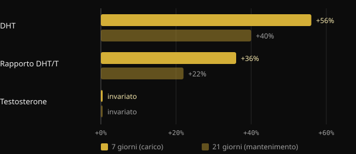
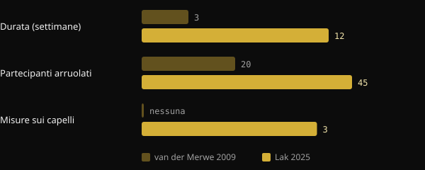

# La creatina fa cadere i capelli? Cosa dicono davvero gli studi

La creatina è uno degli integratori più studiati in assoluto, eppure una domanda torna sempre: "Mi farà cadere i capelli?". Il timore ha un'origine precisa, un piccolo studio del 2009 che non guardava i capelli. Qui ricostruiamo cosa misurava quello studio, cosa ha trovato il primo trial costruito apposta nel 2025 e come leggere da soli uno studio prima di farsi spaventare da un titolo.

## In breve

- Il timore nasce da uno studio del 2009 su 20 giocatori di rugby: in 3 settimane il DHT nel sangue è salito, ma i capelli non sono mai stati misurati.
- Il DHT è un ormone coinvolto nella calvizie maschile, ma un suo aumento nel sangue non equivale a perdere capelli.
- Nel 2025 un trial randomizzato di 12 settimane ha misurato direttamente densità, numero di unità follicolari e spessore dei capelli: nessuna differenza tra creatina e placebo.
- Nello stesso trial anche il DHT e il rapporto DHT/testosterone non differivano tra i gruppi.
- Le review della International Society of Sports Nutrition (ISSN) considerano la creatina monoidrato sicura e ben tollerata nelle persone sane alle dosi studiate.

## Da dove nasce il timore

Nel 2009 un gruppo dell'Università di Stellenbosch, in Sudafrica, ha dato creatina a 20 giocatori di rugby universitari durante la stagione. Il disegno era crossover e in doppio cieco: ogni atleta ha preso sia creatina sia placebo, in periodi diversi separati da 6 settimane di pausa. La fase con creatina durava 3 settimane: 7 giorni di carico a 25 g al giorno, poi 14 giorni a 5 g.

Gli autori hanno misurato nel sangue il testosterone e il diidrotestosterone (DHT), un ormone che deriva dal testosterone grazie all'enzima 5-alfa-reduttasi ed è più potente sui recettori degli androgeni.

*Fonte: van der Merwe et al., Clin J Sport Med 2009 (n = 20, crossover). Variazioni rispetto all'inizio riportate nell'abstract. Grafico Nurvan.*

Il testosterone non è cambiato. Il DHT invece è salito del 56% dopo la settimana di carico ed era ancora del 40% sopra il valore iniziale dopo le due settimane di mantenimento. Il rapporto DHT/testosterone è aumentato del 36% e poi del 22%. Gli stessi autori concludevano che servivano altri studi.

Il passaggio successivo l'ha fatto il passaparola. Il DHT è centrale nella calvizie androgenetica maschile, tanto che il farmaco finasteride agisce proprio bloccando la 5-alfa-reduttasi. Da "la creatina alza il DHT" a "la creatina fa cadere i capelli" il salto è stato breve. Ma nello studio nessuno ha contato un capello.

## Perché il DHT nel sangue non basta

La calvizie androgenetica è una miniaturizzazione progressiva dei follicoli, guidata da fattori genetici e dagli androgeni. Secondo le review di dermatologia, conta la sensibilità del follicolo, non solo quanto DHT circola. Un aumento temporaneo nel sangue è un indizio da approfondire, non una prova di danno ai capelli.

Ci sono poi i limiti dello studio: un solo gruppo di atleti, tre settimane in tutto e una dose di carico alta. Inoltre il risultato non è mai stato replicato. La review ISSN del 2021 su domande e falsi miti sulla creatina tratta proprio questo punto e conclude che i dati attuali non indicano che la creatina causi perdita di capelli o calvizie.

## Lo studio del 2025: finalmente si misurano i capelli

Nel 2025 un gruppo di ricercatori iraniani, canadesi e statunitensi ha pubblicato sul Journal of the International Society of Sports Nutrition il primo trial progettato per rispondere direttamente alla domanda. Hanno reclutato 45 uomini tra 18 e 40 anni, già allenati con i pesi, e li hanno divisi a caso in due gruppi per 12 settimane: 5 g al giorno di creatina monoidrato oppure 5 g di maltodestrina come placebo. Hanno completato lo studio in 38.

Questa volta sono stati misurati sia gli ormoni sia i capelli. Gli ormoni erano testosterone totale, testosterone libero e DHT. Per i capelli, con il tricogramma e il sistema FotoFinder, densità, numero di unità follicolari e spessore cumulativo.

*Fonti: van der Merwe et al. 2009; Lak et al. 2025. Dati dagli abstract. Grafico Nurvan.*

Risultato: nessuna differenza tra creatina e placebo per nessun ormone e per nessun parametro dei capelli. Il testosterone totale è salito e quello libero è sceso in entrambi i gruppi, quindi indipendentemente dalla creatina. Anche il DHT e il rapporto DHT/testosterone non si sono mossi in modo diverso tra i gruppi.

Lo studio ha limiti da tenere presenti: 38 persone, solo uomini giovani, 12 settimane e un solo centro. Non dice nulla su donne, su chi ha già una calvizie avanzata o su anni di utilizzo. Ma è la prima volta che la domanda viene testata misurando la cosa giusta.

## Tre domande da fare a qualsiasi studio

Questa storia è un buon esercizio per leggere la ricerca. Prima di condividere un titolo, prova a farti queste tre domande.

1. **Cosa è stato misurato, esattamente?** Un ormone nel sangue, un marcatore o l'esito che ti interessa davvero? Nel 2009 si misurava il DHT, non la caduta dei capelli. Se l'esito non è stato misurato, lo studio non può rispondere alla domanda.
2. **Su chi e per quanto tempo?** Venti rugbisti per tre settimane non sono la popolazione generale per anni. Numero di persone, durata, età, sesso e dosi dicono fino a dove si possono estendere i risultati.
3. **È stato replicato, e come si inserisce nel resto delle prove?** Un singolo studio è un punto di partenza. Conta se altri gruppi hanno trovato lo stesso, e se le review che raccolgono tutti i dati vanno nella stessa direzione.

## Cosa dice davvero la ricerca

Lo spunto di questo articolo è un post di Marco Guercioni (@the___doc) sulla storia del legame tra creatina e capelli. Ecco le affermazioni principali, confrontate con le fonti.

- **Confermato** — "Lo studio del 2009 ha misurato il DHT nel sangue, non i capelli." L'abstract riporta solo testosterone, DHT, rapporto DHT/T e composizione corporea.
- **Confermato** — "Lo studio durava tre settimane." Una settimana di carico più due di mantenimento.
- **Da precisare** — "I partecipanti erano 16 rugbisti." L'abstract indica 20 volontari. Il numero di chi ha completato non compare nell'abstract, quindi il dato di 16 non è verificabile da lì.
- **Da precisare** — "Da quello studio è nato il mito." È l'unico studio sull'uomo che abbia riportato un aumento del DHT con la creatina ed è quello discusso nella review ISSN del 2021. Che sia l'origine del passaparola è una ricostruzione plausibile, non un dato misurabile.
- **Confermato** — "Nel 2025 è uscito il primo studio costruito per misurare la caduta dei capelli con la creatina." Gli stessi autori dichiarano di essere i primi a valutare direttamente la salute del follicolo dopo la creatina.

## Come applicarlo

- **Se usi la creatina e temi per i capelli:** le prove dirette oggi disponibili non mostrano effetti sui capelli né sul DHT in 12 settimane. Il dato è solido per uomini giovani allenati, meno per altri gruppi.
- **Dosi usate negli studi:** il trial del 2025 ha usato 5 g al giorno. La review ISSN del 2021 indica come dosi raccomandate 3–5 g al giorno, o 0,1 g per kg di peso. La fase di carico del 2009 (25 g al giorno) non è necessaria secondo la stessa review. Sono dati della letteratura, non una prescrizione personale.
- **Se hai familiarità per calvizie:** la genetica resta il fattore principale. Se noti un diradamento, parlane con un dermatologo, che può valutare la situazione indipendentemente dalla creatina.
- **Se hai patologie renali o altre condizioni mediche,** parla con il tuo medico prima di iniziare qualsiasi integratore.

<h3>Integrazione seguita dal tuo coach</h3>

In Nurvan puoi chiedere al tuo coach un protocollo di integrazione direttamente dall'app. Il coach lo costruisce scegliendo dal catalogo integratori dell'app, con dose e momento di assunzione per ciascun prodotto, e lo assegna nel tuo piano accanto ad allenamento e alimentazione. Così ogni integratore ha un motivo e qualcuno che lo segue con te.

<a href="https://nurvan.app">Prova Nurvan</a>

## Domande frequenti

### La creatina aumenta il DHT?

Uno studio del 2009 su 20 rugbisti ha visto un aumento del DHT nel sangue in 3 settimane. Il trial del 2025, più lungo e su più persone, non ha trovato differenze tra creatina e placebo. Il risultato del 2009 non è stato replicato.

### La creatina fa male ai capelli delle donne?

Non ci sono studi diretti sui capelli delle donne. Il trial del 2025 ha coinvolto solo uomini. Le review ISSN considerano la creatina efficace e ben tollerata anche nelle donne, ma sui capelli femminili il dato manca.

### Serve la fase di carico?

Secondo la review ISSN del 2021 no: la fase di carico satura i muscoli più in fretta, ma dosi giornaliere più basse ci arrivano comunque in qualche settimana. Il trial del 2025 ha usato 5 g al giorno senza carico.

### Ho già una calvizie in corso: devo smettere?

Le prove disponibili non indicano che la creatina la acceleri, ma non ci sono studi specifici su chi ha già una calvizie avanzata. In questo caso è sensato confrontarsi con un dermatologo.

## Fonti

1. van der Merwe J, Brooks NE, Myburgh KH, 2009. Three weeks of creatine monohydrate supplementation affects dihydrotestosterone to testosterone ratio in college-aged rugby players. *Clin J Sport Med* 19(5):399–404. [PMID 19741313](https://pubmed.ncbi.nlm.nih.gov/19741313/) · [DOI 10.1097/JSM.0b013e3181b8b52f](https://doi.org/10.1097/JSM.0b013e3181b8b52f)
2. Lak M, Forbes SC, Ashtary-Larky D et al., 2025. Does creatine cause hair loss? A 12-week randomized controlled trial. *J Int Soc Sports Nutr* 22(sup1):2495229. [PMID 40265319](https://pubmed.ncbi.nlm.nih.gov/40265319/) · [DOI 10.1080/15502783.2025.2495229](https://doi.org/10.1080/15502783.2025.2495229)
3. Antonio J, Candow DG, Forbes SC et al., 2021. Common questions and misconceptions about creatine supplementation: what does the scientific evidence really show? *J Int Soc Sports Nutr* 18(1):13. [PMID 33557850](https://pubmed.ncbi.nlm.nih.gov/33557850/) · [DOI 10.1186/s12970-021-00412-w](https://doi.org/10.1186/s12970-021-00412-w)
4. Kreider RB, Kalman DS, Antonio J et al., 2017. International Society of Sports Nutrition position stand: safety and efficacy of creatine supplementation in exercise, sport, and medicine. *J Int Soc Sports Nutr* 14:18. [PMID 28615996](https://pubmed.ncbi.nlm.nih.gov/28615996/) · [DOI 10.1186/s12970-017-0173-z](https://doi.org/10.1186/s12970-017-0173-z)
5. York K, Meah N, Bhoyrul B, Sinclair R, 2020. A review of the treatment of male pattern hair loss. *Expert Opin Pharmacother* 21(5):603–612. [PMID 32066284](https://pubmed.ncbi.nlm.nih.gov/32066284/) · [DOI 10.1080/14656566.2020.1721463](https://doi.org/10.1080/14656566.2020.1721463)

Articolo ispirato a un post di [Marco Guercioni (@the___doc)](https://www.instagram.com/p/Dd169MICJ8G/). Fonti consultate tramite PubMed.

> Nota: contenuto informativo, non sostituisce il parere di un medico o di un professionista qualificato.
