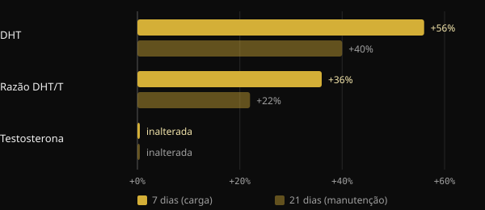

# Creatina faz cair o cabelo? O que os estudos realmente dizem

A creatina é um dos suplementos mais estudados que existem, e mesmo assim uma pergunta sempre volta: "Ela vai fazer meu cabelo cair?". O medo tem uma origem precisa: um pequeno estudo de 2009 que não olhava para o cabelo. Aqui reconstruímos o que esse estudo media, o que encontrou o primeiro trial feito de propósito em 2025 e como ler um estudo por conta própria antes de se assustar com uma manchete.

## Resumindo

- O medo nasce de um estudo de 2009 com 20 jogadores de rúgbi: em 3 semanas o DHT no sangue subiu, mas o cabelo nunca foi medido.
- O DHT é um hormônio envolvido na calvície masculina, mas um aumento dele no sangue não equivale a perder cabelo.
- Em 2025, um ensaio randomizado de 12 semanas mediu diretamente densidade, número de unidades foliculares e espessura dos fios: nenhuma diferença entre creatina e placebo.
- No mesmo trial, o DHT e a razão DHT/testosterona também não diferiram entre os grupos.
- As revisões da International Society of Sports Nutrition (ISSN) consideram a creatina monohidratada segura e bem tolerada em pessoas saudáveis nas doses estudadas.

## De onde vem o medo

Em 2009, um grupo da Universidade de Stellenbosch, na África do Sul, deu creatina a 20 jogadores de rúgbi universitários durante a temporada. O desenho era crossover e duplo-cego: cada atleta tomou tanto creatina quanto placebo, em períodos diferentes separados por 6 semanas de pausa. A fase com creatina durava 3 semanas: 7 dias de carga a 25 g por dia, depois 14 dias a 5 g.

Os autores mediram no sangue a testosterona e a di-hidrotestosterona (DHT), um hormônio que deriva da testosterona graças à enzima 5-alfa-redutase e é mais potente nos receptores de androgênios.

*Fonte: van der Merwe et al., Clin J Sport Med 2009 (n = 20, crossover). Variações em relação ao início, conforme o resumo. Gráfico Nurvan.*

A testosterona não mudou. O DHT, por outro lado, subiu 56% depois da semana de carga e ainda estava 40% acima do valor inicial após as duas semanas de manutenção. A razão DHT/testosterona aumentou 36% e depois 22%. Os próprios autores concluíam que eram necessários mais estudos.

O passo seguinte foi dado pelo boca a boca. O DHT é central na calvície androgenética masculina, tanto que o medicamento finasterida age justamente bloqueando a 5-alfa-redutase. De "a creatina aumenta o DHT" a "a creatina faz o cabelo cair" foi um pulo. Mas, no estudo, ninguém contou um fio de cabelo.

## Por que o DHT no sangue não basta

A calvície androgenética é uma miniaturização progressiva dos folículos, guiada por fatores genéticos e androgênios. Segundo as revisões de dermatologia, o que conta é a sensibilidade do folículo, não só quanto DHT circula. Um aumento temporário no sangue é um indício a investigar, não uma prova de dano ao cabelo.

Há ainda os limites do estudo: um único grupo de atletas, três semanas no total e uma dose de carga alta. Além disso, o resultado nunca foi replicado. A revisão da ISSN de 2021 sobre perguntas e mitos a respeito da creatina trata exatamente desse ponto e conclui que os dados atuais não indicam que a creatina cause perda de cabelo ou calvície.

## O estudo de 2025: finalmente o cabelo foi medido

Em 2025, um grupo de pesquisadores iranianos, canadenses e americanos publicou no Journal of the International Society of Sports Nutrition o primeiro trial desenhado para responder diretamente à pergunta. Recrutaram 45 homens entre 18 e 40 anos, já treinados com pesos, e os dividiram aleatoriamente em dois grupos por 12 semanas: 5 g por dia de creatina monohidratada ou 5 g de maltodextrina como placebo. Concluíram o estudo 38.

Desta vez foram medidos tanto os hormônios quanto o cabelo. Os hormônios eram testosterona total, testosterona livre e DHT. Para o cabelo, com o tricograma e o sistema FotoFinder, densidade, número de unidades foliculares e espessura cumulativa.

*Fontes: van der Merwe et al. 2009; Lak et al. 2025. Dados dos resumos. Gráfico Nurvan.*

Resultado: nenhuma diferença entre creatina e placebo para nenhum hormônio e nenhum parâmetro do cabelo. A testosterona total subiu e a livre caiu nos dois grupos, ou seja, independentemente da creatina. O DHT e a razão DHT/testosterona também não se moveram de forma diferente entre os grupos.

O estudo tem limites que é preciso ter em mente: 38 pessoas, só homens jovens, 12 semanas e um único centro. Não diz nada sobre mulheres, sobre quem já tem calvície avançada ou sobre anos de uso. Mas é a primeira vez que a pergunta é testada medindo a coisa certa.

## Três perguntas para fazer a qualquer estudo

Essa história é um bom exercício para ler pesquisa. Antes de compartilhar uma manchete, tente fazer a si mesmo estas três perguntas.

1. **O que foi medido, exatamente?** Um hormônio no sangue, um marcador ou o desfecho que realmente interessa? Em 2009 media-se o DHT, não a queda de cabelo. Se o desfecho não foi medido, o estudo não pode responder à pergunta.
2. **Em quem e por quanto tempo?** Vinte jogadores de rúgbi por três semanas não são a população geral por anos. Número de pessoas, duração, idade, sexo e doses dizem até onde se podem estender os resultados.
3. **Foi replicado e como se encaixa no restante das evidências?** Um único estudo é um ponto de partida. Importa se outros grupos encontraram o mesmo e se as revisões que reúnem todos os dados apontam na mesma direção.

## O que a pesquisa realmente diz

O ponto de partida deste artigo é um post de Marco Guercioni (@the___doc) sobre a história da ligação entre creatina e cabelo. Estas são as principais afirmações, confrontadas com as fontes.

- **Confirmado** — "O estudo de 2009 mediu o DHT no sangue, não o cabelo." O resumo informa apenas testosterona, DHT, razão DHT/T e composição corporal.
- **Confirmado** — "O estudo durava três semanas." Uma semana de carga mais duas de manutenção.
- **A esclarecer** — "Os participantes eram 16 jogadores de rúgbi." O resumo indica 20 voluntários. O número dos que concluíram não aparece no resumo, então o dado de 16 não é verificável a partir dele.
- **A esclarecer** — "Desse estudo nasceu o mito." É o único estudo em humanos que relatou aumento do DHT com creatina e é o discutido na revisão da ISSN de 2021. Que seja a origem do boca a boca é uma reconstrução plausível, não um dado mensurável.
- **Confirmado** — "Em 2025 saiu o primeiro estudo feito para medir a queda de cabelo com creatina." Os próprios autores declaram ser os primeiros a avaliar diretamente a saúde do folículo após a creatina.

## Como aplicar

- **Se você usa creatina e teme pelo cabelo:** as evidências diretas hoje disponíveis não mostram efeitos sobre o cabelo nem sobre o DHT em 12 semanas. O dado é sólido para homens jovens treinados, menos para outros grupos.
- **Doses usadas nos estudos:** o trial de 2025 usou 5 g por dia. A revisão da ISSN de 2021 indica como doses recomendadas 3–5 g por dia, ou 0,1 g por kg de peso. A fase de carga de 2009 (25 g por dia) não é necessária segundo a mesma revisão. São dados da literatura, não uma prescrição pessoal.
- **Se você tem histórico familiar de calvície:** a genética continua sendo o fator principal. Se notar afinamento, converse com um dermatologista, que pode avaliar a situação independentemente da creatina.
- **Se você tem doenças renais ou outras condições médicas,** converse com seu médico antes de começar qualquer suplemento.

<h3>Suplementação acompanhada pelo seu coach</h3>

No Nurvan você pode pedir ao seu coach um protocolo de suplementação direto pelo app. O coach o monta escolhendo do catálogo de suplementos do app, com dose e momento de uso para cada produto, e o atribui ao seu plano ao lado de treino e alimentação. Assim cada suplemento tem um motivo e alguém que o acompanha com você.

<a href="https://nurvan.app">Experimente o Nurvan</a>

## Perguntas frequentes

### A creatina aumenta o DHT?

Um estudo de 2009 com 20 jogadores de rúgbi viu um aumento do DHT no sangue em 3 semanas. O trial de 2025, mais longo e com mais pessoas, não encontrou diferenças entre creatina e placebo. O resultado de 2009 não foi replicado.

### A creatina faz mal ao cabelo das mulheres?

Não há estudos diretos sobre o cabelo das mulheres. O trial de 2025 envolveu apenas homens. As revisões da ISSN consideram a creatina eficaz e bem tolerada também em mulheres, mas sobre o cabelo feminino falta o dado.

### Precisa da fase de carga?

Segundo a revisão da ISSN de 2021, não: a fase de carga satura os músculos mais rápido, mas doses diárias menores chegam lá de qualquer forma em algumas semanas. O trial de 2025 usou 5 g por dia sem carga.

### Já tenho uma calvície em curso: devo parar?

As evidências disponíveis não indicam que a creatina a acelere, mas não há estudos específicos em quem já tem calvície avançada. Nesse caso, é sensato conversar com um dermatologista.

## Fontes

1. van der Merwe J, Brooks NE, Myburgh KH, 2009. Three weeks of creatine monohydrate supplementation affects dihydrotestosterone to testosterone ratio in college-aged rugby players. *Clin J Sport Med* 19(5):399–404. [PMID 19741313](https://pubmed.ncbi.nlm.nih.gov/19741313/) · [DOI 10.1097/JSM.0b013e3181b8b52f](https://doi.org/10.1097/JSM.0b013e3181b8b52f)
2. Lak M, Forbes SC, Ashtary-Larky D et al., 2025. Does creatine cause hair loss? A 12-week randomized controlled trial. *J Int Soc Sports Nutr* 22(sup1):2495229. [PMID 40265319](https://pubmed.ncbi.nlm.nih.gov/40265319/) · [DOI 10.1080/15502783.2025.2495229](https://doi.org/10.1080/15502783.2025.2495229)
3. Antonio J, Candow DG, Forbes SC et al., 2021. Common questions and misconceptions about creatine supplementation: what does the scientific evidence really show? *J Int Soc Sports Nutr* 18(1):13. [PMID 33557850](https://pubmed.ncbi.nlm.nih.gov/33557850/) · [DOI 10.1186/s12970-021-00412-w](https://doi.org/10.1186/s12970-021-00412-w)
4. Kreider RB, Kalman DS, Antonio J et al., 2017. International Society of Sports Nutrition position stand: safety and efficacy of creatine supplementation in exercise, sport, and medicine. *J Int Soc Sports Nutr* 14:18. [PMID 28615996](https://pubmed.ncbi.nlm.nih.gov/28615996/) · [DOI 10.1186/s12970-017-0173-z](https://doi.org/10.1186/s12970-017-0173-z)
5. York K, Meah N, Bhoyrul B, Sinclair R, 2020. A review of the treatment of male pattern hair loss. *Expert Opin Pharmacother* 21(5):603–612. [PMID 32066284](https://pubmed.ncbi.nlm.nih.gov/32066284/) · [DOI 10.1080/14656566.2020.1721463](https://doi.org/10.1080/14656566.2020.1721463)

Artigo inspirado em um post de [Marco Guercioni (@the___doc)](https://www.instagram.com/p/Dd169MICJ8G/). Fontes consultadas via PubMed.

> Nota: conteúdo informativo, não substitui a opinião de um médico ou de um profissional qualificado.
