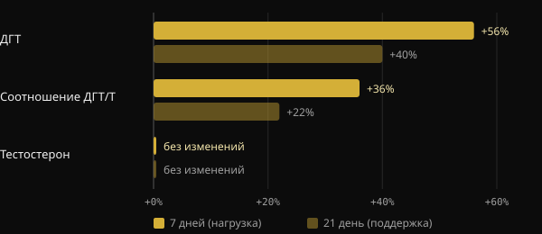
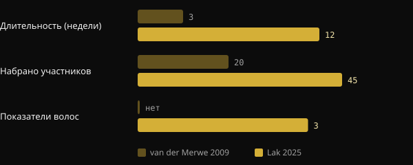

# Креатин вызывает выпадение волос? Что на самом деле говорят исследования

Креатин — одна из самых изученных добавок вообще, и всё же один вопрос возникает снова и снова: «У меня от него выпадут волосы?» У этих опасений есть конкретный источник — небольшое исследование 2009 года, в котором волосы не оценивали. Здесь мы разбираем, что измеряло то исследование, что показало первое специально построенное испытание 2025 года и как самому читать исследование, прежде чем пугаться заголовка.

## Коротко

- Опасения идут от исследования 2009 года на 20 регбистах: за 3 недели ДГТ в крови вырос, но волосы никто не измерял.
- ДГТ — гормон, связанный с мужским облысением, но рост его уровня в крови не равен потере волос.
- В 2025 году в 12-недельном рандомизированном испытании напрямую измерили плотность, число фолликулярных единиц и толщину волос: между креатином и плацебо различий нет.
- В том же испытании ДГТ и соотношение ДГТ/тестостерон в группах тоже не различались.
- Обзоры Международного общества спортивного питания (ISSN) считают креатин моногидрат безопасным и хорошо переносимым у здоровых людей в изученных дозах.

## Откуда взялись опасения

В 2009 году группа из Стелленбошского университета (ЮАР) давала креатин 20 студентам-регбистам в течение сезона. Дизайн был перекрёстным и двойным слепым: каждый спортсмен принимал и креатин, и плацебо в разные периоды, между которыми была пауза в 6 недель. Фаза с креатином длилась 3 недели: 7 дней загрузки по 25 г в день, затем 14 дней по 5 г.

Авторы измеряли в крови тестостерон и дигидротестостерон (ДГТ) — гормон, который образуется из тестостерона под действием фермента 5-альфа-редуктазы и сильнее действует на рецепторы андрогенов.

*Источник: van der Merwe et al., Clin J Sport Med 2009 (n = 20, перекрёстное). Изменения относительно исходного уровня приведены в абстракте. График Nurvan.*

Тестостерон не изменился. А вот ДГТ после недели загрузки вырос на 56% и после двух недель поддерживающей дозы всё ещё был на 40% выше исходного. Соотношение ДГТ/тестостерон выросло на 36%, а затем на 22%. Сами авторы заключали, что нужны новые исследования.

Дальше сработало «сарафанное радио». ДГТ играет центральную роль в андрогенной алопеции у мужчин — недаром препарат финастерид действует именно блокируя 5-альфа-редуктазу. От «креатин повышает ДГТ» до «креатин вызывает выпадение волос» оставался один короткий шаг. Но в исследовании никто не посчитал ни одного волоса.

## Почему ДГТ в крови — ещё не доказательство

Андрогенная алопеция — это постепенная миниатюризация фолликулов, обусловленная генетическими факторами и андрогенами. По обзорам в дерматологии, важна чувствительность самого фолликула, а не только то, сколько ДГТ циркулирует. Временный рост в крови — повод разобраться глубже, а не доказательство вреда для волос.

Есть и ограничения самого исследования: одна группа спортсменов, всего три недели и высокая загрузочная доза. Кроме того, результат так и не был воспроизведён. Обзор ISSN 2021 года о вопросах и мифах про креатин рассматривает как раз этот момент и заключает, что современные данные не указывают на то, что креатин вызывает потерю волос или облысение.

## Исследование 2025 года: наконец-то измеряют волосы

В 2025 году группа исследователей из Ирана, Канады и США опубликовала в Journal of the International Society of Sports Nutrition первое испытание, задуманное, чтобы ответить на этот вопрос напрямую. Они набрали 45 мужчин от 18 до 40 лет, уже занимавшихся с отягощениями, и случайным образом разделили на две группы на 12 недель: 5 г в день креатина моногидрата или 5 г мальтодекстрина в качестве плацебо. Исследование завершили 38 человек.

На этот раз измеряли и гормоны, и волосы. Гормоны — общий тестостерон, свободный тестостерон и ДГТ. Волосы — с помощью трихограммы и системы FotoFinder: плотность, число фолликулярных единиц и суммарная толщина.

*Источники: van der Merwe et al. 2009; Lak et al. 2025. Данные из абстрактов. График Nurvan.*

Результат: никаких различий между креатином и плацебо ни по одному гормону и ни по одному показателю волос. Общий тестостерон вырос, а свободный снизился в обеих группах, то есть независимо от креатина. ДГТ и соотношение ДГТ/тестостерон тоже менялись в группах одинаково.

У исследования есть ограничения, о которых надо помнить: 38 человек, только молодые мужчины, 12 недель и один центр. Оно ничего не говорит о женщинах, о тех, у кого уже выраженное облысение, и о годах приёма. Но впервые вопрос проверили, измеряя то, что нужно.

## Три вопроса к любому исследованию

Эта история — хорошее упражнение в чтении научных работ. Прежде чем делиться заголовком, задай себе три вопроса.

1. **Что именно измеряли?** Гормон в крови, маркер или тот исход, который тебя действительно интересует? В 2009 году измеряли ДГТ, а не выпадение волос. Если исход не измеряли, исследование не может ответить на вопрос.
2. **У кого и как долго?** Двадцать регбистов в течение трёх недель — это не население в целом на годы. Число людей, длительность, возраст, пол и дозы показывают, как далеко можно распространять результаты.
3. **Воспроизвели ли это и как это вписывается в остальные данные?** Одно исследование — лишь отправная точка. Важно, нашли ли то же самое другие группы и идут ли в том же направлении обзоры, собирающие все данные.

## Что на самом деле говорят исследования

Поводом для этой статьи стал пост Марко Гуэрчони (@the___doc) об истории связи креатина и волос. Вот основные утверждения, сверенные с источниками.

- **Подтверждено** — «Исследование 2009 года измеряло ДГТ в крови, а не волосы». В абстракте приведены только тестостерон, ДГТ, соотношение ДГТ/Т и состав тела.
- **Подтверждено** — «Исследование длилось три недели». Одна неделя загрузки и две поддержки.
- **Требует уточнения** — «Участников было 16 регбистов». В абстракте указано 20 добровольцев. Число закончивших исследование в абстракте не приведено, поэтому цифру 16 оттуда проверить нельзя.
- **Требует уточнения** — «Из того исследования родился миф». Это единственное исследование на людях, сообщившее о росте ДГТ при приёме креатина, и именно оно обсуждается в обзоре ISSN 2021 года. Что оно стало источником слухов — правдоподобная реконструкция, а не измеримый факт.
- **Подтверждено** — «В 2025 году вышло первое исследование, построенное для измерения выпадения волос при приёме креатина». Сами авторы заявляют, что первыми напрямую оценили состояние фолликулов после приёма креатина.

## Как это применить

- **Если ты принимаешь креатин и боишься за волосы:** доступные сегодня прямые данные не показывают влияния ни на волосы, ни на ДГТ за 12 недель. Данные надёжны для молодых тренирующихся мужчин, для других групп — менее.
- **Дозы, использованные в исследованиях:** в испытании 2025 года применяли 5 г в день. Обзор ISSN 2021 года указывает как рекомендуемые дозы 3–5 г в день, или 0,1 г на кг веса. Фаза загрузки 2009 года (25 г в день) по тому же обзору не нужна. Это данные из литературы, а не личное назначение.
- **Если в семье были случаи облысения:** главным фактором остаётся генетика. Если замечаешь поредение волос, обсуди это с дерматологом: он оценит ситуацию независимо от креатина.
- **Если у тебя заболевания почек или другие медицинские состояния,** поговори с врачом, прежде чем начинать любую добавку.

<h3>Добавки под наблюдением твоего тренера</h3>

В Nurvan ты можешь попросить тренера составить протокол добавок прямо в приложении. Тренер собирает его из каталога добавок приложения, указывая дозу и время приёма для каждого продукта, и назначает в твоём плане рядом с тренировками и питанием. Так у каждой добавки есть причина и человек, который следит за ней вместе с тобой.

<a href="https://nurvan.app">Попробуй Nurvan</a>

## Частые вопросы

### Креатин повышает ДГТ?

Исследование 2009 года на 20 регбистах показало рост ДГТ в крови за 3 недели. Более длительное испытание 2025 года на большем числе людей не обнаружило различий между креатином и плацебо. Результат 2009 года воспроизвести не удалось.

### Креатин вреден для волос у женщин?

Прямых исследований о волосах у женщин нет. В испытании 2025 года участвовали только мужчины. Обзоры ISSN считают креатин эффективным и хорошо переносимым и у женщин, но данных по женским волосам не хватает.

### Нужна ли фаза загрузки?

По обзору ISSN 2021 года — нет: фаза загрузки быстрее насыщает мышцы, но и меньшие суточные дозы доходят до этого за несколько недель. В испытании 2025 года применяли 5 г в день без загрузки.

### У меня уже идёт облысение: нужно прекратить приём?

Доступные данные не указывают на то, что креатин его ускоряет, но специальных исследований на тех, у кого уже выраженное облысение, нет. В этом случае разумно проконсультироваться с дерматологом.

## Источники

1. van der Merwe J, Brooks NE, Myburgh KH, 2009. Three weeks of creatine monohydrate supplementation affects dihydrotestosterone to testosterone ratio in college-aged rugby players. *Clin J Sport Med* 19(5):399–404. [PMID 19741313](https://pubmed.ncbi.nlm.nih.gov/19741313/) · [DOI 10.1097/JSM.0b013e3181b8b52f](https://doi.org/10.1097/JSM.0b013e3181b8b52f)
2. Lak M, Forbes SC, Ashtary-Larky D et al., 2025. Does creatine cause hair loss? A 12-week randomized controlled trial. *J Int Soc Sports Nutr* 22(sup1):2495229. [PMID 40265319](https://pubmed.ncbi.nlm.nih.gov/40265319/) · [DOI 10.1080/15502783.2025.2495229](https://doi.org/10.1080/15502783.2025.2495229)
3. Antonio J, Candow DG, Forbes SC et al., 2021. Common questions and misconceptions about creatine supplementation: what does the scientific evidence really show? *J Int Soc Sports Nutr* 18(1):13. [PMID 33557850](https://pubmed.ncbi.nlm.nih.gov/33557850/) · [DOI 10.1186/s12970-021-00412-w](https://doi.org/10.1186/s12970-021-00412-w)
4. Kreider RB, Kalman DS, Antonio J et al., 2017. International Society of Sports Nutrition position stand: safety and efficacy of creatine supplementation in exercise, sport, and medicine. *J Int Soc Sports Nutr* 14:18. [PMID 28615996](https://pubmed.ncbi.nlm.nih.gov/28615996/) · [DOI 10.1186/s12970-017-0173-z](https://doi.org/10.1186/s12970-017-0173-z)
5. York K, Meah N, Bhoyrul B, Sinclair R, 2020. A review of the treatment of male pattern hair loss. *Expert Opin Pharmacother* 21(5):603–612. [PMID 32066284](https://pubmed.ncbi.nlm.nih.gov/32066284/) · [DOI 10.1080/14656566.2020.1721463](https://doi.org/10.1080/14656566.2020.1721463)

Статья написана по мотивам поста [Marco Guercioni (@the___doc)](https://www.instagram.com/p/Dd169MICJ8G/). Источники изучены через PubMed.

> Примечание: материал носит информационный характер и не заменяет консультацию врача или квалифицированного специалиста.
