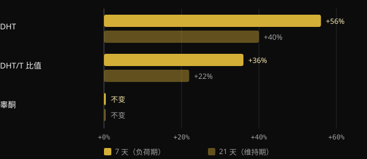
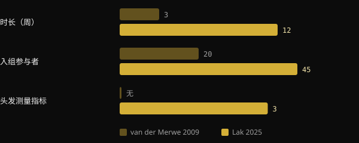

# 肌酸会导致脱发吗？研究到底怎么说

肌酸是研究最充分的补剂之一，但有一个问题总会被反复问起：“它会让我掉头发吗？”这种担忧有一个明确的来源，那是 2009 年的一项小型研究，而它并没有观察头发。本文将梳理那项研究测量了什么，2025 年专门设计的首个试验发现了什么，以及如何在被标题吓到之前，自己学会解读一项研究。

## 要点速览

- 这种担忧源于 2009 年一项针对 20 名橄榄球运动员的研究：3 周内血液中的 DHT 上升，但头发从未被测量。
- DHT 是一种与男性型脱发有关的激素，但血液中 DHT 升高并不等于会掉头发。
- 2025 年，一项为期 12 周的随机试验直接测量了头发的密度、毛囊单位数量和粗细：肌酸组与安慰剂组没有差异。
- 在同一项试验中，DHT 以及 DHT 与睾酮的比值在两组之间同样没有差异。
- 国际运动营养学会（ISSN）的综述认为，在健康人群中，按研究所用剂量服用一水肌酸是安全且耐受良好的。

## 担忧从何而来

2009 年，南非斯泰伦博斯大学的一个团队在赛季期间让 20 名大学橄榄球运动员服用肌酸。研究采用交叉和双盲设计：每位运动员在不同时期既服用肌酸，也服用安慰剂，两个时期之间间隔 6 周。肌酸阶段持续 3 周：先是 7 天的负荷期，每天 25 g，随后 14 天每天 5 g。

作者测量了血液中的睾酮和双氢睾酮（DHT）。DHT 由睾酮经 5-α 还原酶转化而来，对雄激素受体的作用更强。

*来源：van der Merwe et al., Clin J Sport Med 2009（n = 20，交叉设计）。相对于基线的变化取自摘要。图表由 Nurvan 制作。*

睾酮没有变化。而 DHT 在负荷周之后上升了 56%，在两周维持期之后仍比初始值高 40%。DHT 与睾酮的比值先增加了 36%，随后为 22%。作者自己的结论是，还需要更多研究。

接下来的一步是靠口口相传完成的。DHT 是男性雄激素性脱发的核心，以至于药物非那雄胺正是通过阻断 5-α 还原酶起作用。从“肌酸会升高 DHT”到“肌酸会导致脱发”，只一步之遥。但在这项研究里，没有人数过一根头发。

## 为什么血液中的 DHT 并不足以说明问题

雄激素性脱发是毛囊逐渐微型化的过程，由遗传因素和雄激素共同驱动。根据皮肤科的综述，起决定作用的是毛囊的敏感性，而不仅仅是循环中有多少 DHT。血液中的暂时性升高是值得进一步探究的线索，而不是头发受损的证据。

此外还有这项研究本身的局限：只有一组运动员，总共只有三周，而且负荷剂量很高。更重要的是，这个结果从未被重复验证。ISSN 在 2021 年发表的关于肌酸的常见问题与误区的综述正是讨论了这一点，并得出结论：目前的数据并不表明肌酸会导致脱发或秃顶。

## 2025 年的研究：终于测量了头发

2025 年，由伊朗、加拿大和美国研究人员组成的团队在 Journal of the International Society of Sports Nutrition 上发表了第一项专门为直接回答这个问题而设计的试验。他们招募了 45 名 18 至 40 岁、已有力量训练基础的男性，随机分为两组，为期 12 周：每天 5 g 一水肌酸，或每天 5 g 麦芽糊精作为安慰剂。最终有 38 人完成了研究。

这一次，激素和头发都被测量了。激素包括总睾酮、游离睾酮和 DHT。头发方面，使用毛发图谱和 FotoFinder 系统测量了密度、毛囊单位数量和累计粗细。

*来源：van der Merwe et al. 2009；Lak et al. 2025。数据取自摘要。图表由 Nurvan 制作。*

结果：无论是哪种激素，还是头发的哪项指标，肌酸组与安慰剂组之间都没有差异。两组的总睾酮都上升了，游离睾酮都下降了，因此与肌酸无关。DHT 以及 DHT 与睾酮的比值在两组之间的变化也没有不同。

这项研究也有需要牢记的局限：38 人，只有年轻男性，12 周，且只有一个研究中心。它没有说明女性、已有严重脱发的人，或长年使用的情况。但这是第一次，有人通过测量真正该测的东西来检验这个问题。

## 向任何一项研究提出的三个问题

这个故事是练习解读研究的好例子。在转发一个标题之前，不妨先问自己这三个问题。

1. **到底测量了什么？** 是血液中的某种激素、某个标志物，还是你真正关心的结局？2009 年测量的是 DHT，而不是脱发。如果没有测量结局，这项研究就无法回答这个问题。
2. **对象是谁，持续多久？** 二十名橄榄球运动员、三周，并不等于普通人群、多年使用。人数、时长、年龄、性别和剂量，决定了结果可以推广到什么程度。
3. **是否被重复验证过，它在其余证据中处于什么位置？** 单独一项研究只是一个起点。重要的是其他团队是否得出了相同的结果，以及汇总所有数据的综述是否指向同一方向。

## 研究到底怎么说

本文的灵感来自 Marco Guercioni（@the___doc）的一篇帖子，讲的是肌酸与头发之间这一说法的来龙去脉。以下是主要说法，并与文献来源进行对照。

- **已证实** — “2009 年的研究测量的是血液中的 DHT，而不是头发。” 摘要只报告了睾酮、DHT、DHT/T 比值和身体成分。
- **已证实** — “这项研究持续了三周。” 一周负荷期加两周维持期。
- **需要补充说明** — “参与者是 16 名橄榄球运动员。” 摘要给出的是 20 名志愿者。完成者的人数没有出现在摘要里，因此 16 这个数字无法从中核实。
- **需要补充说明** — “这个谣言就是从那项研究来的。” 它是唯一一项报告肌酸会升高 DHT 的人体研究，也是 ISSN 2021 年综述所讨论的那一项。说它是口口相传的源头，是一个合理的推断，而不是可以测量的数据。
- **已证实** — “2025 年出现了第一项专门为测量肌酸与脱发而设计的研究。” 作者们自己声明，他们是第一个直接评估服用肌酸后毛囊健康状况的团队。

## 如何应用

- **如果你在使用肌酸，并担心头发：** 目前可用的直接证据显示，在 12 周内，对头发和 DHT 都没有影响。这一结论对年轻的、有训练基础的男性比较可靠，对其他人群则不那么确定。
- **研究中使用的剂量：** 2025 年的试验使用的是每天 5 g。ISSN 2021 年的综述推荐的剂量是每天 3 至 5 g，或每公斤体重 0.1 g。根据同一篇综述，2009 年的负荷阶段（每天 25 g）并不必要。以上是文献中的数据，而不是个人处方。
- **如果你有脱发家族史：** 遗传仍然是主要因素。如果你发现头发变稀疏，请咨询皮肤科医生，他可以在与肌酸无关的前提下评估你的情况。
- **如果你有肾脏疾病或其他基础疾病，** 在开始任何补剂之前，请先咨询医生。

<h3>由教练跟进的补剂方案</h3>

在 Nurvan 中，你可以直接在应用里向教练申请补剂方案。教练从应用的补剂目录中挑选，为每种产品设定剂量和服用时间，并把它与训练和饮食一起分配到你的计划中。这样，每一种补剂都有明确的理由，也有人和你一起跟进。

<a href="https://nurvan.app">试用 Nurvan</a>

## 常见问题

### 肌酸会升高 DHT 吗？

2009 年一项针对 20 名橄榄球运动员的研究在 3 周内观察到血液中 DHT 升高。2025 年的试验时间更长、人数更多，没有发现肌酸组与安慰剂组之间的差异。2009 年的结果没有被重复验证。

### 肌酸会伤害女性的头发吗？

目前没有针对女性头发的直接研究。2025 年的试验只纳入了男性。ISSN 的综述认为，肌酸对女性同样有效且耐受良好，但关于女性头发的数据是缺失的。

### 需要负荷期吗？

根据 ISSN 2021 年的综述，不需要：负荷期能让肌肉更快饱和，但较低的每日剂量也能在几周内达到同样的水平。2025 年的试验使用的是每天 5 g，没有负荷期。

### 我已经在脱发了，需要停用吗？

现有证据并不表明肌酸会加速脱发，但没有专门针对已有严重脱发人群的研究。在这种情况下，与皮肤科医生商量是合理的做法。

## 参考文献

1. van der Merwe J, Brooks NE, Myburgh KH, 2009. Three weeks of creatine monohydrate supplementation affects dihydrotestosterone to testosterone ratio in college-aged rugby players. *Clin J Sport Med* 19(5):399–404. [PMID 19741313](https://pubmed.ncbi.nlm.nih.gov/19741313/) · [DOI 10.1097/JSM.0b013e3181b8b52f](https://doi.org/10.1097/JSM.0b013e3181b8b52f)
2. Lak M, Forbes SC, Ashtary-Larky D et al., 2025. Does creatine cause hair loss? A 12-week randomized controlled trial. *J Int Soc Sports Nutr* 22(sup1):2495229. [PMID 40265319](https://pubmed.ncbi.nlm.nih.gov/40265319/) · [DOI 10.1080/15502783.2025.2495229](https://doi.org/10.1080/15502783.2025.2495229)
3. Antonio J, Candow DG, Forbes SC et al., 2021. Common questions and misconceptions about creatine supplementation: what does the scientific evidence really show? *J Int Soc Sports Nutr* 18(1):13. [PMID 33557850](https://pubmed.ncbi.nlm.nih.gov/33557850/) · [DOI 10.1186/s12970-021-00412-w](https://doi.org/10.1186/s12970-021-00412-w)
4. Kreider RB, Kalman DS, Antonio J et al., 2017. International Society of Sports Nutrition position stand: safety and efficacy of creatine supplementation in exercise, sport, and medicine. *J Int Soc Sports Nutr* 14:18. [PMID 28615996](https://pubmed.ncbi.nlm.nih.gov/28615996/) · [DOI 10.1186/s12970-017-0173-z](https://doi.org/10.1186/s12970-017-0173-z)
5. York K, Meah N, Bhoyrul B, Sinclair R, 2020. A review of the treatment of male pattern hair loss. *Expert Opin Pharmacother* 21(5):603–612. [PMID 32066284](https://pubmed.ncbi.nlm.nih.gov/32066284/) · [DOI 10.1080/14656566.2020.1721463](https://doi.org/10.1080/14656566.2020.1721463)

本文灵感来自 [Marco Guercioni (@the___doc)](https://www.instagram.com/p/Dd169MICJ8G/) 的一篇帖子。参考文献通过 PubMed 查阅。

> 注：本文仅供参考，不能替代医生或合格专业人士的意见。
