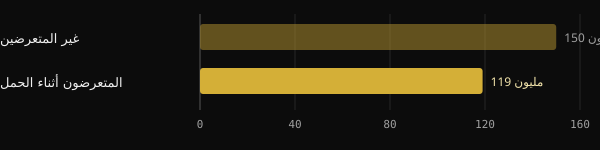

# التدخين أثناء الحمل وخصوبة الأبناء الذكور: ما تقوله الدراسات

يُعرف منذ عقود أن التدخين أثناء الحمل يؤثر في وزن المولود. أما الأقل شيوعًا فهو أن عدة دراسات تربطه أيضًا بإنتاج الحيوانات المنوية لدى الأبناء الذكور بعد عشرين عامًا. ستجد هنا أرقامًا راجعناها على الدراسات الأصلية: ما هو متين منها، وما يُبالَغ فيه، وما الذي يفيد فعله اليوم.

## باختصار

- الشبان الذين تعرضوا لتدخين الأم أثناء الحمل لديهم في المتوسط حيوانات منوية أقل في سن الرشد: نحو الربع أقل في العدد الكلي في الدراسة الأوروبية الأكثر استشهادًا.
- قاست الدراسة نفسها خصيتين أصغر بنحو 1 مل. وتجد دراسة دنماركية ثانية أوسع فروقًا في الاتجاه نفسه لكنها أصغر قليلًا.
- يبدو أن الخطر يزداد مع عدد السجائر، لكن البيانات عن الجرعة مصدرها عينات صغيرة وهوامش عدم يقين واسعة.
- هذه دراسات رصدية: تُظهر ارتباطًا قويًا ومتكررًا، لا حكمًا على الفرد. فكثير من الرجال المتعرضين لديهم قيم طبيعية تمامًا.
- لا أساس في الدراسات على البشر للفكرة القائلة إن الآثار تنتقل عبر "سبعة أجيال".

## ماذا وجدت الدراسات

الدراسة المرجعية لـ Tina Kold Jensen وزملائها، نُشرت عام 2004 في American Journal of Epidemiology. بين عامي 1996 و1999 جمع الباحثون عينات سائل منوي من 1.770 شابًا في الدنمارك والنرويج وفنلندا وليتوانيا وإستونيا، أثناء الفحص الطبي للتجنيد. وملأت الأمهات استبيانًا مع أبنائهن، يبيّن أيضًا ما إذا دخّنّ أثناء الحمل.

بعد التصحيح للعوامل المُشوِّشة الرئيسية، ومنها تدخين الشبان أنفسهم، كان لدى المتعرضين في المتوسط:

| المؤشر | الفرق مقارنةً بغير المتعرضين | فاصل الثقة 95% |
|---|---|---|
| العدد الكلي للحيوانات المنوية | −24,5% | من −9,5% إلى −39,5% |
| التركيز (مليون لكل مل) | −20,1% | من −6,8% إلى −33,5% |
| الحيوانات المنوية المتحركة | −1,85 نقطة مئوية | من −0,46 إلى −3,23 |
| حجم الخصيتين | −1,15 مل | من −0,66 إلى −1,64 مل |

*المصدر: Jensen TK et al., Am J Epidemiol 2004 (n = 1.770). قيم معدَّلة من الملخص.*

ظهر الارتباط في كل مركز على حدة، مع استثناء لافت: ففي ليتوانيا لم تدخّن سوى 1% من الأمهات أثناء الحمل، وهو عدد قليل جدًا لا يتيح رؤية أثر.

## التأكيد الدنماركي

في عام 2011 حلل Ravnborg وزملاؤه، من مجموعة كوبنهاغن نفسها، 3.486 رجلًا دنماركيًا بعمر وسيط 19 عامًا، جُمعوا بين 1996 و2006. وهنا أيضًا كان لدى أبناء الأمهات المدخِّنات حيوانات منوية أقل وخصيتان أصغر قليلًا.

*المصدر: Ravnborg TL et al., Hum Reprod 2011 (n = 3.486، قيم من الملخص). رسم Nurvan.*

كان العدد الكلي 119 مليونًا لدى المتعرضين مقابل 150 مليونًا لدى غير المتعرضين، أي أقل بنحو 21%. وبلغ حجم الخصية 14,0 مقابل 14,5 مل. كما أظهر المتعرضون هرمونات مرتبطة بإنتاج الحيوانات المنوية أقل قليلًا، وبلوغًا أبكر قليلًا، ومؤشر كتلة جسم أعلى قليلًا.

ويضيف المؤلفون تنبيهًا مهمًا: قد لا تكون هذه الفروق ذات دلالة سريرية للفرد، لكنها مهمة على مستوى السكان. فإذا أزحتَ المتوسط نحو الأسفل لدى كثير من الرجال، ازدادت حصة من ينزلون تحت العتبات التي تجعل الحمل أصعب.

وملاحظة منهجية: دراسة 2011 نشأت من البرنامج الدنماركي نفسه الذي أنتج دراسة 2004، وفترة جمع العينات تتداخل. فهي إذن تأكيد على عينة أكبر، لا تكرار مستقل تمامًا.

## كلما زادت السجائر زاد الخطر؟

بحثت دراسة دنماركية ثالثة، لـ Jensen MS وزملائه (2005)، عن علاقة بالجرعة. وعلى 522 رجلًا عُرفت عادات أمهاتهم، كان خطر قلة النطاف (أقل من 20 مليون حيوان منوي لكل مل):

*المصدر: Jensen MS et al., Hum Reprod 2005 (n = 522). نسب الأرجحية مع فاصل ثقة 95%. رسم Nurvan.*

مع أكثر من 10 سجائر يوميًا كان الخطر المقدَّر 2,6 ضعف خطر أبناء غير المدخِّنات. والاتجاه واضح، لكن لا بد من ذكر الحدود. فالفاصل واسع، من 1,2 إلى 5,8. ومجموعة 1 إلى 10 سجائر لم تبلغ الدلالة الإحصائية. كما لم تكن الفروق في متوسط التركيز دالّة إحصائيًا.

وفي فوج دنماركي آخر تابع 347 ابنًا لنساء أُجريت معهن مقابلات أثناء الحمل، وُجدت علاقة عكسية مع العدد الكلي. فمع أكثر من 19 سيجارة يوميًا كان العدد أقل بنسبة 38% وحجم السائل المنوي أقل بنسبة 19%. غير أن الارتباط الإجمالي والحجم وحدهما تجاوزا عتبة الدلالة.

## لماذا قد يدوم الأثر

تتكون الخصية أثناء الحياة الجنينية. وفي تلك الفترة تتكاثر خلايا سيرتولي، التي تدعم في سن الرشد إنتاج الحيوانات المنوية، وسلائف الخلايا الجرثومية. وتخلص مراجعة عام 2012 إلى أن صغر الخصيتين وتدنّي جودة السائل المنوي لدى المتعرضين يوحيان بتأثير سُمّي على هذه الخلايا تحديدًا.

وتسير التجارب على الفئران في الاتجاه نفسه. فعند تعريض الأمهات للدخان أثناء الحمل والإرضاع، كان لدى الذكور من أبنائها في سن الرشد خلايا جذعية للحيوانات المنوية أقل، وتلف أكبر في الحمض النووي، وخصوبة منخفضة. وهذا نموذج حيواني، مفيد لفهم الآلية لكنه لا ينتقل كما هو إلى الإنسان.

والنقطة التي ينبغي توضيحها أن أي دراسة على البشر لم تتحقق مما إذا كان يمكن تعويض هذه الفروق وإلى أي حد. نقول إن الضرر مرتبط على الأرجح بنافذة مبكرة من النمو، لا إنه مثبت أنه لا رجعة فيه في كل حالة.

## ثلاثة أجيال لا سبعة

ثمة ملاحظة بيولوجية صحيحة يتردد ذكرها كثيرًا. فأثناء الحمل تتكوّن أصلًا الخلايا الجرثومية للجنين. ففي حمل واحد يتأثر إذن كل من الأم والجنين، وبمعنى ما، أبناء الجنين مستقبلًا.

ومن هنا إلى القول إن التدخين يترك أثره في "سبعة أجيال" قفزة هائلة. فالدراسات المذكورة تقيس جيلًا واحدًا، هم الأبناء. ولا توجد بيانات على البشر تُظهر آثارًا على الأحفاد، فضلًا عمّا بعدهم.

## ماذا يقول البحث حقًا

منطلق هذا المقال منشور لـ Marco Guercioni (@the___doc). وهذه أبرز ادعاءاته، مقارَنةً بالملخصات.

- **مؤكَّد** — "أبناء الأمهات المدخِّنات لديهم نحو ربع الحيوانات المنوية أقل." ينطبق على العدد الكلي (−24,5%) في الدراسة الأوروبية لعام 2004.
- **مؤكَّد** — "1.770 شابًا في 5 دول، التركيز −20,1%، خصيتان أصغر بـ1,15 مل." الأرقام تطابق الملخص.
- **يحتاج إلى توضيح** — "تكررت على 3.486 دنماركيًا عام 2011." الفروق في الاتجاه نفسه لكنها أصغر قليلًا (−21% في العدد الكلي، −0,5 مل في حجم الخصية)، والعينتان من البرنامج الدنماركي نفسه.
- **يحتاج إلى توضيح** — "فوق 10 سجائر يوميًا يتضاعف خطر قلة النطاف." التقدير هو في الواقع 2,6، لكنه مستمد من 522 رجلًا، بفاصل من 1,2 إلى 5,8 ومجموعة وسطى غير دالّة.
- **يحتاج إلى توضيح** — "لا يمكن تعويضه لأن الخلايا تتكوّن في الحياة الجنينية." الآلية معقولة وتدعمها نماذج حيوانية، لكن عدم الرجعة لم يُقَس لدى البشر.
- **مؤكَّد** — "ثلاثة أجيال معنية أثناء الحمل." هذه معلومة من علم الأجنة: الخلايا الجرثومية للجنين تتكوّن أثناء الحمل.
- **مدحوض** — "سبعة أجيال." لا يوجد أي دليل لدى البشر يتجاوز الجيل الأول من الأبناء.

ويشير المنشور أيضًا إلى أن رقمًا يتكرر نقله خطأً. لا نعرف أي رقم كان يقصد. والخطأ الأشيع الذي نصادفه هو الخلط بين العدد الكلي (−24,5%) والتركيز (−20,1%): فهما قياسان مختلفان، وانخفاض "الربع" يخص الأول فقط.

## ما الذي يمكن فعله

هذا ليس مقالًا لإلقاء اللوم على أحد. فالإقلاع عن التدخين صعب، والإدمان على النيكوتين حالة طبية، وكثير من أمهات هذه الدراسات كنّ حوامل في السبعينيات والثمانينيات، حين كانت المعلومات مختلفة. والبيانات تخدم توجيه خيارات اليوم.

1. **إن كنتِ تسعين إلى الحمل أو كنتِ حاملًا**، فتحدثي إلى طبيبك العام أو طبيب النساء. الإقلاع قبل الحمل أو في بدايته هو الخيار الأفضل، لكن التقليل يظل مجديًا مقارنةً بعدم فعل شيء.
2. **اطلبي المساعدة ولا تواجهي الأمر وحدك.** في إيطاليا توجد مراكز عامة لمكافحة التدخين وخط Telefono Verde contro il Fumo التابع للمعهد الأعلى للصحة (800 554088). ويستطيع الطبيب والصيدلي أن يدلّاك على الخيارات الملائمة أثناء الحمل.
3. **أشركي الشريك.** فالتدخين السلبي في المنزل مؤثر، كما أن تدخين الأب يؤثر في جودة سائله المنوي.
4. **إن كنت رجلًا تعرضت للتدخين أثناء الحمل**، فلا داعي للذعر. وإن كنتما تحاولان إنجاب طفل منذ 12 شهرًا دون نجاح، فبإمكان طبيب الذكورة أن يصف تحليل السائل المنوي، وهو الوسيلة الوحيدة لمعرفة قيمك الحقيقية.

<h3>احتفظ بفحوصك في مكان واحد</h3>

في قسم الفحوص في Nurvan يمكنك حفظ التقارير والقيم مع تواريخها، ومنها تحليل السائل المنوي، وإرفاق الملف الأصلي. وهكذا تجد النتائج حين تناقشها مع الطبيب وتراجعها عبر الزمن. وهي بيانات صحية: تبقى في حسابك، ولا تشاركها مع مدرب إلا إذا قررت ذلك أنت.

<a href="https://nurvan.app">جرّب Nurvan</a>

## أسئلة شائعة

### كانت أمي تدخّن أثناء الحمل: هل سأكون بالتأكيد أقل خصوبة؟

لا. فالبيانات تصف متوسطات على آلاف الرجال. وكثير من المتعرضين لديهم قيم طبيعية ويصبحون آباء دون صعوبة. وإن كانت لديك شكوك أو كنتما تحاولان منذ مدة، فتحليل السائل المنوي هو الفحص الذي يجيب فعلًا.

### أيهما أهم: تدخين الأم أم تدخين الابن في سن الرشد؟

في الدراسات المذكورة يبقى أثر التدخين أثناء الحمل حتى بعد مراعاة تدخين الشبان أنفسهم. وللتدخين في سن الرشد آثاره الخاصة في جودة السائل المنوي، فالإقلاع مجدٍ على أي حال.

### هل السجائر الإلكترونية أثناء الحمل بديل آمن؟

الدراسات المناقشة هنا تخص السجائر التقليدية. أما عن السجائر الإلكترونية أثناء الحمل فالبيانات عن خصوبة الأبناء ما زالت شحيحة: وهو موضوع يُبحث مع طبيب النساء.

### هل تقتصر الآثار على الأبناء الذكور؟

يتناول هذا المقال جودة السائل المنوي، أي الأبناء الذكور. وللتدخين أثناء الحمل آثار موثَّقة جيدًا في جوانب أخرى من صحة الطفل، بغض النظر عن جنسه.

## المصادر

1. Jensen TK et al., 2004. Association of in utero exposure to maternal smoking with reduced semen quality and testis size in adulthood: a cross-sectional study of 1,770 young men from the general population in five European countries. *Am J Epidemiol* 159(1):49–58. [PMID 14693659](https://pubmed.ncbi.nlm.nih.gov/14693659/) · [DOI 10.1093/aje/kwh002](https://doi.org/10.1093/aje/kwh002)
2. Ravnborg TL et al., 2011. Prenatal and adult exposures to smoking are associated with adverse effects on reproductive hormones, semen quality, final height and body mass index. *Hum Reprod* 26(5):1000–11. [PMID 21335416](https://pubmed.ncbi.nlm.nih.gov/21335416/) · [DOI 10.1093/humrep/der011](https://doi.org/10.1093/humrep/der011)
3. Jensen MS et al., 2005. Lower sperm counts following prenatal tobacco exposure. *Hum Reprod* 20(9):2559–66. [PMID 15919771](https://pubmed.ncbi.nlm.nih.gov/15919771/) · [DOI 10.1093/humrep/dei110](https://doi.org/10.1093/humrep/dei110)
4. Ramlau-Hansen CH et al., 2007. Is prenatal exposure to tobacco smoking a cause of poor semen quality? A follow-up study. *Am J Epidemiol* 165(12):1372–9. [PMID 17369608](https://pubmed.ncbi.nlm.nih.gov/17369608/) · [DOI 10.1093/aje/kwm032](https://doi.org/10.1093/aje/kwm032)
5. Virtanen HE, Sadov S, Toppari J, 2012. Prenatal exposure to smoking and male reproductive health. *Curr Opin Endocrinol Diabetes Obes* 19(3):228–32. [PMID 22499223](https://pubmed.ncbi.nlm.nih.gov/22499223/) · [DOI 10.1097/MED.0b013e3283537cb8](https://doi.org/10.1097/MED.0b013e3283537cb8)
6. Sobinoff AP et al., 2014. Damaging legacy: maternal cigarette smoking has long-term consequences for male offspring fertility. *Hum Reprod* 29(12):2719–35. [PMID 25269568](https://pubmed.ncbi.nlm.nih.gov/25269568/) · [DOI 10.1093/humrep/deu235](https://doi.org/10.1093/humrep/deu235) (دراسة على الفئران)

مقال مستوحى من منشور لـ [Marco Guercioni (@the___doc)](https://www.instagram.com/p/Dd6psLVCKfq/). المصادر مُراجَعة عبر PubMed.

> ملاحظة: محتوى إعلامي، ولا يغني عن رأي الطبيب أو المختص المؤهل.
