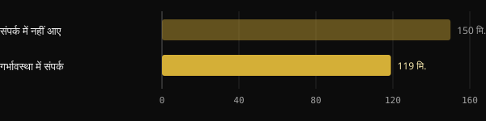

# गर्भावस्था में धूम्रपान और बेटों की प्रजनन क्षमता: अध्ययन क्या कहते हैं

यह दशकों से पता है कि गर्भावस्था में धूम्रपान जन्म के वज़न पर असर डालता है। कम पता है कि कई अध्ययन इसे बेटों में बीस साल बाद शुक्राणु बनने से भी जोड़ते हैं। यहाँ आपको मूल अध्ययनों से जाँचे हुए आँकड़े मिलेंगे: क्या ठोस है, क्या बढ़ा-चढ़ाकर कहा जाता है और आज क्या करना समझदारी है।

## संक्षेप में

- गर्भावस्था में माँ के धूम्रपान के संपर्क में आए लड़कों में वयस्क होने पर औसतन शुक्राणु कम होते हैं: सबसे ज़्यादा उद्धृत यूरोपीय अध्ययन में कुल संख्या में लगभग एक चौथाई की कमी।
- उसी अध्ययन में अंडकोष लगभग 1 ml छोटे मापे गए। डेनमार्क का एक दूसरा, बड़ा विश्लेषण उसी दिशा में अंतर पाता है, पर थोड़े छोटे।
- जोखिम सिगरेट की संख्या के साथ बढ़ता लगता है, लेकिन मात्रा-संबंधी आँकड़े छोटे नमूनों से आते हैं और उनमें अनिश्चितता की सीमा चौड़ी है।
- ये ऑब्ज़र्वेशनल अध्ययन हैं: ये मज़बूत और बार-बार दिखने वाला संबंध दिखाते हैं, किसी व्यक्ति के लिए सज़ा नहीं। संपर्क में आए कई पुरुषों के मान बिल्कुल सामान्य होते हैं।
- "सात पीढ़ियों" तक असर जाने के विचार का मनुष्यों पर हुए अध्ययनों में कोई आधार नहीं है।

## अध्ययनों में क्या मिला

संदर्भ अध्ययन Tina Kold Jensen और सहयोगियों का है, जो 2004 में American Journal of Epidemiology में छपा। 1996 और 1999 के बीच शोधकर्ताओं ने डेनमार्क, नॉर्वे, फ़िनलैंड, लिथुआनिया और एस्टोनिया के 1.770 युवा पुरुषों से सैन्य भर्ती जाँच के दौरान वीर्य के नमूने इकट्ठा किए। माताओं ने बेटों के साथ एक प्रश्नावली भरी, जिसमें यह भी बताया कि उन्होंने गर्भावस्था में धूम्रपान किया था या नहीं।

मुख्य भ्रमित करने वाले कारकों के लिए सुधार के बाद, लड़कों के अपने धूम्रपान सहित, संपर्क में आए लोगों में औसतन ये अंतर थे:

| पैमाना | संपर्क में न आए लोगों के मुकाबले अंतर | 95% कॉन्फ़िडेंस इंटरवल |
|---|---|---|
| शुक्राणुओं की कुल संख्या | −24,5% | −9,5% से −39,5% |
| सांद्रता (मिलियन प्रति ml) | −20,1% | −6,8% से −33,5% |
| गतिशील शुक्राणु | −1,85 प्रतिशत अंक | −0,46 से −3,23 |
| अंडकोष का आयतन | −1,15 ml | −0,66 से −1,64 ml |

*स्रोत: Jensen TK et al., Am J Epidemiol 2004 (n = 1.770)। abstract से समायोजित मान।*

यह संबंध अलग-अलग केंद्रों में दिखा, एक दिलचस्प अपवाद के साथ: लिथुआनिया में सिर्फ़ 1% माताओं ने गर्भावस्था में धूम्रपान किया था, असर देखने के लिए बहुत कम।

## डेनमार्क की पुष्टि

2011 में Ravnborg और सहयोगियों ने, कोपेनहेगन के उसी समूह से, 1996 और 2006 के बीच इकट्ठा किए गए 19 साल की माध्यिका उम्र के 3.486 डेनिश पुरुषों का विश्लेषण किया। यहाँ भी धूम्रपान करने वाली माताओं के बेटों में शुक्राणु कम थे और अंडकोष कुछ छोटे।

*स्रोत: Ravnborg TL et al., Hum Reprod 2011 (n = 3.486, abstract से मान)। ग्राफ़: Nurvan।*

कुल संख्या संपर्क में आए लोगों में 119 मिलियन थी, जबकि न आने वालों में 150 मिलियन, यानी लगभग 21% कम। अंडकोष का आयतन 14,0 बनाम 14,5 ml था। संपर्क में आए लोगों में शुक्राणु उत्पादन से जुड़े हॉर्मोन भी कुछ कम थे, यौवन थोड़ा जल्दी आया और बॉडी मास इंडेक्स कुछ ज़्यादा था।

लेखक एक ज़रूरी चेतावनी जोड़ते हैं: ये अंतर किसी एक व्यक्ति के लिए क्लिनिकल रूप से मायने न रखते हों, पर आबादी के स्तर पर रखते हैं। अगर आप बहुत से पुरुषों का औसत नीचे खिसका दें, तो उन लोगों का अनुपात बढ़ता है जो गर्भधारण को कठिन बनाने वाली सीमाओं से नीचे पहुँच जाते हैं।

विधि का एक ब्योरा: 2011 का अध्ययन 2004 वाले उसी डेनिश कार्यक्रम से आता है और आँकड़े इकट्ठा करने की अवधि आपस में मिलती है। इसलिए यह बड़े नमूने पर पुष्टि है, पूरी तरह स्वतंत्र दोहराव नहीं।

## ज़्यादा सिगरेट, ज़्यादा जोखिम?

Jensen MS और सहयोगियों (2005) के तीसरे डेनिश अध्ययन ने मात्रा से संबंध खोजा। 522 पुरुषों पर, जिनकी माँ की आदतें पता थीं, ऑलिगोज़ूस्पर्मिया (20 मिलियन प्रति ml से कम शुक्राणु) का जोखिम यह था:

*स्रोत: Jensen MS et al., Hum Reprod 2005 (n = 522)। 95% कॉन्फ़िडेंस इंटरवल के साथ ऑड्स रेशियो। ग्राफ़: Nurvan।*

रोज़ 10 से ज़्यादा सिगरेट पर अनुमानित जोखिम धूम्रपान न करने वाली माताओं के बेटों के मुकाबले 2,6 गुना था। दिशा साफ़ है, पर सीमाएँ भी बतानी होंगी। अंतराल चौड़ा है, 1,2 से 5,8। 1 से 10 सिगरेट वाला समूह सांख्यिकीय महत्व तक नहीं पहुँचा। औसत सांद्रता में अंतर भी महत्वपूर्ण नहीं थे।

एक और डेनिश कोहोर्ट ने, जिसने गर्भावस्था के दौरान इंटरव्यू की गई महिलाओं के 347 बेटों को फ़ॉलो किया, कुल संख्या के साथ उलटा संबंध पाया। रोज़ 19 से ज़्यादा सिगरेट पर संख्या 38% कम थी और वीर्य की मात्रा 19% कम। हालाँकि सिर्फ़ समग्र संबंध और मात्रा ही महत्व की सीमा पार करते थे।

## असर टिक क्यों सकता है

अंडकोष भ्रूण-जीवन में बनता है। उस दौरान सर्टोली कोशिकाएँ, जो वयस्क होने पर शुक्राणु उत्पादन को सहारा देती हैं, और जर्म कोशिकाओं के पूर्वज बढ़ते हैं। 2012 की एक रिव्यू निष्कर्ष निकालती है कि संपर्क में आए लोगों में छोटे अंडकोष और खराब वीर्य गुणवत्ता, इन्हीं कोशिकाओं पर विषैले असर की ओर इशारा करते हैं।

चूहों पर प्रयोग उसी दिशा में जाते हैं। माताओं को गर्भावस्था और स्तनपान के दौरान धुएँ के संपर्क में रखने पर, नर संतानों में वयस्क होने पर शुक्राणुओं की स्टेम कोशिकाएँ कम थीं, DNA को ज़्यादा नुकसान था और प्रजनन क्षमता घटी थी। यह पशु मॉडल है, तंत्र समझने के लिए उपयोगी, पर मनुष्यों पर हू-ब-हू लागू नहीं।

स्पष्ट करने वाली बात यह है कि मनुष्यों पर किसी अध्ययन ने यह नहीं जाँचा कि ये अंतर कितने और कैसे ठीक हो सकते हैं। हम इतना ही कहते हैं कि नुकसान संभवतः विकास की शुरुआती खिड़की से जुड़ा है, यह नहीं कि हर मामले में अपरिवर्तनीय साबित हुआ है।

## तीन पीढ़ियाँ, सात नहीं

एक सही जैविक अवलोकन अक्सर चर्चा में रहता है। गर्भावस्था के दौरान भ्रूण की जर्म कोशिकाएँ पहले से बन रही होती हैं। इसलिए एक गर्भावस्था में माँ, भ्रूण और, एक अर्थ में, भ्रूण की भावी संतानें शामिल होती हैं।

यहाँ से यह कहना कि धूम्रपान "सात पीढ़ियों" पर निशान छोड़ता है, बहुत बड़ी छलाँग है। उद्धृत अध्ययन सिर्फ़ एक पीढ़ी, बेटों, को मापते हैं। मनुष्यों पर ऐसे कोई आँकड़े नहीं हैं जो पोतों पर असर दिखाएँ, उससे आगे की तो बात ही छोड़िए।

## रिसर्च असल में क्या कहती है

इस लेख की प्रेरणा Marco Guercioni (@the___doc) की एक पोस्ट है। यहाँ उनके मुख्य दावे हैं, abstracts से मिलाकर।

- **पुष्ट** — "धूम्रपान करने वाली माताओं के बेटों में लगभग एक चौथाई शुक्राणु कम होते हैं।" यह 2004 के यूरोपीय अध्ययन में कुल संख्या (−24,5%) के लिए सही है।
- **पुष्ट** — "5 देशों में 1.770 लड़के, सांद्रता −20,1%, अंडकोष 1,15 ml छोटे।" संख्याएँ abstract से मेल खाती हैं।
- **स्पष्टीकरण ज़रूरी** — "2011 में 3.486 डेनिश पुरुषों पर दोहराया गया।" अंतर उसी दिशा में हैं पर कुछ छोटे हैं (कुल संख्या −21%, अंडकोष का आयतन −0,5 ml), और दोनों नमूने उसी डेनिश कार्यक्रम से आते हैं।
- **स्पष्टीकरण ज़रूरी** — "रोज़ 10 से ज़्यादा सिगरेट पर ऑलिगोज़ूस्पर्मिया का जोखिम दोगुना हो जाता है।" अनुमान तो 2,6 तक है, पर यह 522 पुरुषों से आता है, 1,2 से 5,8 के अंतराल और एक महत्वहीन बीच के समूह के साथ।
- **स्पष्टीकरण ज़रूरी** — "यह ठीक नहीं हो सकता क्योंकि कोशिकाएँ भ्रूण-जीवन में स्थापित हो जाती हैं।" तंत्र संभव है और पशु मॉडलों से समर्थित है, लेकिन अपरिवर्तनीयता मनुष्यों में मापी नहीं गई है।
- **पुष्ट** — "गर्भावस्था में तीन पीढ़ियाँ शामिल होती हैं।" यह भ्रूण-विज्ञान का तथ्य है: भ्रूण की जर्म कोशिकाएँ गर्भकाल में बनती हैं।
- **खंडित** — "सात पीढ़ियाँ।" मनुष्यों में बेटों की पहली पीढ़ी से आगे कोई प्रमाण नहीं है।

पोस्ट यह भी बताती है कि एक संख्या को अक्सर गलत दोहराया जाता है। हमें नहीं पता कि वह किसकी बात कर रही थी। सबसे आम गलती कुल संख्या (−24,5%) को सांद्रता (−20,1%) से बदल देना है: ये दो अलग माप हैं और "एक चौथाई" की कमी सिर्फ़ पहले के लिए है।

## क्या किया जा सकता है

यह किसी को दोषी ठहराने वाला लेख नहीं है। धूम्रपान छोड़ना कठिन है, निकोटीन की निर्भरता एक चिकित्सीय स्थिति है और इन अध्ययनों की कई माताएँ 70 और 80 के दशक में गर्भवती थीं, जब जानकारी अलग थी। ये आँकड़े आज के फ़ैसलों को दिशा देने के लिए हैं।

1. **अगर आप गर्भधारण की कोशिश में हैं या गर्भवती हैं**, तो अपने फ़ैमिली डॉक्टर या स्त्री-रोग विशेषज्ञ से बात करें। गर्भावस्था से पहले या शुरुआत में छोड़ना सबसे अच्छा विकल्प है, लेकिन कुछ न करने के मुकाबले कम करना भी समझदारी है।
2. **मदद माँगें, सब कुछ अकेले न करें।** इटली में सार्वजनिक धूम्रपान-मुक्ति केंद्र हैं और Istituto Superiore di Sanità की Telefono Verde contro il Fumo हेल्पलाइन (800 554088) है। डॉक्टर और फ़ार्मासिस्ट गर्भावस्था के लिए उपयुक्त विकल्प बता सकते हैं।
3. **साथी को शामिल करें।** घर में पैसिव स्मोकिंग मायने रखती है और पिता का धूम्रपान भी उसके अपने वीर्य की गुणवत्ता को प्रभावित करता है।
4. **अगर आप गर्भावस्था में संपर्क में आए पुरुष हैं**, तो घबराने का कोई कारण नहीं। अगर आप 12 महीनों से संतान की कोशिश कर रहे हैं और सफल नहीं हो रहे, तो एंड्रोलॉजिस्ट वीर्य-विश्लेषण (स्पर्मियोग्राम) लिख सकता है, जो आपके असली मान जानने का एकमात्र तरीका है।

<h3>अपनी जाँचें एक ही जगह रखें</h3>

Nurvan के जाँच (Esami) सेक्शन में आप रिपोर्ट और मान उनकी तारीख के साथ सहेज सकते हैं, स्पर्मियोग्राम समेत, और मूल फ़ाइल भी जोड़ सकते हैं। इस तरह डॉक्टर से बात करते समय नतीजे आपको मिल जाते हैं और आप समय के साथ उन्हें देख सकते हैं। ये स्वास्थ्य डेटा हैं: ये आपके अकाउंट में रहते हैं और कोच के साथ तभी साझा होते हैं जब आप चाहें।

<a href="https://nurvan.app">Nurvan आज़माएँ</a>

## अक्सर पूछे जाने वाले सवाल

### मेरी माँ गर्भावस्था में धूम्रपान करती थीं: क्या मेरी प्रजनन क्षमता पक्का कम होगी?

नहीं। ये आँकड़े हज़ारों पुरुषों के औसत बताते हैं। संपर्क में आए कई पुरुषों के मान सामान्य होते हैं और वे बिना कठिनाई पिता बनते हैं। अगर आपको संदेह है या आप काफ़ी समय से कोशिश कर रहे हैं, तो स्पर्मियोग्राम वह जाँच है जो सच में जवाब देती है।

### माँ का धूम्रपान ज़्यादा मायने रखता है या बेटे का वयस्क होने पर?

उद्धृत अध्ययनों में गर्भावस्था के धूम्रपान का असर तब भी बना रहता है जब लड़कों के अपने धूम्रपान को ध्यान में रख लिया जाए। वयस्क होने पर धूम्रपान का वीर्य की गुणवत्ता पर अपना असर होता है, इसलिए छोड़ना फिर भी फ़ायदेमंद है।

### क्या गर्भावस्था में ई-सिगरेट एक सुरक्षित विकल्प है?

यहाँ चर्चा किए गए अध्ययन पारंपरिक सिगरेट के बारे में हैं। गर्भावस्था में ई-सिगरेट पर बच्चों की प्रजनन क्षमता के आँकड़े अभी कम हैं: यह विषय स्त्री-रोग विशेषज्ञ से चर्चा का है।

### क्या असर सिर्फ़ बेटों पर पड़ता है?

यह लेख वीर्य की गुणवत्ता के बारे में है, इसलिए बेटों के बारे में। गर्भावस्था में धूम्रपान का बच्चे के स्वास्थ्य के दूसरे पहलुओं पर भी, लिंग से स्वतंत्र, भली-भाँति दर्ज असर है।

## स्रोत

1. Jensen TK et al., 2004. Association of in utero exposure to maternal smoking with reduced semen quality and testis size in adulthood: a cross-sectional study of 1,770 young men from the general population in five European countries. *Am J Epidemiol* 159(1):49–58. [PMID 14693659](https://pubmed.ncbi.nlm.nih.gov/14693659/) · [DOI 10.1093/aje/kwh002](https://doi.org/10.1093/aje/kwh002)
2. Ravnborg TL et al., 2011. Prenatal and adult exposures to smoking are associated with adverse effects on reproductive hormones, semen quality, final height and body mass index. *Hum Reprod* 26(5):1000–11. [PMID 21335416](https://pubmed.ncbi.nlm.nih.gov/21335416/) · [DOI 10.1093/humrep/der011](https://doi.org/10.1093/humrep/der011)
3. Jensen MS et al., 2005. Lower sperm counts following prenatal tobacco exposure. *Hum Reprod* 20(9):2559–66. [PMID 15919771](https://pubmed.ncbi.nlm.nih.gov/15919771/) · [DOI 10.1093/humrep/dei110](https://doi.org/10.1093/humrep/dei110)
4. Ramlau-Hansen CH et al., 2007. Is prenatal exposure to tobacco smoking a cause of poor semen quality? A follow-up study. *Am J Epidemiol* 165(12):1372–9. [PMID 17369608](https://pubmed.ncbi.nlm.nih.gov/17369608/) · [DOI 10.1093/aje/kwm032](https://doi.org/10.1093/aje/kwm032)
5. Virtanen HE, Sadov S, Toppari J, 2012. Prenatal exposure to smoking and male reproductive health. *Curr Opin Endocrinol Diabetes Obes* 19(3):228–32. [PMID 22499223](https://pubmed.ncbi.nlm.nih.gov/22499223/) · [DOI 10.1097/MED.0b013e3283537cb8](https://doi.org/10.1097/MED.0b013e3283537cb8)
6. Sobinoff AP et al., 2014. Damaging legacy: maternal cigarette smoking has long-term consequences for male offspring fertility. *Hum Reprod* 29(12):2719–35. [PMID 25269568](https://pubmed.ncbi.nlm.nih.gov/25269568/) · [DOI 10.1093/humrep/deu235](https://doi.org/10.1093/humrep/deu235) (चूहों पर अध्ययन)

यह लेख [Marco Guercioni (@the___doc)](https://www.instagram.com/p/Dd6psLVCKfq/) की एक पोस्ट से प्रेरित है। स्रोत PubMed के माध्यम से देखे गए।

> नोट: यह जानकारी केवल सूचनात्मक है, डॉक्टर या किसी योग्य विशेषज्ञ की सलाह का विकल्प नहीं है।
