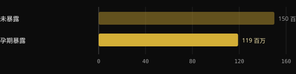

# 孕期吸烟与儿子的生育力：研究怎么说

孕期吸烟会影响出生体重，这一点几十年前就已为人所知。较少有人知道的是，多项研究还把它与儿子二十年后的精子生成联系在一起。本文为你提供对照原始研究核实过的数据：哪些证据可靠，哪些被夸大，以及现在做什么才有意义。

## 要点速览

- 孕期暴露于母亲吸烟的男孩，成年后的精子平均更少：在引用最多的那项欧洲研究中，精子总数约少四分之一。
- 同一项研究测得睾丸体积小约 1 ml。丹麦另一项规模更大的分析发现了同一方向的差异，只是略小一些。
- 风险似乎随香烟数量增加，但关于剂量的数据来自较小的样本，不确定范围较大。
- 这些都是观察性研究：它们显示的是一种强烈且反复出现的关联，而不是对个人的判决。许多暴露过的男性数值完全正常。
- 认为影响会延续“七代”的说法，在人体研究中没有依据。

## 研究发现了什么

最主要的研究由 Tina Kold Jensen 及同事完成，于 2004 年发表在 American Journal of Epidemiology。1996 至 1999 年间，研究人员在体检征兵时，从丹麦、挪威、芬兰、立陶宛和爱沙尼亚的 1,770 名年轻男性身上采集了精液样本。母亲与儿子一起填写了问卷，其中包括是否在孕期吸烟。

在校正了主要混杂因素（包括男孩自己的吸烟情况）之后，暴露组平均表现为：

| 指标 | 与未暴露者相比的差异 | 95% 置信区间 |
|---|---|---|
| 精子总数 | −24.5% | −9.5% 至 −39.5% |
| 精子浓度（百万/ml） | −20.1% | −6.8% 至 −33.5% |
| 活动精子 | −1.85 个百分点 | −0.46 至 −3.23 |
| 睾丸体积 | −1.15 ml | −0.66 至 −1.64 ml |

*来源：Jensen TK et al., Am J Epidemiol 2004（n = 1.770）。调整后的数值，取自摘要。*

这种关联在各个中心内都出现了，只有一个有意思的例外：在立陶宛，只有 1% 的母亲在孕期吸烟，人数太少，看不出影响。

## 丹麦的验证

2011 年，来自哥本哈根同一团队的 Ravnborg 及同事分析了 3,486 名丹麦男性，年龄中位数为 19 岁，采集时间为 1996 至 2006 年。在这里，吸烟母亲的儿子同样精子更少，睾丸也略小。

*来源：Ravnborg TL et al., Hum Reprod 2011（n = 3.486，数值取自摘要）。图表由 Nurvan 制作。*

暴露组的精子总数为 1.19 亿，未暴露组为 1.5 亿，约少 21%。睾丸体积分别为 14.0 ml 和 14.5 ml。暴露组还表现出与精子生成相关的激素略低、青春期略早，以及体重指数略高。

作者补充了一条重要的提醒：这些差异对个人而言可能没有临床意义，但在人群层面却很重要。如果许多男性的平均值整体下移，那么落到更难受孕的阈值以下的人的比例就会增加。

关于方法的一个细节：2011 年的研究出自与 2004 年相同的丹麦项目，采集时间也有重叠。因此，它是在更大样本上的确认，而不是完全独立的重复研究。

## 香烟越多，风险越高吗？

丹麦的第三项研究由 Jensen MS 及同事完成（2005），试图寻找与剂量的关系。在 522 名已知母亲习惯的男性中，少精子症（每 ml 少于 2000 万个精子）的风险如下：

*来源：Jensen MS et al., Hum Reprod 2005（n = 522）。比值比及 95% 置信区间。图表由 Nurvan 制作。*

每天超过 10 支香烟时，估计风险是非吸烟母亲之子的 2.6 倍。方向是明确的，但局限也必须说明。区间很宽，从 1.2 到 5.8。每天 1 至 10 支的组没有达到统计学显著性。平均浓度的差异同样不显著。

另一个丹麦队列追踪了 347 名在孕期接受访谈的女性的儿子，发现与精子总数呈反向关系。每天超过 19 支香烟时，精子总数低 38%，精液量低 19%。不过，只有总体关联和精液量超过了显著性阈值。

## 为什么影响可能持续

睾丸在胎儿期形成。在这一阶段，支持细胞会增殖，它们在成年后支撑精子的生成，同时生殖细胞的前体也在增殖。2012 年的一篇综述得出结论：暴露者的睾丸较小、精液质量较差，提示对这些细胞存在毒性作用。

小鼠实验也指向同一方向。让母鼠在孕期和哺乳期暴露于烟雾后，雄性后代成年后的精子干细胞更少，DNA 损伤更多，生育力下降。这是动物模型，有助于理解机制，但不能原封不动地套用到人身上。

需要说明的一点是，没有任何人体研究验证过这些差异能否恢复、恢复多少。我们只能说，这种损害合理地与发育早期的一个窗口期有关，而不是说它在任何情况下都已被证明不可逆。

## 是三代，不是七代

有一个常被提起的生物学观察是正确的。孕期中，胎儿的生殖细胞已经形成。因此，在一次怀孕中，涉及母亲、胎儿，以及在某种意义上胎儿未来的孩子。

但由此推到烟草会影响“七代”，则是巨大的跳跃。上述研究只测量了一代，即儿子。没有任何人体数据显示对孙辈有影响，更不用说更远的后代。

## 研究到底怎么说

本文的灵感来自 Marco Guercioni（@the___doc）的一篇帖子。以下是他的主要说法，并与摘要进行对照。

- **已证实** — “吸烟母亲的儿子精子大约少四分之一。” 这指的是 2004 年欧洲研究中的精子总数（−24.5%）。
- **已证实** — “5 个国家的 1,770 名男孩，浓度 −20.1%，睾丸小 1.15 ml。” 数字与摘要一致。
- **需要补充说明** — “2011 年在 3,486 名丹麦人中得到重复。” 差异方向相同，但略小（精子总数 −21%，睾丸体积 −0.5 ml），而且两个样本都来自同一个丹麦项目。
- **需要补充说明** — “每天超过 10 支香烟，少精子症风险翻倍。” 估计值其实是 2.6，但来自 522 名男性，区间为 1.2 至 5.8，而且中间组并不显著。
- **需要补充说明** — “因为细胞在胎儿期就已确立，所以无法恢复。” 这一机制是合理的，并得到动物模型的支持，但不可逆性在人体中没有被测量过。
- **已证实** — “怀孕涉及三代人。” 这是胚胎学上的事实：胎儿的生殖细胞在孕期形成。
- **已被否定** — “七代。” 在人体中，除了第一代儿子之外，没有任何证据。

这篇帖子还提到有一个数字经常被说错。我们不清楚指的是哪一个。最常见的错误是把精子总数（−24.5%）与浓度（−20.1%）混为一谈：它们是两个不同的指标，“四分之一”的下降只涉及前者。

## 可以做些什么

本文不是为了指责任何人。戒烟很难，尼古丁依赖是一种医学状况，而且这些研究中的许多母亲怀孕于上世纪七八十年代，当时的信息和现在不同。这些数据的作用，是帮助人们做出今天的选择。

1. **如果你正在备孕或已经怀孕，** 请与全科医生或妇科医生谈谈。在怀孕前或怀孕初期戒烟是最好的选择，但与什么都不做相比，减少吸烟仍然有意义。
2. **寻求帮助，不要独自硬撑。** 在意大利，有公立戒烟中心，还有国家卫生研究院（Istituto Superiore di Sanità）的禁烟免费热线（800 554088）。医生和药剂师可以告诉你适合孕期的选择。
3. **让伴侣一起参与。** 家中的二手烟有影响，父亲吸烟也会影响他自己的精液质量。
4. **如果你是在孕期暴露过的男性，** 没有理由惊慌。如果你们备孕 12 个月仍未成功，男科医生可以开具精液分析，这是了解你真实数值的唯一办法。

<h3>把你的检查结果放在同一个地方</h3>

在 Nurvan 的“检查”板块中，你可以保存带有日期的报告和数值，包括精液分析，并附上原始文件。这样，当你与医生讨论时就能找到结果，也能随时间推移回顾它们。这些是健康数据：它们保存在你的账户中，只有在你决定时才会与教练分享。

<a href="https://nurvan.app">试用 Nurvan</a>

## 常见问题

### 我母亲孕期吸烟，我一定生育力较低吗？

不是。这些数据描述的是数千名男性的平均情况。许多暴露过的男性数值正常，也能顺利成为父亲。如果你有疑虑，或者已经尝试了很久，精液分析才是真正能回答问题的检查。

### 是母亲的吸烟更重要，还是儿子成年后的吸烟更重要？

在文中引用的研究里，即使把男孩自己的吸烟因素考虑在内，孕期吸烟的影响依然存在。成年后吸烟本身对精液质量也有影响，所以无论如何戒烟都有好处。

### 孕期使用电子烟是安全的替代方案吗？

这里讨论的研究针对的是传统香烟。关于孕期使用电子烟对子女生育力的影响，数据仍然很少：这是需要与妇科医生讨论的话题。

### 这种影响只涉及儿子吗？

本文谈的是精液质量，因此针对的是儿子。孕期吸烟对孩子健康的其他方面，同样有充分记录的影响，与性别无关。

## 参考文献

1. Jensen TK et al., 2004. Association of in utero exposure to maternal smoking with reduced semen quality and testis size in adulthood: a cross-sectional study of 1,770 young men from the general population in five European countries. *Am J Epidemiol* 159(1):49–58. [PMID 14693659](https://pubmed.ncbi.nlm.nih.gov/14693659/) · [DOI 10.1093/aje/kwh002](https://doi.org/10.1093/aje/kwh002)
2. Ravnborg TL et al., 2011. Prenatal and adult exposures to smoking are associated with adverse effects on reproductive hormones, semen quality, final height and body mass index. *Hum Reprod* 26(5):1000–11. [PMID 21335416](https://pubmed.ncbi.nlm.nih.gov/21335416/) · [DOI 10.1093/humrep/der011](https://doi.org/10.1093/humrep/der011)
3. Jensen MS et al., 2005. Lower sperm counts following prenatal tobacco exposure. *Hum Reprod* 20(9):2559–66. [PMID 15919771](https://pubmed.ncbi.nlm.nih.gov/15919771/) · [DOI 10.1093/humrep/dei110](https://doi.org/10.1093/humrep/dei110)
4. Ramlau-Hansen CH et al., 2007. Is prenatal exposure to tobacco smoking a cause of poor semen quality? A follow-up study. *Am J Epidemiol* 165(12):1372–9. [PMID 17369608](https://pubmed.ncbi.nlm.nih.gov/17369608/) · [DOI 10.1093/aje/kwm032](https://doi.org/10.1093/aje/kwm032)
5. Virtanen HE, Sadov S, Toppari J, 2012. Prenatal exposure to smoking and male reproductive health. *Curr Opin Endocrinol Diabetes Obes* 19(3):228–32. [PMID 22499223](https://pubmed.ncbi.nlm.nih.gov/22499223/) · [DOI 10.1097/MED.0b013e3283537cb8](https://doi.org/10.1097/MED.0b013e3283537cb8)
6. Sobinoff AP et al., 2014. Damaging legacy: maternal cigarette smoking has long-term consequences for male offspring fertility. *Hum Reprod* 29(12):2719–35. [PMID 25269568](https://pubmed.ncbi.nlm.nih.gov/25269568/) · [DOI 10.1093/humrep/deu235](https://doi.org/10.1093/humrep/deu235)（小鼠研究）

本文灵感来自 [Marco Guercioni (@the___doc)](https://www.instagram.com/p/Dd6psLVCKfq/) 的一篇帖子。参考文献通过 PubMed 查阅。

> 注：本文仅供参考，不能替代医生或合格专业人士的意见。
