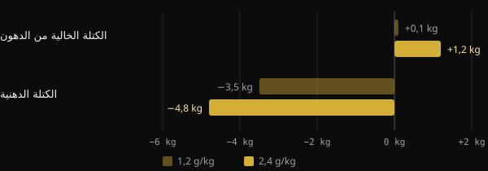
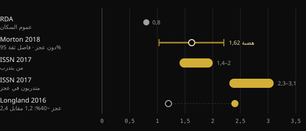

# البروتين أثناء التجفيف: كم تحتاج منه فعلًا؟

عندما تخفض السعرات، يكون الخوف الأكبر من خسارة العضلات التي بنيتها بجهد. والبروتين هو أكثر وسيلة غذائية دُرست لتفادي ذلك، لكن الأرقام المتداولة تتراوح من 1,6 إلى أكثر من 4 غرامات لكل كيلوغرام. ستجد هنا ما تقوله الدراسات التحليلية، ولماذا تتباين الأرقام إلى هذا الحد، وكيف تختار رقمك.

## باختصار

- في عجز السعرات، تناول مزيد من البروتين يساعد على حماية الكتلة الخالية من الدهون: وعلى هذا تتفق الدراسات.
- في غياب العجز، يتسطح الفائدة المتوسطة بعد نحو 1,6 غ لكل كغ من وزن الجسم يوميًا. ويمتد عدم اليقين حتى نحو 2,2 غ/كغ.
- أثناء التجفيف ترتفع الإرشادات: 2,3–3,1 غ لكل كغ من الكتلة الخالية من الدهون بحسب مراجعة Helms وزملائه.
- القيم المرتفعة جدًا، فوق 3 غ/كغ من الوزن، ليست حدًا أدنى يجب الالتزام به. إنها الجزء الأعلى من البيانات المرصودة، بنتائج يصفها المؤلفون أنفسهم بأنها استكشافية.
- ونقطة البداية مهمة أيضًا: من يتناول بروتينًا كثيرًا أصلًا قد يكسب أقل من زيادات إضافية.

## لماذا يتغير الحديث أثناء التجفيف

تتجدد العضلة باستمرار: كل يوم تبني جزءًا صغيرًا منها وتهدم جزءًا. وحين تأكل أقل مما تستهلك، يستخدم الجسم بروتينات العضلة أيضًا كاحتياطي. وكلما كان العجز أعمق وكنتَ أنحف، ازداد هذا الدفع.

تُظهر ذلك جيدًا دراسة تحليلية من جامعة Purdue على 18 دراسة مضبوطة. فتناول بروتين أكثر من الكمية الغذائية الموصى بها (RDA، أي الجرعة الموصى بها لعموم السكان، 0,8 غ/كغ) قلّل خسارة الكتلة الخالية من الدهون أثناء الحمية بنحو 0,36 كغ. أما لدى أشخاص لا يتبعون حمية ولا يتدربون فلم يكن هناك فرق. فالبروتين الإضافي يفيد خصوصًا حين يكون الجسم تحت الضغط: عجز السعرات أو التدريب أو كلاهما.

ودراسة Longland وزملائه في جامعة McMaster هي المثال الأوضح. فقد اتبع أربعون شابًا لمدة أربعة أسابيع عجزًا بنحو 40%، وتدربوا ستة أيام من سبعة بالأثقال وفترات عالية الشدة. تناول نصفهم 1,2 غ/كغ من البروتين، والنصف الآخر 2,4 غ/كغ.

*المصدر: Longland et al., Am J Clin Nutr 2016 (n = 40، تركيب الجسم بنموذج رباعي المقصورات). رسم Nurvan.*

كسبت المجموعة ذات البروتين الأعلى في المتوسط 1,2 كغ من الكتلة الخالية من الدهون، مقابل 0,1 كغ للمجموعة الأخرى، وخسرت دهونًا أكثر. وهذه نتيجة في فترة قصيرة وببروتوكول قاسٍ جدًا، لكنها تشير إلى الاتجاه.

## كم تحتاج حين لا تكون في عجز

لفهم أرقام التجفيف نحتاج إلى نقطة مرجعية. والدراسة التحليلية الأكثر استشهادًا هي دراسة Morton وزملائه (2018): 49 دراسة و1.863 شخصًا يتدربون بالأثقال، جميعهم بسعرات طبيعية أو بفائض. وقد أضاف تناول مكملات البروتين في المتوسط 0,30 كغ من الكتلة الخالية من الدهون.

والمعطى الأكثر استخدامًا هو نقطة الهضبة: فوق نحو 1,62 غ/كغ يوميًا، لم تزد الكتلة الخالية من الدهون أكثر. أما فاصل الثقة، أي النطاق الذي تقع فيه القيمة الحقيقية على الأرجح، فامتد من 1,03 إلى 2,20 غ/كغ. ولهذا يقترح المؤلفون، احتياطًا، نحو 2,2 غ/كغ لمن يريد تعظيم النمو.

ووجدت دراسة تحليلية ثانية يابانية، على 105 دراسات و5.402 شخصًا، نمطًا مشابهًا. فكل زيادة في البروتين تعود بفائدة، لكن فوق 1,3 غ/كغ يصبح المكسب عن كل درجة أصغر بنحو ثلاث مرات. إنه العائد المتناقص المعروف.

## كم تحتاج حين تكون في عجز

هنا ترتفع الأرقام. ففي عام 2014 حلل Helms وزملاؤه الدراسات على رياضيين نحيفين مدرَّبين في عجز سعرات. وتقديرهم: 2,3–3,1 غ لكل كغ من الكتلة الخالية من الدهون، نحو الأعلى كلما كان العجز أشد والشخص أنحف. ويعتمد موقف الجمعية الدولية للتغذية الرياضية (ISSN) الرسمي المجال نفسه.

*المصادر: Hudson et al. 2020 (RDA)؛ Morton et al. 2018؛ Jäger et al. 2017 (ISSN)؛ Longland et al. 2016. القيم بالغرام لكل كغ من وزن الجسم. تعبّر مراجعة Helms 2014 عن 2,3–3,1 غ لكل كغ من الكتلة الخالية من الدهون. رسم Nurvan.*

وفي عام 2025 حدّثت المجموعة نفسها التحليل بانحدار تلوي (meta-regression) على 29 دراسة، اختيرت من بين 916. ويجد النموذج احتمالًا يتجاوز 97% لعلاقة خطية: كلما زاد البروتين، تحسّن الحفاظ على الكتلة الخالية من الدهون. وكانت العلاقة أقوى حين حُسب البروتين على الكتلة الخالية من الدهون، وفي التدخلات التي تتجاوز أربعة أسابيع، وعند الرجال، وعند الأشخاص الأنحف.

وثمة تفصيلان يغيّران القراءة. الأول: العلاقة الخطية داخل البيانات المجموعة لا تقول أين تتوقف. فالقيم الأعلى تدل فقط على المدى الذي بلغته الدراسات. والثاني: كان هناك تباين كبير بين الدراسات، ويصف المؤلفون النتائج بأنها استكشافية لا حاسمة.

## نقطة البداية مهمة

يضيف تعليق نُشر عام 2026 في Sports Medicine عنصرًا كثيرًا ما يُهمل. فالانحدارات التلوية تنظر إلى الجرعة الموصوفة، لكن المشاركين ينطلقون من عادات مختلفة. وبحسب المؤلفين، يبدو أن من يتناول بروتينًا كثيرًا أصلًا قبل الدراسة يجني أقل من الزيادات الإضافية. ويعرضون ذلك كدليل استكشافي يحتاج إلى تأكيد. عمليًا: الانتقال من 1,2 إلى 2,2 غ/كغ يهم على الأرجح أكثر بكثير من الانتقال من 2,5 إلى 3,5.

## ماذا يقول البحث حقًا

منطلق هذا المقال منشور لـ Stronger By Science يلخّص تحليلهم الداخلي والانحدار التلوي لعام 2025. وهذه أبرز الادعاءات، مقارَنةً بالمصادر.

- **مؤكَّد** — "أثناء التجفيف تلزم كمية أكبر من البروتين." المراجعات والدراسات التحليلية والدراسات المضبوطة كلها تسير في الاتجاه نفسه.
- **مؤكَّد** — "كانت التوصيات السابقة بين 1,6 و2,2 غ/كغ." يطابق هضبة Morton 2018 وفاصل ثقتها، لكنها تخص من ليسوا في عجز.
- **مؤكَّد** — "الأثر صغير لكنه ملموس، مع عوائد متناقصة." يُظهره كل من Morton 2018 (+0,30 كغ في المتوسط) وTagawa 2020.
- **يحتاج إلى توضيح** — "للحفاظ الأقصى تلزم 3,2 غ/كغ من الوزن أو 4,2 غ/كغ من الكتلة الخالية من الدهون." يصف الملخص علاقة خطية بلا سقف. وهذه القيم هي الجزء الأعلى من البيانات المرصودة، لا عتبة مثبتة، والنتائج استكشافية.
- **يحتاج إلى توضيح** — "كل غ/كغ إضافي يمنح احتمالًا 97–99% للحفاظ على كتلة خالية من الدهون أكبر." هذه النسبة تقيس مدى احتمال أن يسير الأثر في الاتجاه الصحيح، لا مدى كِبَره.
- **غير قابل للتحقق** — المجالات الخاصة ببناء الكتلة وإعادة التركيب (نحو 2–2,35 غ/كغ) مصدرها تحليل داخلي منشور على موقع Stronger By Science، لا في مجلة مفهرسة في PubMed.

## كيف تطبّق ذلك

لنأخذ مثالًا لشخص وزنه 80 كغ ونسبة الدهون في جسمه 15%. كتلته الخالية من الدهون نحو 68 كغ.

| المرجع | الحساب | البروتين يوميًا |
|---|---|---|
| هضبة Morton 2018 (دون عجز) | 1,6 غ × 80 كغ | 128 غ |
| حد Morton 2018 الاحترازي | 2,2 غ × 80 كغ | 176 غ |
| Helms 2014 (في عجز) | 2,3–3,1 غ × 68 كغ | 156–211 غ |
| القيمة المرتفعة المذكورة في المنشور | 4,2 غ × 68 كغ | 286 غ |

1. **ابدأ من قاعدة متينة.** إن كنت تتناول اليوم بروتينًا قليلًا، فالتقدم نحو 1,6–2,2 غ/كغ هو الخطوة ذات العائد الأكبر.
2. **ارفع الكمية أثناء التجفيف، خصوصًا إن كنت نحيفًا أصلًا.** كلما كان العجز أشد وكنتَ أنحف، كان من المنطقي البقاء في الجزء الأعلى من مجال Helms.
3. **احسب على الكتلة الخالية من الدهون إن كانت دهونك كثيرة.** استخدام الوزن الكلي يضخّم الرقم بلا مبرر.
4. **وزّع الكمية.** تشير ISSN إلى وجبات بنحو 0,25 غ/كغ، أو 20–40 غ، كل 3–4 ساعات.
5. **لا تنسَ الأثقال.** في دراسة Morton التحليلية يفوق تأثير تدريب المقاومة بكثير تأثير مكملات البروتين. فالبروتين يدعمه ولا يحل محله.

إن كنت تعاني أمراض الكلى أو حالات طبية أخرى، فاستشر طبيبك قبل زيادة البروتين زيادة كبيرة.

<h3>حدّد هدفك من البروتين أثناء التجفيف</h3>

يحسب Nurvan هدف البروتين بحسب وزنك وهدفك، ويرفعه حين تكون في مرحلة التجفيف، ويمكنك تعديله يدويًا. ثم تتابعه وجبة بوجبة في اليوميات وتقارنه بالوزن والقياسات والأحمال، لترى إن كنت تحافظ فعلًا على العضلات.

<a href="https://nurvan.app">جرّب Nurvan</a>

## أسئلة شائعة

### هل أحسب البروتين على وزني الحالي أم على وزني المستهدف؟

إن كنت نحيفًا بما يكفي فالوزن الحالي مناسب. وإن كانت دهون جسمك كثيرة فمن الأنسب التفكير بالكتلة الخالية من الدهون، كما تفعل مراجعة Helms 2014. فالوزن الكلي يؤدي إلى أرقام مضخَّمة.

### كم بروتينًا في كل وجبة؟

يشير موقف ISSN إلى نحو 0,25 غ لكل كغ من الوزن، أو 20–40 غ، في الوجبة، موزعة كل 3–4 ساعات. ومع ذلك يبقى الأهم هو المجموع اليومي.

### هل مسحوق البروتين ضروري؟

ليس إلزاميًا. وبحسب ISSN هو وسيلة عملية لبلوغ الكمية دون إضافة سعرات كثيرة، ومفيد تحديدًا أثناء التجفيف. ويبقى الطعام الكامل هو الأساس.

### إن لم أعرف كتلتي الخالية من الدهون فماذا أفعل؟

يمكنك تقديرها من قياس نسبة الدهون. وبدلًا من ذلك، استخدم وزن الجسم مع الإرشادات المعبَّر عنها بالغ/كغ من الوزن، مثل 1,6–2,2 غ/كغ، وارفع الكمية تدريجيًا أثناء التجفيف.

## المصادر

1. Refalo MC, Trexler ET, Helms ER, 2025. Effect of Dietary Protein on Fat-Free Mass in Energy Restricted, Resistance-Trained Individuals: An Updated Systematic Review With Meta-Regression. *Strength Cond J* 48(4):398–412. [DOI 10.1519/SSC.0000000000000888](https://doi.org/10.1519/SSC.0000000000000888) (مجلة غير مفهرسة في PubMed)
2. Morton RW et al., 2018. A systematic review, meta-analysis and meta-regression of the effect of protein supplementation on resistance training-induced gains in muscle mass and strength in healthy adults. *Br J Sports Med* 52(6):376–384. [PMID 28698222](https://pubmed.ncbi.nlm.nih.gov/28698222/) · [DOI 10.1136/bjsports-2017-097608](https://doi.org/10.1136/bjsports-2017-097608)
3. Helms ER et al., 2014. A systematic review of dietary protein during caloric restriction in resistance trained lean athletes: a case for higher intakes. *Int J Sport Nutr Exerc Metab* 24(2):127–38. [PMID 24092765](https://pubmed.ncbi.nlm.nih.gov/24092765/) · [DOI 10.1123/ijsnem.2013-0054](https://doi.org/10.1123/ijsnem.2013-0054)
4. Jäger R et al., 2017. International Society of Sports Nutrition Position Stand: protein and exercise. *J Int Soc Sports Nutr* 14:20. [PMID 28642676](https://pubmed.ncbi.nlm.nih.gov/28642676/) · [DOI 10.1186/s12970-017-0177-8](https://doi.org/10.1186/s12970-017-0177-8)
5. Longland TM et al., 2016. Higher compared with lower dietary protein during an energy deficit combined with intense exercise promotes greater lean mass gain and fat mass loss: a randomized trial. *Am J Clin Nutr* 103(3):738–46. [PMID 26817506](https://pubmed.ncbi.nlm.nih.gov/26817506/) · [DOI 10.3945/ajcn.115.119339](https://doi.org/10.3945/ajcn.115.119339)
6. Hudson JL et al., 2020. Protein Intake Greater than the RDA Differentially Influences Whole-Body Lean Mass Responses to Purposeful Catabolic and Anabolic Stressors: A Systematic Review and Meta-analysis. *Adv Nutr* 11(3):548–558. [PMID 31794597](https://pubmed.ncbi.nlm.nih.gov/31794597/) · [DOI 10.1093/advances/nmz106](https://doi.org/10.1093/advances/nmz106)
7. Tagawa R et al., 2020. Dose-response relationship between protein intake and muscle mass increase: a systematic review and meta-analysis of randomized controlled trials. *Nutr Rev* 79(1):66–75. [PMID 33300582](https://pubmed.ncbi.nlm.nih.gov/33300582/) · [DOI 10.1093/nutrit/nuaa104](https://doi.org/10.1093/nutrit/nuaa104)
8. López-Moreno M, Quesada G, López-Gil JF, 2026. Starting Point Matters: Baseline Protein Intake as a Moderator of the Protein-Fat-Free Mass Relationship in Energy-Restricted Athletes. *Sports Med*. [PMID 42560437](https://pubmed.ncbi.nlm.nih.gov/42560437/) · [DOI 10.1007/s40279-026-02494-5](https://doi.org/10.1007/s40279-026-02494-5)

مقال مستوحى من منشور لـ [Stronger By Science (@strongerbyscience)](https://www.instagram.com/p/Dd6ncPLF7mI/). المصادر مُراجَعة عبر PubMed.

> ملاحظة: محتوى إعلامي، ولا يغني عن رأي الطبيب أو المختص المؤهل.
