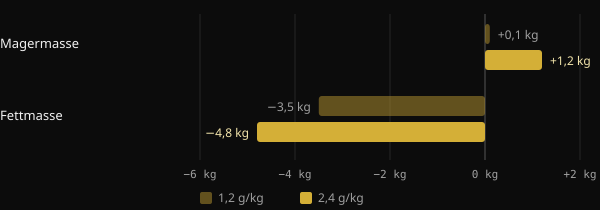
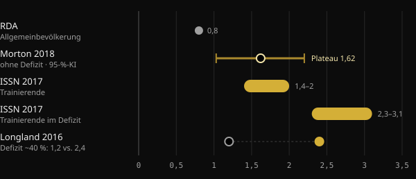

# Protein in der Diät: Wie viel brauchst du wirklich?

Wenn du die Kalorien reduzierst, ist die größte Sorge, die mühsam aufgebaute Muskulatur wieder zu verlieren. Protein ist der am besten untersuchte Ernährungshebel dagegen, doch die Zahlen, die kursieren, reichen von 1,6 bis über 4 Gramm pro Kilo. Hier erfährst du, was die Metaanalysen sagen, warum die Zahlen so stark auseinandergehen und wie du deine eigene findest.

## Kurz gefasst

- Im Kaloriendefizit hilft eine höhere Proteinzufuhr, die fettfreie Masse zu schützen: Darin sind sich die Studien einig.
- Ohne Defizit flacht der durchschnittliche Nutzen oberhalb von etwa 1,6 g pro kg Körpergewicht und Tag ab. Der Unsicherheitsbereich reicht bis etwa 2,2 g/kg.
- In der Diät liegen die Empfehlungen höher: 2,3–3,1 g pro kg fettfreier Masse laut der Übersichtsarbeit von Helms und Kollegen.
- Sehr hohe Werte von über 3 g/kg Körpergewicht sind kein Minimum, das du einhalten musst. Sie bilden das obere Ende der beobachteten Daten, mit Ergebnissen, die die Autoren selbst als explorativ bezeichnen.
- Es kommt auch darauf an, wo du startest: Wer bereits viel Protein isst, hat von einer weiteren Erhöhung möglicherweise weniger.

## Warum sich in der Diät die Lage ändert

Muskulatur erneuert sich ständig: Jeden Tag baust du einen kleinen Teil auf und einen kleinen Teil ab. Wenn du weniger isst, als du verbrauchst, greift der Körper auch auf Muskelprotein als Reserve zurück. Je größer das Defizit und je niedriger dein Körperfettanteil, desto stärker wird dieser Druck.

Eine Metaanalyse der Purdue University über 18 kontrollierte Studien zeigt das gut. Mehr Protein als die RDA (die empfohlene Zufuhr für die Allgemeinbevölkerung, 0,8 g/kg) verringerte den Verlust an fettfreier Masse während der Diät um etwa 0,36 kg. Bei Menschen, die weder Diät hielten noch trainierten, gab es dagegen keinen Unterschied. Das zusätzliche Protein nützt vor allem dann, wenn der Körper unter Stress steht: Kaloriendefizit, Training oder beides.

Die Studie von Longland und Kollegen an der McMaster University ist das deutlichste Beispiel. Vierzig junge Männer hielten vier Wochen lang ein Defizit von etwa 40 % ein und trainierten an sechs von sieben Tagen mit Gewichten und hochintensiven Intervallen. Die eine Hälfte aß 1,2 g/kg Protein, die andere 2,4 g/kg.

*Quelle: Longland et al., Am J Clin Nutr 2016 (n = 40, Körperzusammensetzung nach dem 4-Kompartiment-Modell). Grafik: Nurvan.*

Die Gruppe mit mehr Protein legte im Schnitt 1,2 kg fettfreie Masse zu, die andere 0,1 kg, und sie verlor mehr Fett. Das Ergebnis stammt aus einem kurzen Zeitraum und einem sehr harten Protokoll, zeigt aber die Richtung.

## Wie viel du brauchst, wenn du nicht im Defizit bist

Um die Zahlen für die Diät einzuordnen, braucht es einen Bezugspunkt. Die meistzitierte Metaanalyse ist die von Morton und Kollegen (2018): 49 Studien und 1.863 Personen, die Krafttraining machten, alle bei ausgeglichener Kalorienbilanz oder im Überschuss. Die Proteinsupplementierung brachte im Schnitt 0,30 kg zusätzliche fettfreie Masse.

Der am häufigsten genannte Wert ist der Plateaupunkt: Oberhalb von etwa 1,62 g/kg pro Tag nahm die fettfreie Masse nicht weiter zu. Das Konfidenzintervall, also der Bereich, in dem der wahre Wert wahrscheinlich liegt, reichte von 1,03 bis 2,20 g/kg. Deshalb empfehlen die Autoren vorsichtshalber etwa 2,2 g/kg für alle, die den Muskelaufbau maximieren wollen.

Eine zweite, japanische Metaanalyse mit 105 Studien und 5.402 Personen fand einen ähnlichen Verlauf. Jede Erhöhung der Proteinzufuhr bringt einen Nutzen, oberhalb von 1,3 g/kg ist der Zugewinn pro Stufe aber etwa dreimal kleiner. Das ist der klassische abnehmende Grenznutzen.

## Wie viel du brauchst, wenn du im Defizit bist

Hier steigen die Zahlen. 2014 haben Helms und Kollegen die Studien an schlanken, trainierten Athleten im Defizit ausgewertet. Ihre Schätzung: 2,3–3,1 g pro kg fettfreier Masse – umso weiter oben, je aggressiver das Defizit und je schlanker die Person. Das offizielle Positionspapier der International Society of Sports Nutrition (ISSN) übernimmt denselben Bereich.

*Quellen: Hudson et al. 2020 (RDA); Morton et al. 2018; Jäger et al. 2017 (ISSN); Longland et al. 2016. Werte in g pro kg Körpergewicht. Die Übersichtsarbeit von Helms 2014 gibt 2,3–3,1 g pro kg fettfreier Masse an. Grafik: Nurvan.*

2025 hat dieselbe Arbeitsgruppe die Analyse mit einer Metaregression über 29 Studien aktualisiert, ausgewählt aus 916. Das Modell ergibt eine Wahrscheinlichkeit von über 97 % für einen linearen Zusammenhang: mehr Protein, besserer Erhalt der fettfreien Masse. Der Zusammenhang war stärker, wenn das Protein auf die fettfreie Masse bezogen wurde, bei Interventionen von mehr als vier Wochen, bei Männern und bei schlankeren Personen.

Zwei Details verändern die Lesart. Erstens: Ein linearer Zusammenhang innerhalb der erhobenen Daten sagt nicht, wo er endet. Die höchsten Werte zeigen lediglich, wie weit die Studien reichten. Zweitens: Die Heterogenität zwischen den Studien war groß, und die Autoren bezeichnen die Ergebnisse als explorativ, nicht als abschließend.

## Der Ausgangspunkt zählt

Ein 2026 in Sports Medicine veröffentlichter Kommentar ergänzt einen oft übersehenen Aspekt. Metaregressionen betrachten die verordnete Dosis, die Teilnehmer starten aber mit unterschiedlichen Gewohnheiten. Den Autoren zufolge scheint, wer schon vor der Studie viel Protein isst, von weiteren Erhöhungen weniger zu profitieren. Sie stellen das als explorative Evidenz dar, die noch bestätigt werden muss. In der Praxis heißt das: Der Schritt von 1,2 auf 2,2 g/kg zählt vermutlich deutlich mehr als der von 2,5 auf 3,5.

## Was die Forschung wirklich sagt

Der Anstoß für diesen Artikel ist ein Post von Stronger By Science, der ihre interne Analyse und die Metaregression von 2025 zusammenfasst. Hier die wichtigsten Aussagen im Abgleich mit den Quellen.

- **Bestätigt** — „In der Diät braucht es mehr Protein.“ Übersichtsarbeiten, Metaanalysen und kontrollierte Studien weisen alle in dieselbe Richtung.
- **Bestätigt** — „Die bisherigen Empfehlungen lagen zwischen 1,6 und 2,2 g/kg.“ Das entspricht dem Plateau bei Morton 2018 und dessen Konfidenzintervall, das sich allerdings auf Personen ohne Defizit bezieht.
- **Bestätigt** — „Der Effekt ist klein, aber spürbar, mit abnehmendem Grenznutzen.“ Das zeigen sowohl Morton 2018 (im Schnitt +0,30 kg) als auch Tagawa 2020.
- **Zu präzisieren** — „Für maximalen Erhalt braucht es 3,2 g/kg Körpergewicht oder 4,2 g/kg fettfreie Masse.“ Der Abstract beschreibt einen linearen Zusammenhang ohne Obergrenze. Diese Werte sind das obere Ende der beobachteten Daten, keine nachgewiesene Schwelle, und die Ergebnisse sind explorativ.
- **Zu präzisieren** — „Jedes zusätzliche g/kg bringt eine Wahrscheinlichkeit von 97–99 %, mehr fettfreie Masse zu erhalten.“ Dieser Prozentwert gibt an, wie wahrscheinlich der Effekt in die richtige Richtung geht, nicht wie groß er ist.
- **Nicht überprüfbar** — Die Bereiche für Aufbau und Rekomposition (etwa 2–2,35 g/kg) stammen aus einer internen Analyse, die auf der Website von Stronger By Science veröffentlicht wurde, nicht in einer in PubMed indexierten Zeitschrift.

## So setzt du es um

Nehmen wir als Beispiel eine Person mit 80 kg und 15 % Körperfett. Ihre fettfreie Masse liegt bei etwa 68 kg.

| Bezugswert | Rechnung | Protein pro Tag |
|---|---|---|
| Plateau Morton 2018 (ohne Defizit) | 1,6 g × 80 kg | 128 g |
| Vorsichtige Obergrenze Morton 2018 | 2,2 g × 80 kg | 176 g |
| Helms 2014 (im Defizit) | 2,3–3,1 g × 68 kg | 156–211 g |
| Im Post genannter hoher Wert | 4,2 g × 68 kg | 286 g |

1. **Starte mit einer soliden Basis.** Wenn du heute wenig Protein isst, ist der Schritt in Richtung 1,6–2,2 g/kg derjenige mit dem größten Ertrag.
2. **Geh in der Diät höher, vor allem wenn du schon schlank bist.** Je aggressiver das Defizit und je definierter du bist, desto sinnvoller ist das obere Ende des Bereichs von Helms.
3. **Rechne mit der fettfreien Masse, wenn du viel Körperfett hast.** Das Gesamtgewicht bläht die Zahl ohne Grund auf.
4. **Verteil die Menge.** Die ISSN nennt Mahlzeiten mit etwa 0,25 g/kg oder 20–40 g alle 3–4 Stunden.
5. **Vergiss die Gewichte nicht.** In der Metaanalyse von Morton fällt das Krafttraining deutlich stärker ins Gewicht als die Proteinsupplementierung. Protein unterstützt es, ersetzt es aber nicht.

Wenn du eine Nierenerkrankung oder andere Vorerkrankungen hast, sprich mit deiner Ärztin oder deinem Arzt, bevor du die Proteinzufuhr stark erhöhst.

<h3>Leg dein Proteinziel für die Diät fest</h3>

Nurvan berechnet dein Proteinziel anhand von Gewicht und Ziel, hebt es an, wenn du in der Definitionsphase bist, und du kannst es von Hand anpassen. Danach verfolgst du es Mahlzeit für Mahlzeit im Tagebuch und vergleichst es mit Gewicht, Maßen und Trainingsgewichten – so siehst du, ob du deine Muskulatur wirklich erhältst.

<a href="https://nurvan.app">Nurvan ausprobieren</a>

## Häufige Fragen

### Soll ich das Protein auf mein aktuelles Gewicht oder auf mein Zielgewicht berechnen?

Wenn du ziemlich schlank bist, passt das aktuelle Gewicht. Wenn du viel Körperfett hast, ist es sinnvoller, mit der fettfreien Masse zu rechnen, wie es die Übersichtsarbeit von Helms 2014 tut. Das Gesamtgewicht würde zu aufgeblähten Zahlen führen.

### Wie viel Protein pro Mahlzeit?

Das ISSN-Positionspapier nennt etwa 0,25 g pro kg Körpergewicht oder 20–40 g pro Mahlzeit, verteilt alle 3–4 Stunden. Entscheidend ist trotzdem vor allem die Gesamtmenge am Tag.

### Brauche ich Proteinpulver?

Es ist kein Muss. Laut ISSN ist es eine praktische Möglichkeit, die Menge zu erreichen, ohne zu viele Kalorien hinzuzufügen – gerade in der Diät nützlich. Die Grundlage bleiben vollwertige Lebensmittel.

### Was mache ich, wenn ich meine fettfreie Masse nicht kenne?

Du kannst sie aus einer Messung des Körperfettanteils schätzen. Alternativ nimmst du das Körpergewicht zusammen mit den Empfehlungen in g/kg Körpergewicht, etwa 1,6–2,2 g/kg, und gehst während der Diät schrittweise höher.

## Quellen

1. Refalo MC, Trexler ET, Helms ER, 2025. Effect of Dietary Protein on Fat-Free Mass in Energy Restricted, Resistance-Trained Individuals: An Updated Systematic Review With Meta-Regression. *Strength Cond J* 48(4):398–412. [DOI 10.1519/SSC.0000000000000888](https://doi.org/10.1519/SSC.0000000000000888) (Zeitschrift nicht in PubMed indexiert)
2. Morton RW et al., 2018. A systematic review, meta-analysis and meta-regression of the effect of protein supplementation on resistance training-induced gains in muscle mass and strength in healthy adults. *Br J Sports Med* 52(6):376–384. [PMID 28698222](https://pubmed.ncbi.nlm.nih.gov/28698222/) · [DOI 10.1136/bjsports-2017-097608](https://doi.org/10.1136/bjsports-2017-097608)
3. Helms ER et al., 2014. A systematic review of dietary protein during caloric restriction in resistance trained lean athletes: a case for higher intakes. *Int J Sport Nutr Exerc Metab* 24(2):127–38. [PMID 24092765](https://pubmed.ncbi.nlm.nih.gov/24092765/) · [DOI 10.1123/ijsnem.2013-0054](https://doi.org/10.1123/ijsnem.2013-0054)
4. Jäger R et al., 2017. International Society of Sports Nutrition Position Stand: protein and exercise. *J Int Soc Sports Nutr* 14:20. [PMID 28642676](https://pubmed.ncbi.nlm.nih.gov/28642676/) · [DOI 10.1186/s12970-017-0177-8](https://doi.org/10.1186/s12970-017-0177-8)
5. Longland TM et al., 2016. Higher compared with lower dietary protein during an energy deficit combined with intense exercise promotes greater lean mass gain and fat mass loss: a randomized trial. *Am J Clin Nutr* 103(3):738–46. [PMID 26817506](https://pubmed.ncbi.nlm.nih.gov/26817506/) · [DOI 10.3945/ajcn.115.119339](https://doi.org/10.3945/ajcn.115.119339)
6. Hudson JL et al., 2020. Protein Intake Greater than the RDA Differentially Influences Whole-Body Lean Mass Responses to Purposeful Catabolic and Anabolic Stressors: A Systematic Review and Meta-analysis. *Adv Nutr* 11(3):548–558. [PMID 31794597](https://pubmed.ncbi.nlm.nih.gov/31794597/) · [DOI 10.1093/advances/nmz106](https://doi.org/10.1093/advances/nmz106)
7. Tagawa R et al., 2020. Dose-response relationship between protein intake and muscle mass increase: a systematic review and meta-analysis of randomized controlled trials. *Nutr Rev* 79(1):66–75. [PMID 33300582](https://pubmed.ncbi.nlm.nih.gov/33300582/) · [DOI 10.1093/nutrit/nuaa104](https://doi.org/10.1093/nutrit/nuaa104)
8. López-Moreno M, Quesada G, López-Gil JF, 2026. Starting Point Matters: Baseline Protein Intake as a Moderator of the Protein-Fat-Free Mass Relationship in Energy-Restricted Athletes. *Sports Med*. [PMID 42560437](https://pubmed.ncbi.nlm.nih.gov/42560437/) · [DOI 10.1007/s40279-026-02494-5](https://doi.org/10.1007/s40279-026-02494-5)

Dieser Artikel ist von einem Post von [Stronger By Science (@strongerbyscience)](https://www.instagram.com/p/Dd6ncPLF7mI/) inspiriert. Quellen über PubMed recherchiert.

> Hinweis: Dieser Inhalt dient der Information und ersetzt nicht den Rat einer Ärztin, eines Arztes oder einer qualifizierten Fachperson.
