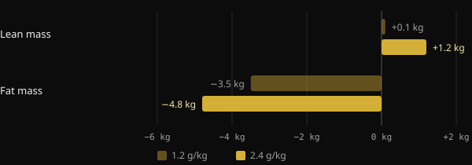
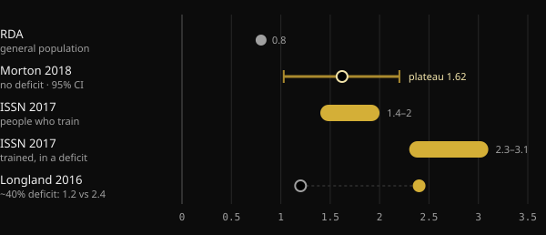

# Protein intake when cutting: how much do you actually need?

When you cut calories, the big fear is losing the muscle you worked hard for. Protein is the most studied nutrition lever for preventing that, yet the numbers you see online range from 1.6 to more than 4 grams per kilo. Here is what the meta-analyses say, why the numbers vary so much, and how to pick yours.

## Key takeaways

- In a calorie deficit, eating more protein helps protect lean mass. The research agrees on that.
- Without a deficit, the average benefit levels off above roughly 1.6 g per kg of body weight per day (about 0.7 g/lb), with uncertainty reaching about 2.2 g/kg (1 g/lb).
- When cutting, recommendations go up: 2.3–3.1 g per kg of fat-free mass, according to the review by Helms and colleagues.
- Very high figures, above 3 g/kg of body weight, are not a minimum to hit. They sit at the top of the observed data, and the authors call their results exploratory.
- Your starting point matters: if you already eat a lot of protein, adding more may do less.

## Why cutting changes the picture

Muscle is constantly being rebuilt: every day you build some and break some down. When you eat less than you burn, your body also taps muscle protein as a reserve. The deeper the deficit and the leaner you are, the stronger that pull.

A Purdue University meta-analysis of 18 controlled trials shows this clearly. Eating more protein than the RDA (the general-population recommendation of 0.8 g/kg) reduced lean mass loss during dieting by about 0.36 kg. In people who were neither dieting nor training, it made no difference. Extra protein matters most when the body is under stress: a calorie deficit, training, or both.

The trial by Longland and colleagues at McMaster University is the starkest example. Forty young men spent four weeks in a deficit of about 40%, training six days a week with weights and high-intensity intervals. Half ate 1.2 g/kg of protein, half ate 2.4 g/kg.

*Source: Longland et al., Am J Clin Nutr 2016 (n = 40, 4-compartment body composition model). Chart by Nurvan.*

The higher-protein group gained 1.2 kg of lean mass on average, compared with 0.1 kg in the other group, and lost more fat. It is a short study with a very demanding protocol, but it shows the direction.

## How much you need when you are not in a deficit

To make sense of cutting numbers, you need a reference point. The most cited meta-analysis is Morton et al. (2018): 49 studies and 1,863 people doing resistance training, all eating at maintenance or in a surplus. Adding protein increased lean mass gains by 0.30 kg on average.

The figure most people quote is the plateau: above about 1.62 g/kg per day, lean mass did not increase further. The confidence interval, the range where the true value probably lies, ran from 1.03 to 2.20 g/kg. That is why the authors suggest about 2.2 g/kg, to be safe, for anyone trying to maximize muscle growth.

A second meta-analysis from Japan, covering 105 studies and 5,402 people, found a similar pattern. More protein keeps helping, but above 1.3 g/kg each step brings roughly a third of the benefit. Classic diminishing returns.

## How much you need when you are cutting

Here the numbers go up. In 2014, Helms and colleagues reviewed studies of lean, trained athletes in a deficit. Their estimate: 2.3–3.1 g per kg of fat-free mass (about 1.0–1.4 g per lb), scaled up the more aggressive the deficit and the leaner the person. The International Society of Sports Nutrition (ISSN) position stand uses the same range.

*Sources: Hudson et al. 2020 (RDA); Morton et al. 2018; Jäger et al. 2017 (ISSN); Longland et al. 2016. Values in g per kg of body weight. Helms 2014 expresses 2.3–3.1 g per kg of fat-free mass. Chart by Nurvan.*

In 2025 Helms and colleagues updated the analysis with a meta-regression of 29 studies, selected from 916. The model found a greater than 97% probability of a linear relationship: more protein, better lean mass retention. The relationship was stronger when protein was expressed per kg of fat-free mass, in interventions longer than four weeks, in men, and in leaner people.

Two details change how you should read this. First, a linear relationship within the collected data does not tell you where it stops. The highest values only show how far the studies went. Second, there was a lot of heterogeneity between studies, and the authors describe the findings as exploratory rather than confirmatory.

## Your starting point matters

A 2026 commentary in Sports Medicine adds something that is often overlooked. Meta-regressions look at the prescribed dose, but participants start from different habits. According to the authors, people who already eat a lot of protein before a study seem to gain less from further increases. They present this as exploratory evidence that still needs confirming. In practice, going from 1.2 to 2.2 g/kg probably matters far more than going from 2.5 to 3.5.

## What the research actually says

This article was prompted by a Stronger By Science post summarizing their in-house analysis and the 2025 meta-regression. Here are its main claims, checked against the sources.

- **Confirmed** — "You need more protein when cutting." Reviews, meta-analyses and controlled trials all point the same way.
- **Confirmed** — "Previous recommendations sat between 1.6 and 2.2 g/kg." That matches the Morton 2018 plateau and its confidence interval, which applies to people who are not in a deficit.
- **Confirmed** — "The effect is small but meaningful, with diminishing returns." Both Morton 2018 (+0.30 kg on average) and Tagawa 2020 show this.
- **Needs context** — "Maximal retention takes 3.2 g/kg of body weight or 4.2 g/kg of fat-free mass." The abstract describes a linear relationship with no ceiling. These values are the top of the observed data, not a proven threshold, and the findings are exploratory.
- **Needs context** — "Each extra g/kg gives a 97–99% probability of better retention." That percentage measures how likely the effect points the right way, not how big it is.
- **Not verifiable** — The ranges for bulking and recomposition (about 2–2.35 g/kg) come from an in-house analysis published on the Stronger By Science website, not in a PubMed-indexed journal.

## How to apply it

Take someone who weighs 80 kg (176 lb) at 15% body fat. Their fat-free mass is about 68 kg (150 lb).

| Reference | Calculation | Protein per day |
|---|---|---|
| Morton 2018 plateau (no deficit) | 1.6 g × 80 kg | 128 g |
| Morton 2018 upper bound | 2.2 g × 80 kg | 176 g |
| Helms 2014 (in a deficit) | 2.3–3.1 g × 68 kg | 156–211 g |
| High value quoted in the post | 4.2 g × 68 kg | 286 g |

1. **Start from a solid base.** If you currently eat little protein, getting to 1.6–2.2 g/kg is the step with the biggest payoff.
2. **Go higher when cutting, especially if you are already lean.** The more aggressive the deficit and the leaner you are, the more sense it makes to aim for the top of the Helms range.
3. **Use fat-free mass if you carry a lot of fat.** Total body weight inflates the number for no reason.
4. **Spread it out.** The ISSN suggests meals of about 0.25 g/kg, or 20–40 g, every 3–4 hours.
5. **Keep lifting.** In the Morton meta-analysis, resistance training mattered far more than protein supplementation.

If you have kidney disease or another medical condition, talk to your doctor before raising your protein intake substantially.

<h3>Set your protein target for your cut</h3>

Nurvan calculates your protein target from your body weight and goal, raising it when you are cutting, and you can adjust it by hand. Then you track it meal by meal in the food diary and compare it with your weight, measurements and lifts, so you can see whether you are really keeping your muscle.

<a href="https://nurvan.app">Try Nurvan</a>

## FAQ

### Should I base protein on my current weight or my goal weight?

If you are fairly lean, current weight is fine. If you carry a lot of body fat, it makes more sense to work from fat-free mass, as the Helms 2014 review does. Total body weight would give inflated numbers.

### How much protein per meal?

The ISSN position stand suggests about 0.25 g per kg of body weight, or 20–40 g, per meal, spread every 3–4 hours. The daily total still matters most.

### Do I need protein powder?

No. According to the ISSN it is a practical way to hit your target without adding many calories, which helps when cutting. Whole food remains the foundation.

### What if I don't know my fat-free mass?

You can estimate it from a body fat percentage measurement. Otherwise, use body weight with recommendations expressed per kg of body weight, such as 1.6–2.2 g/kg, and increase gradually as your cut goes on.

## Sources

1. Refalo MC, Trexler ET, Helms ER, 2025. Effect of Dietary Protein on Fat-Free Mass in Energy Restricted, Resistance-Trained Individuals: An Updated Systematic Review With Meta-Regression. *Strength Cond J* 48(4):398–412. [DOI 10.1519/SSC.0000000000000888](https://doi.org/10.1519/SSC.0000000000000888) (journal not indexed in PubMed)
2. Morton RW et al., 2018. A systematic review, meta-analysis and meta-regression of the effect of protein supplementation on resistance training-induced gains in muscle mass and strength in healthy adults. *Br J Sports Med* 52(6):376–384. [PMID 28698222](https://pubmed.ncbi.nlm.nih.gov/28698222/) · [DOI 10.1136/bjsports-2017-097608](https://doi.org/10.1136/bjsports-2017-097608)
3. Helms ER et al., 2014. A systematic review of dietary protein during caloric restriction in resistance trained lean athletes: a case for higher intakes. *Int J Sport Nutr Exerc Metab* 24(2):127–38. [PMID 24092765](https://pubmed.ncbi.nlm.nih.gov/24092765/) · [DOI 10.1123/ijsnem.2013-0054](https://doi.org/10.1123/ijsnem.2013-0054)
4. Jäger R et al., 2017. International Society of Sports Nutrition Position Stand: protein and exercise. *J Int Soc Sports Nutr* 14:20. [PMID 28642676](https://pubmed.ncbi.nlm.nih.gov/28642676/) · [DOI 10.1186/s12970-017-0177-8](https://doi.org/10.1186/s12970-017-0177-8)
5. Longland TM et al., 2016. Higher compared with lower dietary protein during an energy deficit combined with intense exercise promotes greater lean mass gain and fat mass loss: a randomized trial. *Am J Clin Nutr* 103(3):738–46. [PMID 26817506](https://pubmed.ncbi.nlm.nih.gov/26817506/) · [DOI 10.3945/ajcn.115.119339](https://doi.org/10.3945/ajcn.115.119339)
6. Hudson JL et al., 2020. Protein Intake Greater than the RDA Differentially Influences Whole-Body Lean Mass Responses to Purposeful Catabolic and Anabolic Stressors: A Systematic Review and Meta-analysis. *Adv Nutr* 11(3):548–558. [PMID 31794597](https://pubmed.ncbi.nlm.nih.gov/31794597/) · [DOI 10.1093/advances/nmz106](https://doi.org/10.1093/advances/nmz106)
7. Tagawa R et al., 2020. Dose-response relationship between protein intake and muscle mass increase: a systematic review and meta-analysis of randomized controlled trials. *Nutr Rev* 79(1):66–75. [PMID 33300582](https://pubmed.ncbi.nlm.nih.gov/33300582/) · [DOI 10.1093/nutrit/nuaa104](https://doi.org/10.1093/nutrit/nuaa104)
8. López-Moreno M, Quesada G, López-Gil JF, 2026. Starting Point Matters: Baseline Protein Intake as a Moderator of the Protein-Fat-Free Mass Relationship in Energy-Restricted Athletes. *Sports Med*. [PMID 42560437](https://pubmed.ncbi.nlm.nih.gov/42560437/) · [DOI 10.1007/s40279-026-02494-5](https://doi.org/10.1007/s40279-026-02494-5)

Inspired by a post from [Stronger By Science (@strongerbyscience)](https://www.instagram.com/p/Dd6ncPLF7mI/). Sources reviewed via PubMed.

> Note: this content is for information only and does not replace advice from a doctor or qualified professional.
