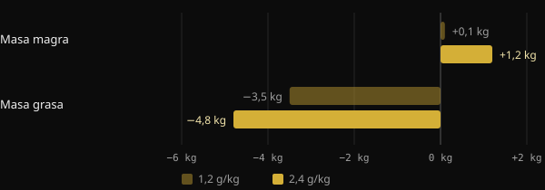
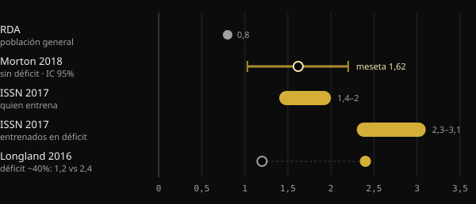

# Proteínas en definición: ¿cuántas necesitas de verdad?

Cuando recortas calorías, el mayor temor es perder el músculo que tanto te ha costado ganar. Las proteínas son la herramienta nutricional más estudiada para evitarlo, pero las cifras que circulan van de 1,6 a más de 4 gramos por kilo. Aquí verás qué dicen los metaanálisis, por qué los números cambian tanto y cómo elegir el tuyo.

## En resumen

- En déficit calórico, comer más proteínas ayuda a proteger la masa magra: en esto los estudios coinciden.
- Sin déficit, por encima de unos 1,6 g por kg de peso al día el beneficio medio se estabiliza. La incertidumbre llega hasta unos 2,2 g/kg.
- En definición, las recomendaciones suben: 2,3–3,1 g por kg de masa magra según la revisión de Helms y sus colaboradores.
- Los valores muy altos, por encima de 3 g/kg de peso, no son un mínimo que haya que cumplir. Son la parte alta de los datos observados, con resultados que los propios autores califican de exploratorios.
- También importa de dónde partes: quien ya come muchas proteínas podría ganar menos con aumentos adicionales.

## Por qué en definición la cosa cambia

El músculo se renueva continuamente: cada día construyes y degradas una pequeña parte. Cuando comes menos de lo que gastas, el cuerpo recurre también a las proteínas musculares como reserva. Cuanto más profundo es el déficit y más bajo es tu porcentaje de grasa, más aumenta esa presión.

Un metaanálisis de la Purdue University con 18 estudios controlados lo muestra bien. Comer más proteínas que la RDA (la cantidad recomendada para la población general, 0,8 g/kg) redujo la pérdida de masa magra durante la dieta en unos 0,36 kg. En cambio, en personas que no estaban a dieta ni entrenaban no hubo diferencia. Las proteínas adicionales sirven sobre todo cuando el cuerpo está sometido a estrés: déficit calórico, entrenamiento o ambos.

El estudio de Longland y sus colaboradores, en la McMaster University, es el ejemplo más claro. Cuarenta hombres jóvenes siguieron durante cuatro semanas un déficit de alrededor del 40%, entrenando seis días de cada siete con pesas e intervalos de alta intensidad. La mitad comía 1,2 g/kg de proteínas; la otra mitad, 2,4 g/kg.

*Fuente: Longland et al., Am J Clin Nutr 2016 (n = 40, composición corporal con modelo de 4 compartimentos). Gráfico de Nurvan.*

El grupo con más proteínas ganó de media 1,2 kg de masa magra, frente a 0,1 kg del otro grupo, y perdió más grasa. Es un resultado obtenido en un periodo corto y con un protocolo muy duro, pero marca la dirección.

## Cuántas necesitas cuando no estás en déficit

Para entender las cifras de la definición hace falta un punto de referencia. El metaanálisis más citado es el de Morton y sus colaboradores (2018): 49 estudios y 1.863 personas que entrenaban con pesas, todas con calorías de mantenimiento o en superávit. Suplementar con proteínas añadió de media 0,30 kg de masa magra.

El dato más utilizado es el punto de meseta: por encima de unos 1,62 g/kg al día, la masa magra no aumentaba más. El intervalo de confianza, es decir, el rango en el que probablemente se encuentra el valor real, iba de 1,03 a 2,20 g/kg. Por eso los autores sugieren, por prudencia, unos 2,2 g/kg a quien quiera maximizar el crecimiento.

Un segundo metaanálisis, japonés, con 105 estudios y 5.402 personas, encontró una tendencia similar. Cada aumento de proteínas aporta beneficios, pero por encima de 1,3 g/kg la ganancia por cada escalón es unas tres veces menor. Son los clásicos rendimientos decrecientes.

## Cuántas necesitas cuando estás en déficit

Aquí las cifras suben. En 2014, Helms y sus colaboradores analizaron los estudios con deportistas entrenados, con poca grasa corporal y en déficit. Su estimación: 2,3–3,1 g por kg de masa magra, más arriba cuanto más agresivo es el déficit y menos grasa tiene la persona. La posición oficial de la International Society of Sports Nutrition (ISSN) recoge el mismo intervalo.

*Fuentes: Hudson et al. 2020 (RDA); Morton et al. 2018; Jäger et al. 2017 (ISSN); Longland et al. 2016. Valores en g por kg de peso corporal. La revisión de Helms 2014 expresa 2,3–3,1 g por kg de masa magra. Gráfico de Nurvan.*

En 2025, el mismo grupo actualizó el análisis con una metarregresión de 29 estudios, seleccionados entre 916. El modelo encuentra una probabilidad superior al 97% de que exista una relación lineal: más proteínas, mejor conservación de la masa magra. La relación era más fuerte cuando las proteínas se calculaban sobre la masa magra, en las intervenciones de más de cuatro semanas, en los hombres y en las personas con menos grasa.

Dos detalles cambian la lectura. Primero: una relación lineal dentro de los datos recogidos no dice dónde se detiene. Los valores más altos solo indican hasta dónde llegaban los estudios. Segundo: había mucha heterogeneidad entre los estudios, y los autores califican los resultados de exploratorios, no de concluyentes.

## El punto de partida importa

Un comentario publicado en 2026 en Sports Medicine añade un elemento que a menudo se pasa por alto. Las metarregresiones miran la dosis prescrita, pero los participantes parten de hábitos distintos. Según los autores, quien ya come muchas proteínas antes del estudio parece obtener menos de los aumentos adicionales. Lo presentan como evidencia exploratoria, pendiente de confirmar. En la práctica: pasar de 1,2 a 2,2 g/kg probablemente cuenta mucho más que pasar de 2,5 a 3,5.

## Qué dice de verdad la investigación

Este artículo nace de una publicación de Stronger By Science que resume su análisis interno y la metarregresión de 2025. Estas son las afirmaciones principales, contrastadas con las fuentes.

- **Confirmado** — «En definición hacen falta más proteínas». Revisiones, metaanálisis y estudios controlados apuntan todos en la misma dirección.
- **Confirmado** — «Las recomendaciones anteriores se situaban entre 1,6 y 2,2 g/kg». Corresponde a la meseta de Morton 2018 y a su intervalo de confianza, que, eso sí, se refiere a quienes no están en déficit.
- **Confirmado** — «El efecto es pequeño pero apreciable, con rendimientos decrecientes». Lo muestran tanto Morton 2018 (+0,30 kg de media) como Tagawa 2020.
- **Con matices** — «Para la máxima conservación hacen falta 3,2 g/kg de peso o 4,2 g/kg de masa magra». El abstract describe una relación lineal sin techo. Esos valores son la parte alta de los datos observados, no un umbral demostrado, y los resultados son exploratorios.
- **Con matices** — «Cada g/kg adicional da un 97–99% de probabilidad de conservar más masa magra». Ese porcentaje mide lo probable que es que el efecto vaya en la dirección correcta, no lo grande que es.
- **No verificable** — Los intervalos para volumen y recomposición (unos 2–2,35 g/kg) proceden de un análisis interno publicado en la web de Stronger By Science, no en una revista indexada en PubMed.

## Cómo aplicarlo

Pongamos un ejemplo con una persona de 80 kg y un 15% de grasa corporal. Su masa magra es de unos 68 kg.

| Referencia | Cálculo | Proteínas al día |
|---|---|---|
| Meseta de Morton 2018 (sin déficit) | 1,6 g × 80 kg | 128 g |
| Límite prudente de Morton 2018 | 2,2 g × 80 kg | 176 g |
| Helms 2014 (en déficit) | 2,3–3,1 g × 68 kg | 156–211 g |
| Valor alto citado en la publicación | 4,2 g × 68 kg | 286 g |

1. **Parte de una base sólida.** Si hoy comes pocas proteínas, acercarte a 1,6–2,2 g/kg es el paso que más rinde.
2. **Sube en definición, sobre todo si ya tienes poca grasa.** Cuanto más agresivo es el déficit y más definido estás, más sentido tiene situarte en la parte alta del intervalo de Helms.
3. **Calcula sobre la masa magra si tienes mucha grasa.** Usar el peso total infla la cifra sin motivo.
4. **Reparte la cantidad.** La ISSN indica comidas de unos 0,25 g/kg, o 20–40 g, cada 3–4 horas.
5. **No te olvides de las pesas.** En el metaanálisis de Morton, el entrenamiento de fuerza pesa mucho más que la suplementación proteica. Las proteínas lo apoyan, no lo sustituyen.

Si tienes una enfermedad renal u otra afección médica, habla con tu médico antes de aumentar mucho las proteínas.

<h3>Fija tu objetivo de proteínas en definición</h3>

Nurvan calcula el objetivo de proteínas según tu peso y tu meta, lo sube cuando estás en fase de definición, y puedes modificarlo a mano. Después lo sigues comida a comida en el diario y lo comparas con el peso, las medidas y las cargas, para ver si de verdad estás conservando el músculo.

<a href="https://nurvan.app">Prueba Nurvan</a>

## Preguntas frecuentes

### ¿Debo calcular las proteínas sobre mi peso actual o sobre mi peso objetivo?

Si tienes poca grasa, el peso actual sirve. Si tienes mucha grasa corporal, es más sensato trabajar con la masa magra, como hace la revisión de Helms 2014. El peso total daría cifras infladas.

### ¿Cuántas proteínas por comida?

La posición de la ISSN indica unos 0,25 g por kg de peso, o 20–40 g, por comida, repartidos cada 3–4 horas. De todos modos, lo que más cuenta es el total del día.

### ¿Sirven las proteínas en polvo?

No son obligatorias. Según la ISSN, son una forma práctica de alcanzar la cantidad sin añadir demasiadas calorías, algo útil precisamente en definición. La comida de verdad sigue siendo la base.

### ¿Qué hago si no conozco mi masa magra?

Puedes estimarla a partir de una medición del porcentaje de grasa. Como alternativa, usa el peso corporal con las recomendaciones expresadas en g/kg de peso, como 1,6–2,2 g/kg, y sube gradualmente durante la definición.

## Fuentes

1. Refalo MC, Trexler ET, Helms ER, 2025. Effect of Dietary Protein on Fat-Free Mass in Energy Restricted, Resistance-Trained Individuals: An Updated Systematic Review With Meta-Regression. *Strength Cond J* 48(4):398–412. [DOI 10.1519/SSC.0000000000000888](https://doi.org/10.1519/SSC.0000000000000888) (revista no indexada en PubMed)
2. Morton RW et al., 2018. A systematic review, meta-analysis and meta-regression of the effect of protein supplementation on resistance training-induced gains in muscle mass and strength in healthy adults. *Br J Sports Med* 52(6):376–384. [PMID 28698222](https://pubmed.ncbi.nlm.nih.gov/28698222/) · [DOI 10.1136/bjsports-2017-097608](https://doi.org/10.1136/bjsports-2017-097608)
3. Helms ER et al., 2014. A systematic review of dietary protein during caloric restriction in resistance trained lean athletes: a case for higher intakes. *Int J Sport Nutr Exerc Metab* 24(2):127–38. [PMID 24092765](https://pubmed.ncbi.nlm.nih.gov/24092765/) · [DOI 10.1123/ijsnem.2013-0054](https://doi.org/10.1123/ijsnem.2013-0054)
4. Jäger R et al., 2017. International Society of Sports Nutrition Position Stand: protein and exercise. *J Int Soc Sports Nutr* 14:20. [PMID 28642676](https://pubmed.ncbi.nlm.nih.gov/28642676/) · [DOI 10.1186/s12970-017-0177-8](https://doi.org/10.1186/s12970-017-0177-8)
5. Longland TM et al., 2016. Higher compared with lower dietary protein during an energy deficit combined with intense exercise promotes greater lean mass gain and fat mass loss: a randomized trial. *Am J Clin Nutr* 103(3):738–46. [PMID 26817506](https://pubmed.ncbi.nlm.nih.gov/26817506/) · [DOI 10.3945/ajcn.115.119339](https://doi.org/10.3945/ajcn.115.119339)
6. Hudson JL et al., 2020. Protein Intake Greater than the RDA Differentially Influences Whole-Body Lean Mass Responses to Purposeful Catabolic and Anabolic Stressors: A Systematic Review and Meta-analysis. *Adv Nutr* 11(3):548–558. [PMID 31794597](https://pubmed.ncbi.nlm.nih.gov/31794597/) · [DOI 10.1093/advances/nmz106](https://doi.org/10.1093/advances/nmz106)
7. Tagawa R et al., 2020. Dose-response relationship between protein intake and muscle mass increase: a systematic review and meta-analysis of randomized controlled trials. *Nutr Rev* 79(1):66–75. [PMID 33300582](https://pubmed.ncbi.nlm.nih.gov/33300582/) · [DOI 10.1093/nutrit/nuaa104](https://doi.org/10.1093/nutrit/nuaa104)
8. López-Moreno M, Quesada G, López-Gil JF, 2026. Starting Point Matters: Baseline Protein Intake as a Moderator of the Protein-Fat-Free Mass Relationship in Energy-Restricted Athletes. *Sports Med*. [PMID 42560437](https://pubmed.ncbi.nlm.nih.gov/42560437/) · [DOI 10.1007/s40279-026-02494-5](https://doi.org/10.1007/s40279-026-02494-5)

Artículo inspirado en una publicación de [Stronger By Science (@strongerbyscience)](https://www.instagram.com/p/Dd6ncPLF7mI/). Fuentes consultadas a través de PubMed.

> Nota: contenido informativo; no sustituye la opinión de un médico ni de un profesional cualificado.
