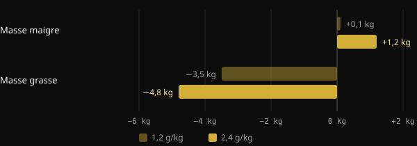
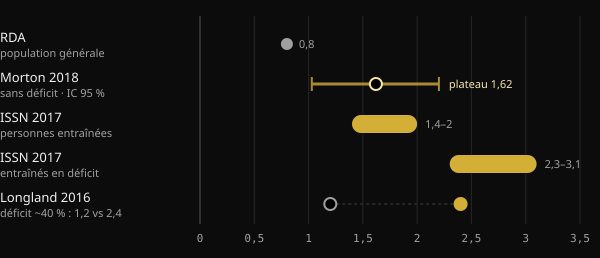

# Protéines en sèche : combien en faut-il vraiment ?

Quand tu réduis les calories, la grande crainte est de perdre le muscle durement construit. Les protéines sont le levier alimentaire le plus étudié pour l'éviter, mais les chiffres qui circulent vont de 1,6 à plus de 4 grammes par kilo. Tu trouveras ici ce que disent les méta-analyses, pourquoi les chiffres varient autant et comment choisir le tien.

## En bref

- En déficit calorique, manger plus de protéines aide à protéger la masse maigre : sur ce point, les études concordent.
- Hors déficit, au-delà d'environ 1,6 g par kg de poids et par jour, le bénéfice moyen plafonne. L'incertitude s'étend jusqu'à environ 2,2 g/kg.
- En sèche, les recommandations montent : 2,3 à 3,1 g par kg de masse maigre selon la revue de Helms et de ses collègues.
- Les valeurs très élevées, au-delà de 3 g/kg de poids, ne sont pas un minimum à respecter. Elles correspondent à la partie haute des données observées, avec des résultats que les auteurs eux-mêmes qualifient d'exploratoires.
- Le point de départ compte aussi : celui qui mange déjà beaucoup de protéines pourrait gagner moins à en ajouter encore.

## Pourquoi tout change en sèche

Le muscle se renouvelle en permanence : chaque jour, tu en construis et tu en dégrades une petite partie. Quand tu manges moins que ce que tu dépenses, le corps puise aussi dans les protéines musculaires comme réserve. Plus le déficit est marqué et plus tu es sec, plus cette tendance s'accentue.

Une méta-analyse de l'université Purdue portant sur 18 études contrôlées le montre bien. Manger plus de protéines que la RDA (l'apport recommandé pour la population générale, 0,8 g/kg) a réduit d'environ 0,36 kg la perte de masse maigre pendant le régime. Chez les personnes qui n'étaient pas au régime et ne s'entraînaient pas, en revanche, il n'y avait aucune différence. Les protéines supplémentaires servent surtout quand le corps est sous contrainte : déficit calorique, entraînement ou les deux.

L'étude de Longland et de ses collègues, à l'université McMaster, en est l'exemple le plus net. Quarante jeunes hommes ont suivi pendant quatre semaines un déficit d'environ 40 %, en s'entraînant six jours sur sept avec musculation et fractionné à haute intensité. La moitié consommait 1,2 g/kg de protéines, l'autre moitié 2,4 g/kg.

*Source : Longland et al., Am J Clin Nutr 2016 (n = 40, composition corporelle par modèle à 4 compartiments). Graphique Nurvan.*

Le groupe le plus riche en protéines a gagné en moyenne 1,2 kg de masse maigre, contre 0,1 kg pour l'autre groupe, et a perdu davantage de graisse. C'est un résultat obtenu sur une courte période et avec un protocole très dur, mais il indique la direction.

## Combien il en faut quand tu n'es pas en déficit

Pour comprendre les chiffres de la sèche, il faut un point de repère. La méta-analyse la plus citée est celle de Morton et de ses collègues (2018) : 49 études et 1 863 personnes pratiquant la musculation, toutes en apport calorique normal ou en surplus. La supplémentation en protéines a ajouté en moyenne 0,30 kg de masse maigre.

Le chiffre le plus repris est le point de plateau : au-delà d'environ 1,62 g/kg par jour, la masse maigre n'augmentait plus. L'intervalle de confiance, c'est-à-dire la fourchette dans laquelle se situe probablement la vraie valeur, allait de 1,03 à 2,20 g/kg. C'est pourquoi les auteurs suggèrent, par prudence, environ 2,2 g/kg à qui veut maximiser la croissance.

Une seconde méta-analyse, japonaise, portant sur 105 études et 5 402 personnes, a trouvé une évolution similaire. Chaque augmentation des protéines apporte un bénéfice, mais au-dessus de 1,3 g/kg le gain par palier est environ trois fois plus faible. C'est le rendement décroissant classique.

## Combien il en faut quand tu es en déficit

Ici, les chiffres montent. En 2014, Helms et ses collègues ont analysé les études menées sur des athlètes secs et entraînés en déficit. Leur estimation : 2,3 à 3,1 g par kg de masse maigre, d'autant plus haut que le déficit est agressif et que la personne est sèche. La position officielle de l'International Society of Sports Nutrition (ISSN) reprend la même fourchette.

*Sources : Hudson et al. 2020 (RDA) ; Morton et al. 2018 ; Jäger et al. 2017 (ISSN) ; Longland et al. 2016. Valeurs en g par kg de poids corporel. La revue de Helms 2014 donne 2,3–3,1 g par kg de masse maigre. Graphique Nurvan.*

En 2025, la même équipe a mis à jour l'analyse avec une méta-régression sur 29 études, sélectionnées parmi 916. Le modèle trouve une probabilité supérieure à 97 % d'une relation linéaire : plus de protéines, meilleure préservation de la masse maigre. La relation était plus forte lorsque les protéines étaient calculées sur la masse maigre, dans les interventions de plus de quatre semaines, chez les hommes et chez les personnes les plus sèches.

Deux détails changent la lecture. Premièrement : une relation linéaire à l'intérieur des données recueillies ne dit pas où elle s'arrête. Les valeurs les plus élevées indiquent seulement jusqu'où allaient les études. Deuxièmement : l'hétérogénéité entre les études était forte, et les auteurs qualifient leurs résultats d'exploratoires, non de concluants.

## Le point de départ compte

Un commentaire publié en 2026 dans Sports Medicine ajoute un élément souvent ignoré. Les méta-régressions regardent la dose prescrite, mais les participants partent d'habitudes différentes. Selon les auteurs, celui qui mange déjà beaucoup de protéines avant l'étude semble tirer moins de bénéfice d'augmentations supplémentaires. Ils présentent cela comme une preuve exploratoire, à confirmer. En pratique : passer de 1,2 à 2,2 g/kg compte probablement bien plus que passer de 2,5 à 3,5.

## Ce que dit vraiment la recherche

Le point de départ de cet article est une publication de Stronger By Science qui résume leur analyse interne et la méta-régression de 2025. Voici ses principales affirmations, confrontées aux sources.

- **Confirmé** — « En sèche, il faut plus de protéines. » Revues, méta-analyses et essais contrôlés vont tous dans le même sens.
- **Confirmé** — « Les recommandations précédentes se situaient entre 1,6 et 2,2 g/kg. » Cela correspond au plateau de Morton 2018 et à son intervalle de confiance, qui concerne toutefois les personnes hors déficit.
- **Confirmé** — « L'effet est faible mais appréciable, avec des rendements décroissants. » C'est ce que montrent à la fois Morton 2018 (+0,30 kg en moyenne) et Tagawa 2020.
- **À nuancer** — « Pour une préservation maximale, il faut 3,2 g/kg de poids ou 4,2 g/kg de masse maigre. » Le résumé décrit une relation linéaire sans plafond. Ces valeurs correspondent à la partie haute des données observées, pas à un seuil démontré, et les résultats sont exploratoires.
- **À nuancer** — « Chaque g/kg supplémentaire donne 97 à 99 % de probabilité de préserver davantage de masse maigre. » Ce pourcentage mesure la probabilité que l'effet aille dans le bon sens, pas son ampleur.
- **Non vérifiable** — Les fourchettes pour la prise de masse et la recomposition (environ 2 à 2,35 g/kg) proviennent d'une analyse interne publiée sur le site de Stronger By Science, et non dans une revue indexée dans PubMed.

## Comment l'appliquer

Prenons l'exemple d'une personne de 80 kg à 15 % de masse grasse. Sa masse maigre est d'environ 68 kg.

| Référence | Calcul | Protéines par jour |
|---|---|---|
| Plateau Morton 2018 (hors déficit) | 1,6 g × 80 kg | 128 g |
| Limite prudente Morton 2018 | 2,2 g × 80 kg | 176 g |
| Helms 2014 (en déficit) | 2,3–3,1 g × 68 kg | 156–211 g |
| Valeur haute citée dans la publication | 4,2 g × 68 kg | 286 g |

1. **Pars d'une base solide.** Si tu manges peu de protéines aujourd'hui, monter vers 1,6–2,2 g/kg est l'étape la plus rentable.
2. **Augmente en sèche, surtout si tu es déjà sec.** Plus le déficit est agressif et plus ton taux de masse grasse est bas, plus il est logique de viser le haut de la fourchette de Helms.
3. **Calcule sur la masse maigre si tu as beaucoup de masse grasse.** Utiliser le poids total gonfle le chiffre sans raison.
4. **Répartis ton apport.** L'ISSN indique des repas d'environ 0,25 g/kg, soit 20 à 40 g, toutes les 3 à 4 heures.
5. **N'oublie pas la fonte.** Dans la méta-analyse de Morton, l'entraînement en résistance pèse bien plus que la supplémentation en protéines. Les protéines le soutiennent, elles ne le remplacent pas.

Si tu souffres d'une maladie rénale ou d'un autre problème de santé, parles-en à ton médecin avant d'augmenter fortement tes protéines.

<h3>Fixe ton objectif de protéines en sèche</h3>

Nurvan calcule ta cible de protéines en fonction de ton poids et de ton objectif, en la relevant quand tu es en phase de sèche, et tu peux la modifier à la main. Tu la suis ensuite repas par repas dans le journal et tu la compares à ton poids, tes mensurations et tes charges, pour voir si tu préserves vraiment ton muscle.

<a href="https://nurvan.app">Essayer Nurvan</a>

## Questions fréquentes

### Dois-je calculer mes protéines sur mon poids actuel ou sur mon poids cible ?

Si tu es assez sec, le poids actuel convient. Si tu as beaucoup de masse grasse, il est plus pertinent de raisonner sur la masse maigre, comme le fait la revue de Helms 2014. Le poids total conduirait à des chiffres gonflés.

### Combien de protéines par repas ?

La position de l'ISSN indique environ 0,25 g par kg de poids, soit 20 à 40 g, par repas, répartis toutes les 3 à 4 heures. C'est toutefois surtout le total de la journée qui compte.

### Les protéines en poudre sont-elles utiles ?

Elles ne sont pas obligatoires. Selon l'ISSN, c'est un moyen pratique d'atteindre son apport sans ajouter trop de calories, ce qui est justement utile en sèche. Les aliments bruts restent la base.

### Comment faire si je ne connais pas ma masse maigre ?

Tu peux l'estimer à partir d'une mesure de ton pourcentage de masse grasse. Sinon, utilise ton poids corporel avec les recommandations exprimées en g/kg de poids, comme 1,6–2,2 g/kg, et augmente progressivement pendant la sèche.

## Sources

1. Refalo MC, Trexler ET, Helms ER, 2025. Effect of Dietary Protein on Fat-Free Mass in Energy Restricted, Resistance-Trained Individuals: An Updated Systematic Review With Meta-Regression. *Strength Cond J* 48(4):398–412. [DOI 10.1519/SSC.0000000000000888](https://doi.org/10.1519/SSC.0000000000000888) (revue non indexée dans PubMed)
2. Morton RW et al., 2018. A systematic review, meta-analysis and meta-regression of the effect of protein supplementation on resistance training-induced gains in muscle mass and strength in healthy adults. *Br J Sports Med* 52(6):376–384. [PMID 28698222](https://pubmed.ncbi.nlm.nih.gov/28698222/) · [DOI 10.1136/bjsports-2017-097608](https://doi.org/10.1136/bjsports-2017-097608)
3. Helms ER et al., 2014. A systematic review of dietary protein during caloric restriction in resistance trained lean athletes: a case for higher intakes. *Int J Sport Nutr Exerc Metab* 24(2):127–38. [PMID 24092765](https://pubmed.ncbi.nlm.nih.gov/24092765/) · [DOI 10.1123/ijsnem.2013-0054](https://doi.org/10.1123/ijsnem.2013-0054)
4. Jäger R et al., 2017. International Society of Sports Nutrition Position Stand: protein and exercise. *J Int Soc Sports Nutr* 14:20. [PMID 28642676](https://pubmed.ncbi.nlm.nih.gov/28642676/) · [DOI 10.1186/s12970-017-0177-8](https://doi.org/10.1186/s12970-017-0177-8)
5. Longland TM et al., 2016. Higher compared with lower dietary protein during an energy deficit combined with intense exercise promotes greater lean mass gain and fat mass loss: a randomized trial. *Am J Clin Nutr* 103(3):738–46. [PMID 26817506](https://pubmed.ncbi.nlm.nih.gov/26817506/) · [DOI 10.3945/ajcn.115.119339](https://doi.org/10.3945/ajcn.115.119339)
6. Hudson JL et al., 2020. Protein Intake Greater than the RDA Differentially Influences Whole-Body Lean Mass Responses to Purposeful Catabolic and Anabolic Stressors: A Systematic Review and Meta-analysis. *Adv Nutr* 11(3):548–558. [PMID 31794597](https://pubmed.ncbi.nlm.nih.gov/31794597/) · [DOI 10.1093/advances/nmz106](https://doi.org/10.1093/advances/nmz106)
7. Tagawa R et al., 2020. Dose-response relationship between protein intake and muscle mass increase: a systematic review and meta-analysis of randomized controlled trials. *Nutr Rev* 79(1):66–75. [PMID 33300582](https://pubmed.ncbi.nlm.nih.gov/33300582/) · [DOI 10.1093/nutrit/nuaa104](https://doi.org/10.1093/nutrit/nuaa104)
8. López-Moreno M, Quesada G, López-Gil JF, 2026. Starting Point Matters: Baseline Protein Intake as a Moderator of the Protein-Fat-Free Mass Relationship in Energy-Restricted Athletes. *Sports Med*. [PMID 42560437](https://pubmed.ncbi.nlm.nih.gov/42560437/) · [DOI 10.1007/s40279-026-02494-5](https://doi.org/10.1007/s40279-026-02494-5)

Article inspiré d'une publication de [Stronger By Science (@strongerbyscience)](https://www.instagram.com/p/Dd6ncPLF7mI/). Sources consultées via PubMed.

> Note : contenu à visée informative, qui ne remplace pas l'avis d'un médecin ou d'un professionnel qualifié.
