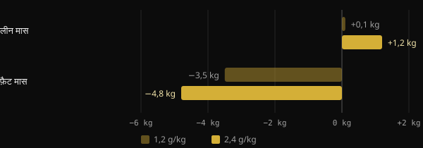
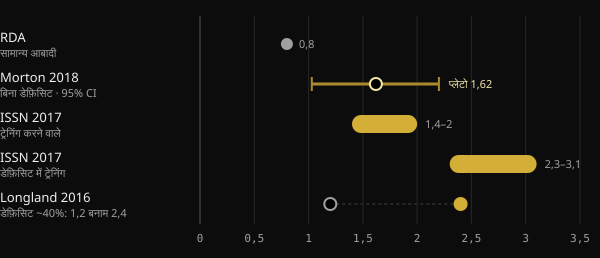

# कटिंग में प्रोटीन: असल में कितना चाहिए?

जब आप कैलोरी घटाते हैं, तो सबसे बड़ा डर होता है मेहनत से बनाई मांसपेशियाँ गँवा देने का। प्रोटीन इसे रोकने के लिए सबसे ज़्यादा अध्ययन किया गया खान-पान का साधन है, पर जो आँकड़े चलते हैं वे 1,6 से लेकर 4 ग्राम प्रति किलो से भी ऊपर तक जाते हैं। यहाँ आपको मिलेगा कि मेटा-विश्लेषण क्या कहते हैं, संख्याएँ इतनी अलग क्यों हैं और अपनी संख्या कैसे चुनें।

## संक्षेप में

- कैलोरी डेफ़िसिट में ज़्यादा प्रोटीन खाना लीन मास को बचाने में मदद करता है: इस पर अध्ययन सहमत हैं।
- डेफ़िसिट के बिना, लगभग 1,6 g प्रति किलो वज़न प्रतिदिन के बाद औसत लाभ सपाट हो जाता है। अनिश्चितता लगभग 2,2 g/kg तक जाती है।
- कटिंग में सुझाव ऊपर जाते हैं: Helms और सहयोगियों की रिव्यू के अनुसार 2,3–3,1 g प्रति किलो लीन मास।
- 3 g/kg वज़न से ऊपर के बहुत ऊँचे मान कोई न्यूनतम सीमा नहीं हैं। वे देखे गए आँकड़ों का ऊपरी हिस्सा हैं, और नतीजों को खुद लेखक एक्सप्लोरेटरी कहते हैं।
- यह भी मायने रखता है कि आप कहाँ से शुरू करते हैं: जो पहले से काफ़ी प्रोटीन खाता है, उसे और बढ़ाने से शायद कम फ़ायदा मिले।

## कटिंग में बात क्यों बदल जाती है

मांसपेशी लगातार नवीनीकृत होती रहती है: हर दिन आप उसका एक छोटा हिस्सा बनाते और तोड़ते हैं। जब आप खर्च से कम खाते हैं, तो शरीर मांसपेशी के प्रोटीन को भी भंडार की तरह इस्तेमाल करता है। डेफ़िसिट जितना गहरा और आप जितने दुबले, यह दबाव उतना बढ़ता है।

Purdue University का 18 नियंत्रित अध्ययनों पर एक मेटा-विश्लेषण इसे अच्छी तरह दिखाता है। RDA से ज़्यादा प्रोटीन खाने (RDA आम आबादी के लिए सुझाई गई मात्रा है, 0,8 g/kg) से डाइट के दौरान लीन मास का नुकसान लगभग 0,36 kg कम हुआ। जो लोग डाइट पर नहीं थे और ट्रेनिंग भी नहीं करते थे, उनमें कोई अंतर नहीं था। अतिरिक्त प्रोटीन मुख्य रूप से तब काम आता है जब शरीर तनाव में हो: कैलोरी डेफ़िसिट, ट्रेनिंग या दोनों।

McMaster University में Longland और सहयोगियों का अध्ययन सबसे साफ़ उदाहरण है। चालीस युवा पुरुषों ने चार हफ़्ते तक लगभग 40% का डेफ़िसिट रखा, हफ़्ते में सातों में से छह दिन वेट और हाई-इंटेंसिटी इंटरवल के साथ ट्रेनिंग करते हुए। आधे ने 1,2 g/kg प्रोटीन खाया, आधे ने 2,4 g/kg।

*स्रोत: Longland et al., Am J Clin Nutr 2016 (n = 40, 4-कम्पार्टमेंट मॉडल से बॉडी कंपोज़िशन)। ग्राफ़: Nurvan।*

ज़्यादा प्रोटीन वाले समूह ने औसतन 1,2 kg लीन मास बढ़ाया, जबकि दूसरे समूह ने 0,1 kg, और उसने ज़्यादा फ़ैट खोया। यह छोटी अवधि और बहुत कठिन प्रोटोकॉल पर नतीजा है, पर दिशा बताता है।

## डेफ़िसिट के बिना कितना चाहिए

कटिंग की संख्याएँ समझने के लिए एक संदर्भ बिंदु चाहिए। सबसे ज़्यादा उद्धृत मेटा-विश्लेषण Morton और सहयोगियों (2018) का है: 49 अध्ययन और वेट ट्रेनिंग करने वाले 1.863 लोग, सब सामान्य कैलोरी या सरप्लस पर। प्रोटीन सप्लीमेंटेशन ने औसतन 0,30 kg लीन मास जोड़ा।

सबसे ज़्यादा इस्तेमाल होने वाला आँकड़ा प्लेटो बिंदु है: लगभग 1,62 g/kg प्रतिदिन से ऊपर लीन मास और नहीं बढ़ा। कॉन्फ़िडेंस इंटरवल, यानी वह दायरा जिसमें असली मान शायद गिरता है, 1,03 से 2,20 g/kg तक था। इसीलिए लेखक सावधानी के तौर पर, जो विकास को अधिकतम करना चाहते हैं उन्हें, लगभग 2,2 g/kg सुझाते हैं।

जापान के दूसरे मेटा-विश्लेषण ने, 105 अध्ययनों और 5.402 लोगों पर, मिलता-जुलता रुझान पाया। प्रोटीन में हर बढ़ोतरी फ़ायदा देती है, लेकिन 1,3 g/kg से ऊपर हर पायदान का लाभ लगभग तीन गुना छोटा होता है। यह घटते प्रतिफल का क्लासिक मामला है।

## डेफ़िसिट में कितना चाहिए

यहाँ संख्याएँ ऊपर जाती हैं। 2014 में Helms और सहयोगियों ने डेफ़िसिट में दुबले, प्रशिक्षित एथलीटों पर अध्ययनों का विश्लेषण किया। उनका अनुमान: 2,3–3,1 g प्रति किलो लीन मास, डेफ़िसिट जितना आक्रामक और व्यक्ति जितना दुबला, उतना ऊपर की ओर। International Society of Sports Nutrition (ISSN) की आधिकारिक स्थिति भी यही दायरा दोहराती है।

*स्रोत: Hudson et al. 2020 (RDA); Morton et al. 2018; Jäger et al. 2017 (ISSN); Longland et al. 2016। मान g प्रति kg शरीर के वज़न में। Helms 2014 की रिव्यू 2,3–3,1 g प्रति kg लीन मास में बताती है। ग्राफ़: Nurvan।*

2025 में उसी समूह ने 916 में से चुने गए 29 अध्ययनों पर मेटा-रिग्रेशन से विश्लेषण अपडेट किया। मॉडल 97% से ज़्यादा संभावना पाता है कि संबंध रैखिक है: ज़्यादा प्रोटीन, लीन मास का बेहतर संरक्षण। संबंध तब ज़्यादा मज़बूत था जब प्रोटीन लीन मास पर गिना गया, चार हफ़्ते से लंबे हस्तक्षेपों में, पुरुषों में और ज़्यादा दुबले लोगों में।

दो बातें पढ़ने का नज़रिया बदल देती हैं। पहली: इकट्ठा किए गए आँकड़ों के भीतर रैखिक संबंध यह नहीं बताता कि वह कहाँ रुकता है। सबसे ऊँचे मान सिर्फ़ यह दिखाते हैं कि अध्ययन कहाँ तक पहुँचे थे। दूसरी: अध्ययनों के बीच बहुत विषमता थी और लेखक नतीजों को एक्सप्लोरेटरी कहते हैं, निर्णायक नहीं।

## शुरुआती बिंदु मायने रखता है

2026 में Sports Medicine में छपी एक टिप्पणी अक्सर नज़रअंदाज़ होने वाला तत्व जोड़ती है। मेटा-रिग्रेशन निर्धारित मात्रा देखते हैं, पर प्रतिभागी अलग-अलग आदतों से शुरू करते हैं। लेखकों के अनुसार जो अध्ययन से पहले ही काफ़ी प्रोटीन खाता है, उसे और बढ़ाने से कम मिलता लगता है। वे इसे एक्सप्लोरेटरी साक्ष्य के रूप में रखते हैं, जिसकी पुष्टि बाकी है। व्यवहार में: 1,2 से 2,2 g/kg पर जाना शायद 2,5 से 3,5 पर जाने से कहीं ज़्यादा मायने रखता है।

## रिसर्च असल में क्या कहती है

इस लेख की प्रेरणा Stronger By Science की एक पोस्ट है, जो उनके आंतरिक विश्लेषण और 2025 के मेटा-रिग्रेशन का सार देती है। यहाँ मुख्य दावे हैं, स्रोतों से मिलाकर।

- **पुष्ट** — "कटिंग में ज़्यादा प्रोटीन चाहिए।" रिव्यू, मेटा-विश्लेषण और नियंत्रित अध्ययन सब एक ही दिशा में जाते हैं।
- **पुष्ट** — "पहले के सुझाव 1,6 से 2,2 g/kg के बीच थे।" यह Morton 2018 के प्लेटो और उसके कॉन्फ़िडेंस इंटरवल से मेल खाता है, जो हालाँकि उन पर लागू है जो डेफ़िसिट में नहीं हैं।
- **पुष्ट** — "असर छोटा पर सराहनीय है, घटते प्रतिफल के साथ।" Morton 2018 (औसतन +0,30 kg) और Tagawa 2020, दोनों यह दिखाते हैं।
- **स्पष्टीकरण ज़रूरी** — "अधिकतम संरक्षण के लिए 3,2 g/kg वज़न या 4,2 g/kg लीन मास चाहिए।" Abstract बिना किसी सीमा के रैखिक संबंध बताता है। ये मान देखे गए आँकड़ों का ऊपरी हिस्सा हैं, सिद्ध सीमा नहीं, और नतीजे एक्सप्लोरेटरी हैं।
- **स्पष्टीकरण ज़रूरी** — "हर अतिरिक्त g/kg पर ज़्यादा लीन मास बचाने की 97–99% संभावना है।" वह प्रतिशत मापता है कि असर सही दिशा में होने की कितनी संभावना है, असर कितना बड़ा है यह नहीं।
- **सत्यापित नहीं हो सकता** — मास और रीकंपोज़िशन के दायरे (लगभग 2–2,35 g/kg) Stronger By Science की वेबसाइट पर छपे एक आंतरिक विश्लेषण से आते हैं, PubMed में सूचीबद्ध किसी पत्रिका से नहीं।

## इसे कैसे लागू करें

एक उदाहरण लेते हैं: 80 kg वज़न और 15% बॉडी फ़ैट वाला व्यक्ति। उसका लीन मास लगभग 68 kg है।

| संदर्भ | गणना | प्रतिदिन प्रोटीन |
|---|---|---|
| Morton 2018 का प्लेटो (डेफ़िसिट के बिना) | 1,6 g × 80 kg | 128 g |
| Morton 2018 की सावधानीपूर्ण सीमा | 2,2 g × 80 kg | 176 g |
| Helms 2014 (डेफ़िसिट में) | 2,3–3,1 g × 68 kg | 156–211 g |
| पोस्ट में उद्धृत ऊँचा मान | 4,2 g × 68 kg | 286 g |

1. **ठोस आधार से शुरू करें।** अगर आज आप कम प्रोटीन खाते हैं, तो 1,6–2,2 g/kg की ओर बढ़ना सबसे ज़्यादा रिटर्न वाला कदम है।
2. **कटिंग में ऊपर जाएँ, खासकर अगर आप पहले से दुबले हैं।** डेफ़िसिट जितना आक्रामक और आप जितने सूखे, Helms के दायरे के ऊपरी हिस्से में रहना उतना ही समझदारी भरा है।
3. **अगर फ़ैट ज़्यादा है, तो गणना लीन मास पर करें।** कुल वज़न लेने से संख्या बेवजह फूल जाती है।
4. **मात्रा बाँटें।** ISSN हर 3–4 घंटे में लगभग 0,25 g/kg, यानी 20–40 g, के भोजन सुझाती है।
5. **वेट ट्रेनिंग न भूलें।** Morton के मेटा-विश्लेषण में रेसिस्टेंस ट्रेनिंग का वज़न प्रोटीन सप्लीमेंटेशन से कहीं ज़्यादा है। प्रोटीन उसे सहारा देता है, उसकी जगह नहीं लेता।

अगर आपको किडनी की बीमारी या दूसरी चिकित्सीय स्थितियाँ हैं, तो प्रोटीन काफ़ी बढ़ाने से पहले अपने डॉक्टर से बात करें।

<h3>कटिंग में अपना प्रोटीन लक्ष्य सेट करें</h3>

Nurvan वज़न और लक्ष्य के आधार पर प्रोटीन का टारगेट निकालता है, कटिंग के चरण में उसे बढ़ाकर, और आप उसे हाथ से बदल भी सकते हैं। फिर आप डायरी में भोजन-दर-भोजन उसे फ़ॉलो करते हैं और वज़न, माप और लोड से मिलाकर देखते हैं कि आप सच में मांसपेशी बचा पा रहे हैं या नहीं।

<a href="https://nurvan.app">Nurvan आज़माएँ</a>

## अक्सर पूछे जाने वाले सवाल

### क्या प्रोटीन मौजूदा वज़न पर गिनना चाहिए या लक्ष्य वज़न पर?

अगर आप काफ़ी दुबले हैं, तो मौजूदा वज़न ठीक है। अगर शरीर में फ़ैट ज़्यादा है, तो लीन मास के हिसाब से सोचना ज़्यादा समझदारी है, जैसा Helms 2014 की रिव्यू करती है। कुल वज़न से फूली हुई संख्याएँ आतीं।

### प्रति भोजन कितना प्रोटीन?

ISSN की स्थिति प्रति भोजन लगभग 0,25 g प्रति kg वज़न, या 20–40 g बताती है, हर 3–4 घंटे में। फिर भी सबसे ज़्यादा मायने दिन के कुल का रखता है।

### क्या प्रोटीन पाउडर ज़रूरी है?

अनिवार्य नहीं है। ISSN के अनुसार यह ज़्यादा कैलोरी जोड़े बिना मात्रा पूरी करने का व्यावहारिक तरीका है, कटिंग में खास तौर पर उपयोगी। असली खाना ही आधार रहता है।

### अगर मुझे अपना लीन मास पता नहीं, तो क्या करूँ?

आप उसे बॉडी फ़ैट प्रतिशत के माप से अनुमानित कर सकते हैं। विकल्प के तौर पर, g/kg वज़न में दिए सुझाव, जैसे 1,6–2,2 g/kg, शरीर के वज़न पर इस्तेमाल करें और कटिंग के दौरान धीरे-धीरे ऊपर जाएँ।

## स्रोत

1. Refalo MC, Trexler ET, Helms ER, 2025. Effect of Dietary Protein on Fat-Free Mass in Energy Restricted, Resistance-Trained Individuals: An Updated Systematic Review With Meta-Regression. *Strength Cond J* 48(4):398–412. [DOI 10.1519/SSC.0000000000000888](https://doi.org/10.1519/SSC.0000000000000888) (पत्रिका PubMed में सूचीबद्ध नहीं)
2. Morton RW et al., 2018. A systematic review, meta-analysis and meta-regression of the effect of protein supplementation on resistance training-induced gains in muscle mass and strength in healthy adults. *Br J Sports Med* 52(6):376–384. [PMID 28698222](https://pubmed.ncbi.nlm.nih.gov/28698222/) · [DOI 10.1136/bjsports-2017-097608](https://doi.org/10.1136/bjsports-2017-097608)
3. Helms ER et al., 2014. A systematic review of dietary protein during caloric restriction in resistance trained lean athletes: a case for higher intakes. *Int J Sport Nutr Exerc Metab* 24(2):127–38. [PMID 24092765](https://pubmed.ncbi.nlm.nih.gov/24092765/) · [DOI 10.1123/ijsnem.2013-0054](https://doi.org/10.1123/ijsnem.2013-0054)
4. Jäger R et al., 2017. International Society of Sports Nutrition Position Stand: protein and exercise. *J Int Soc Sports Nutr* 14:20. [PMID 28642676](https://pubmed.ncbi.nlm.nih.gov/28642676/) · [DOI 10.1186/s12970-017-0177-8](https://doi.org/10.1186/s12970-017-0177-8)
5. Longland TM et al., 2016. Higher compared with lower dietary protein during an energy deficit combined with intense exercise promotes greater lean mass gain and fat mass loss: a randomized trial. *Am J Clin Nutr* 103(3):738–46. [PMID 26817506](https://pubmed.ncbi.nlm.nih.gov/26817506/) · [DOI 10.3945/ajcn.115.119339](https://doi.org/10.3945/ajcn.115.119339)
6. Hudson JL et al., 2020. Protein Intake Greater than the RDA Differentially Influences Whole-Body Lean Mass Responses to Purposeful Catabolic and Anabolic Stressors: A Systematic Review and Meta-analysis. *Adv Nutr* 11(3):548–558. [PMID 31794597](https://pubmed.ncbi.nlm.nih.gov/31794597/) · [DOI 10.1093/advances/nmz106](https://doi.org/10.1093/advances/nmz106)
7. Tagawa R et al., 2020. Dose-response relationship between protein intake and muscle mass increase: a systematic review and meta-analysis of randomized controlled trials. *Nutr Rev* 79(1):66–75. [PMID 33300582](https://pubmed.ncbi.nlm.nih.gov/33300582/) · [DOI 10.1093/nutrit/nuaa104](https://doi.org/10.1093/nutrit/nuaa104)
8. López-Moreno M, Quesada G, López-Gil JF, 2026. Starting Point Matters: Baseline Protein Intake as a Moderator of the Protein-Fat-Free Mass Relationship in Energy-Restricted Athletes. *Sports Med*. [PMID 42560437](https://pubmed.ncbi.nlm.nih.gov/42560437/) · [DOI 10.1007/s40279-026-02494-5](https://doi.org/10.1007/s40279-026-02494-5)

यह लेख [Stronger By Science (@strongerbyscience)](https://www.instagram.com/p/Dd6ncPLF7mI/) की एक पोस्ट से प्रेरित है। स्रोत PubMed के माध्यम से देखे गए।

> नोट: यह जानकारी केवल सूचनात्मक है, डॉक्टर या किसी योग्य विशेषज्ञ की सलाह का विकल्प नहीं है।
