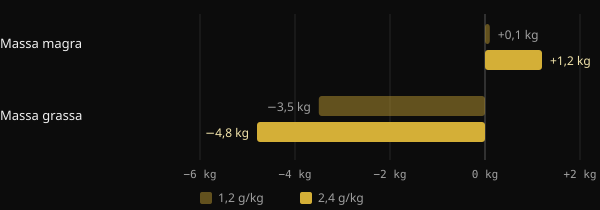
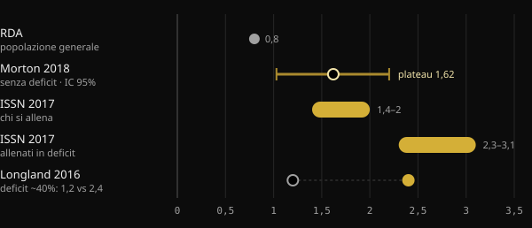

# Proteine in definizione: quante ne servono davvero?

Quando tagli le calorie, il timore principale è perdere il muscolo costruito con fatica. Le proteine sono la leva alimentare più studiata per evitarlo, ma le cifre che girano vanno da 1,6 a oltre 4 grammi per chilo. Qui trovi cosa dicono le meta-analisi, perché i numeri cambiano tanto e come scegliere il tuo.

## In breve

- In deficit calorico, mangiare più proteine aiuta a proteggere la massa magra: su questo gli studi concordano.
- Senza deficit, oltre circa 1,6 g per kg di peso al giorno il beneficio medio si appiattisce. L'incertezza arriva fino a circa 2,2 g/kg.
- In definizione le indicazioni salgono: 2,3–3,1 g per kg di massa magra secondo la review di Helms e colleghi.
- I valori molto alti, oltre 3 g/kg di peso, non sono un minimo da rispettare. Sono la parte alta dei dati osservati, con risultati che gli stessi autori definiscono esplorativi.
- Conta anche da dove parti: chi mangia già molte proteine potrebbe guadagnare meno da ulteriori aumenti.

## Perché in definizione il discorso cambia

Il muscolo si rinnova di continuo: ogni giorno ne costruisci e ne smonti una piccola parte. Quando mangi meno di quanto consumi, il corpo usa anche le proteine muscolari come riserva. Più il deficit è profondo e più sei magro, più questa spinta aumenta.

Una meta-analisi della Purdue University su 18 studi controllati lo mostra bene. Mangiare più proteine della RDA (la dose raccomandata per la popolazione generale, 0,8 g/kg) ha ridotto la perdita di massa magra durante la dieta di circa 0,36 kg. In persone che non erano a dieta e non si allenavano, invece, non c'era differenza. Le proteine in più servono soprattutto quando il corpo è sotto stress: deficit calorico, allenamento o entrambi.

Lo studio di Longland e colleghi, alla McMaster University, è l'esempio più netto. Quaranta giovani uomini hanno seguito per quattro settimane un deficit di circa il 40%, allenandosi sei giorni su sette con pesi e intervalli ad alta intensità. Metà mangiava 1,2 g/kg di proteine, metà 2,4 g/kg.

*Fonte: Longland et al., Am J Clin Nutr 2016 (n = 40, composizione corporea con modello a 4 compartimenti). Grafico Nurvan.*

Il gruppo con più proteine ha guadagnato in media 1,2 kg di massa magra, contro 0,1 kg dell'altro gruppo, e ha perso più grasso. È un risultato su un periodo breve e con un protocollo molto duro, ma indica la direzione.

## Quanto ne serve quando non sei in deficit

Per capire i numeri della definizione serve un punto di riferimento. La meta-analisi più citata è quella di Morton e colleghi (2018): 49 studi e 1.863 persone che si allenavano con i pesi, tutte a calorie normali o in surplus. Integrare le proteine ha aggiunto in media 0,30 kg di massa magra.

Il dato più usato è il punto di plateau: oltre circa 1,62 g/kg al giorno, la massa magra non aumentava ulteriormente. L'intervallo di confidenza, cioè la fascia in cui probabilmente cade il valore vero, andava da 1,03 a 2,20 g/kg. Per questo gli autori suggeriscono, per prudenza, circa 2,2 g/kg a chi vuole massimizzare la crescita.

Una seconda meta-analisi giapponese, su 105 studi e 5.402 persone, ha trovato un andamento simile. Ogni aumento di proteine porta benefici, ma sopra 1,3 g/kg il guadagno per ogni gradino è circa tre volte più piccolo. È il classico rendimento decrescente.

## Quanto ne serve quando sei in deficit

Qui i numeri salgono. Nel 2014 Helms e colleghi hanno analizzato gli studi su atleti magri e allenati in deficit. La loro stima: 2,3–3,1 g per kg di massa magra, verso l'alto quanto più il deficit è aggressivo e la persona è magra. La posizione ufficiale della International Society of Sports Nutrition (ISSN) riprende lo stesso intervallo.

*Fonti: Hudson et al. 2020 (RDA); Morton et al. 2018; Jäger et al. 2017 (ISSN); Longland et al. 2016. Valori in g per kg di peso corporeo. La review di Helms 2014 esprime 2,3–3,1 g per kg di massa magra. Grafico Nurvan.*

Nel 2025 lo stesso gruppo ha aggiornato l'analisi con una meta-regressione su 29 studi, selezionati tra 916. Il modello trova una probabilità superiore al 97% di una relazione lineare: più proteine, migliore conservazione della massa magra. La relazione era più forte quando le proteine erano calcolate sulla massa magra, negli interventi oltre le quattro settimane, negli uomini e nelle persone più magre.

Due dettagli cambiano la lettura. Primo: una relazione lineare dentro i dati raccolti non dice dove si ferma. I valori più alti indicano solo fin dove arrivavano gli studi. Secondo: c'era molta eterogeneità tra gli studi e gli autori definiscono i risultati esplorativi, non conclusivi.

## Il punto di partenza conta

Un commento pubblicato nel 2026 su Sports Medicine aggiunge un elemento spesso ignorato. Le meta-regressioni guardano la dose prescritta, ma i partecipanti partono da abitudini diverse. Secondo gli autori, chi mangia già molte proteine prima dello studio sembra ottenere meno da ulteriori aumenti. Lo presentano come evidenza esplorativa, da confermare. In pratica: passare da 1,2 a 2,2 g/kg probabilmente conta molto più che passare da 2,5 a 3,5.

## Cosa dice davvero la ricerca

Lo spunto di questo articolo è un post di Stronger By Science che riassume la loro analisi interna e la meta-regressione del 2025. Ecco le affermazioni principali, confrontate con le fonti.

- **Confermato** — "In definizione servono più proteine." Review, meta-analisi e studi controllati vanno tutti nella stessa direzione.
- **Confermato** — "Le raccomandazioni precedenti stavano tra 1,6 e 2,2 g/kg." Corrisponde al plateau di Morton 2018 e al suo intervallo di confidenza, che però riguarda chi non è in deficit.
- **Confermato** — "L'effetto è piccolo ma apprezzabile, con rendimenti decrescenti." Lo mostrano sia Morton 2018 (+0,30 kg in media) sia Tagawa 2020.
- **Da precisare** — "Per la massima conservazione servono 3,2 g/kg di peso o 4,2 g/kg di massa magra." L'abstract descrive una relazione lineare senza un tetto. Questi valori sono la parte alta dei dati osservati, non una soglia dimostrata, e i risultati sono esplorativi.
- **Da precisare** — "Ogni g/kg in più dà il 97–99% di probabilità di conservare più massa magra." Quella percentuale misura quanto è probabile che l'effetto vada nella direzione giusta, non quanto è grande.
- **Non verificabile** — Gli intervalli per massa e ricomposizione (circa 2–2,35 g/kg) vengono da un'analisi interna pubblicata sul sito di Stronger By Science, non su una rivista indicizzata in PubMed.

## Come applicarlo

Facciamo un esempio con una persona di 80 kg e il 15% di grasso corporeo. La sua massa magra è circa 68 kg.

| Riferimento | Calcolo | Proteine al giorno |
|---|---|---|
| Plateau Morton 2018 (senza deficit) | 1,6 g × 80 kg | 128 g |
| Limite prudente Morton 2018 | 2,2 g × 80 kg | 176 g |
| Helms 2014 (in deficit) | 2,3–3,1 g × 68 kg | 156–211 g |
| Valore alto citato nel post | 4,2 g × 68 kg | 286 g |

1. **Parti da una base solida.** Se oggi mangi poche proteine, portarti verso 1,6–2,2 g/kg è il passo con il ritorno maggiore.
2. **Sali in definizione, soprattutto se sei già magro.** Più il deficit è aggressivo e più sei asciutto, più ha senso stare nella parte alta dell'intervallo di Helms.
3. **Calcola sulla massa magra se hai molto grasso.** Usare il peso totale gonfia il numero senza motivo.
4. **Distribuisci la quota.** L'ISSN indica pasti da circa 0,25 g/kg, o 20–40 g, ogni 3–4 ore.
5. **Non dimenticare i pesi.** Nella meta-analisi di Morton l'allenamento contro resistenza pesa molto più dell'integrazione proteica. Le proteine lo supportano, non lo sostituiscono.

Se hai patologie renali o altre condizioni mediche, parla con il tuo medico prima di aumentare molto le proteine.

<h3>Imposta il tuo obiettivo proteico in definizione</h3>

Nurvan calcola il target di proteine in base al peso e all'obiettivo, alzandolo quando sei in fase di definizione, e puoi modificarlo a mano. Poi lo segui pasto per pasto nel diario e lo confronti con peso, misure e carichi, per vedere se stai davvero conservando il muscolo.

<a href="https://nurvan.app">Prova Nurvan</a>

## Domande frequenti

### Devo calcolare le proteine sul peso attuale o sul peso obiettivo?

Se sei abbastanza magro, il peso attuale va bene. Se hai molto grasso corporeo, è più sensato ragionare sulla massa magra, come fa la review di Helms 2014. Il peso totale porterebbe a numeri gonfiati.

### Quante proteine per pasto?

La posizione ISSN indica circa 0,25 g per kg di peso, o 20–40 g, per pasto, distribuiti ogni 3–4 ore. Conta comunque soprattutto il totale della giornata.

### Le proteine in polvere servono?

Non sono obbligatorie. Secondo l'ISSN sono un modo pratico per raggiungere la quota senza aggiungere troppe calorie, utile proprio in definizione. Il cibo intero resta la base.

### Se non conosco la mia massa magra come faccio?

Puoi stimarla da una misura della percentuale di grasso. In alternativa, usa il peso corporeo con le indicazioni espresse in g/kg di peso, come 1,6–2,2 g/kg, e sali gradualmente durante la definizione.

## Fonti

1. Refalo MC, Trexler ET, Helms ER, 2025. Effect of Dietary Protein on Fat-Free Mass in Energy Restricted, Resistance-Trained Individuals: An Updated Systematic Review With Meta-Regression. *Strength Cond J* 48(4):398–412. [DOI 10.1519/SSC.0000000000000888](https://doi.org/10.1519/SSC.0000000000000888) (rivista non indicizzata in PubMed)
2. Morton RW et al., 2018. A systematic review, meta-analysis and meta-regression of the effect of protein supplementation on resistance training-induced gains in muscle mass and strength in healthy adults. *Br J Sports Med* 52(6):376–384. [PMID 28698222](https://pubmed.ncbi.nlm.nih.gov/28698222/) · [DOI 10.1136/bjsports-2017-097608](https://doi.org/10.1136/bjsports-2017-097608)
3. Helms ER et al., 2014. A systematic review of dietary protein during caloric restriction in resistance trained lean athletes: a case for higher intakes. *Int J Sport Nutr Exerc Metab* 24(2):127–38. [PMID 24092765](https://pubmed.ncbi.nlm.nih.gov/24092765/) · [DOI 10.1123/ijsnem.2013-0054](https://doi.org/10.1123/ijsnem.2013-0054)
4. Jäger R et al., 2017. International Society of Sports Nutrition Position Stand: protein and exercise. *J Int Soc Sports Nutr* 14:20. [PMID 28642676](https://pubmed.ncbi.nlm.nih.gov/28642676/) · [DOI 10.1186/s12970-017-0177-8](https://doi.org/10.1186/s12970-017-0177-8)
5. Longland TM et al., 2016. Higher compared with lower dietary protein during an energy deficit combined with intense exercise promotes greater lean mass gain and fat mass loss: a randomized trial. *Am J Clin Nutr* 103(3):738–46. [PMID 26817506](https://pubmed.ncbi.nlm.nih.gov/26817506/) · [DOI 10.3945/ajcn.115.119339](https://doi.org/10.3945/ajcn.115.119339)
6. Hudson JL et al., 2020. Protein Intake Greater than the RDA Differentially Influences Whole-Body Lean Mass Responses to Purposeful Catabolic and Anabolic Stressors: A Systematic Review and Meta-analysis. *Adv Nutr* 11(3):548–558. [PMID 31794597](https://pubmed.ncbi.nlm.nih.gov/31794597/) · [DOI 10.1093/advances/nmz106](https://doi.org/10.1093/advances/nmz106)
7. Tagawa R et al., 2020. Dose-response relationship between protein intake and muscle mass increase: a systematic review and meta-analysis of randomized controlled trials. *Nutr Rev* 79(1):66–75. [PMID 33300582](https://pubmed.ncbi.nlm.nih.gov/33300582/) · [DOI 10.1093/nutrit/nuaa104](https://doi.org/10.1093/nutrit/nuaa104)
8. López-Moreno M, Quesada G, López-Gil JF, 2026. Starting Point Matters: Baseline Protein Intake as a Moderator of the Protein-Fat-Free Mass Relationship in Energy-Restricted Athletes. *Sports Med*. [PMID 42560437](https://pubmed.ncbi.nlm.nih.gov/42560437/) · [DOI 10.1007/s40279-026-02494-5](https://doi.org/10.1007/s40279-026-02494-5)

Articolo ispirato a un post di [Stronger By Science (@strongerbyscience)](https://www.instagram.com/p/Dd6ncPLF7mI/). Fonti consultate tramite PubMed.

> Nota: contenuto informativo, non sostituisce il parere di un medico o di un professionista qualificato.
