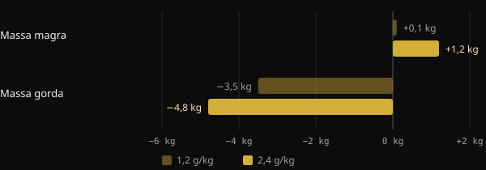
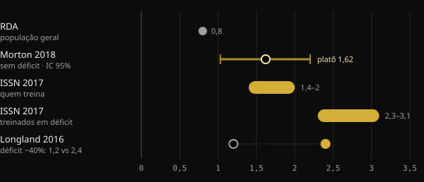

# Proteína na definição: quanto você realmente precisa?

Quando você corta calorias, o maior medo é perder o músculo construído com tanto esforço. A proteína é a alavanca alimentar mais estudada para evitar isso, mas os números que circulam vão de 1,6 a mais de 4 gramas por quilo. Aqui você encontra o que dizem as meta-análises, por que os números mudam tanto e como escolher o seu.

## Resumindo

- Em déficit calórico, comer mais proteína ajuda a proteger a massa magra: nisso os estudos concordam.
- Sem déficit, acima de cerca de 1,6 g por kg de peso por dia o benefício médio se achata. A incerteza chega a cerca de 2,2 g/kg.
- Na definição, as indicações sobem: 2,3–3,1 g por kg de massa magra segundo a revisão de Helms e colegas.
- Os valores muito altos, acima de 3 g/kg de peso, não são um mínimo a cumprir. São a parte alta dos dados observados, com resultados que os próprios autores chamam de exploratórios.
- Também conta de onde você parte: quem já come muita proteína pode ganhar menos com aumentos adicionais.

## Por que na definição a conversa muda

O músculo se renova o tempo todo: todo dia você constrói e desmonta uma pequena parte dele. Quando você come menos do que gasta, o corpo usa também as proteínas musculares como reserva. Quanto mais profundo o déficit e quanto mais magro você é, mais essa pressão aumenta.

Uma meta-análise da Purdue University com 18 estudos controlados mostra isso bem. Comer mais proteína que a RDA (a dose recomendada para a população geral, 0,8 g/kg) reduziu a perda de massa magra durante a dieta em cerca de 0,36 kg. Em pessoas que não estavam de dieta nem treinavam, por outro lado, não havia diferença. A proteína extra serve sobretudo quando o corpo está sob estresse: déficit calórico, treino ou ambos.

O estudo de Longland e colegas, na McMaster University, é o exemplo mais claro. Quarenta jovens seguiram por quatro semanas um déficit de cerca de 40%, treinando seis dias em sete com pesos e intervalos de alta intensidade. Metade comia 1,2 g/kg de proteína, metade 2,4 g/kg.

*Fonte: Longland et al., Am J Clin Nutr 2016 (n = 40, composição corporal com modelo de 4 compartimentos). Gráfico Nurvan.*

O grupo com mais proteína ganhou em média 1,2 kg de massa magra, contra 0,1 kg do outro grupo, e perdeu mais gordura. É um resultado em um período curto e com um protocolo muito duro, mas indica a direção.

## Quanto é preciso quando você não está em déficit

Para entender os números da definição, é preciso um ponto de referência. A meta-análise mais citada é a de Morton e colegas (2018): 49 estudos e 1.863 pessoas que treinavam com pesos, todas com calorias normais ou em superávit. Suplementar proteína acrescentou em média 0,30 kg de massa magra.

O dado mais usado é o ponto de plateau: acima de cerca de 1,62 g/kg por dia, a massa magra não aumentava mais. O intervalo de confiança, ou seja, a faixa em que provavelmente cai o valor verdadeiro, ia de 1,03 a 2,20 g/kg. Por isso os autores sugerem, por prudência, cerca de 2,2 g/kg a quem quer maximizar o crescimento.

Uma segunda meta-análise japonesa, com 105 estudos e 5.402 pessoas, encontrou um padrão semelhante. Cada aumento de proteína traz benefícios, mas acima de 1,3 g/kg o ganho a cada degrau é cerca de três vezes menor. É o clássico retorno decrescente.

## Quanto é preciso quando você está em déficit

Aqui os números sobem. Em 2014, Helms e colegas analisaram os estudos com atletas magros e treinados em déficit. A estimativa deles: 2,3–3,1 g por kg de massa magra, para cima quanto mais agressivo o déficit e mais magra a pessoa. A posição oficial da International Society of Sports Nutrition (ISSN) retoma o mesmo intervalo.

*Fontes: Hudson et al. 2020 (RDA); Morton et al. 2018; Jäger et al. 2017 (ISSN); Longland et al. 2016. Valores em g por kg de peso corporal. A revisão de Helms 2014 expressa 2,3–3,1 g por kg de massa magra. Gráfico Nurvan.*

Em 2025, o mesmo grupo atualizou a análise com uma meta-regressão de 29 estudos, selecionados entre 916. O modelo encontra uma probabilidade superior a 97% de uma relação linear: mais proteína, melhor preservação da massa magra. A relação era mais forte quando a proteína era calculada sobre a massa magra, nas intervenções com mais de quatro semanas, nos homens e nas pessoas mais magras.

Dois detalhes mudam a leitura. Primeiro: uma relação linear dentro dos dados coletados não diz onde ela para. Os valores mais altos indicam apenas até onde chegavam os estudos. Segundo: havia muita heterogeneidade entre os estudos e os autores definem os resultados como exploratórios, não conclusivos.

## O ponto de partida conta

Um comentário publicado em 2026 na Sports Medicine acrescenta um elemento muitas vezes ignorado. As meta-regressões olham a dose prescrita, mas os participantes partem de hábitos diferentes. Segundo os autores, quem já come muita proteína antes do estudo parece obter menos com aumentos adicionais. Eles apresentam isso como evidência exploratória, a ser confirmada. Na prática: passar de 1,2 para 2,2 g/kg provavelmente conta muito mais do que passar de 2,5 para 3,5.

## O que a pesquisa realmente diz

O ponto de partida deste artigo é um post do Stronger By Science que resume a análise interna deles e a meta-regressão de 2025. Estas são as principais afirmações, confrontadas com as fontes.

- **Confirmado** — "Na definição é preciso mais proteína." Revisões, meta-análises e estudos controlados vão todos na mesma direção.
- **Confirmado** — "As recomendações anteriores ficavam entre 1,6 e 2,2 g/kg." Corresponde ao plateau de Morton 2018 e ao seu intervalo de confiança, que porém diz respeito a quem não está em déficit.
- **Confirmado** — "O efeito é pequeno mas apreciável, com retornos decrescentes." Mostram isso tanto Morton 2018 (+0,30 kg em média) quanto Tagawa 2020.
- **A esclarecer** — "Para a máxima preservação são necessários 3,2 g/kg de peso ou 4,2 g/kg de massa magra." O resumo descreve uma relação linear sem teto. Esses valores são a parte alta dos dados observados, não um limiar demonstrado, e os resultados são exploratórios.
- **A esclarecer** — "Cada g/kg a mais dá 97–99% de probabilidade de preservar mais massa magra." Essa porcentagem mede quão provável é que o efeito vá na direção certa, não quão grande ele é.
- **Não verificável** — Os intervalos para massa e recomposição (cerca de 2–2,35 g/kg) vêm de uma análise interna publicada no site do Stronger By Science, não em uma revista indexada no PubMed.

## Como aplicar

Vamos a um exemplo com uma pessoa de 80 kg e 15% de gordura corporal. Sua massa magra é cerca de 68 kg.

| Referência | Cálculo | Proteína por dia |
|---|---|---|
| Plateau Morton 2018 (sem déficit) | 1,6 g × 80 kg | 128 g |
| Limite prudente Morton 2018 | 2,2 g × 80 kg | 176 g |
| Helms 2014 (em déficit) | 2,3–3,1 g × 68 kg | 156–211 g |
| Valor alto citado no post | 4,2 g × 68 kg | 286 g |

1. **Parta de uma base sólida.** Se hoje você come pouca proteína, ir em direção a 1,6–2,2 g/kg é o passo com maior retorno.
2. **Suba na definição, sobretudo se você já é magro.** Quanto mais agressivo o déficit e mais seco você está, mais sentido faz ficar na parte alta do intervalo de Helms.
3. **Calcule sobre a massa magra se você tem muita gordura.** Usar o peso total infla o número sem motivo.
4. **Distribua a cota.** A ISSN indica refeições de cerca de 0,25 g/kg, ou 20–40 g, a cada 3–4 horas.
5. **Não esqueça dos pesos.** Na meta-análise de Morton, o treino resistido pesa muito mais que a suplementação proteica. A proteína o apoia, não o substitui.

Se você tem doenças renais ou outras condições médicas, converse com seu médico antes de aumentar muito a proteína.

<h3>Defina sua meta de proteína na definição</h3>

O Nurvan calcula a meta de proteína com base no peso e no objetivo, aumentando-a quando você está em fase de definição, e você pode ajustá-la à mão. Depois você a acompanha refeição por refeição no diário e a compara com peso, medidas e cargas, para ver se está realmente preservando o músculo.

<a href="https://nurvan.app">Experimente o Nurvan</a>

## Perguntas frequentes

### Devo calcular a proteína sobre o peso atual ou sobre o peso-meta?

Se você já é bem magro, o peso atual serve. Se tem muita gordura corporal, faz mais sentido raciocinar sobre a massa magra, como faz a revisão de Helms 2014. O peso total levaria a números inflados.

### Quanta proteína por refeição?

A posição da ISSN indica cerca de 0,25 g por kg de peso, ou 20–40 g, por refeição, distribuídas a cada 3–4 horas. De qualquer forma, o que conta mesmo é o total do dia.

### Proteína em pó é necessária?

Não é obrigatória. Segundo a ISSN, é uma forma prática de atingir a cota sem acrescentar muitas calorias, útil justamente na definição. A comida de verdade continua sendo a base.

### Se eu não sei minha massa magra, como faço?

Você pode estimá-la a partir de uma medida do percentual de gordura. Alternativamente, use o peso corporal com as indicações expressas em g/kg de peso, como 1,6–2,2 g/kg, e suba gradualmente durante a definição.

## Fontes

1. Refalo MC, Trexler ET, Helms ER, 2025. Effect of Dietary Protein on Fat-Free Mass in Energy Restricted, Resistance-Trained Individuals: An Updated Systematic Review With Meta-Regression. *Strength Cond J* 48(4):398–412. [DOI 10.1519/SSC.0000000000000888](https://doi.org/10.1519/SSC.0000000000000888) (revista não indexada no PubMed)
2. Morton RW et al., 2018. A systematic review, meta-analysis and meta-regression of the effect of protein supplementation on resistance training-induced gains in muscle mass and strength in healthy adults. *Br J Sports Med* 52(6):376–384. [PMID 28698222](https://pubmed.ncbi.nlm.nih.gov/28698222/) · [DOI 10.1136/bjsports-2017-097608](https://doi.org/10.1136/bjsports-2017-097608)
3. Helms ER et al., 2014. A systematic review of dietary protein during caloric restriction in resistance trained lean athletes: a case for higher intakes. *Int J Sport Nutr Exerc Metab* 24(2):127–38. [PMID 24092765](https://pubmed.ncbi.nlm.nih.gov/24092765/) · [DOI 10.1123/ijsnem.2013-0054](https://doi.org/10.1123/ijsnem.2013-0054)
4. Jäger R et al., 2017. International Society of Sports Nutrition Position Stand: protein and exercise. *J Int Soc Sports Nutr* 14:20. [PMID 28642676](https://pubmed.ncbi.nlm.nih.gov/28642676/) · [DOI 10.1186/s12970-017-0177-8](https://doi.org/10.1186/s12970-017-0177-8)
5. Longland TM et al., 2016. Higher compared with lower dietary protein during an energy deficit combined with intense exercise promotes greater lean mass gain and fat mass loss: a randomized trial. *Am J Clin Nutr* 103(3):738–46. [PMID 26817506](https://pubmed.ncbi.nlm.nih.gov/26817506/) · [DOI 10.3945/ajcn.115.119339](https://doi.org/10.3945/ajcn.115.119339)
6. Hudson JL et al., 2020. Protein Intake Greater than the RDA Differentially Influences Whole-Body Lean Mass Responses to Purposeful Catabolic and Anabolic Stressors: A Systematic Review and Meta-analysis. *Adv Nutr* 11(3):548–558. [PMID 31794597](https://pubmed.ncbi.nlm.nih.gov/31794597/) · [DOI 10.1093/advances/nmz106](https://doi.org/10.1093/advances/nmz106)
7. Tagawa R et al., 2020. Dose-response relationship between protein intake and muscle mass increase: a systematic review and meta-analysis of randomized controlled trials. *Nutr Rev* 79(1):66–75. [PMID 33300582](https://pubmed.ncbi.nlm.nih.gov/33300582/) · [DOI 10.1093/nutrit/nuaa104](https://doi.org/10.1093/nutrit/nuaa104)
8. López-Moreno M, Quesada G, López-Gil JF, 2026. Starting Point Matters: Baseline Protein Intake as a Moderator of the Protein-Fat-Free Mass Relationship in Energy-Restricted Athletes. *Sports Med*. [PMID 42560437](https://pubmed.ncbi.nlm.nih.gov/42560437/) · [DOI 10.1007/s40279-026-02494-5](https://doi.org/10.1007/s40279-026-02494-5)

Artigo inspirado em um post de [Stronger By Science (@strongerbyscience)](https://www.instagram.com/p/Dd6ncPLF7mI/). Fontes consultadas via PubMed.

> Nota: conteúdo informativo, não substitui a opinião de um médico ou de um profissional qualificado.
