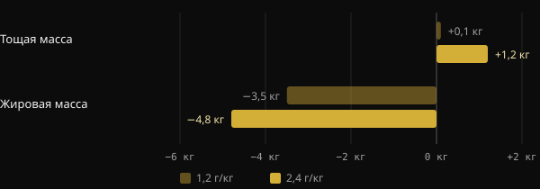
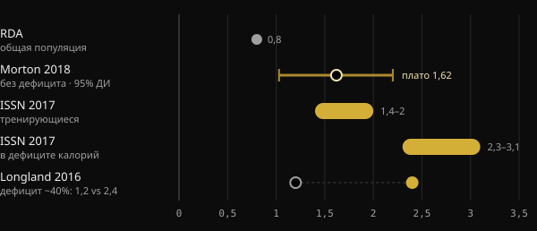

# Белок на сушке: сколько нужно на самом деле?

Когда ты урезаешь калории, главный страх — потерять мышцы, которые с таким трудом набраны. Белок — самый изученный рычаг питания, чтобы этого избежать, но называемые цифры колеблются от 1,6 до более чем 4 граммов на килограмм. Здесь ты найдёшь, что говорят метаанализы, почему цифры так сильно различаются и как выбрать свою.

## Коротко

- В дефиците калорий больше белка помогает сохранить тощую массу: тут исследования сходятся.
- Без дефицита выше примерно 1,6 г на кг веса в день средняя польза выходит на плато. Неопределённость доходит до примерно 2,2 г/кг.
- На сушке рекомендации выше: 2,3–3,1 г на кг тощей массы по обзору Хелмса с коллегами.
- Очень высокие значения, свыше 3 г/кг веса, — это не минимум, который нужно соблюдать. Это верхняя часть наблюдавшихся данных, с результатами, которые сами авторы называют предварительными.
- Важно и то, с чего ты начинаешь: кто уже ест много белка, может выиграть от дальнейшего увеличения меньше.

## Почему на сушке всё меняется

Мышцы постоянно обновляются: каждый день ты строишь и разрушаешь небольшую их часть. Когда ты ешь меньше, чем тратишь, организм использует и мышечный белок как резерв. Чем глубже дефицит и чем ты суше, тем сильнее этот эффект.

Метаанализ Университета Пердью по 18 контролируемым исследованиям хорошо это показывает. Потребление белка выше RDA (рекомендуемой дозы для населения в целом, 0,8 г/кг) уменьшило потерю тощей массы во время диеты примерно на 0,36 кг. У людей, которые не сидели на диете и не тренировались, разницы не было. Дополнительный белок нужен прежде всего тогда, когда организм под нагрузкой: дефицит калорий, тренировки или то и другое.

Исследование Лонгланда с коллегами из Университета Макмастера — самый чёткий пример. Сорок молодых мужчин в течение четырёх недель держали дефицит примерно в 40%, тренируясь шесть дней из семи с отягощениями и высокоинтенсивными интервалами. Половина ела 1,2 г/кг белка, половина — 2,4 г/кг.

*Источник: Longland et al., Am J Clin Nutr 2016 (n = 40, состав тела по четырёхкомпонентной модели). График Nurvan.*

Группа с большим количеством белка в среднем набрала 1,2 кг тощей массы против 0,1 кг в другой группе и потеряла больше жира. Это результат за короткий период и при очень жёстком протоколе, но он показывает направление.

## Сколько нужно, когда нет дефицита

Чтобы понять цифры для сушки, нужна точка отсчёта. Самый цитируемый метаанализ — Мортона с коллегами (2018): 49 исследований и 1863 человека, тренировавшихся с отягощениями, все при нормальной калорийности или в профиците. Добавление белка в среднем прибавило 0,30 кг тощей массы.

Чаще всего используют точку плато: выше примерно 1,62 г/кг в день тощая масса дальше не росла. Доверительный интервал, то есть диапазон, в который, вероятно, попадает истинное значение, составлял от 1,03 до 2,20 г/кг. Поэтому авторы для осторожности предлагают около 2,2 г/кг тем, кто хочет максимизировать рост.

Второй, японский метаанализ — 105 исследований и 5402 человека — показал похожую картину. Любое увеличение белка приносит пользу, но выше 1,3 г/кг выигрыш на каждую ступень примерно втрое меньше. Это классическая убывающая отдача.

## Сколько нужно в дефиците

Здесь цифры растут. В 2014 году Хелмс с коллегами проанализировали исследования на сухих тренированных атлетах в дефиците. Их оценка: 2,3–3,1 г на кг тощей массы, ближе к верхней границе тем сильнее, чем агрессивнее дефицит и чем суше человек. Официальная позиция Международного общества спортивного питания (ISSN) повторяет тот же диапазон.

*Источники: Hudson et al. 2020 (RDA); Morton et al. 2018; Jäger et al. 2017 (ISSN); Longland et al. 2016. Значения в г на кг массы тела. Обзор Helms 2014 выражает 2,3–3,1 г на кг тощей массы. График Nurvan.*

В 2025 году та же группа обновила анализ метарегрессией по 29 исследованиям, отобранным из 916. Модель находит вероятность выше 97% линейной зависимости: больше белка — лучше сохранение тощей массы. Зависимость была сильнее, когда белок считали на тощую массу, во вмешательствах дольше четырёх недель, у мужчин и у более сухих людей.

Две детали меняют прочтение. Первая: линейная зависимость внутри собранных данных не говорит, где она заканчивается. Самые высокие значения показывают лишь, докуда доходили исследования. Вторая: между исследованиями была большая гетерогенность, и авторы называют результаты предварительными, а не окончательными.

## Важна исходная точка

Комментарий, опубликованный в 2026 году в Sports Medicine, добавляет элемент, который часто упускают. Метарегрессии смотрят на назначенную дозу, но участники приходят с разными привычками. По мнению авторов, тот, кто уже ест много белка до исследования, получает от дальнейшего увеличения, по-видимому, меньше. Они представляют это как предварительные данные, требующие подтверждения. На практике: переход с 1,2 на 2,2 г/кг, вероятно, значит гораздо больше, чем переход с 2,5 на 3,5.

## Что на самом деле говорят исследования

Поводом для этой статьи стал пост Stronger By Science, обобщающий их внутренний анализ и метарегрессию 2025 года. Вот основные утверждения, сверенные с источниками.

- **Подтверждено** — «На сушке нужно больше белка». Обзоры, метаанализы и контролируемые исследования идут в одном направлении.
- **Подтверждено** — «Прежние рекомендации были в пределах 1,6–2,2 г/кг». Это соответствует плато Morton 2018 и его доверительному интервалу, который, однако, относится к тем, кто не в дефиците.
- **Подтверждено** — «Эффект небольшой, но заметный, с убывающей отдачей». Это показывают и Morton 2018 (+0,30 кг в среднем), и Tagawa 2020.
- **Требует уточнения** — «Для максимального сохранения нужно 3,2 г/кг веса или 4,2 г/кг тощей массы». Абстракт описывает линейную зависимость без потолка. Эти значения — верхняя часть наблюдавшихся данных, а не доказанный порог, и результаты предварительные.
- **Требует уточнения** — «Каждый лишний г/кг даёт 97–99% вероятности сохранить больше тощей массы». Этот процент измеряет, насколько вероятно, что эффект направлен в нужную сторону, а не насколько он велик.
- **Невозможно проверить** — Диапазоны для набора массы и рекомпозиции (около 2–2,35 г/кг) взяты из внутреннего анализа, опубликованного на сайте Stronger By Science, а не в журнале, индексируемом в PubMed.

## Как это применить

Возьмём пример: человек весом 80 кг с 15% жира в теле. Его тощая масса — около 68 кг.

| Ориентир | Расчёт | Белок в день |
|---|---|---|
| Плато Morton 2018 (без дефицита) | 1,6 г × 80 кг | 128 г |
| Осторожный предел Morton 2018 | 2,2 г × 80 кг | 176 г |
| Helms 2014 (в дефиците) | 2,3–3,1 г × 68 кг | 156–211 г |
| Высокое значение из поста | 4,2 г × 68 кг | 286 г |

1. **Начни с прочной базы.** Если сейчас ты ешь мало белка, довести его до 1,6–2,2 г/кг — шаг с наибольшей отдачей.
2. **Повышай на сушке, особенно если ты уже сухой.** Чем агрессивнее дефицит и чем ты суше, тем больше смысла держаться в верхней части диапазона Хелмса.
3. **Считай на тощую массу, если жира много.** Если взять полный вес, цифра раздувается без причины.
4. **Распредели порцию.** ISSN указывает приёмы пищи примерно по 0,25 г/кг, или 20–40 г, каждые 3–4 часа.
5. **Не забывай про отягощения.** В метаанализе Мортона силовые тренировки значат гораздо больше, чем белковые добавки. Белок их поддерживает, но не заменяет.

Если у тебя заболевания почек или другие медицинские состояния, поговори с врачом, прежде чем сильно увеличивать белок.

<h3>Задай свою белковую цель на сушке</h3>

Nurvan рассчитывает целевое количество белка по весу и цели, повышая его на этапе сушки, и ты можешь изменить его вручную. Затем ты отслеживаешь его по приёмам пищи в дневнике и сопоставляешь с весом, замерами и рабочими весами, чтобы увидеть, действительно ли ты сохраняешь мышцы.

<a href="https://nurvan.app">Попробуй Nurvan</a>

## Частые вопросы

### Считать белок на текущий вес или на целевой?

Если ты достаточно сухой, подойдёт текущий вес. Если жира в теле много, разумнее считать на тощую массу, как в обзоре Хелмса 2014. Полный вес даст завышенные цифры.

### Сколько белка на один приём пищи?

Позиция ISSN — около 0,25 г на кг веса, или 20–40 г, на приём, с интервалом 3–4 часа. Но главное всё равно — общее количество за день.

### Нужен ли протеин в порошке?

Не обязателен. По мнению ISSN, это удобный способ набрать норму, не добавляя много калорий, что особенно полезно на сушке. Основа — цельная пища.

### Как быть, если я не знаю свою тощую массу?

Её можно оценить по измерению процента жира. Или используй вес тела с рекомендациями в г/кг веса, например 1,6–2,2 г/кг, и постепенно повышай в ходе сушки.

## Источники

1. Refalo MC, Trexler ET, Helms ER, 2025. Effect of Dietary Protein on Fat-Free Mass in Energy Restricted, Resistance-Trained Individuals: An Updated Systematic Review With Meta-Regression. *Strength Cond J* 48(4):398–412. [DOI 10.1519/SSC.0000000000000888](https://doi.org/10.1519/SSC.0000000000000888) (журнал не индексируется в PubMed)
2. Morton RW et al., 2018. A systematic review, meta-analysis and meta-regression of the effect of protein supplementation on resistance training-induced gains in muscle mass and strength in healthy adults. *Br J Sports Med* 52(6):376–384. [PMID 28698222](https://pubmed.ncbi.nlm.nih.gov/28698222/) · [DOI 10.1136/bjsports-2017-097608](https://doi.org/10.1136/bjsports-2017-097608)
3. Helms ER et al., 2014. A systematic review of dietary protein during caloric restriction in resistance trained lean athletes: a case for higher intakes. *Int J Sport Nutr Exerc Metab* 24(2):127–38. [PMID 24092765](https://pubmed.ncbi.nlm.nih.gov/24092765/) · [DOI 10.1123/ijsnem.2013-0054](https://doi.org/10.1123/ijsnem.2013-0054)
4. Jäger R et al., 2017. International Society of Sports Nutrition Position Stand: protein and exercise. *J Int Soc Sports Nutr* 14:20. [PMID 28642676](https://pubmed.ncbi.nlm.nih.gov/28642676/) · [DOI 10.1186/s12970-017-0177-8](https://doi.org/10.1186/s12970-017-0177-8)
5. Longland TM et al., 2016. Higher compared with lower dietary protein during an energy deficit combined with intense exercise promotes greater lean mass gain and fat mass loss: a randomized trial. *Am J Clin Nutr* 103(3):738–46. [PMID 26817506](https://pubmed.ncbi.nlm.nih.gov/26817506/) · [DOI 10.3945/ajcn.115.119339](https://doi.org/10.3945/ajcn.115.119339)
6. Hudson JL et al., 2020. Protein Intake Greater than the RDA Differentially Influences Whole-Body Lean Mass Responses to Purposeful Catabolic and Anabolic Stressors: A Systematic Review and Meta-analysis. *Adv Nutr* 11(3):548–558. [PMID 31794597](https://pubmed.ncbi.nlm.nih.gov/31794597/) · [DOI 10.1093/advances/nmz106](https://doi.org/10.1093/advances/nmz106)
7. Tagawa R et al., 2020. Dose-response relationship between protein intake and muscle mass increase: a systematic review and meta-analysis of randomized controlled trials. *Nutr Rev* 79(1):66–75. [PMID 33300582](https://pubmed.ncbi.nlm.nih.gov/33300582/) · [DOI 10.1093/nutrit/nuaa104](https://doi.org/10.1093/nutrit/nuaa104)
8. López-Moreno M, Quesada G, López-Gil JF, 2026. Starting Point Matters: Baseline Protein Intake as a Moderator of the Protein-Fat-Free Mass Relationship in Energy-Restricted Athletes. *Sports Med*. [PMID 42560437](https://pubmed.ncbi.nlm.nih.gov/42560437/) · [DOI 10.1007/s40279-026-02494-5](https://doi.org/10.1007/s40279-026-02494-5)

Статья написана по мотивам поста [Stronger By Science (@strongerbyscience)](https://www.instagram.com/p/Dd6ncPLF7mI/). Источники изучены через PubMed.

> Примечание: материал носит информационный характер и не заменяет консультацию врача или квалифицированного специалиста.
