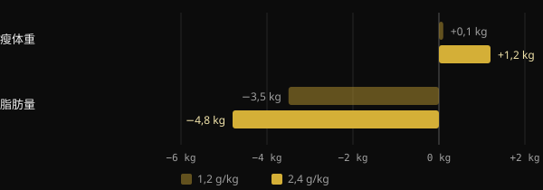
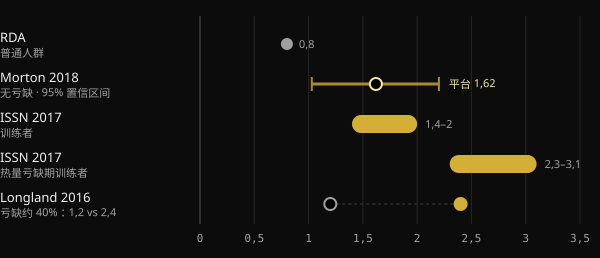

# 减脂期的蛋白质：究竟需要多少？

当你削减热量时，最大的担心是失去辛苦练出来的肌肉。蛋白质是研究最多的、用于避免这种情况的饮食手段，但流传的数字从每公斤 1.6 克到超过 4 克不等。本文带你看荟萃分析怎么说，为什么这些数字差别这么大，以及如何选出适合你的那一个。

## 要点速览

- 在热量缺口下，多吃蛋白质有助于保护瘦体重：在这一点上，研究是一致的。
- 没有热量缺口时，超过每天每公斤体重约 1.6 g，平均获益就趋于平缓。不确定范围可以延伸到约 2.2 g/kg。
- 在减脂期，建议值会上升：根据 Helms 及同事的综述，为每公斤瘦体重 2.3–3.1 g。
- 非常高的数值，即超过每公斤体重 3 g，并不是必须达到的下限。它们是观察到的数据中偏高的一端，其结果被作者自己称为探索性的。
- 起点也很重要：本来就吃很多蛋白质的人，进一步增加所能获得的收益可能更少。

## 为什么减脂期的情况不同

肌肉在不断更新：每天你都会合成一小部分，也会分解一小部分。当你摄入的比消耗的少时，身体也会把肌肉蛋白当作储备来使用。缺口越深、你越瘦，这种趋势就越强。

普渡大学对 18 项对照研究做的一项荟萃分析很好地说明了这一点。摄入高于 RDA（针对普通人群的推荐摄入量，0.8 g/kg）的蛋白质，使节食期间的瘦体重流失减少了约 0.36 kg。而对于没有节食、也不训练的人，则没有差异。多出来的蛋白质，主要是在身体承受压力时才有用：热量缺口、训练，或者两者兼有。

McMaster 大学 Longland 及同事的研究是最鲜明的例子。四十名年轻男性在四周内执行约 40% 的热量缺口，每周七天中有六天进行力量训练和高强度间歇训练。一半人每天吃 1.2 g/kg 的蛋白质，另一半吃 2.4 g/kg。

*来源：Longland et al., Am J Clin Nutr 2016（n = 40，采用四室模型测量身体成分）。图表由 Nurvan 制作。*

蛋白质更多的一组平均增加了 1.2 kg 瘦体重，而另一组只有 0.1 kg，并且减掉了更多脂肪。这是在短时间内、采用非常严苛方案得出的结果，但它指明了方向。

## 没有热量缺口时需要多少

要理解减脂期的数字，需要一个参照点。被引用最多的荟萃分析是 Morton 及同事的（2018）：49 项研究、1,863 名进行力量训练的人，全部处于正常热量或热量盈余状态。补充蛋白质平均增加了 0.30 kg 瘦体重。

使用最多的数据是平台点：超过约每天 1.62 g/kg，瘦体重不再进一步增加。置信区间，即真实值可能落入的范围，从 1.03 到 2.20 g/kg。因此，作者出于谨慎，建议想要最大化增长的人摄入约 2.2 g/kg。

日本的第二项荟萃分析纳入 105 项研究、5,402 人，发现了相似的趋势。每增加一些蛋白质都有益处，但超过 1.3 g/kg 之后，每上一个台阶的收益约小三倍。这就是典型的收益递减。

## 处于热量缺口时需要多少

在这里，数字会上升。2014 年，Helms 及同事分析了针对处于热量缺口、有力量训练基础的精瘦运动员的研究。他们的估计是：每公斤瘦体重 2.3–3.1 g，缺口越激进、人越瘦，就越趋向上限。国际运动营养学会（ISSN）的官方立场采用了相同的区间。

*来源：Hudson et al. 2020（RDA）；Morton et al. 2018；Jäger et al. 2017（ISSN）；Longland et al. 2016。数值单位为每公斤体重的克数。Helms 2014 的综述以每公斤瘦体重表示，为 2.3–3.1 g。图表由 Nurvan 制作。*

2025 年，同一团队用元回归更新了分析，纳入从 916 项中筛选出的 29 项研究。模型发现，存在线性关系的概率超过 97%：蛋白质越多，瘦体重保留得越好。当蛋白质按瘦体重计算时、在超过四周的干预中、在男性中以及在更瘦的人群中，这种关系更强。

有两个细节会改变解读。第一：在已收集的数据范围内呈线性关系，并不能说明它在哪里停止。最高的数值只表示研究所能达到的范围。第二：研究之间存在很大的异质性，作者将结果称为探索性的，而不是结论性的。

## 起点很重要

2026 年发表在 Sports Medicine 上的一篇评论补充了一个常被忽视的因素。元回归看的是处方剂量，但参与者的起点习惯各不相同。作者认为，在研究开始前就已经吃很多蛋白质的人，似乎从进一步增加中获得的收益更少。他们把这作为探索性证据提出，有待确认。实际意义是：从 1.2 提高到 2.2 g/kg，很可能比从 2.5 提高到 3.5 重要得多。

## 研究到底怎么说

本文的灵感来自 Stronger By Science 的一篇帖子，其中总结了他们的内部分析和 2025 年的元回归。以下是主要说法，并与文献来源进行对照。

- **已证实** — “减脂期需要更多蛋白质。” 综述、荟萃分析和对照研究都指向同一个方向。
- **已证实** — “此前的建议在 1.6 到 2.2 g/kg 之间。” 这与 Morton 2018 的平台点及其置信区间相符，但它针对的是没有热量缺口的人。
- **已证实** — “效果虽小但可观，并且收益递减。” Morton 2018（平均 +0.30 kg）和 Tagawa 2020 都显示了这一点。
- **需要补充说明** — “要最大程度保留，需要每公斤体重 3.2 g，或每公斤瘦体重 4.2 g。” 摘要描述的是一种没有上限的线性关系。这些数值是观察到的数据中偏高的一端，而不是已被证明的阈值，而且结果是探索性的。
- **需要补充说明** — “每多 1 g/kg，就有 97–99% 的概率保留更多瘦体重。” 这个百分比衡量的是效果朝正确方向发展的可能性有多大，而不是效果有多大。
- **无法验证** — 增肌和身体重组的区间（约 2–2.35 g/kg）来自 Stronger By Science 网站上发布的内部分析，而不是 PubMed 收录的期刊。

## 如何应用

举个例子：一个体重 80 kg、体脂率 15% 的人。他的瘦体重约为 68 kg。

| 参照 | 计算 | 每日蛋白质 |
|---|---|---|
| Morton 2018 平台点（无热量缺口） | 1.6 g × 80 kg | 128 g |
| Morton 2018 谨慎上限 | 2.2 g × 80 kg | 176 g |
| Helms 2014（热量缺口） | 2.3–3.1 g × 68 kg | 156–211 g |
| 帖子中引用的高值 | 4.2 g × 68 kg | 286 g |

1. **从扎实的基础开始。** 如果你现在吃的蛋白质很少，把摄入量提高到 1.6–2.2 g/kg，是回报最大的一步。
2. **减脂期要提高，尤其是已经很瘦的时候。** 缺口越激进、你越精瘦，就越适合处于 Helms 区间的偏高一端。
3. **体脂很高时，按瘦体重计算。** 使用总体重会无端地把数字算高。
4. **分配摄入量。** ISSN 建议每餐约 0.25 g/kg，即 20–40 g，每 3–4 小时一次。
5. **别忘了力量训练。** 在 Morton 的荟萃分析中，抗阻训练的作用远大于补充蛋白质。蛋白质是支持训练，而不是替代训练。

如果你有肾脏疾病或其他基础疾病，在大幅增加蛋白质之前，请先咨询医生。

<h3>设定你减脂期的蛋白质目标</h3>

Nurvan 会根据体重和目标计算蛋白质目标，在你处于减脂阶段时调高，你也可以手动修改。然后你可以在日记中逐餐跟进，并与体重、围度和负荷对照，看看你是否真的保住了肌肉。

<a href="https://nurvan.app">试用 Nurvan</a>

## 常见问题

### 蛋白质应该按当前体重算，还是按目标体重算？

如果你已经相当精瘦，按当前体重就可以。如果体脂很高，更合理的做法是按瘦体重来考虑，就像 Helms 2014 的综述那样。使用总体重会得出偏高的数字。

### 每餐吃多少蛋白质？

ISSN 的立场是每餐约 0.25 g/kg 体重，即 20–40 g，每 3–4 小时分配一次。不过，最重要的仍然是一整天的总量。

### 需要蛋白粉吗？

不是必须的。根据 ISSN，蛋白粉是在不增加过多热量的前提下达到目标摄入量的实用方法，在减脂期尤其有用。天然食物仍然是基础。

### 如果我不知道自己的瘦体重，该怎么办？

你可以根据体脂率的测量值来估算。或者，使用以 g/kg 体重表示的建议值，例如 1.6–2.2 g/kg，并在减脂期逐步提高。

## 参考文献

1. Refalo MC, Trexler ET, Helms ER, 2025. Effect of Dietary Protein on Fat-Free Mass in Energy Restricted, Resistance-Trained Individuals: An Updated Systematic Review With Meta-Regression. *Strength Cond J* 48(4):398–412. [DOI 10.1519/SSC.0000000000000888](https://doi.org/10.1519/SSC.0000000000000888)（该期刊未被 PubMed 收录）
2. Morton RW et al., 2018. A systematic review, meta-analysis and meta-regression of the effect of protein supplementation on resistance training-induced gains in muscle mass and strength in healthy adults. *Br J Sports Med* 52(6):376–384. [PMID 28698222](https://pubmed.ncbi.nlm.nih.gov/28698222/) · [DOI 10.1136/bjsports-2017-097608](https://doi.org/10.1136/bjsports-2017-097608)
3. Helms ER et al., 2014. A systematic review of dietary protein during caloric restriction in resistance trained lean athletes: a case for higher intakes. *Int J Sport Nutr Exerc Metab* 24(2):127–38. [PMID 24092765](https://pubmed.ncbi.nlm.nih.gov/24092765/) · [DOI 10.1123/ijsnem.2013-0054](https://doi.org/10.1123/ijsnem.2013-0054)
4. Jäger R et al., 2017. International Society of Sports Nutrition Position Stand: protein and exercise. *J Int Soc Sports Nutr* 14:20. [PMID 28642676](https://pubmed.ncbi.nlm.nih.gov/28642676/) · [DOI 10.1186/s12970-017-0177-8](https://doi.org/10.1186/s12970-017-0177-8)
5. Longland TM et al., 2016. Higher compared with lower dietary protein during an energy deficit combined with intense exercise promotes greater lean mass gain and fat mass loss: a randomized trial. *Am J Clin Nutr* 103(3):738–46. [PMID 26817506](https://pubmed.ncbi.nlm.nih.gov/26817506/) · [DOI 10.3945/ajcn.115.119339](https://doi.org/10.3945/ajcn.115.119339)
6. Hudson JL et al., 2020. Protein Intake Greater than the RDA Differentially Influences Whole-Body Lean Mass Responses to Purposeful Catabolic and Anabolic Stressors: A Systematic Review and Meta-analysis. *Adv Nutr* 11(3):548–558. [PMID 31794597](https://pubmed.ncbi.nlm.nih.gov/31794597/) · [DOI 10.1093/advances/nmz106](https://doi.org/10.1093/advances/nmz106)
7. Tagawa R et al., 2020. Dose-response relationship between protein intake and muscle mass increase: a systematic review and meta-analysis of randomized controlled trials. *Nutr Rev* 79(1):66–75. [PMID 33300582](https://pubmed.ncbi.nlm.nih.gov/33300582/) · [DOI 10.1093/nutrit/nuaa104](https://doi.org/10.1093/nutrit/nuaa104)
8. López-Moreno M, Quesada G, López-Gil JF, 2026. Starting Point Matters: Baseline Protein Intake as a Moderator of the Protein-Fat-Free Mass Relationship in Energy-Restricted Athletes. *Sports Med*. [PMID 42560437](https://pubmed.ncbi.nlm.nih.gov/42560437/) · [DOI 10.1007/s40279-026-02494-5](https://doi.org/10.1007/s40279-026-02494-5)

本文灵感来自 [Stronger By Science (@strongerbyscience)](https://www.instagram.com/p/Dd6ncPLF7mI/) 的一篇帖子。参考文献通过 PubMed 查阅。

> 注：本文仅供参考，不能替代医生或合格专业人士的意见。
