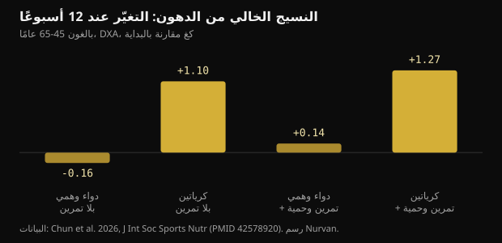
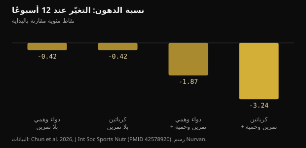

# 10 غرامات من الكرياتين يوميًا بلا نادٍ رياضي: ماذا وجدت الدراسة فعلًا

بعد سنّ الخامسة والأربعين تتكرّر النصيحة نفسها: ارفع الأثقال وتناول الكرياتين. حاولت تجربة من عام 2026 فصل الأمرين، وتابعت لمدة 12 أسبوعًا من اكتفوا بالنصف الثاني فقط. هذه هي الأرقام الحقيقية: ما يصمد منها وما لا يصمد.

## باختصار

- من تناولوا 10 غرامات من الكرياتين يوميًا دون تمرين اكتسبوا في المتوسط 1.1 كغ من النسيج الخالي من الدهون بقياس DXA خلال 12 أسبوعًا، بينما لم تتغيّر مجموعات الدواء الوهمي.
- النسيج الخالي من الدهون في قياس DXA يشمل الماء، والكرياتين يرفع ماء الجسم الكلي: جزء من هذا الكيلوغرام ليس عضلًا جديدًا.
- لم تنخفض نسبة الدهون بشكل ملموس إلا في المجموعة التي تدرّبت وأكلت أقل (-3.24 نقطة): الكرياتين وحده لم ينحّف أحدًا.
- الجزء المتعلّق بالذاكرة هو الأضعف: لا فرق على مجمل الاختبارات، والنتيجة الإيجابية الوحيدة تظهر في الأسبوع السادس وتختفي في الثاني عشر.
- يرتفع الكرياتينين في الدم قليلًا (أقل من 0.16 ملغ/دل) لأن الكرياتين يتحلّل إلى كرياتينين: هذا أثر قياس لا ضرر كلوي، ويستحسن إخبار من يقرأ التحاليل به.

## ماذا جرى عمليًا

أُجريت التجربة في مختبر تغذية الرياضة بجامعة تكساس إيه آند إم ونُشرت في Journal of the International Society of Sports Nutrition. اختار ثلاثة وسبعون بالغًا سليمًا قليل الحركة بين 45 و65 عامًا الانضمام إلى برنامج تمرين وحمية أو البقاء دونه، ثم وُزّعوا داخل كل مجموعة بطريقة مزدوجة التعمية بين 10 غرامات يوميًا من أحادي هيدرات الكرياتين (جرعتان من 5 غرامات) ودواء وهمي من المالتوديكسترين. أكمل أربعة وستون منهم الأسابيع الاثني عشر.

تضمّن البرنامج ثلاث حصص أثقال أسبوعيًا مع نحو 20 دقيقة من التمارين الهوائية، وحمية بعجز يومي بين 300 و500 سعرة. أما من لم يتدرّبوا فواصلوا حياتهم المعتادة. وفي الأسابيع 0 و6 و12 قيست تركيبة الجسم بـ DXA، والحد الأقصى في ضغط الصدر ودفع الأرجل، وتحاليل الدم صائمًا، ومجموعة اختبارات معرفية.

تفصيلان يزنان أكثر مما يبدو. الأول: ضمّت كل مجموعة بلا تمرين 13 شخصًا فقط، وهو عدد صغير. الثاني: كان التمرين من عدمه اختيارًا شخصيًا لا قرعة، لذلك لا تُقارن المجموعتان الكبريان كما في تجربة نظيفة. التوزيع العشوائي المعمّى اقتصر على الكرياتين مقابل الدواء الوهمي داخل كل مجموعة.

## النتيجة التي تصدّرت العناوين: كتلة خالية من الدهون بلا تمرين

بعد 12 أسبوعًا ارتفع النسيج الخالي من الدهون بقياس DXA بمقدار 1.1 كغ (فاصل ثقة 95%: 0.2 إلى 2.0) لدى من تناولوا الكرياتين دون تمرين، وبمقدار 1.27 كغ لدى من تناولوه مع التمرين والحمية. ولم يتغيّر شيء في مجموعتي الدواء الوهمي.

*النسيج الخالي من الدهون: التغيّر عند 12 أسبوعًا — البيانات: Chun et al. 2026, J Int Soc Sports Nutr (PMID 42578920). رسم Nurvan.*

هذا يخالف الفكرة الشائعة بأن الكرياتين لا يعمل إلا مع محفّز تدريبي. لكن هناك تحفظين. المنهج: يقيس DXA نسيجًا خاليًا من الدهون، أي عضلًا وماءً وأعضاءً، لا عضلًا خالصًا. ثم إن المجموعتين بلا تمرين كانتا الأصغر في الدراسة.

ثمة تفصيل يشير إليه الباحثون ويغيّر القراءة: أكلت مجموعة الكرياتين بلا تمرين أكثر من الجميع، بمدخول أعلى بدلالة إحصائية من الطاقة والكربوهيدرات. والكربوهيدرات الأكثر تعني غليكوجينًا عضليًا أكثر، وكل غرام غليكوجين يحتجز ماءً معه.

## لماذا «+1 كغ كتلة خالية من الدهون» ليست «+1 كغ عضل»

يدخل الكرياتين إلى العضلة مصحوبًا بالماء. في دراسة استعملت قياسات مباشرة لماء الجسم (تخفيف بأكسيد الديوتيريوم وبروميد الصوديوم)، رفع بروتوكول تحميل يتبعه حفاظ كرياتينَ العضلة ووزن الجسم وماء الجسم الكلي، دون أن يغيّر النسبة بين الماء داخل الخلايا وخارجها.

لا يعني هذا أن الكرياتين لا يبني عضلًا: فعلى مدى أشهر ومع التمرين يفعل. يعني أن جزءًا من ذلك الكيلوغرام، خلال 12 أسبوعًا بلا تمرين، هو ماء داخل الخلايا، وأن DXA لا يميّزه. الأثر حقيقي، لكن طبيعته أبسط مما يُروى.

تساعد مراجعة تحليلية من 2026 على نساء بعد سن اليأس في ضبط التوقعات: عبر سبع تجارب، أضاف الكرياتين 0.37 كغ من الكتلة الخالية من الدهون في المتوسط، بفوائد واضحة عند 5 غرامات يوميًا على الأقل مع تمارين المقاومة، بينما لم تُظهر الجرعات البالغة 3 غرامات أو أقل بلا تمرين أي أثر قابل للقياس.

## أما دهون الجسم، فلم يفعل الكرياتين وحده شيئًا

الصورة هنا واضحة. لم تنخفض نسبة الدهون انخفاضًا ذا معنى إلا في المجموعة التي جمعت الكرياتين والتمرين والعجز في السعرات: -3.24 نقطة مئوية مقابل -1.87 لمن تدرّبوا وخفّفوا الأكل مع الدواء الوهمي. وبلا تمرين، انتهى الكرياتين والدواء الوهمي إلى الموضع نفسه.

*نسبة الدهون: التغيّر عند 12 أسبوعًا — البيانات: Chun et al. 2026, J Int Soc Sports Nutr (PMID 42578920). رسم Nurvan.*

هذه أنفع إجابة تقدّمها الدراسة لمن يبحث عن طريق مختصر: الكرياتين يحسّن نتيجة مسار، ولا يحلّ محلّه. والرافعة الكبرى تبقى تمارين المقاومة مع العجز في السعرات.

## وماذا عن الذاكرة؟ أرقّ أجزاء الورقة

يتحدّث الملخّص عن تحسّن في بعض المؤشرات المعرفية. وبقراءة النتائج بالتفصيل يتقلّص الحماس.

- في اختبار استرجاع الكلمات، لا يُظهر التحليل العام أثرًا للزمن ولا للمجموعة. الإيجابية الوحيدة هي عدد الكلمات المسترجعة بشكل صحيح بعد تأخير، في الأسبوع السادس، لدى مجموعة الكرياتين بلا تمرين. وفي الأسبوع الثاني عشر تختفي.
- التعرّف على الصور واليقظة للأرقام واختبار ستروب: لا فائدة.
- في التعرّف على الكلمات، التحليل العام غير دال؛ ويبرز زمن استجابة واحد.
- في اختبار استجابة الاختيار، كانت نسبة الإجابات الصحيحة أفضل في مجموعة الدواء الوهمي بلا تمرين.

يكتب الباحثون أنفسهم أن النتائج المعرفية يجب اعتبارها استكشافية وأنه لم تُطبّق أي تصحيح للمقارنات المتعدّدة. وحين تُقاس عشرات المتغيّرات دون تصحيح، يكون ظهور بعض النتائج الإيجابية بالصدفة أمرًا متوقّعًا.

تعطي المراجعات التحليلية صورة أثبت وأكثر تواضعًا. عبر 16 تجربة عشوائية، يحسّن الكرياتين الذاكرة بأثر صغير (فرق المتوسطات المعياري 0.31) ولا يحسّن الوظيفة المعرفية العامة ولا التنفيذية؛ وحده أثر الذاكرة يبلغ يقينًا متوسطًا وفق GRADE. وتجد مراجعة أخرى على أصحّاء الأثر الصغير نفسه وتحصره بين 66 و76 عامًا، بلا شيء بين 11 و31.

## الكرياتينين وتحاليل الدم: الجانب العملي

يتحلّل الكرياتين تلقائيًا إلى كرياتينين، وهو الجزيء نفسه الذي يقيسه المختبر لتقدير وظيفة الكلى. وكلّما زاد الكرياتين في الدورة الدموية ظهر كرياتينين أكثر في الدم: هذه حسابات، لا ضرر في الكلى.

في الدراسة ارتفع الكرياتينين بنسبة 6 إلى 8% (أقل من 0.1 ملغ/دل) بلا تمرين، و16 إلى 18% (أقل من 0.16 ملغ/دل) مع التمرين، مع بقائه دون 1.0 ملغ/دل. ولذلك انخفض معدّل الترشيح الكبيبي المقدّر، المحسوب من الكرياتينين، بنسبة 5 إلى 7% و14 إلى 20% مع بقائه ضمن القيم الطبيعية. ويوضّح الباحثون أنهم لم يقيسوا السيستاتين C ولا الترشيح مباشرة، فلا ينبغي قراءة هذا الانخفاض على أنه تراجع في وظيفة الكلى.

الخلاصة العملية بسيطة: إن أجريت تحاليل أثناء تناول الكرياتين فأخبر من يفسّرها. وأي سؤال عن الكلى أو الدواء أو المرض مكانه الطبيب، لا قراءة تقرير بمفردك.

## ما تقوله الأبحاث فعلًا

**يحتاج توضيحًا** — 10 غرامات من الكرياتين يوميًا تضيف كتلة خالية من الدهون حتى بلا تمرين.

حدث ذلك في هذه الدراسة: +1.1 كغ من النسيج الخالي من الدهون بقياس DXA خلال 12 أسبوعًا مقابل لا تغيير مع الدواء الوهمي. لكن المجموعة ضمّت 13 شخصًا، ولم يوزّعوا إليها بالقرعة، وأكلوا أكثر من غيرهم، وDXA يحتسب ضمن النسيج الخالي من الدهون الماءَ الذي يجرّه الكرياتين إلى العضلة.

**غير صحيح** — الكرياتين وحده يحرق الدهون.

بلا تمرين، أنهى الكرياتين والدواء الوهمي الأسابيع الاثني عشر بالتغيّر نفسه في نسبة الدهون (-0.42 نقطة). أما الفارق الحقيقي، -3.24 نقطة، فجاء من الكرياتين مع الأثقال مع العجز في السعرات.

**يحتاج توضيحًا** — الكرياتين يحسّن الذاكرة بعد الخامسة والأربعين.

في هذه الدراسة، التحليل العام لاختبارات الذاكرة غير دال، والنتيجة الإيجابية الوحيدة تختفي في الأسبوع الثاني عشر. وتجد المراجعات التحليلية أثرًا صغيرًا على الذاكرة، أوضحَه بين 66 و76 عامًا، ولا أثر على الإدراك العام.

**يحتاج توضيحًا** — لا بدّ من 10 غرامات يوميًا.

اختيرت العشرة غرامات لأن الفرضيات المتعلّقة بالدماغ تتطلّب جرعات أعلى، لا لأن العضلة تحتاجها. وللكتلة والقوة يبقى مرجع بيان الموقف الصادر عن ISSN هو 3 إلى 5 غرامات يوميًا، وقد رأت المراجعة التحليلية لنساء بعد سن اليأس فوائد ابتداءً من 5 غرامات مع الأثقال.

**غير صحيح** — ارتفاع الكرياتينين مع الكرياتين يدلّ على مشكلة في الكلى.

يتحوّل الكرياتين إلى كرياتينين: ترتفع القيمة لأسباب أيضية وتسحب معها إلى الأسفل الترشيحَ المقدّر المحسوب منها. ولم يجد تحليل لـ684 تجربة عشوائية أي زيادة في الآثار الجانبية الكلوية أو الكبدية أو الهضمية مقارنة بالدواء الوهمي، حتى عند أعلى الجرعات وأطول المدد.

**غير قابل للتحقّق** — الكرياتين بلا تمرين يزيد التوتّر.

كانت درجة التوتّر في استبيان المزاج أعلى لدى مجموعة الكرياتين بلا تمرين منها لدى الدواء الوهمي في الأسبوع الثاني عشر، لكن التحليل العام للاستبيان لا يُظهر فروقًا دالة. إنها قراءة واحدة بين عشرات المقارنات.

## كيف تطبّق ذلك

1. إن استطعت التمرين فتمرّن: أعطت الحزمة الكاملة (أثقال، تمارين هوائية، عجز معتدل، كرياتين) أكبر تغيّر في الدهون والقوة. والكرياتين وحده لا يبلغ ذلك.
2. إن لم تكن تتمرّن، تبقى 3 إلى 5 غرامات يوميًا من أحادي هيدرات الكرياتين هي الجرعة المرجعية لدى ISSN للكتلة والقوة. أما العشرة غرامات في الدراسة فمصدرها فرضية عن الدماغ، لا ميزة عضلية مثبتة.
3. لا تنتظر خسارة دهون من الكرياتين. قد يرتفع الوزن على الميزان في الأسابيع الأولى بسبب الماء المحتجز في العضلة: هذا متوقّع وليس دهنًا.
4. زن نفسك وقس محيطاتك دائمًا في الظروف نفسها، واقرأ الاتجاه عبر 4 إلى 6 أسابيع لا عبر يوم واحد. فماء الجسم يتحرّك أكثر من أن تُقرأ قراءة مفردة.
5. إن أجريت تحاليل دم فاذكر أنك تتناول الكرياتين. فالكرياتينين والترشيح المقدّر يُقرآن حينها بطريقة مختلفة، والتقييم للطبيب.
6. سجّل أوزانك في التمرين: إن لم ترتفع القوة خلال 8 إلى 12 أسبوعًا فالمشكلة في البرنامج أو الاستشفاء، لا في ماركة المكمّل.

> **الأوزان والقياسات والمكمّلات في مكان واحد**  
> في Nurvan تسجّل المجموعات والأوزان وRIR حصّةً بعد حصّة، وتتابع وزنك وقياساتك عبر الزمن، وتدوّن المكمّلات التي تتناولها ومنها الكرياتين. ويحفظ قسم التحاليل تقاريرك إلى جانب البقية، فتكون البيانات جاهزة حين تتحدّث مع طبيبك أو مدرّبك. — **جرّب Nurvan** (https://nurvan.app)

## أسئلة شائعة

### هل ينفع الكرياتين إن لم أذهب إلى النادي؟

في هذه الدراسة ارتفع لدى من تناولوه بلا تمرين النسيجُ الخالي من الدهون بقياس DXA والحدُّ الأقصى في ضغط الصدر. ضمّت المجموعة 13 شخصًا، وجزء من الزيادة ماء محتجز في العضلة. ويبقى أمتن آثار الكرياتين ذاك الذي يحقّقه مع تمارين المقاومة.

### أيّهما أفضل: 5 أم 10 غرامات يوميًا؟

للكتلة والقوة المرجع هو 3 إلى 5 غرامات يوميًا. أما الجرعات الأعلى فاستُعملت في دراسات تبحث عن آثار دماغية، حيث الأدلة ما زالت قليلة وغير ثابتة. والعضلة لا تحتاج عشرة غرامات.

### هل يضرّ الكرياتين بالكلى؟

لدى الأصحّاء لم تجد المراجعات ضررًا كلويًا، ولم ير تحليل 684 تجربة عشوائية آثارًا جانبية أكثر من الدواء الوهمي. يرتفع الكرياتينين لأسباب أيضية فينخفض الترشيح المقدّر: وهذا أثر حسابي. ومن لديه مرض كلوي معروف أو شكّ في نتائجه فليراجع طبيبه.

### كم من الوزن المكتسب ماء؟

لم تفصّل الدراسة ذلك. تُظهر الأعمال التي تقيس ماء الجسم مباشرة أن الكرياتين يرفع ماء الجسم الكلي دون تغيير النسبة بين الماء داخل الخلايا وخارجها. وخلال 12 أسبوعًا بلا تمرين، من المعقول أن يكون جزء من الكيلوغرام ماءً.

## المصادر

- Chun J, Liu Y, Kibler GL et al., 2026. Effects of creatine supplementation with and without exercise and diet intervention on body composition, cognitive function, and markers of health in middle-aged and older adults. J Int Soc Sports Nutr 23(sup1):2716273. [PMID 42578920](https://pubmed.ncbi.nlm.nih.gov/42578920/) · [DOI 10.1080/15502783.2026.2716273](https://doi.org/10.1080/15502783.2026.2716273)
- Naddafha S, Antonio J, Kreider RB, Stout JR, 2026. Creatine monohydrate for lean mass, strength, and bone density in postmenopausal women: a systematic review and meta-analysis. J Int Soc Sports Nutr 23(1):2668435. [PMID 42141930](https://pubmed.ncbi.nlm.nih.gov/42141930/) · [DOI 10.1080/15502783.2026.2668435](https://doi.org/10.1080/15502783.2026.2668435)
- Xu C, Bi S, Zhang W, Luo L, 2024. The effects of creatine supplementation on cognitive function in adults: a systematic review and meta-analysis. Front Nutr 11:1424972. [PMID 39070254](https://pubmed.ncbi.nlm.nih.gov/39070254/) · [DOI 10.3389/fnut.2024.1424972](https://doi.org/10.3389/fnut.2024.1424972)
- Prokopidis K, Giannos P, Triantafyllidis KK et al., 2023. Effects of creatine supplementation on memory in healthy individuals: a systematic review and meta-analysis of randomized controlled trials. Nutr Rev 81(4):416-427. [PMID 35984306](https://pubmed.ncbi.nlm.nih.gov/35984306/) · [DOI 10.1093/nutrit/nuac064](https://doi.org/10.1093/nutrit/nuac064)
- Powers ME, Arnold BL, Weltman AL et al., 2003. Creatine supplementation increases total body water without altering fluid distribution. J Athl Train 38(1):44-50. [PMID 12937471](https://pubmed.ncbi.nlm.nih.gov/12937471/)
- Gonzalez DE, Dickerson BL, Hines K et al., 2026. Creatine supplementation dose and duration are not associated with increased side effects: a structured review and study-level dose-response analysis of randomized controlled trials. Sports 14(4):137. [PMID 42043069](https://pubmed.ncbi.nlm.nih.gov/42043069/) · [DOI 10.3390/sports14040137](https://doi.org/10.3390/sports14040137)
- Kreider RB, Kalman DS, Antonio J et al., 2017. International Society of Sports Nutrition position stand: safety and efficacy of creatine supplementation in exercise, sport, and medicine. J Int Soc Sports Nutr 14:18. [PMID 28615996](https://pubmed.ncbi.nlm.nih.gov/28615996/) · [DOI 10.1186/s12970-017-0173-z](https://doi.org/10.1186/s12970-017-0173-z)

هذا المقال مستوحى من منشور لـ [Dan Garner (@dangarnernutrition)](https://www.instagram.com/p/Dd1cvUmkUS7/). المصادر عبر PubMed.

> ملاحظة: محتوى تثقيفي لا يغني عن رأي طبيب أو مختصّ مؤهّل.
