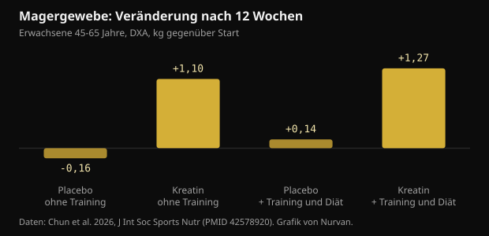
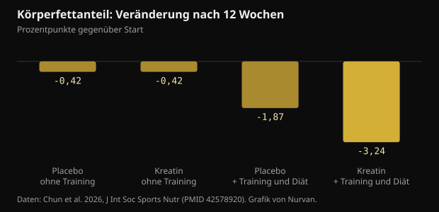

# 10 g Kreatin pro Tag ohne Studio: was die Studie wirklich gefunden hat

Ab 45 lautet der Standardrat: Gewichte heben und Kreatin nehmen. Eine Studie von 2026 hat versucht, beides zu trennen, und 12 Wochen lang auch jene begleitet, die nur die zweite Hälfte umsetzten. Hier stehen die echten Zahlen, die haltbaren und die nicht haltbaren.

## Kurz gefasst

- Wer 10 g Kreatin pro Tag ohne Training nahm, legte in 12 Wochen im Mittel 1,1 kg DXA-Magergewebe zu; in den Placebogruppen bewegte sich nichts.
- Das im DXA gemessene Magergewebe enthält auch Wasser, und Kreatin erhöht das Gesamtkörperwasser: ein Teil dieses Kilos ist kein neuer Muskel.
- Der Körperfettanteil sank deutlich nur in der Gruppe, die trainierte und weniger aß (-3,24 Punkte): Kreatin allein hat niemanden schlanker gemacht.
- Der Gedächtnisteil ist der schwächste: über die gesamte Testbatterie gab es keinen Unterschied, und das einzige positive Ergebnis taucht in Woche 6 auf und ist in Woche 12 verschwunden.
- Das Kreatinin im Blut steigt leicht (unter 0,16 mg/dL), weil Kreatin zu Kreatinin abgebaut wird: ein Messeffekt, kein Nierenschaden. Sag es, wer deine Werte liest.

## Was konkret gemacht wurde

Die Studie lief am sportnährstoffwissenschaftlichen Labor der Texas A&M University und erschien im Journal of the International Society of Sports Nutrition. Dreiundsiebzig gesunde, untrainierte Erwachsene zwischen 45 und 65 Jahren entschieden selbst, ob sie an einem Trainings- und Diätprogramm teilnehmen; innerhalb beider Blöcke wurden sie dann doppelblind 10 g Kreatinmonohydrat pro Tag (zweimal 5 g) oder einem Maltodextrin-Placebo zugeteilt. Vierundsechzig beendeten die 12 Wochen.

Das Programm umfasste drei Krafteinheiten pro Woche plus rund 20 Minuten Ausdauer, bei einer Ernährung mit 300 bis 500 kcal Defizit täglich. Wer nicht trainierte, lebte weiter wie bisher. In Woche 0, 6 und 12 wurden Körperzusammensetzung per DXA, Maximalkraft im Bankdrücken und an der Beinpresse, Nüchternblutwerte und eine Batterie kognitiver Tests erhoben.

Zwei Details wiegen schwerer, als sie aussehen. Erstens: Jede Gruppe ohne Training bestand aus 13 Personen, das ist wenig. Zweitens: Ob trainiert wurde, war eine freie Entscheidung und keine Zuteilung per Los, die beiden Blöcke sind also nicht wie in einem sauberen Experiment vergleichbar. Verblindet randomisiert war nur Kreatin gegen Placebo innerhalb jedes Blocks.

## Das Ergebnis mit Schlagzeilenwert: Magermasse ohne Training

Nach 12 Wochen lag das DXA-Magergewebe um 1,1 kg höher (95-%-Konfidenzintervall: 0,2 bis 2,0) bei denen, die Kreatin ohne Training nahmen, und um 1,27 kg bei denen, die es mit Training und Diät nahmen. In beiden Placebogruppen änderte sich nichts.

*Magergewebe: Veränderung nach 12 Wochen — Daten: Chun et al. 2026, J Int Soc Sports Nutr (PMID 42578920). Grafik von Nurvan.*

Das widerspricht der verbreiteten Vorstellung, Kreatin wirke nur mit Trainingsreiz. Zwei Einschränkungen gehören dazu. Die Methode: DXA misst Magergewebe, also Muskel plus Wasser plus Organe, nicht reinen Muskel. Und die Gruppen ohne Training waren die kleinsten der Studie.

Ein von den Autoren genanntes Detail verschiebt die Deutung: Die Kreatingruppe ohne Training aß mehr als alle anderen, mit signifikant höherer Energie- und Kohlenhydratzufuhr. Mehr Kohlenhydrate heißt mehr Muskelglykogen, und jedes Gramm Glykogen bindet Wasser.

## Warum „+1 kg Magermasse“ nicht „+1 kg Muskel“ heißt

Kreatin gelangt zusammen mit Wasser in den Muskel. In einer Studie mit direkten Messungen des Körperwassers (Verdünnung mit Deuteriumoxid und Natriumbromid) erhöhte ein Lade- und Erhaltungsprotokoll das Muskelkreatin, das Körpergewicht und das Gesamtkörperwasser, ohne das Verhältnis zwischen intra- und extrazellulärem Wasser zu verschieben.

Das heißt nicht, dass Kreatin keinen Muskel aufbaut: über Monate und mit Training tut es das. Es heißt, dass in 12 Wochen ohne Training ein Teil dieses Kilos intrazelluläres Wasser ist und DXA das nicht trennen kann. Der Effekt ist echt, seine Natur nur gewöhnlicher als erzählt.

Eine Metaanalyse von 2026 bei Frauen nach der Menopause hilft beim Kalibrieren: Über sieben Studien hinweg erhöhte Kreatin die Magermasse um durchschnittlich 0,37 kg, mit klaren Vorteilen, wenn mindestens 5 g pro Tag mit Krafttraining kombiniert wurden, während Dosen von 3 g oder weniger ohne Training keinen messbaren Effekt zeigten.

## Beim Körperfett hat Kreatin allein nichts bewirkt

Hier ist das Bild klar. Der Körperfettanteil sank nennenswert nur in der Gruppe aus Kreatin, Training und Kaloriendefizit: -3,24 Prozentpunkte gegenüber -1,87 bei Training und Diät mit Placebo. Ohne Training landeten Kreatin und Placebo an derselben Stelle.

*Körperfettanteil: Veränderung nach 12 Wochen — Daten: Chun et al. 2026, J Int Soc Sports Nutr (PMID 42578920). Grafik von Nurvan.*

Das ist die nützlichste Antwort der Studie an alle, die eine Abkürzung suchen: Kreatin verbessert das Ergebnis eines Prozesses, es ersetzt ihn nicht. Der große Hebel bleibt Krafttraining plus Kaloriendefizit.

## Und das Gedächtnis? Der dünnste Teil der Arbeit

Die Zusammenfassung spricht von Verbesserungen bei ausgewählten kognitiven Markern. Liest man die Ergebnisse genauer, schrumpft die Begeisterung.

- Beim Wortabruf zeigt die Gesamtanalyse weder einen Zeit- noch einen Gruppeneffekt. Positiv ist allein die Zahl korrekt erinnerter Wörter nach Verzögerung, in Woche 6, in der Kreatingruppe ohne Training. In Woche 12 ist sie weg.
- Bilderkennung, Zahlenvigilanz und Stroop-Test: kein Nutzen.
- Bei der Worterkennung ist die Gesamtanalyse nicht signifikant; eine einzelne Reaktionszeit fällt auf.
- Beim Wahlreaktionstest war der Anteil richtiger Antworten in der Placebogruppe ohne Training besser.

Die Autoren schreiben selbst, die kognitiven Befunde seien explorativ und es sei keine Korrektur für multiples Testen angewendet worden. Wer Dutzende Variablen ohne Korrektur misst, bekommt zufällige Treffer.

Metaanalysen zeichnen ein stabileres und bescheideneres Bild. Über 16 randomisierte Studien verbessert Kreatin das Gedächtnis mit kleinem Effekt (standardisierte Mittelwertdifferenz 0,31) und verbessert weder die globale kognitive noch die exekutive Funktion; nur der Gedächtniseffekt erreicht nach GRADE moderate Sicherheit. Eine weitere Metaanalyse bei Gesunden findet denselben kleinen Effekt und verortet ihn zwischen 66 und 76 Jahren, während zwischen 11 und 31 nichts bleibt.

## Kreatinin und Blutwerte: das Praktische

Kreatin zerfällt spontan zu Kreatinin, genau dem Molekül, das Labore zur Schätzung der Nierenfunktion messen. Je mehr Kreatin zirkuliert, desto mehr Kreatinin erscheint im Blut: Arithmetik, kein Nierenschaden.

In der Studie stieg Kreatinin ohne Training um 6 bis 8 % (unter 0,1 mg/dL) und mit Training um 16 bis 18 % (unter 0,16 mg/dL), blieb aber unter 1,0 mg/dL. Die aus dem Kreatinin berechnete geschätzte glomeruläre Filtrationsrate sank entsprechend um 5 bis 7 % beziehungsweise 14 bis 20 % und blieb dabei im Normbereich. Die Autoren halten fest, dass weder Cystatin C noch die Filtration direkt gemessen wurden; dieser Rückgang darf daher nicht als verminderte Nierenfunktion gelesen werden.

Die praktische Folge ist einfach: Wer Blut abnehmen lässt und Kreatin nimmt, sagt es der Person, die die Werte beurteilt. Jede Frage zu Nieren, Medikamenten oder Krankheiten gehört zur Ärztin oder zum Arzt, nicht zu einem allein gelesenen Befund.

## Was die Forschung wirklich sagt

**Einordnen** — 10 g Kreatin täglich bringen auch ohne Training Magermasse.

In dieser Studie war es so: +1,1 kg DXA-Magergewebe in 12 Wochen gegenüber keiner Veränderung unter Placebo. Doch die Gruppe hatte 13 Personen, wurde nicht per Los in diesen Arm gesetzt, aß mehr als die anderen, und DXA zählt das Wasser, das Kreatin in den Muskel zieht, als Magergewebe.

**Widerlegt** — Kreatin allein verbrennt Fett.

Ohne Training beendeten Kreatin und Placebo die 12 Wochen mit derselben Veränderung des Körperfettanteils (-0,42 Punkte). Der echte Unterschied, -3,24 Punkte, kam nur aus Kreatin plus Gewichten plus Kaloriendefizit.

**Einordnen** — Kreatin verbessert das Gedächtnis nach 45.

In dieser Studie ist die Gesamtanalyse der Gedächtnistests nicht signifikant, und der einzige positive Befund verschwindet bis Woche 12. Metaanalysen finden einen kleinen Gedächtniseffekt, am deutlichsten zwischen 66 und 76 Jahren, und keinen auf die globale Kognition.

**Einordnen** — Es braucht 10 g pro Tag.

Zehn Gramm wurden gewählt, weil Hypothesen zum Gehirn höhere Dosen verlangen, nicht weil der Muskel sie braucht. Für Masse und Kraft bleibt die Referenz des ISSN-Positionspapiers 3 bis 5 g täglich, und die Metaanalyse zu Frauen nach der Menopause sah Vorteile ab 5 g zusammen mit Krafttraining.

**Widerlegt** — Steigendes Kreatinin unter Kreatin zeigt ein Nierenproblem an.

Kreatin wird zu Kreatinin: Der Wert steigt aus Stoffwechselgründen und zieht die daraus berechnete geschätzte Filtrationsrate nach unten. Eine Auswertung von 684 randomisierten Studien fand keine Zunahme renaler, hepatischer oder gastrointestinaler Nebenwirkungen gegenüber Placebo, auch nicht bei den höchsten Dosen und längsten Zeiträumen.

**Nicht prüfbar** — Kreatin ohne Training macht angespannter.

Der Anspannungswert im Stimmungsfragebogen war in Woche 12 in der Kreatingruppe ohne Training höher als unter Placebo, doch die Gesamtanalyse des Fragebogens zeigt keine signifikanten Unterschiede. Ein Einzelwert unter Dutzenden Vergleichen.

## So wendest du es an

1. Wenn du trainieren kannst, trainiere: Das volle Paket (Gewichte, Ausdauer, moderates Defizit, Kreatin) brachte die größte Veränderung bei Fett und Kraft. Kreatin allein kommt dort nicht hin.
2. Wenn du nicht trainierst, bleiben 3 bis 5 g Kreatinmonohydrat täglich die ISSN-Referenzdosis für Masse und Kraft. Die 10 g der Studie stammen aus einer Gehirnhypothese, nicht aus einem belegten Muskelvorteil.
3. Erwarte von Kreatin keinen Fettverlust. Das Waagengewicht kann in den ersten Wochen durch Wasser im Muskel steigen: Das ist erwartbar und kein Fett.
4. Wiege und miss dich immer unter gleichen Bedingungen und lies Trends über 4 bis 6 Wochen, nicht einzelne Tage. Körperwasser schwankt zu stark.
5. Wenn du Blutwerte machen lässt, sag, dass du Kreatin nimmst. Kreatinin und geschätzte Filtration liest man dann anders, und die Beurteilung liegt bei der Ärztin oder dem Arzt.
6. Protokolliere deine Lasten: Steigt die Kraft in 8 bis 12 Wochen nicht, liegt es am Programm oder an der Erholung, nicht an der Marke des Supplements.

> **Lasten, Maße und Supplements an einem Ort**  
> In Nurvan trägst du Sätze, Lasten und RIR Einheit für Einheit ein, verfolgst Gewicht und Umfänge über die Zeit und notierst die Supplements, die du nimmst, Kreatin eingeschlossen. Im Bereich für Laborwerte liegen deine Befunde neben allem anderen, sodass die Daten schon da sind, wenn du mit Ärztin oder Coach sprichst. — **Nurvan testen** (https://nurvan.app)

## Häufige Fragen

### Wirkt Kreatin, wenn ich nicht ins Studio gehe?

In dieser Studie stieg bei denen ohne Training das DXA-Magergewebe und das Maximum im Bankdrücken. Die Gruppe hatte 13 Personen, und ein Teil des Zuwachses ist Wasser im Muskel. Der belastbarste Kreatineffekt bleibt der zusammen mit Krafttraining.

### Besser 5 g oder 10 g pro Tag?

Für Masse und Kraft ist die Referenz 3 bis 5 g täglich. Höhere Dosen wurden in Studien zu Gehirneffekten eingesetzt, wo die Evidenz klein und uneinheitlich ist. Für den Muskel braucht es keine 10 g.

### Schadet Kreatin den Nieren?

Bei Gesunden fanden Übersichtsarbeiten keinen Nierenschaden, und die Auswertung von 684 randomisierten Studien sah nicht mehr Nebenwirkungen als unter Placebo. Das Kreatinin steigt aus Stoffwechselgründen, was die geschätzte Filtration senkt: ein Rechenartefakt. Wer eine bekannte Nierenerkrankung hat oder unsicher ist, spricht mit der Ärztin oder dem Arzt.

### Wie viel des Gewichtszuwachses ist Wasser?

Die Studie hat das nicht aufgeschlüsselt. Arbeiten mit direkten Messungen des Körperwassers zeigen, dass Kreatin das Gesamtkörperwasser erhöht, ohne das Verhältnis zwischen intra- und extrazellulärem Wasser zu verschieben. Über 12 Wochen ohne Training ist ein Wasseranteil am Kilo plausibel.

## Quellen

- Chun J, Liu Y, Kibler GL et al., 2026. Effects of creatine supplementation with and without exercise and diet intervention on body composition, cognitive function, and markers of health in middle-aged and older adults. J Int Soc Sports Nutr 23(sup1):2716273. [PMID 42578920](https://pubmed.ncbi.nlm.nih.gov/42578920/) · [DOI 10.1080/15502783.2026.2716273](https://doi.org/10.1080/15502783.2026.2716273)
- Naddafha S, Antonio J, Kreider RB, Stout JR, 2026. Creatine monohydrate for lean mass, strength, and bone density in postmenopausal women: a systematic review and meta-analysis. J Int Soc Sports Nutr 23(1):2668435. [PMID 42141930](https://pubmed.ncbi.nlm.nih.gov/42141930/) · [DOI 10.1080/15502783.2026.2668435](https://doi.org/10.1080/15502783.2026.2668435)
- Xu C, Bi S, Zhang W, Luo L, 2024. The effects of creatine supplementation on cognitive function in adults: a systematic review and meta-analysis. Front Nutr 11:1424972. [PMID 39070254](https://pubmed.ncbi.nlm.nih.gov/39070254/) · [DOI 10.3389/fnut.2024.1424972](https://doi.org/10.3389/fnut.2024.1424972)
- Prokopidis K, Giannos P, Triantafyllidis KK et al., 2023. Effects of creatine supplementation on memory in healthy individuals: a systematic review and meta-analysis of randomized controlled trials. Nutr Rev 81(4):416-427. [PMID 35984306](https://pubmed.ncbi.nlm.nih.gov/35984306/) · [DOI 10.1093/nutrit/nuac064](https://doi.org/10.1093/nutrit/nuac064)
- Powers ME, Arnold BL, Weltman AL et al., 2003. Creatine supplementation increases total body water without altering fluid distribution. J Athl Train 38(1):44-50. [PMID 12937471](https://pubmed.ncbi.nlm.nih.gov/12937471/)
- Gonzalez DE, Dickerson BL, Hines K et al., 2026. Creatine supplementation dose and duration are not associated with increased side effects: a structured review and study-level dose-response analysis of randomized controlled trials. Sports 14(4):137. [PMID 42043069](https://pubmed.ncbi.nlm.nih.gov/42043069/) · [DOI 10.3390/sports14040137](https://doi.org/10.3390/sports14040137)
- Kreider RB, Kalman DS, Antonio J et al., 2017. International Society of Sports Nutrition position stand: safety and efficacy of creatine supplementation in exercise, sport, and medicine. J Int Soc Sports Nutr 14:18. [PMID 28615996](https://pubmed.ncbi.nlm.nih.gov/28615996/) · [DOI 10.1186/s12970-017-0173-z](https://doi.org/10.1186/s12970-017-0173-z)

Dieser Artikel wurde durch einen Beitrag von [Dan Garner (@dangarnernutrition)](https://www.instagram.com/p/Dd1cvUmkUS7/) angeregt. Quellen über PubMed recherchiert.

> Hinweis: informativer Inhalt. Er ersetzt nicht die Einschätzung einer Ärztin, eines Arztes oder einer qualifizierten Fachperson.
