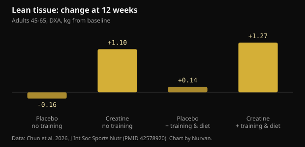
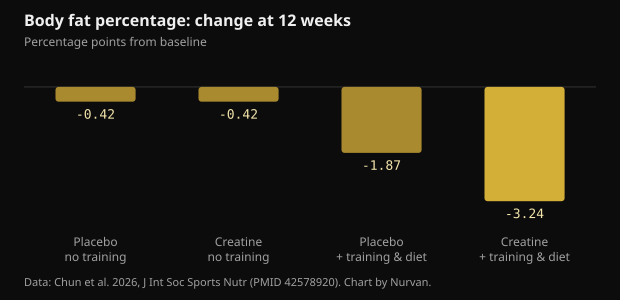

# 10 g of creatine a day with no gym: what the study really found

After 45 the standard advice is: lift weights and take creatine. A 2026 trial tried to separate the two and followed, for 12 weeks, people who only did the second half. Here are the real numbers, the ones that hold up and the ones that do not.

## The short version

- People who took 10 g of creatine a day without training gained about 1.1 kg of DXA lean tissue in 12 weeks; the placebo groups did not move.
- DXA lean tissue includes water, and creatine raises total body water, so part of that kilogram is not new muscle.
- Body fat percentage dropped meaningfully only in the group that trained and ate less (-3.24 points): creatine alone did not drive fat loss.
- The memory claim is the weakest part. Across the test battery there was no overall difference, and the one positive result appears at week 6 and is gone by week 12.
- Blood creatinine rose slightly (under 0.16 mg/dL) because creatine degrades into creatinine. That is a measurement effect, not kidney damage, and it is worth telling whoever reads your labs.

## What was actually done

The trial ran at the Exercise and Sport Nutrition Lab at Texas A&M University and was published in the Journal of the International Society of Sports Nutrition. Seventy-three healthy sedentary adults aged 45 to 65 chose whether to join an exercise and diet programme or stay without one; within each block they were then assigned, double-blind, to 10 g a day of creatine monohydrate (two 5 g doses) or a maltodextrin placebo. Sixty-four finished the 12 weeks.

The programme was three weekly sessions of resistance training plus about 20 minutes of cardio, with a diet set at a 300-500 kcal daily deficit. The non-exercise group carried on with normal life. At 0, 6 and 12 weeks the researchers measured body composition by DXA, one-rep max on bench press and leg press, fasting bloods and a battery of cognitive tests.

Two details matter more than they look. First, each non-exercise group held 13 people, which is small. Second, exercise status was self-selected rather than randomised, so the two blocks are not comparable the way a clean experiment would be. The blinded randomisation only covered creatine versus placebo inside each block.

## The headline result: lean mass without training

After 12 weeks, DXA lean tissue was up 1.1 kg (95% confidence interval 0.2 to 2.0) in the creatine group that did not train, and up 1.27 kg in the creatine group that trained and dieted. Neither placebo group changed.

*Lean tissue: change at 12 weeks — Data: Chun et al. 2026, J Int Soc Sports Nutr (PMID 42578920). Chart by Nurvan.*

That cuts against the common line that creatine only works with a training stimulus. It comes with two caveats. The method: DXA measures lean tissue, which is muscle plus water plus organs, not muscle alone. And the non-exercise groups were the smallest in the study.

One detail the authors flag changes how you read it: the no-training creatine group ate more than everyone else, with significantly higher energy and carbohydrate intake. More carbohydrate means more muscle glycogen, and every gram of glycogen holds water with it.

## Why “+1 kg of lean mass” is not “+1 kg of muscle”

Creatine enters muscle together with water. In a study using direct measures of body water (deuterium oxide and sodium bromide dilution), a loading-then-maintenance protocol raised muscle creatine, body mass and total body water without shifting the balance between water inside and outside cells.

This does not mean creatine fails to build muscle: over months, with training, it does. It means that in 12 weeks without training part of that kilogram is intracellular water, and DXA cannot tell the difference. The effect is real; its nature is more ordinary than the headlines suggest.

A 2026 meta-analysis in postmenopausal women helps set expectations. Across seven trials, creatine added 0.37 kg of lean mass on average, with clear benefits when at least 5 g a day was combined with resistance training, while doses of 3 g or less without training showed no measurable effect.

## On body fat, creatine alone did nothing

Here the picture is clean. Body fat percentage fell meaningfully only in the group combining creatine, training and a calorie deficit: -3.24 percentage points against -1.87 for training and dieting on placebo. Without training, creatine and placebo ended in the same place.

*Body fat percentage: change at 12 weeks — Data: Chun et al. 2026, J Int Soc Sports Nutr (PMID 42578920). Chart by Nurvan.*

That is the most useful answer the study offers anyone looking for a shortcut. Creatine improves the result of a process; it does not replace it. The big lever is still resistance training plus the calorie deficit.

## What about memory? The thinnest part of the paper

The abstract mentions improvements in selected markers of cognition. Read the results in detail and the enthusiasm shrinks.

- On word recall, the overall analysis shows no effect of time or group. The single positive is the number of words correctly recalled after a delay, at week 6, in the no-training creatine group. By week 12 it is gone.
- Picture recognition, digit vigilance and the Stroop task: no benefit.
- On word recognition the overall analysis is not significant; one reaction-time measure comes out.
- On the choice reaction task, the share of correct answers was better in the no-training placebo group.

The authors say plainly that the cognitive findings are exploratory and that no correction was applied across the many outcomes tested. When you measure dozens of variables without correction, some positives by chance are expected.

Meta-analyses give a steadier and smaller picture. Across 16 randomised trials, creatine improves memory with a small effect (standardised mean difference 0.31) and does not improve overall cognitive function or executive function; only the memory effect reaches moderate certainty under GRADE. A second meta-analysis in healthy people finds the same small memory effect and locates it in the 66-76 age band, with nothing between 11 and 31.

## Creatinine and blood work: the practical bit

Creatine degrades spontaneously into creatinine, the molecule labs measure to estimate kidney function. More creatine in circulation means more creatinine in blood. That is arithmetic, not kidney damage.

In the study creatinine rose 6-8% (under 0.1 mg/dL) without training and 16-18% (under 0.16 mg/dL) with it, staying below 1.0 mg/dL. Estimated glomerular filtration rate, which is calculated from creatinine, therefore fell by 5-7% and 14-20% while staying inside normal ranges. The authors note that they measured neither cystatin C nor filtration directly, so that drop should not be read as reduced kidney function.

The practical takeaway is simple: if you get blood work while taking creatine, tell whoever interprets it. Any question about kidneys, medication or disease belongs with your doctor, not with a lab report read alone.

## What the research actually says

**Needs context** — 10 g of creatine a day adds lean mass even without training.

It happened in this study: +1.1 kg of DXA lean tissue in 12 weeks against no change on placebo. But the group held 13 people, was not randomised into that arm, ate more than the others, and DXA counts as lean tissue the water creatine pulls into muscle.

**Not supported** — Creatine on its own burns fat.

Without training, creatine and placebo finished the 12 weeks with the same change in body fat percentage (-0.42 points). The real difference, -3.24 points, came only from creatine plus weights plus a calorie deficit.

**Needs context** — Creatine improves memory after 45.

In this study the overall analysis of the memory tests is not significant and the single positive disappears by week 12. Meta-analyses find a small memory effect, clearest between 66 and 76 years, and no effect on overall cognition.

**Needs context** — You need 10 g a day.

Ten grams was chosen because brain hypotheses call for higher doses, not because muscle needs it. For mass and strength the ISSN position stand reference is still 3-5 g a day, and the postmenopausal meta-analysis saw benefits from 5 g combined with lifting.

**Not supported** — Rising creatinine on creatine signals a kidney problem.

Creatine turns into creatinine, so the value climbs for metabolic reasons and drags down the estimated filtration rate calculated from it. An analysis of 684 randomised trials found no increase in renal, liver or gastrointestinal side effects versus placebo, even at the highest doses and longest durations.

**Can't tell** — Creatine without training makes you tenser.

The tension score on the mood questionnaire was higher in the no-training creatine group than placebo at week 12, but the overall analysis of that questionnaire shows no significant differences. It is one reading among dozens of comparisons.

## How to use this

1. If you can train, train. The full package (weights, cardio, moderate deficit, creatine) produced the largest change in fat and strength. Creatine alone does not get there.
2. If you are not training, 3-5 g a day of creatine monohydrate is still the ISSN reference dose for mass and strength. The 10 g in this study came from a brain hypothesis, not a proven muscle advantage.
3. Do not expect fat loss from creatine. Scale weight can rise in the first weeks from water held in muscle; that is expected, and it is not fat.
4. Weigh and measure under the same conditions every time and read trends over 4-6 weeks, not single days. Body water moves too much for one reading to mean anything.
5. If you get blood work, say you are taking creatine. Creatinine and estimated filtration read differently, and the interpretation belongs to your doctor.
6. Track your loads. If strength is not moving over 8-12 weeks, the problem is the programme or recovery, not the supplement brand.

> **Loads, measurements and supplements in one place**  
> In Nurvan you log sets, loads and RIR session by session, follow weight and measurements over time, and record the supplements you are taking, creatine included. The lab-results section keeps your reports next to everything else, so the data is already there when you talk to your doctor or your coach. — **Try Nurvan** (https://nurvan.app)

## Frequently asked questions

### Does creatine work if I don't go to the gym?

In this study people taking it without training increased DXA lean tissue and bench press one-rep max. The group was 13 people and part of the gain is water held in muscle. Creatine's most solid effect is still the one it produces alongside resistance training.

### Is 5 g or 10 g a day better?

For mass and strength the reference is 3-5 g a day. Higher doses have been used in studies chasing brain effects, where the evidence is still small and inconsistent. Ten grams is not needed for muscle.

### Is creatine bad for your kidneys?

In healthy people, reviews have found no kidney damage, and an analysis of 684 randomised trials saw no more side effects than placebo. Blood creatinine rises for metabolic reasons and that lowers the estimated filtration rate, which is a calculation artefact. Anyone with known kidney disease or questions about their own results should speak to a doctor.

### How much of the weight gain is water?

The study did not break it down. Work using direct measures of body water shows creatine raises total body water without shifting the ratio between water inside and outside cells. Over 12 weeks without training it is reasonable to expect part of the kilogram to be water.

## Sources

- Chun J, Liu Y, Kibler GL et al., 2026. Effects of creatine supplementation with and without exercise and diet intervention on body composition, cognitive function, and markers of health in middle-aged and older adults. J Int Soc Sports Nutr 23(sup1):2716273. [PMID 42578920](https://pubmed.ncbi.nlm.nih.gov/42578920/) · [DOI 10.1080/15502783.2026.2716273](https://doi.org/10.1080/15502783.2026.2716273)
- Naddafha S, Antonio J, Kreider RB, Stout JR, 2026. Creatine monohydrate for lean mass, strength, and bone density in postmenopausal women: a systematic review and meta-analysis. J Int Soc Sports Nutr 23(1):2668435. [PMID 42141930](https://pubmed.ncbi.nlm.nih.gov/42141930/) · [DOI 10.1080/15502783.2026.2668435](https://doi.org/10.1080/15502783.2026.2668435)
- Xu C, Bi S, Zhang W, Luo L, 2024. The effects of creatine supplementation on cognitive function in adults: a systematic review and meta-analysis. Front Nutr 11:1424972. [PMID 39070254](https://pubmed.ncbi.nlm.nih.gov/39070254/) · [DOI 10.3389/fnut.2024.1424972](https://doi.org/10.3389/fnut.2024.1424972)
- Prokopidis K, Giannos P, Triantafyllidis KK et al., 2023. Effects of creatine supplementation on memory in healthy individuals: a systematic review and meta-analysis of randomized controlled trials. Nutr Rev 81(4):416-427. [PMID 35984306](https://pubmed.ncbi.nlm.nih.gov/35984306/) · [DOI 10.1093/nutrit/nuac064](https://doi.org/10.1093/nutrit/nuac064)
- Powers ME, Arnold BL, Weltman AL et al., 2003. Creatine supplementation increases total body water without altering fluid distribution. J Athl Train 38(1):44-50. [PMID 12937471](https://pubmed.ncbi.nlm.nih.gov/12937471/)
- Gonzalez DE, Dickerson BL, Hines K et al., 2026. Creatine supplementation dose and duration are not associated with increased side effects: a structured review and study-level dose-response analysis of randomized controlled trials. Sports 14(4):137. [PMID 42043069](https://pubmed.ncbi.nlm.nih.gov/42043069/) · [DOI 10.3390/sports14040137](https://doi.org/10.3390/sports14040137)
- Kreider RB, Kalman DS, Antonio J et al., 2017. International Society of Sports Nutrition position stand: safety and efficacy of creatine supplementation in exercise, sport, and medicine. J Int Soc Sports Nutr 14:18. [PMID 28615996](https://pubmed.ncbi.nlm.nih.gov/28615996/) · [DOI 10.1186/s12970-017-0173-z](https://doi.org/10.1186/s12970-017-0173-z)

This article was inspired by a post from [Dan Garner (@dangarnernutrition)](https://www.instagram.com/p/Dd1cvUmkUS7/). Sources retrieved through PubMed.

> Note: educational content. It does not replace advice from a doctor or qualified professional.
