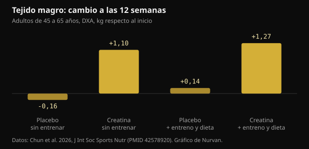
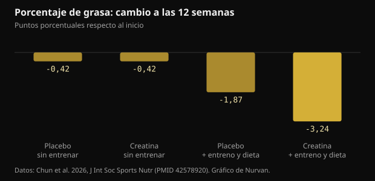

# 10 g de creatina al día sin pisar el gimnasio: qué encontró el estudio

Después de los 45 el consejo estándar es: levanta pesas y toma creatina. Un ensayo de 2026 intentó separar las dos cosas y siguió durante 12 semanas a quienes solo hacían la segunda mitad. Aquí están las cifras reales, las que se sostienen y las que no.

## En resumen

- Quienes tomaron 10 g de creatina al día sin entrenar ganaron una media de 1,1 kg de tejido magro por DXA en 12 semanas; en los grupos placebo la masa magra no se movió.
- El tejido magro que mide la DXA incluye agua, y la creatina aumenta el agua corporal total: parte de ese kilo no es músculo nuevo.
- El porcentaje de grasa bajó de forma relevante solo en el grupo que entrenaba y comía menos (-3,24 puntos): la creatina sola no adelgazó a nadie.
- La parte de la memoria es la más débil: en el conjunto de las pruebas no hubo diferencia, y el único resultado positivo aparece en la semana 6 y desaparece en la 12.
- La creatinina en sangre sube poco (menos de 0,16 mg/dL) porque la creatina se degrada en creatinina: es un efecto de la medición, no un daño renal, y conviene decírselo a quien lee los análisis.

## Qué se hizo exactamente

El ensayo se realizó en el laboratorio de nutrición deportiva de la Universidad Texas A&M y se publicó en el Journal of the International Society of Sports Nutrition. Setenta y tres adultos sanos y sedentarios de 45 a 65 años eligieron si participar en un programa de entrenamiento y dieta o quedarse sin él; dentro de cada bloque se les asignó, a doble ciego, 10 g diarios de creatina monohidrato (dos tomas de 5 g) o un placebo de maltodextrina. Sesenta y cuatro completaron las 12 semanas.

El programa consistía en tres sesiones semanales de pesas más unos 20 minutos de cardio, con una dieta de 300 a 500 kcal de déficit diario. Quienes no entrenaban siguieron con su vida normal. En las semanas 0, 6 y 12 se midieron composición corporal por DXA, máximo en press de banca y prensa de piernas, analítica en ayunas y una batería de pruebas cognitivas.

Dos detalles pesan más de lo que parece. Primero: cada grupo sin entrenamiento tenía 13 personas, una cifra pequeña. Segundo: entrenar o no fue una elección de cada participante, no un sorteo, así que los dos bloques no son comparables como en un experimento limpio. El doble ciego solo cubría creatina frente a placebo dentro de cada bloque.

## El resultado que dio titulares: masa magra sin entrenar

A las 12 semanas el tejido magro medido por DXA había subido 1,1 kg (intervalo de confianza del 95%: 0,2 a 2,0) en quienes tomaban creatina sin entrenar, y 1,27 kg en quienes la tomaban entrenando y comiendo menos. En los dos grupos placebo no cambió nada.

*Tejido magro: cambio a las 12 semanas — Datos: Chun et al. 2026, J Int Soc Sports Nutr (PMID 42578920). Gráfico de Nurvan.*

Va en contra de la idea extendida de que la creatina solo sirve con un estímulo de entrenamiento. Pero hay dos advertencias. El método: la DXA mide tejido magro, que es músculo más agua más órganos, no músculo puro. Y los grupos sin entrenamiento eran los más pequeños del estudio.

Un dato que los autores señalan cambia la lectura: el grupo de creatina sin entrenamiento comió más que los demás, con una ingesta de energía y de hidratos significativamente mayor. Más hidratos significa más glucógeno muscular, y cada gramo de glucógeno retiene agua.

## Por qué «+1 kg de masa magra» no es «+1 kg de músculo»

La creatina entra en el músculo acompañada de agua. En un estudio con medidas directas del agua corporal (dilución con óxido de deuterio y bromuro de sodio), un protocolo de carga seguido de mantenimiento aumentó la creatina muscular, el peso y el agua corporal total, sin cambiar la proporción entre el agua dentro y fuera de las células.

Esto no significa que la creatina no construya músculo: a lo largo de meses y con entrenamiento lo hace. Significa que en 12 semanas sin entrenar parte de ese kilo es agua intracelular y que la DXA no sabe distinguirla. El efecto es real; su naturaleza es más corriente de lo que se cuenta.

Un metaanálisis de 2026 en mujeres posmenopáusicas ayuda a calibrar expectativas: en los siete ensayos incluidos, la creatina aumentó la masa magra 0,37 kg de media, con beneficios claros cuando se usaban al menos 5 g diarios junto a las pesas, mientras que dosis de 3 g o menos sin entrenamiento no mostraron efecto medible.

## Sobre la grasa corporal, la creatina sola no hizo nada

Aquí el cuadro es limpio. El porcentaje de grasa bajó de forma relevante solo en el grupo que combinaba creatina, entrenamiento y déficit calórico: -3,24 puntos frente a -1,87 de quienes entrenaban y comían menos con placebo. Sin entrenamiento, creatina y placebo acabaron en el mismo sitio.

*Porcentaje de grasa: cambio a las 12 semanas — Datos: Chun et al. 2026, J Int Soc Sports Nutr (PMID 42578920). Gráfico de Nurvan.*

Es la respuesta más útil que ofrece el estudio a quien busca un atajo: la creatina mejora el resultado de un proceso, no lo sustituye. La palanca grande sigue siendo el entrenamiento de fuerza más el déficit calórico.

## ¿Y la memoria? La parte más frágil del artículo

El resumen habla de mejoras en algunos marcadores cognitivos. Al mirar los resultados en detalle, el entusiasmo se reduce.

- En la prueba de recuerdo de palabras, el análisis global no muestra efecto ni del tiempo ni del grupo. El único positivo es el número de palabras recordadas correctamente tras una demora, en la semana 6, en el grupo de creatina sin entrenamiento. En la semana 12 ya no está.
- Reconocimiento de imágenes, vigilancia de dígitos y prueba de Stroop: ningún beneficio.
- En el reconocimiento de palabras el análisis global no es significativo; aparece un único tiempo de reacción.
- En la prueba de reacción de elección, el porcentaje de aciertos fue mejor en el grupo placebo sin entrenamiento.

Los propios autores escriben que los hallazgos cognitivos deben considerarse exploratorios y que no se aplicó corrección por comparaciones múltiples. Cuando se miden decenas de variables sin corrección, algún positivo por azar es lo esperable.

Los metaanálisis dan un cuadro más estable y más modesto. En 16 ensayos aleatorizados, la creatina mejora la memoria con un efecto pequeño (diferencia media estandarizada 0,31) y no mejora la función cognitiva global ni la ejecutiva; solo el efecto sobre la memoria alcanza certeza moderada con GRADE. Otro metaanálisis en personas sanas encuentra el mismo efecto pequeño y lo sitúa entre los 66 y los 76 años, sin nada entre los 11 y los 31.

## Creatinina y analíticas: lo práctico

La creatina se degrada de forma espontánea en creatinina, que es la molécula que el laboratorio mide para estimar la función renal. Cuanta más creatina circula, más creatinina aparece en sangre: es aritmética, no daño renal.

En el estudio la creatinina subió un 6-8% (menos de 0,1 mg/dL) sin entrenamiento y un 16-18% (menos de 0,16 mg/dL) con él, quedando por debajo de 1,0 mg/dL. El filtrado glomerular estimado, que se calcula a partir de la creatinina, bajó un 5-7% y un 14-20% sin salir de los valores normales. Los autores precisan que no midieron ni cistatina C ni el filtrado de forma directa, así que esa caída no debe leerse como una pérdida de función renal.

La consecuencia práctica es sencilla: si te haces analíticas mientras tomas creatina, dilo a quien las interpreta. Cualquier duda sobre riñones, medicación o enfermedad es del médico, no se resuelve leyendo un informe a solas.

## Qué dice realmente la investigación

**Con matices** — 10 g de creatina al día añaden masa magra incluso sin entrenar.

En este estudio ocurrió: +1,1 kg de tejido magro por DXA en 12 semanas frente a ningún cambio con placebo. Pero el grupo era de 13 personas, no fue aleatorizado a esa rama, comió más que los demás y la DXA cuenta como tejido magro el agua que la creatina mete en el músculo.

**Desmentido** — La creatina por sí sola quema grasa.

Sin entrenamiento, creatina y placebo terminaron las 12 semanas con el mismo cambio de porcentaje de grasa (-0,42 puntos). La diferencia real, -3,24 puntos, llegó solo con creatina más pesas más déficit calórico.

**Con matices** — La creatina mejora la memoria después de los 45.

En este estudio el análisis global de las pruebas de memoria no es significativo y el único positivo desaparece en la semana 12. Los metaanálisis encuentran un efecto pequeño sobre la memoria, más claro entre los 66 y los 76 años, y ninguno sobre la cognición global.

**Con matices** — Hacen falta 10 g al día.

Los 10 g se eligieron porque las hipótesis sobre el cerebro piden dosis altas, no porque el músculo las necesite. Para masa y fuerza la referencia del posicionamiento de la ISSN sigue siendo 3-5 g al día, y el metaanálisis en posmenopáusicas veía beneficios desde 5 g junto a las pesas.

**Desmentido** — Que suba la creatinina con creatina indica un problema renal.

La creatina se convierte en creatinina: el valor sube por motivos metabólicos y arrastra hacia abajo el filtrado estimado, que se calcula a partir de ella. Un análisis de 684 ensayos aleatorizados no encontró más efectos adversos renales, hepáticos o digestivos que el placebo, ni siquiera a las dosis y duraciones mayores.

**No verificable** — La creatina sin entrenamiento genera más tensión.

La puntuación de tensión del cuestionario de estado de ánimo fue mayor en el grupo de creatina sin entrenamiento que en el placebo en la semana 12, pero el análisis global del cuestionario no muestra diferencias significativas. Es un dato suelto entre decenas de comparaciones.

## Cómo aplicarlo

1. Si puedes entrenar, entrena: el paquete completo (pesas, cardio, déficit moderado, creatina) dio el mayor cambio en grasa y fuerza. La creatina sola no llega ahí.
2. Si no entrenas, 3-5 g diarios de creatina monohidrato siguen siendo la dosis de referencia de la ISSN para masa y fuerza. Los 10 g del estudio nacen de una hipótesis sobre el cerebro, no de una ventaja demostrada en el músculo.
3. No esperes perder grasa con creatina. El peso en la báscula puede subir las primeras semanas por el agua retenida en el músculo: está previsto y no es grasa.
4. Pésate y mídete siempre en las mismas condiciones y mira tendencias de 4 a 6 semanas, no días sueltos. El agua corporal se mueve demasiado.
5. Si te haces analíticas, avisa de que tomas creatina. La creatinina y el filtrado estimado se leen de otra manera, y la valoración es del médico.
6. Registra las cargas: si la fuerza no sube en 8-12 semanas, el problema es el programa o la recuperación, no la marca del suplemento.

> **Cargas, medidas y suplementos en el mismo sitio**  
> En Nurvan registras series, cargas y RIR sesión a sesión, sigues peso y medidas en el tiempo y anotas los suplementos que tomas, creatina incluida. En la sección de analíticas guardas los informes junto al resto, así los datos ya están cuando hables con tu médico o tu entrenador. — **Prueba Nurvan** (https://nurvan.app)

## Preguntas frecuentes

### ¿Funciona la creatina si no voy al gimnasio?

En este estudio quienes la tomaron sin entrenar aumentaron el tejido magro por DXA y el máximo en press de banca. El grupo era de 13 personas y parte de la ganancia es agua retenida en el músculo. El efecto más sólido de la creatina sigue siendo el que logra junto al entrenamiento de fuerza.

### ¿Mejor 5 g o 10 g al día?

Para masa y fuerza la referencia es 3-5 g al día. Las dosis mayores se han usado en estudios que buscan efectos cerebrales, donde la evidencia aún es pequeña e inconstante. Diez gramos no hacen falta para el músculo.

### ¿La creatina daña los riñones?

En personas sanas las revisiones no han encontrado daño renal, y el análisis de 684 ensayos aleatorizados no vio más efectos adversos que con placebo. La creatinina sube por motivos metabólicos y eso baja el filtrado estimado: es un artefacto del cálculo. Quien tenga enfermedad renal conocida o dudas sobre sus resultados debe hablar con su médico.

### ¿Cuánto del peso ganado es agua?

El estudio no lo desglosó. Los trabajos con medidas directas del agua corporal muestran que la creatina aumenta el agua corporal total sin cambiar la proporción entre el agua dentro y fuera de las células. En 12 semanas sin entrenar es razonable esperar que parte del kilo sea agua.

## Fuentes

- Chun J, Liu Y, Kibler GL et al., 2026. Effects of creatine supplementation with and without exercise and diet intervention on body composition, cognitive function, and markers of health in middle-aged and older adults. J Int Soc Sports Nutr 23(sup1):2716273. [PMID 42578920](https://pubmed.ncbi.nlm.nih.gov/42578920/) · [DOI 10.1080/15502783.2026.2716273](https://doi.org/10.1080/15502783.2026.2716273)
- Naddafha S, Antonio J, Kreider RB, Stout JR, 2026. Creatine monohydrate for lean mass, strength, and bone density in postmenopausal women: a systematic review and meta-analysis. J Int Soc Sports Nutr 23(1):2668435. [PMID 42141930](https://pubmed.ncbi.nlm.nih.gov/42141930/) · [DOI 10.1080/15502783.2026.2668435](https://doi.org/10.1080/15502783.2026.2668435)
- Xu C, Bi S, Zhang W, Luo L, 2024. The effects of creatine supplementation on cognitive function in adults: a systematic review and meta-analysis. Front Nutr 11:1424972. [PMID 39070254](https://pubmed.ncbi.nlm.nih.gov/39070254/) · [DOI 10.3389/fnut.2024.1424972](https://doi.org/10.3389/fnut.2024.1424972)
- Prokopidis K, Giannos P, Triantafyllidis KK et al., 2023. Effects of creatine supplementation on memory in healthy individuals: a systematic review and meta-analysis of randomized controlled trials. Nutr Rev 81(4):416-427. [PMID 35984306](https://pubmed.ncbi.nlm.nih.gov/35984306/) · [DOI 10.1093/nutrit/nuac064](https://doi.org/10.1093/nutrit/nuac064)
- Powers ME, Arnold BL, Weltman AL et al., 2003. Creatine supplementation increases total body water without altering fluid distribution. J Athl Train 38(1):44-50. [PMID 12937471](https://pubmed.ncbi.nlm.nih.gov/12937471/)
- Gonzalez DE, Dickerson BL, Hines K et al., 2026. Creatine supplementation dose and duration are not associated with increased side effects: a structured review and study-level dose-response analysis of randomized controlled trials. Sports 14(4):137. [PMID 42043069](https://pubmed.ncbi.nlm.nih.gov/42043069/) · [DOI 10.3390/sports14040137](https://doi.org/10.3390/sports14040137)
- Kreider RB, Kalman DS, Antonio J et al., 2017. International Society of Sports Nutrition position stand: safety and efficacy of creatine supplementation in exercise, sport, and medicine. J Int Soc Sports Nutr 14:18. [PMID 28615996](https://pubmed.ncbi.nlm.nih.gov/28615996/) · [DOI 10.1186/s12970-017-0173-z](https://doi.org/10.1186/s12970-017-0173-z)

Artículo inspirado en una publicación de [Dan Garner (@dangarnernutrition)](https://www.instagram.com/p/Dd1cvUmkUS7/). Fuentes consultadas a través de PubMed.

> Nota: contenido informativo. No sustituye la opinión de un médico o profesional cualificado.
