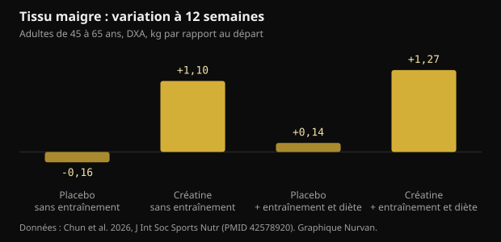
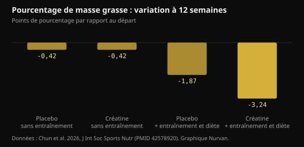

# 10 g de créatine par jour sans salle de sport : ce que l'étude montre vraiment

Après 45 ans, le conseil standard tient en deux mots : soulevez des charges et prenez de la créatine. Un essai de 2026 a tenté de séparer les deux et a suivi pendant 12 semaines ceux qui ne faisaient que la seconde moitié. Voici les chiffres réels, ceux qui tiennent et ceux qui ne tiennent pas.

## L'essentiel

- Les personnes ayant pris 10 g de créatine par jour sans s'entraîner ont gagné en moyenne 1,1 kg de tissu maigre au DXA en 12 semaines ; dans les groupes placebo, rien n'a bougé.
- Le tissu maigre mesuré au DXA inclut l'eau, et la créatine augmente l'eau corporelle totale : une partie de ce kilo n'est pas du muscle neuf.
- Le pourcentage de masse grasse n'a vraiment baissé que dans le groupe qui s'entraînait et mangeait moins (-3,24 points) : la créatine seule n'a fait maigrir personne.
- La partie mémoire est la plus fragile : sur l'ensemble des tests, aucune différence, et le seul résultat positif apparaît à la semaine 6 puis disparaît à la 12.
- La créatinine sanguine monte un peu (moins de 0,16 mg/dL) parce que la créatine se dégrade en créatinine : c'est un effet de mesure, pas une atteinte rénale, et cela mérite d'être signalé à qui lit vos analyses.

## Ce qui a été fait, concrètement

L'essai a été mené au laboratoire de nutrition sportive de l'université Texas A&M et publié dans le Journal of the International Society of Sports Nutrition. Soixante-treize adultes sains et sédentaires de 45 à 65 ans ont choisi de rejoindre ou non un programme d'entraînement et de diète ; à l'intérieur de chaque bloc, ils ont ensuite été répartis en double aveugle entre 10 g par jour de créatine monohydrate (deux prises de 5 g) et un placebo de maltodextrine. Soixante-quatre ont terminé les 12 semaines.

Le programme comptait trois séances de musculation par semaine plus environ 20 minutes de cardio, avec une diète en déficit de 300 à 500 kcal par jour. Ceux qui ne s'entraînaient pas ont poursuivi leur vie normale. Aux semaines 0, 6 et 12 : composition corporelle au DXA, maximum au développé couché et à la presse à cuisses, prises de sang à jeun et une batterie de tests cognitifs.

Deux détails pèsent plus qu'il n'y paraît. D'abord, chaque groupe sans entraînement comptait 13 personnes, ce qui est peu. Ensuite, s'entraîner ou non relevait du choix des participants et non d'un tirage au sort : les deux blocs ne sont donc pas comparables comme dans une expérience propre. La randomisation en aveugle ne portait que sur créatine contre placebo à l'intérieur de chaque bloc.

## Le résultat qui a fait les titres : de la masse maigre sans entraînement

À 12 semaines, le tissu maigre mesuré au DXA avait augmenté de 1,1 kg (intervalle de confiance à 95 % : 0,2 à 2,0) chez ceux qui prenaient de la créatine sans s'entraîner, et de 1,27 kg chez ceux qui en prenaient en s'entraînant et en mangeant moins. Dans les deux groupes placebo, rien n'a changé.

*Tissu maigre : variation à 12 semaines — Données : Chun et al. 2026, J Int Soc Sports Nutr (PMID 42578920). Graphique Nurvan.*

Cela contredit l'idée répandue selon laquelle la créatine n'agit qu'avec un stimulus d'entraînement. Deux réserves s'imposent. La méthode : le DXA mesure du tissu maigre, c'est-à-dire du muscle plus de l'eau plus des organes, et non du muscle pur. Et les groupes sans entraînement étaient les plus petits de l'étude.

Un détail signalé par les auteurs change la lecture : le groupe créatine sans entraînement a mangé plus que les autres, avec des apports en énergie et en glucides significativement supérieurs. Plus de glucides, c'est plus de glycogène musculaire, et chaque gramme de glycogène retient de l'eau.

## Pourquoi « +1 kg de masse maigre » n'est pas « +1 kg de muscle »

La créatine entre dans le muscle avec de l'eau. Dans une étude utilisant des mesures directes de l'eau corporelle (dilution à l'oxyde de deutérium et au bromure de sodium), un protocole de charge suivi d'un entretien a augmenté la créatine musculaire, le poids et l'eau corporelle totale, sans modifier la répartition entre eau intracellulaire et extracellulaire.

Cela ne veut pas dire que la créatine ne construit pas de muscle : sur plusieurs mois et avec de l'entraînement, elle le fait. Cela veut dire qu'en 12 semaines sans entraînement une partie de ce kilo est de l'eau intracellulaire, et que le DXA ne sait pas la distinguer. L'effet est réel ; sa nature est plus banale qu'on ne le raconte.

Une méta-analyse de 2026 chez des femmes ménopausées aide à calibrer les attentes : sur sept essais, la créatine a ajouté 0,37 kg de masse maigre en moyenne, avec des bénéfices nets quand au moins 5 g par jour étaient associés à la musculation, tandis que les doses de 3 g ou moins sans entraînement n'ont montré aucun effet mesurable.

## Sur la masse grasse, la créatine seule n'a rien fait

Ici le tableau est net. Le pourcentage de masse grasse n'a reculé de façon notable que dans le groupe associant créatine, entraînement et déficit calorique : -3,24 points contre -1,87 pour l'entraînement et la diète sous placebo. Sans entraînement, créatine et placebo finissent au même point.

*Pourcentage de masse grasse : variation à 12 semaines — Données : Chun et al. 2026, J Int Soc Sports Nutr (PMID 42578920). Graphique Nurvan.*

C'est la réponse la plus utile de l'étude à qui cherche un raccourci : la créatine améliore le résultat d'une démarche, elle ne la remplace pas. Le gros levier reste la musculation plus le déficit calorique.

## Et la mémoire ? La partie la plus fragile

Le résumé évoque des améliorations sur certains marqueurs cognitifs. En lisant les résultats en détail, l'enthousiasme se réduit.

- Au test de rappel de mots, l'analyse d'ensemble ne montre aucun effet, ni du temps ni du groupe. Le seul positif est le nombre de mots correctement rappelés après délai, à la semaine 6, dans le groupe créatine sans entraînement. À la semaine 12, il a disparu.
- Reconnaissance d'images, vigilance aux chiffres et test de Stroop : aucun bénéfice.
- Sur la reconnaissance de mots, l'analyse d'ensemble n'est pas significative ; un seul temps de réaction ressort.
- Au test de réaction à choix, le pourcentage de bonnes réponses était meilleur dans le groupe placebo sans entraînement.

Les auteurs écrivent eux-mêmes que les résultats cognitifs doivent être considérés comme exploratoires et qu'aucune correction n'a été appliquée pour les comparaisons multiples. Quand on mesure des dizaines de variables sans correction, quelques positifs dus au hasard sont attendus.

Les méta-analyses donnent un tableau plus stable et plus modeste. Sur 16 essais randomisés, la créatine améliore la mémoire avec un effet faible (différence moyenne standardisée de 0,31) et n'améliore ni la fonction cognitive globale ni les fonctions exécutives ; seul l'effet sur la mémoire atteint une certitude modérée selon GRADE. Une autre méta-analyse chez des personnes saines trouve le même effet faible et le situe entre 66 et 76 ans, sans rien entre 11 et 31 ans.

## Créatinine et bilan sanguin : le point pratique

La créatine se dégrade spontanément en créatinine, la molécule que le laboratoire mesure pour estimer la fonction rénale. Plus il y a de créatine en circulation, plus il y a de créatinine dans le sang : c'est de l'arithmétique, pas une atteinte des reins.

Dans l'étude, la créatinine a augmenté de 6 à 8 % (moins de 0,1 mg/dL) sans entraînement et de 16 à 18 % (moins de 0,16 mg/dL) avec, en restant sous 1,0 mg/dL. Le débit de filtration glomérulaire estimé, calculé à partir de la créatinine, a donc baissé de 5 à 7 % et de 14 à 20 % tout en restant dans les valeurs normales. Les auteurs précisent n'avoir mesuré ni la cystatine C ni la filtration directement : cette baisse ne doit donc pas être lue comme une fonction rénale diminuée.

La conséquence pratique est simple : si vous faites un bilan sanguin en prenant de la créatine, dites-le à qui l'interprète. Toute question sur les reins, un médicament ou une maladie relève du médecin, pas d'un compte rendu lu seul.

## Ce que dit vraiment la recherche

**À nuancer** — 10 g de créatine par jour ajoutent de la masse maigre même sans entraînement.

C'est arrivé dans cette étude : +1,1 kg de tissu maigre au DXA en 12 semaines contre aucun changement sous placebo. Mais le groupe comptait 13 personnes, n'a pas été tiré au sort dans ce bras, a mangé plus que les autres, et le DXA compte comme tissu maigre l'eau que la créatine fait entrer dans le muscle.

**Démenti** — La créatine seule fait perdre de la graisse.

Sans entraînement, créatine et placebo ont terminé les 12 semaines avec la même variation de masse grasse (-0,42 point). La vraie différence, -3,24 points, n'est venue que de la créatine associée aux charges et au déficit calorique.

**À nuancer** — La créatine améliore la mémoire après 45 ans.

Dans cette étude, l'analyse d'ensemble des tests de mémoire n'est pas significative et le seul positif disparaît à la semaine 12. Les méta-analyses trouvent un effet faible sur la mémoire, surtout entre 66 et 76 ans, et aucun sur la cognition globale.

**À nuancer** — Il faut 10 g par jour.

Les 10 g ont été choisis parce que les hypothèses sur le cerveau demandent des doses élevées, pas parce que le muscle en a besoin. Pour la masse et la force, la référence de la prise de position de l'ISSN reste 3-5 g par jour, et la méta-analyse chez les femmes ménopausées voyait des bénéfices dès 5 g associés à la musculation.

**Démenti** — Une créatinine qui monte sous créatine signale un problème rénal.

La créatine se transforme en créatinine : la valeur monte pour des raisons métaboliques et tire vers le bas la filtration estimée, qui en est calculée. Une analyse de 684 essais randomisés n'a trouvé aucune augmentation des effets indésirables rénaux, hépatiques ou digestifs par rapport au placebo, même aux doses et durées les plus élevées.

**Invérifiable** — La créatine sans entraînement rend plus tendu.

Le score de tension du questionnaire d'humeur était plus élevé dans le groupe créatine sans entraînement que sous placebo à la semaine 12, mais l'analyse d'ensemble du questionnaire ne montre pas de différence significative. C'est une donnée isolée parmi des dizaines de comparaisons.

## Comment l'appliquer

1. Si vous pouvez vous entraîner, entraînez-vous : le paquet complet (charges, cardio, déficit modéré, créatine) a donné le plus grand changement sur la graisse et la force. La créatine seule n'y arrive pas.
2. Si vous ne vous entraînez pas, 3-5 g par jour de créatine monohydrate restent la dose de référence de l'ISSN pour la masse et la force. Les 10 g de l'étude viennent d'une hypothèse sur le cerveau, pas d'un avantage musculaire démontré.
3. N'attendez pas de perte de graisse de la créatine. Le poids sur la balance peut monter les premières semaines à cause de l'eau retenue dans le muscle : c'est prévu, et ce n'est pas de la graisse.
4. Pesez-vous et mesurez-vous toujours dans les mêmes conditions, et lisez des tendances sur 4 à 6 semaines, pas des journées isolées. L'eau corporelle bouge trop.
5. Si vous faites un bilan sanguin, signalez que vous prenez de la créatine. La créatinine et la filtration estimée se lisent autrement, et l'interprétation revient au médecin.
6. Suivez vos charges : si la force ne monte pas en 8 à 12 semaines, le problème vient du programme ou de la récupération, pas de la marque du complément.

> **Charges, mesures et compléments au même endroit**  
> Dans Nurvan, vous notez séries, charges et RIR séance après séance, suivez poids et mensurations dans le temps et enregistrez les compléments que vous prenez, créatine comprise. La partie analyses garde vos comptes rendus à côté du reste : les données sont déjà là quand vous parlez à votre médecin ou à votre coach. — **Essayer Nurvan** (https://nurvan.app)

## Questions fréquentes

### La créatine fonctionne-t-elle si je ne vais pas en salle ?

Dans cette étude, les personnes qui en prenaient sans s'entraîner ont augmenté leur tissu maigre au DXA et leur maximum au développé couché. Le groupe comptait 13 personnes et une partie du gain est de l'eau retenue dans le muscle. L'effet le plus solide de la créatine reste celui obtenu avec la musculation.

### 5 g ou 10 g par jour ?

Pour la masse et la force, la référence est de 3 à 5 g par jour. Les doses plus élevées ont été utilisées dans les études qui cherchent des effets cérébraux, où les preuves restent minces et inconstantes. Dix grammes ne sont pas nécessaires pour le muscle.

### La créatine abîme-t-elle les reins ?

Chez les personnes en bonne santé, les revues n'ont trouvé aucune atteinte rénale, et l'analyse de 684 essais randomisés n'a pas vu plus d'effets indésirables que sous placebo. La créatinine sanguine monte pour des raisons métaboliques, ce qui abaisse la filtration estimée : c'est un artefact de calcul. Toute personne ayant une maladie rénale connue ou un doute sur ses résultats doit en parler à son médecin.

### Quelle part de la prise de poids est de l'eau ?

L'étude ne l'a pas décomposée. Les travaux avec mesures directes de l'eau corporelle montrent que la créatine augmente l'eau corporelle totale sans modifier le rapport entre eau intracellulaire et extracellulaire. Sur 12 semaines sans entraînement, il est raisonnable de penser qu'une part du kilo est de l'eau.

## Sources

- Chun J, Liu Y, Kibler GL et al., 2026. Effects of creatine supplementation with and without exercise and diet intervention on body composition, cognitive function, and markers of health in middle-aged and older adults. J Int Soc Sports Nutr 23(sup1):2716273. [PMID 42578920](https://pubmed.ncbi.nlm.nih.gov/42578920/) · [DOI 10.1080/15502783.2026.2716273](https://doi.org/10.1080/15502783.2026.2716273)
- Naddafha S, Antonio J, Kreider RB, Stout JR, 2026. Creatine monohydrate for lean mass, strength, and bone density in postmenopausal women: a systematic review and meta-analysis. J Int Soc Sports Nutr 23(1):2668435. [PMID 42141930](https://pubmed.ncbi.nlm.nih.gov/42141930/) · [DOI 10.1080/15502783.2026.2668435](https://doi.org/10.1080/15502783.2026.2668435)
- Xu C, Bi S, Zhang W, Luo L, 2024. The effects of creatine supplementation on cognitive function in adults: a systematic review and meta-analysis. Front Nutr 11:1424972. [PMID 39070254](https://pubmed.ncbi.nlm.nih.gov/39070254/) · [DOI 10.3389/fnut.2024.1424972](https://doi.org/10.3389/fnut.2024.1424972)
- Prokopidis K, Giannos P, Triantafyllidis KK et al., 2023. Effects of creatine supplementation on memory in healthy individuals: a systematic review and meta-analysis of randomized controlled trials. Nutr Rev 81(4):416-427. [PMID 35984306](https://pubmed.ncbi.nlm.nih.gov/35984306/) · [DOI 10.1093/nutrit/nuac064](https://doi.org/10.1093/nutrit/nuac064)
- Powers ME, Arnold BL, Weltman AL et al., 2003. Creatine supplementation increases total body water without altering fluid distribution. J Athl Train 38(1):44-50. [PMID 12937471](https://pubmed.ncbi.nlm.nih.gov/12937471/)
- Gonzalez DE, Dickerson BL, Hines K et al., 2026. Creatine supplementation dose and duration are not associated with increased side effects: a structured review and study-level dose-response analysis of randomized controlled trials. Sports 14(4):137. [PMID 42043069](https://pubmed.ncbi.nlm.nih.gov/42043069/) · [DOI 10.3390/sports14040137](https://doi.org/10.3390/sports14040137)
- Kreider RB, Kalman DS, Antonio J et al., 2017. International Society of Sports Nutrition position stand: safety and efficacy of creatine supplementation in exercise, sport, and medicine. J Int Soc Sports Nutr 14:18. [PMID 28615996](https://pubmed.ncbi.nlm.nih.gov/28615996/) · [DOI 10.1186/s12970-017-0173-z](https://doi.org/10.1186/s12970-017-0173-z)

Article inspiré d'une publication de [Dan Garner (@dangarnernutrition)](https://www.instagram.com/p/Dd1cvUmkUS7/). Sources consultées via PubMed.

> Note : contenu informatif. Il ne remplace pas l'avis d'un médecin ou d'un professionnel qualifié.
