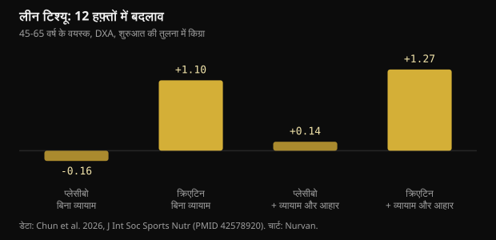
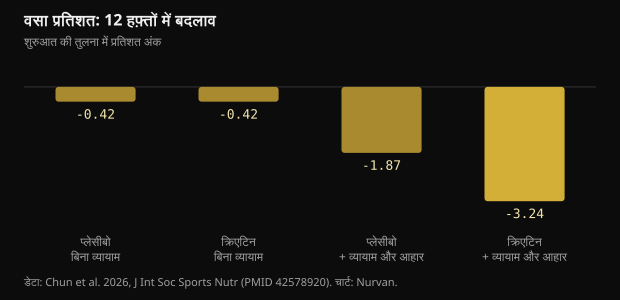

# बिना जिम रोज़ 10 ग्राम क्रिएटिन: अध्ययन ने सच में क्या पाया

45 के बाद सलाह हमेशा एक ही होती है: वज़न उठाइए और क्रिएटिन लीजिए। 2026 के एक परीक्षण ने दोनों को अलग करके देखा और 12 हफ़्ते तक उन लोगों को भी ट्रैक किया जिन्होंने सिर्फ़ दूसरी बात मानी। यहाँ असली आँकड़े हैं: वे भी जो टिकते हैं और वे भी जो नहीं।

## संक्षेप में

- जिन्होंने बिना व्यायाम रोज़ 10 ग्राम क्रिएटिन लिया, उन्होंने 12 हफ़्तों में DXA पर औसतन 1.1 किग्रा लीन टिश्यू बढ़ाया; प्लेसीबो समूहों में कोई बदलाव नहीं आया।
- DXA जिसे लीन टिश्यू मापता है उसमें पानी भी शामिल है, और क्रिएटिन शरीर का कुल पानी बढ़ाता है: उस एक किलो का एक हिस्सा नई मांसपेशी नहीं है।
- शरीर की वसा प्रतिशत सिर्फ़ उस समूह में उल्लेखनीय रूप से घटी जो व्यायाम कर रहा था और कम खा रहा था (-3.24 अंक): अकेले क्रिएटिन ने किसी का वज़न नहीं घटाया।
- याददाश्त वाला हिस्सा सबसे कमज़ोर है: पूरी टेस्ट श्रृंखला में कोई अंतर नहीं मिला, और इकलौता सकारात्मक नतीजा छठे हफ़्ते दिखता है और बारहवें तक गायब हो जाता है।
- खून में क्रिएटिनिन थोड़ा बढ़ता है (0.16 मिग्रा/डेसीलीटर से कम) क्योंकि क्रिएटिन टूटकर क्रिएटिनिन बनता है: यह माप का असर है, गुर्दे की क्षति नहीं, और रिपोर्ट पढ़ने वाले को यह बताना चाहिए।

## असल में किया क्या गया

यह परीक्षण टेक्सास ए एंड एम विश्वविद्यालय की स्पोर्ट्स न्यूट्रिशन लैब में हुआ और Journal of the International Society of Sports Nutrition में छपा। 45 से 65 वर्ष के तिहत्तर स्वस्थ, निष्क्रिय वयस्कों ने खुद चुना कि वे व्यायाम और आहार कार्यक्रम में शामिल हों या नहीं; फिर हर समूह के भीतर उन्हें डबल-ब्लाइंड तरीके से रोज़ 10 ग्राम क्रिएटिन मोनोहाइड्रेट (5-5 ग्राम की दो खुराक) या माल्टोडेक्सट्रिन प्लेसीबो दिया गया। चौंसठ लोगों ने 12 हफ़्ते पूरे किए।

कार्यक्रम में हफ़्ते में तीन बार वज़न प्रशिक्षण और लगभग 20 मिनट कार्डियो था, साथ में रोज़ 300 से 500 कैलोरी की कमी वाला आहार। जो लोग व्यायाम नहीं कर रहे थे वे सामान्य जीवन जीते रहे। 0, 6 और 12 हफ़्ते पर DXA से शरीर संरचना, बेंच प्रेस और लेग प्रेस का अधिकतम भार, खाली पेट रक्त जाँच और संज्ञानात्मक परीक्षणों की एक श्रृंखला ली गई।

दो बातें दिखने से ज़्यादा मायने रखती हैं। पहली: बिना व्यायाम वाले हर समूह में सिर्फ़ 13 लोग थे, जो बहुत कम है। दूसरी: व्यायाम करना या न करना प्रतिभागियों की अपनी पसंद थी, लॉटरी नहीं, इसलिए दोनों बड़े समूह एक साफ़ प्रयोग की तरह तुलनीय नहीं हैं। ब्लाइंड रैंडमाइज़ेशन सिर्फ़ हर समूह के भीतर क्रिएटिन बनाम प्लेसीबो पर लागू था।

## सुर्खियाँ बटोरने वाला नतीजा: बिना व्यायाम लीन मास

12 हफ़्ते बाद, बिना व्यायाम क्रिएटिन लेने वालों में DXA लीन टिश्यू 1.1 किग्रा बढ़ा (95% विश्वास अंतराल: 0.2 से 2.0), और व्यायाम व आहार के साथ क्रिएटिन लेने वालों में 1.27 किग्रा। दोनों प्लेसीबो समूहों में कुछ नहीं बदला।

*लीन टिश्यू: 12 हफ़्तों में बदलाव — डेटा: Chun et al. 2026, J Int Soc Sports Nutr (PMID 42578920). चार्ट: Nurvan.*

यह उस आम धारणा के खिलाफ़ जाता है कि क्रिएटिन सिर्फ़ प्रशिक्षण उत्तेजना के साथ ही काम करता है। पर दो चेतावनियाँ हैं। पद्धति: DXA लीन टिश्यू मापता है, यानी मांसपेशी और पानी और अंग, शुद्ध मांसपेशी नहीं। और बिना व्यायाम वाले समूह अध्ययन के सबसे छोटे समूह थे।

लेखक एक बात बताते हैं जो पढ़ने का तरीका बदल देती है: बिना व्यायाम वाले क्रिएटिन समूह ने बाकी सबसे ज़्यादा खाया, ऊर्जा और कार्बोहाइड्रेट दोनों में सांख्यिकीय रूप से अधिक। ज़्यादा कार्बोहाइड्रेट यानी ज़्यादा मांसपेशीय ग्लाइकोजन, और ग्लाइकोजन का हर ग्राम पानी रोकता है।

## «+1 किग्रा लीन मास» का मतलब «+1 किग्रा मांसपेशी» क्यों नहीं

क्रिएटिन मांसपेशी में पानी के साथ प्रवेश करता है। शरीर के पानी की सीधी माप वाले एक अध्ययन में (ड्यूटेरियम ऑक्साइड और सोडियम ब्रोमाइड तनुकरण से), लोडिंग और फिर मेंटेनेंस के प्रोटोकॉल ने मांसपेशीय क्रिएटिन, शरीर का वज़न और कुल शरीर जल बढ़ाया, पर कोशिकाओं के भीतर और बाहर के पानी का अनुपात नहीं बदला।

इसका मतलब यह नहीं कि क्रिएटिन मांसपेशी नहीं बनाता: महीनों में और प्रशिक्षण के साथ वह बनाता है। मतलब यह है कि बिना व्यायाम 12 हफ़्तों में उस किलो का एक हिस्सा अंतःकोशिकीय पानी है, और DXA उसे अलग नहीं कर सकता। असर असली है, पर उसकी प्रकृति जितना बताया जाता है उससे कहीं साधारण है।

रजोनिवृत्ति के बाद की महिलाओं पर 2026 का एक मेटा-विश्लेषण अपेक्षाएँ तय करने में मदद करता है: सात परीक्षणों में क्रिएटिन ने औसतन 0.37 किग्रा लीन मास जोड़ा, और स्पष्ट लाभ तब था जब रोज़ कम से कम 5 ग्राम वज़न प्रशिक्षण के साथ लिया गया, जबकि बिना व्यायाम 3 ग्राम या उससे कम की खुराक पर कोई मापने योग्य असर नहीं दिखा।

## शरीर की वसा पर अकेले क्रिएटिन ने कुछ नहीं किया

यहाँ तस्वीर साफ़ है। वसा प्रतिशत सिर्फ़ उस समूह में उल्लेखनीय रूप से गिरा जिसमें क्रिएटिन, व्यायाम और कैलोरी की कमी तीनों थे: -3.24 प्रतिशत अंक, जबकि प्लेसीबो के साथ व्यायाम और आहार वालों में -1.87। बिना व्यायाम, क्रिएटिन और प्लेसीबो एक ही जगह पहुँचे।

*वसा प्रतिशत: 12 हफ़्तों में बदलाव — डेटा: Chun et al. 2026, J Int Soc Sports Nutr (PMID 42578920). चार्ट: Nurvan.*

शॉर्टकट ढूँढ़ने वालों के लिए यही इस अध्ययन का सबसे उपयोगी जवाब है: क्रिएटिन एक प्रक्रिया का नतीजा बेहतर करता है, प्रक्रिया की जगह नहीं लेता। बड़ा लीवर आज भी वज़न प्रशिक्षण और कैलोरी की कमी है।

## और याददाश्त? पर्चे का सबसे पतला हिस्सा

सार में कुछ संज्ञानात्मक संकेतकों में सुधार की बात है। नतीजों को विस्तार से पढ़ें तो उत्साह सिकुड़ जाता है।

- शब्द स्मरण परीक्षण में समग्र विश्लेषण न समय का असर दिखाता है न समूह का। इकलौता सकारात्मक नतीजा है देर बाद सही याद किए गए शब्दों की संख्या, छठे हफ़्ते, बिना व्यायाम वाले क्रिएटिन समूह में। बारहवें हफ़्ते तक वह भी नहीं रहता।
- चित्र पहचान, अंक सतर्कता और स्ट्रूप परीक्षण: कोई लाभ नहीं।
- शब्द पहचान में समग्र विश्लेषण सार्थक नहीं; सिर्फ़ एक प्रतिक्रिया समय उभरता है।
- चॉइस रिएक्शन परीक्षण में सही उत्तरों का प्रतिशत बिना व्यायाम वाले प्लेसीबो समूह में बेहतर रहा।

लेखक स्वयं लिखते हैं कि संज्ञानात्मक निष्कर्षों को अन्वेषणात्मक माना जाए और बहु-तुलना के लिए कोई सुधार लागू नहीं किया गया। जब दर्जनों चर बिना सुधार मापे जाते हैं, तो संयोग से कुछ सकारात्मक नतीजे आना अपेक्षित है।

मेटा-विश्लेषण अधिक स्थिर और अधिक संयत तस्वीर देते हैं। 16 यादृच्छिक परीक्षणों में क्रिएटिन याददाश्त को छोटे असर के साथ सुधारता है (मानकीकृत माध्य अंतर 0.31) और समग्र संज्ञानात्मक या कार्यकारी कार्य में सुधार नहीं करता; GRADE के अनुसार केवल याददाश्त वाला असर मध्यम निश्चितता तक पहुँचता है। स्वस्थ लोगों पर एक अन्य मेटा-विश्लेषण वही छोटा असर पाता है और उसे 66 से 76 वर्ष की आयु में केंद्रित करता है, जबकि 11 से 31 के बीच कुछ नहीं मिलता।

## क्रिएटिनिन और रक्त जाँच: व्यावहारिक बात

क्रिएटिन अपने आप टूटकर क्रिएटिनिन बनता है, और वही अणु प्रयोगशाला गुर्दे की कार्यक्षमता आँकने के लिए मापती है। जितना अधिक क्रिएटिन चलन में होगा, उतना अधिक क्रिएटिनिन खून में दिखेगा: यह गणित है, गुर्दे की क्षति नहीं।

अध्ययन में बिना व्यायाम क्रिएटिनिन 6 से 8% बढ़ा (0.1 मिग्रा/डेसीलीटर से कम) और व्यायाम के साथ 16 से 18% (0.16 मिग्रा/डेसीलीटर से कम), पर 1.0 मिग्रा/डेसीलीटर से नीचे ही रहा। क्रिएटिनिन से ही निकाली जाने वाली अनुमानित ग्लोमेरुलर फ़िल्ट्रेशन दर इसलिए 5 से 7% और 14 से 20% घटी, फिर भी सामान्य सीमा में रही। लेखक स्पष्ट करते हैं कि उन्होंने न सिस्टैटिन C मापा न सीधे फ़िल्ट्रेशन, इसलिए इस गिरावट को गुर्दे की घटी कार्यक्षमता नहीं पढ़ा जाना चाहिए।

व्यावहारिक निष्कर्ष सरल है: क्रिएटिन लेते हुए रक्त जाँच कराएँ तो रिपोर्ट पढ़ने वाले को बताइए। गुर्दे, दवा या बीमारी से जुड़ा कोई भी सवाल डॉक्टर का है, अकेले रिपोर्ट पढ़कर तय करने का नहीं।

## शोध वास्तव में क्या कहता है

**संदर्भ चाहिए** — रोज़ 10 ग्राम क्रिएटिन बिना व्यायाम भी लीन मास बढ़ाता है।

इस अध्ययन में ऐसा हुआ: 12 हफ़्तों में DXA लीन टिश्यू +1.1 किग्रा, जबकि प्लेसीबो में कोई बदलाव नहीं। पर समूह में 13 लोग थे, उन्हें लॉटरी से उस शाखा में नहीं रखा गया, उन्होंने बाकी से ज़्यादा खाया, और DXA उस पानी को भी लीन टिश्यू गिनता है जिसे क्रिएटिन मांसपेशी में खींचता है।

**ग़लत** — अकेला क्रिएटिन चर्बी घटाता है।

बिना व्यायाम, क्रिएटिन और प्लेसीबो दोनों ने 12 हफ़्ते वसा प्रतिशत में एक ही बदलाव (-0.42 अंक) के साथ पूरे किए। असली फ़र्क, -3.24 अंक, तभी आया जब क्रिएटिन के साथ वज़न और कैलोरी की कमी भी थी।

**संदर्भ चाहिए** — क्रिएटिन 45 के बाद याददाश्त सुधारता है।

इस अध्ययन में याददाश्त परीक्षणों का समग्र विश्लेषण सार्थक नहीं है और इकलौता सकारात्मक नतीजा बारहवें हफ़्ते तक गायब हो जाता है। मेटा-विश्लेषण याददाश्त पर छोटा असर पाते हैं, जो 66 से 76 वर्ष में सबसे स्पष्ट है, और समग्र संज्ञान पर कोई असर नहीं।

**संदर्भ चाहिए** — रोज़ 10 ग्राम चाहिए ही।

दस ग्राम इसलिए चुने गए क्योंकि मस्तिष्क से जुड़ी परिकल्पनाओं को अधिक खुराक चाहिए, इसलिए नहीं कि मांसपेशी को चाहिए। मास और ताकत के लिए ISSN के पोज़िशन स्टैंड का संदर्भ आज भी रोज़ 3 से 5 ग्राम है, और रजोनिवृत्ति के बाद की महिलाओं वाले मेटा-विश्लेषण में 5 ग्राम और वज़न प्रशिक्षण से ही लाभ दिखा।

**ग़लत** — क्रिएटिन लेते समय क्रिएटिनिन बढ़ना गुर्दे की समस्या का संकेत है।

क्रिएटिन क्रिएटिनिन में बदलता है: मान चयापचय कारणों से बढ़ता है और उसी से निकाली गई अनुमानित फ़िल्ट्रेशन दर को नीचे खींच लेता है। 684 यादृच्छिक परीक्षणों के विश्लेषण में प्लेसीबो की तुलना में गुर्दे, यकृत या पाचन संबंधी दुष्प्रभाव नहीं बढ़े, सबसे अधिक खुराक और सबसे लंबी अवधि पर भी नहीं।

**जाँचा नहीं जा सकता** — बिना व्यायाम क्रिएटिन तनाव बढ़ाता है।

मूड प्रश्नावली में तनाव का स्कोर बारहवें हफ़्ते बिना व्यायाम वाले क्रिएटिन समूह में प्लेसीबो से अधिक था, पर प्रश्नावली का समग्र विश्लेषण कोई सार्थक अंतर नहीं दिखाता। दर्जनों तुलनाओं के बीच यह एक अकेला आँकड़ा है।

## इसे कैसे अपनाएँ

1. अगर व्यायाम कर सकते हैं तो कीजिए: पूरा पैकेज (वज़न, कार्डियो, मध्यम कैलोरी कमी, क्रिएटिन) ने वसा और ताकत में सबसे बड़ा बदलाव दिया। अकेला क्रिएटिन वहाँ नहीं पहुँचता।
2. अगर व्यायाम नहीं करते, तो मास और ताकत के लिए रोज़ 3 से 5 ग्राम क्रिएटिन मोनोहाइड्रेट ही ISSN की संदर्भ खुराक है। अध्ययन के 10 ग्राम मस्तिष्क की परिकल्पना से आए हैं, किसी सिद्ध मांसपेशीय लाभ से नहीं।
3. क्रिएटिन से चर्बी घटने की उम्मीद मत रखिए। पहले कुछ हफ़्तों में तराजू का वज़न मांसपेशी में रुके पानी से बढ़ सकता है: यह अपेक्षित है और चर्बी नहीं है।
4. हर बार एक जैसी परिस्थितियों में वज़न और माप लीजिए और 4 से 6 हफ़्ते का रुझान देखिए, एक दिन का आँकड़ा नहीं। शरीर का पानी बहुत बदलता है।
5. रक्त जाँच कराएँ तो बताइए कि आप क्रिएटिन ले रहे हैं। क्रिएटिनिन और अनुमानित फ़िल्ट्रेशन तब अलग तरह से पढ़े जाते हैं, और आकलन डॉक्टर का काम है।
6. अपने भार दर्ज करते रहिए: अगर 8 से 12 हफ़्तों में ताकत नहीं बढ़ रही तो समस्या कार्यक्रम या रिकवरी में है, सप्लीमेंट के ब्रांड में नहीं।

> **भार, माप और सप्लीमेंट एक ही जगह**  
> Nurvan में आप हर सत्र के सेट, भार और RIR दर्ज करते हैं, समय के साथ वज़न और माप देखते हैं, और जो सप्लीमेंट ले रहे हैं उन्हें नोट करते हैं, क्रिएटिन समेत। जाँच रिपोर्ट वाला हिस्सा आपकी रिपोर्टें बाकी सबके साथ रखता है, ताकि डॉक्टर या कोच से बात करते समय आँकड़े पहले से तैयार हों। — **Nurvan आज़माएँ** (https://nurvan.app)

## अक्सर पूछे जाने वाले प्रश्न

### अगर मैं जिम नहीं जाता तो क्या क्रिएटिन काम करता है?

इस अध्ययन में बिना व्यायाम लेने वालों का DXA लीन टिश्यू और बेंच प्रेस का अधिकतम भार बढ़ा। समूह में 13 लोग थे और बढ़त का एक हिस्सा मांसपेशी में रुका पानी है। क्रिएटिन का सबसे ठोस असर आज भी वही है जो वह वज़न प्रशिक्षण के साथ देता है।

### रोज़ 5 ग्राम बेहतर है या 10?

मास और ताकत के लिए संदर्भ रोज़ 3 से 5 ग्राम है। अधिक खुराक उन अध्ययनों में इस्तेमाल हुई है जो मस्तिष्क पर असर खोज रहे हैं, जहाँ प्रमाण अभी कम और अस्थिर हैं। मांसपेशी के लिए 10 ग्राम ज़रूरी नहीं।

### क्या क्रिएटिन गुर्दों के लिए हानिकारक है?

स्वस्थ लोगों में समीक्षाओं ने गुर्दे की क्षति नहीं पाई, और 684 यादृच्छिक परीक्षणों के विश्लेषण में प्लेसीबो से अधिक दुष्प्रभाव नहीं दिखे। खून का क्रिएटिनिन चयापचय कारणों से बढ़ता है और इससे अनुमानित फ़िल्ट्रेशन घटती दिखती है: यह गणना की कलाकारी है। जिन्हें गुर्दे की ज्ञात बीमारी है या अपनी रिपोर्ट पर संदेह है, वे डॉक्टर से बात करें।

### बढ़े हुए वज़न में कितना पानी है?

अध्ययन ने यह अलग नहीं किया। शरीर के पानी की सीधी माप वाले कामों से पता चलता है कि क्रिएटिन कुल शरीर जल बढ़ाता है पर कोशिकाओं के भीतर और बाहर के पानी का अनुपात नहीं बदलता। बिना व्यायाम 12 हफ़्तों में यह मानना उचित है कि उस किलो का एक हिस्सा पानी है।

## स्रोत

- Chun J, Liu Y, Kibler GL et al., 2026. Effects of creatine supplementation with and without exercise and diet intervention on body composition, cognitive function, and markers of health in middle-aged and older adults. J Int Soc Sports Nutr 23(sup1):2716273. [PMID 42578920](https://pubmed.ncbi.nlm.nih.gov/42578920/) · [DOI 10.1080/15502783.2026.2716273](https://doi.org/10.1080/15502783.2026.2716273)
- Naddafha S, Antonio J, Kreider RB, Stout JR, 2026. Creatine monohydrate for lean mass, strength, and bone density in postmenopausal women: a systematic review and meta-analysis. J Int Soc Sports Nutr 23(1):2668435. [PMID 42141930](https://pubmed.ncbi.nlm.nih.gov/42141930/) · [DOI 10.1080/15502783.2026.2668435](https://doi.org/10.1080/15502783.2026.2668435)
- Xu C, Bi S, Zhang W, Luo L, 2024. The effects of creatine supplementation on cognitive function in adults: a systematic review and meta-analysis. Front Nutr 11:1424972. [PMID 39070254](https://pubmed.ncbi.nlm.nih.gov/39070254/) · [DOI 10.3389/fnut.2024.1424972](https://doi.org/10.3389/fnut.2024.1424972)
- Prokopidis K, Giannos P, Triantafyllidis KK et al., 2023. Effects of creatine supplementation on memory in healthy individuals: a systematic review and meta-analysis of randomized controlled trials. Nutr Rev 81(4):416-427. [PMID 35984306](https://pubmed.ncbi.nlm.nih.gov/35984306/) · [DOI 10.1093/nutrit/nuac064](https://doi.org/10.1093/nutrit/nuac064)
- Powers ME, Arnold BL, Weltman AL et al., 2003. Creatine supplementation increases total body water without altering fluid distribution. J Athl Train 38(1):44-50. [PMID 12937471](https://pubmed.ncbi.nlm.nih.gov/12937471/)
- Gonzalez DE, Dickerson BL, Hines K et al., 2026. Creatine supplementation dose and duration are not associated with increased side effects: a structured review and study-level dose-response analysis of randomized controlled trials. Sports 14(4):137. [PMID 42043069](https://pubmed.ncbi.nlm.nih.gov/42043069/) · [DOI 10.3390/sports14040137](https://doi.org/10.3390/sports14040137)
- Kreider RB, Kalman DS, Antonio J et al., 2017. International Society of Sports Nutrition position stand: safety and efficacy of creatine supplementation in exercise, sport, and medicine. J Int Soc Sports Nutr 14:18. [PMID 28615996](https://pubmed.ncbi.nlm.nih.gov/28615996/) · [DOI 10.1186/s12970-017-0173-z](https://doi.org/10.1186/s12970-017-0173-z)

यह लेख [Dan Garner (@dangarnernutrition)](https://www.instagram.com/p/Dd1cvUmkUS7/) की एक पोस्ट से प्रेरित है। स्रोत PubMed से लिए गए।

> नोट: यह जानकारीपरक सामग्री है। यह डॉक्टर या योग्य पेशेवर की सलाह का विकल्प नहीं है।
