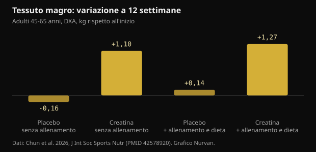
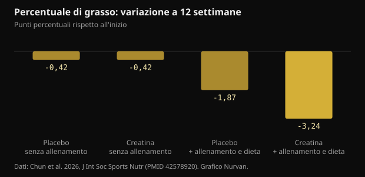

# Creatina 10 g al giorno senza palestra: cosa dice davvero lo studio

Dopo i 45 anni il consiglio standard è: alza pesi e prendi creatina. Uno studio del 2026 ha provato a separare le due cose e ha seguito per 12 settimane anche chi la creatina la prendeva e basta. Qui trovi i numeri reali, quelli che reggono e quelli che non reggono.

## In breve

- Nello studio, chi ha preso 10 g di creatina al giorno senza allenarsi ha guadagnato in media 1,1 kg di tessuto magro alla DXA in 12 settimane; nei gruppi placebo la massa magra non si è mossa.
- Il tessuto magro misurato dalla DXA comprende anche l'acqua, e la creatina aumenta l'acqua totale corporea: parte di quel chilo non è muscolo nuovo.
- La percentuale di grasso è scesa solo nel gruppo che si allenava e mangiava meno (-3,24 punti): la creatina da sola non ha fatto dimagrire.
- La parte sulla memoria è la più debole: sulla batteria di test nel complesso non c'era differenza, e il singolo risultato positivo compare alla settimana 6 e sparisce alla 12.
- La creatinina del sangue sale di poco (meno di 0,16 mg/dL) perché la creatina si degrada in creatinina: è un effetto della misura, non un danno ai reni. Vale la pena dirlo a chi legge le analisi.

## Cosa è stato fatto, in concreto

Lo studio è stato condotto al laboratorio di nutrizione sportiva della Texas A&M University e pubblicato sul Journal of the International Society of Sports Nutrition. Settantatré adulti sani e sedentari tra i 45 e i 65 anni hanno scelto se partecipare a un programma di allenamento e dieta oppure restare senza; dentro ciascuno dei due gruppi sono stati poi assegnati in doppio cieco a 10 g al giorno di creatina monoidrato (due dosi da 5 g) o a un placebo di maltodestrine. Sessantaquattro hanno completato le 12 settimane.

Il programma prevedeva tre sedute a settimana di pesi più circa 20 minuti di cardio, e una dieta con un deficit di 300-500 kcal al giorno. Chi non si allenava continuava la propria vita normale. A 0, 6 e 12 settimane sono stati misurati composizione corporea con DXA, massimale di panca e leg press, prelievi di sangue e una batteria di test cognitivi.

Due dettagli contano più di quanto sembri. Il primo: i gruppi senza allenamento erano composti da 13 persone ciascuno, numeri piccoli. Il secondo: la scelta di allenarsi o no non è stata sorteggiata ma lasciata ai partecipanti, quindi i due blocchi non sono confrontabili come in un esperimento puro. La randomizzazione in cieco riguardava solo creatina contro placebo dentro ogni blocco.

## Il risultato che ha fatto notizia: massa magra senza allenamento

Dopo 12 settimane il tessuto magro misurato alla DXA era aumentato di 1,1 kg (intervallo di confidenza 95%: 0,2-2,0) in chi prendeva creatina senza allenarsi, e di 1,27 kg in chi prendeva creatina allenandosi e mangiando meno. Nei due gruppi placebo non è cambiato nulla.

*Tessuto magro: variazione a 12 settimane — Dati: Chun et al. 2026, J Int Soc Sports Nutr (PMID 42578920). Grafico Nurvan.*

È un risultato che va contro l'idea diffusa che la creatina serva solo se c'è uno stimolo di allenamento. Ma va letto con due avvertenze. La prima è il metodo: la DXA misura tessuto magro, che è muscolo più acqua più organi, non muscolo puro. La seconda è che i gruppi senza allenamento erano i più piccoli dello studio.

Un dato che gli autori segnalano e che pesa sull'interpretazione: il gruppo creatina senza allenamento ha mangiato più degli altri, con un apporto di energia e carboidrati significativamente superiore. Mangiare più carboidrati aumenta il glicogeno muscolare, e ogni grammo di glicogeno trattiene acqua.

## Perché «+1 kg di massa magra» non significa «+1 kg di muscolo»

La creatina entra nel muscolo insieme all'acqua. In uno studio con misure dirette di acqua corporea (diluizione con ossido di deuterio e bromuro di sodio), un protocollo di carico seguito da mantenimento ha aumentato la creatina muscolare, il peso corporeo e l'acqua corporea totale, senza spostare il rapporto tra acqua dentro e fuori dalle cellule.

Questo non vuol dire che la creatina non costruisca muscolo: su mesi e con l'allenamento lo fa. Vuol dire che in 12 settimane senza allenamento una parte del chilo guadagnato è acqua intracellulare, e che la DXA non sa distinguerla. L'effetto è reale ma la sua natura è più banale di come viene raccontata.

Una meta-analisi del 2026 su donne in postmenopausa aiuta a tarare le aspettative: nei sette studi inclusi, la creatina ha aumentato la massa magra di 0,37 kg in media, e i benefici erano chiari quando si usavano almeno 5 g al giorno insieme ai pesi, mentre le dosi pari o inferiori a 3 g senza allenamento non hanno mostrato effetti misurabili.

## Sul grasso corporeo, la creatina da sola non ha fatto nulla

Qui il quadro è netto. La percentuale di grasso è calata in modo rilevante solo nel gruppo che univa creatina, allenamento e deficit calorico: -3,24 punti percentuali contro -1,87 di chi si allenava e mangiava meno con il placebo. Senza allenamento, creatina e placebo sono finiti allo stesso punto.

*Percentuale di grasso: variazione a 12 settimane — Dati: Chun et al. 2026, J Int Soc Sports Nutr (PMID 42578920). Grafico Nurvan.*

È la risposta più utile che lo studio offre a chi cerca una scorciatoia: la creatina migliora il risultato di un percorso, non lo sostituisce. L'effetto più grande resta quello dell'allenamento con i pesi più il deficit calorico.

## E la memoria? La parte più fragile dello studio

L'abstract parla di miglioramenti su alcuni marcatori cognitivi. Guardando i risultati nel dettaglio, l'entusiasmo si ridimensiona.

- Sul test di richiamo delle parole, l'analisi complessiva non mostra differenze né nel tempo né tra i gruppi. L'unico risultato positivo è il numero di parole richiamate correttamente dopo un ritardo, alla settimana 6, nel gruppo creatina senza allenamento: alla settimana 12 non c'è più.
- Riconoscimento di immagini, vigilanza sulle cifre e test di Stroop: nessun beneficio.
- Sul riconoscimento delle parole l'analisi complessiva non è significativa; emerge un singolo tempo di reazione.
- Sul test di reazione a scelta multipla, la percentuale di risposte corrette è risultata migliore nel gruppo placebo senza allenamento.

Gli autori stessi scrivono che i risultati cognitivi vanno considerati esplorativi e che non è stata applicata una correzione per i confronti multipli. Quando si misurano decine di variabili senza correzione, qualche risultato positivo per caso è atteso.

Le meta-analisi danno un quadro più stabile e più modesto. Su 16 studi randomizzati, la creatina migliora la memoria con un effetto piccolo (differenza media standardizzata 0,31) e non migliora la funzione cognitiva globale né quella esecutiva; solo l'effetto sulla memoria arriva a una certezza moderata nella valutazione GRADE. Un'altra meta-analisi, su adulti sani, trova lo stesso effetto piccolo sulla memoria e lo concentra nella fascia 66-76 anni, mentre tra 11 e 31 anni non c'è nulla.

## Creatinina ed esami del sangue: il punto pratico

La creatina si degrada spontaneamente in creatinina, che è la molecola che il laboratorio misura per stimare la funzione dei reni. Più creatina circola, più creatinina compare nel sangue: è aritmetica, non danno renale.

Nello studio la creatinina è salita del 6-8% (meno di 0,1 mg/dL) senza allenamento e del 16-18% (meno di 0,16 mg/dL) con allenamento, restando sotto 1,0 mg/dL. Di conseguenza il filtrato glomerulare stimato, che si calcola proprio dalla creatinina, è sceso del 5-7% e del 14-20%, restando comunque nei valori normali. Gli autori precisano che non hanno misurato né la cistatina C né il filtrato in modo diretto, quindi quel calo non va letto come una riduzione della funzione renale.

La conseguenza pratica è semplice: se fai le analisi mentre prendi creatina, dillo a chi le interpreta. Qualunque domanda su reni, farmaci o patologie va posta al medico, non risolta leggendo un referto da soli.

## Cosa dice davvero la ricerca

**Da precisare** — 10 g di creatina al giorno aumentano la massa magra anche senza allenarsi.

Nello studio è successo: +1,1 kg di tessuto magro alla DXA in 12 settimane contro nessun cambiamento nel placebo. Ma il gruppo era di 13 persone, non è stato sorteggiato, ha mangiato più degli altri, e la DXA conta come tessuto magro anche l'acqua che la creatina fa entrare nel muscolo.

**Smentito** — La creatina da sola fa perdere grasso.

Senza allenamento, creatina e placebo hanno chiuso le 12 settimane con lo stesso calo di percentuale di grasso (-0,42 punti). La differenza vera, -3,24 punti, è arrivata solo unendo creatina, pesi e deficit calorico.

**Da precisare** — La creatina migliora la memoria dopo i 45 anni.

In questo studio l'analisi complessiva dei test di memoria non è significativa e l'unico risultato positivo sparisce alla settimana 12. Le meta-analisi trovano un effetto piccolo sulla memoria, più visibile tra i 66 e i 76 anni, e nessun effetto sulla cognizione globale.

**Da precisare** — Servono 10 g al giorno.

Dieci grammi sono stati scelti perché le ipotesi sul cervello richiedono dosi più alte, non perché servano al muscolo. Per massa e forza il riferimento del position stand ISSN resta 3-5 g al giorno, e la meta-analisi sulle donne in postmenopausa vedeva benefici già da 5 g uniti ai pesi.

**Smentito** — L'aumento della creatinina durante l'integrazione segnala un problema ai reni.

La creatina si trasforma in creatinina: il valore sale per ragioni metaboliche e trascina in basso il filtrato stimato, che da quella creatinina è calcolato. Un'analisi su 684 studi randomizzati non ha trovato un aumento di effetti indesiderati renali, epatici o gastrointestinali rispetto al placebo, nemmeno alle dosi e alle durate più alte.

**Non verificabile** — La creatina senza allenamento rende più tesi.

Il punteggio di tensione del questionario sull'umore era più alto nel gruppo creatina senza allenamento rispetto al placebo alla settimana 12, ma l'analisi complessiva del questionario non mostra differenze significative. È un singolo dato dentro decine di confronti: serve altro per dire qualcosa.

## Come applicarlo

1. Se puoi allenarti, allenati: nello studio il pacchetto completo (pesi, cardio, deficit moderato, creatina) ha dato il risultato più grande su grasso e forza. La creatina da sola non ci arriva.
2. Se non ti alleni, 3-5 g al giorno di creatina monoidrato restano la dose di riferimento del position stand ISSN per massa e forza. I 10 g dello studio nascono da un'ipotesi sul cervello, non da un vantaggio dimostrato sul muscolo.
3. Non aspettarti dimagrimento dalla creatina. Il peso sulla bilancia può salire nelle prime settimane per l'acqua trattenuta nel muscolo: è previsto, non è grasso.
4. Pesati e misurati sempre nelle stesse condizioni e guarda le tendenze su 4-6 settimane, non il singolo giorno. L'acqua corporea si muove troppo per leggere un dato isolato.
5. Se fai le analisi del sangue, segnala che stai prendendo creatina. Creatinina e filtrato stimato si leggono diversamente, e la valutazione spetta al medico.
6. Tieni traccia dei carichi: se la forza non sale in 8-12 settimane, il problema è il programma o il recupero, non la marca dell'integratore.

> **Carichi, misure e integrazione nello stesso posto**  
> In Nurvan registri serie, carichi e RIR allenamento dopo allenamento, segui peso e misure nel tempo e annoti gli integratori che stai prendendo, creatina compresa. Nella sezione esami puoi tenere i referti vicino al resto, così quando parli con il medico o con il coach i dati ci sono già. — **Prova Nurvan** (https://nurvan.app)

## Domande frequenti

### La creatina funziona se non vado in palestra?

In questo studio chi la prendeva senza allenarsi ha aumentato il tessuto magro alla DXA e il massimale di panca. Il gruppo era però di 13 persone e una parte del guadagno è acqua trattenuta nel muscolo. L'effetto più solido della creatina resta quello che ottiene insieme all'allenamento con i pesi.

### Meglio 5 g o 10 g al giorno?

Per massa e forza il riferimento è 3-5 g al giorno. Le dosi più alte sono state usate negli studi che cercano effetti sul cervello, dove le prove sono ancora piccole e incostanti. Dieci grammi non sono necessari per il muscolo.

### La creatina fa male ai reni?

Nelle persone sane le revisioni non hanno trovato danni renali, e l'analisi su 684 studi randomizzati non ha visto più effetti indesiderati rispetto al placebo. La creatinina nel sangue sale per ragioni metaboliche e questo abbassa il filtrato stimato: è un artefatto del calcolo. Chi ha una malattia renale nota o dubbi sui propri esami ne parla con il medico.

### Quanto dell'aumento di peso è acqua?

Lo studio non lo ha scomposto. Lavori con misure dirette dell'acqua corporea mostrano che la creatina aumenta l'acqua corporea totale senza spostare il rapporto tra acqua dentro e fuori dalle cellule. In 12 settimane senza allenamento è ragionevole aspettarsi che una quota del chilo guadagnato sia acqua.

## Fonti

- Chun J, Liu Y, Kibler GL et al., 2026. Effects of creatine supplementation with and without exercise and diet intervention on body composition, cognitive function, and markers of health in middle-aged and older adults. J Int Soc Sports Nutr 23(sup1):2716273. [PMID 42578920](https://pubmed.ncbi.nlm.nih.gov/42578920/) · [DOI 10.1080/15502783.2026.2716273](https://doi.org/10.1080/15502783.2026.2716273)
- Naddafha S, Antonio J, Kreider RB, Stout JR, 2026. Creatine monohydrate for lean mass, strength, and bone density in postmenopausal women: a systematic review and meta-analysis. J Int Soc Sports Nutr 23(1):2668435. [PMID 42141930](https://pubmed.ncbi.nlm.nih.gov/42141930/) · [DOI 10.1080/15502783.2026.2668435](https://doi.org/10.1080/15502783.2026.2668435)
- Xu C, Bi S, Zhang W, Luo L, 2024. The effects of creatine supplementation on cognitive function in adults: a systematic review and meta-analysis. Front Nutr 11:1424972. [PMID 39070254](https://pubmed.ncbi.nlm.nih.gov/39070254/) · [DOI 10.3389/fnut.2024.1424972](https://doi.org/10.3389/fnut.2024.1424972)
- Prokopidis K, Giannos P, Triantafyllidis KK et al., 2023. Effects of creatine supplementation on memory in healthy individuals: a systematic review and meta-analysis of randomized controlled trials. Nutr Rev 81(4):416-427. [PMID 35984306](https://pubmed.ncbi.nlm.nih.gov/35984306/) · [DOI 10.1093/nutrit/nuac064](https://doi.org/10.1093/nutrit/nuac064)
- Powers ME, Arnold BL, Weltman AL et al., 2003. Creatine supplementation increases total body water without altering fluid distribution. J Athl Train 38(1):44-50. [PMID 12937471](https://pubmed.ncbi.nlm.nih.gov/12937471/)
- Gonzalez DE, Dickerson BL, Hines K et al., 2026. Creatine supplementation dose and duration are not associated with increased side effects: a structured review and study-level dose-response analysis of randomized controlled trials. Sports 14(4):137. [PMID 42043069](https://pubmed.ncbi.nlm.nih.gov/42043069/) · [DOI 10.3390/sports14040137](https://doi.org/10.3390/sports14040137)
- Kreider RB, Kalman DS, Antonio J et al., 2017. International Society of Sports Nutrition position stand: safety and efficacy of creatine supplementation in exercise, sport, and medicine. J Int Soc Sports Nutr 14:18. [PMID 28615996](https://pubmed.ncbi.nlm.nih.gov/28615996/) · [DOI 10.1186/s12970-017-0173-z](https://doi.org/10.1186/s12970-017-0173-z)

Articolo ispirato a un post di [Dan Garner (@dangarnernutrition)](https://www.instagram.com/p/Dd1cvUmkUS7/). Fonti consultate tramite PubMed.

> Nota: contenuto informativo, non sostituisce il parere di un medico o di un professionista qualificato.
