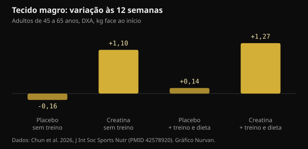
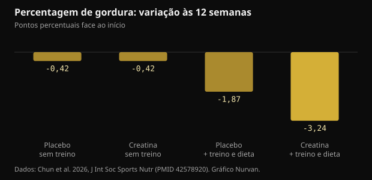

# 10 g de creatina por dia sem ginásio: o que o estudo mostrou mesmo

Depois dos 45 o conselho padrão é: levanta pesos e toma creatina. Um ensaio de 2026 tentou separar as duas coisas e acompanhou durante 12 semanas quem fazia só a segunda metade. Aqui estão os números reais, os que se aguentam e os que não.

## Em resumo

- Quem tomou 10 g de creatina por dia sem treinar ganhou em média 1,1 kg de tecido magro na DXA em 12 semanas; nos grupos placebo a massa magra não se mexeu.
- O tecido magro medido pela DXA inclui água, e a creatina aumenta a água corporal total: parte desse quilo não é músculo novo.
- A percentagem de gordura só desceu de forma relevante no grupo que treinava e comia menos (-3,24 pontos): a creatina sozinha não emagreceu ninguém.
- A parte da memória é a mais frágil: no conjunto dos testes não houve diferença, e o único resultado positivo aparece na semana 6 e desaparece na 12.
- A creatinina no sangue sobe pouco (menos de 0,16 mg/dL) porque a creatina se degrada em creatinina: é um efeito da medição, não lesão renal, e vale a pena dizê-lo a quem lê as análises.

## O que foi feito, em concreto

O ensaio decorreu no laboratório de nutrição desportiva da Universidade Texas A&M e foi publicado no Journal of the International Society of Sports Nutrition. Setenta e três adultos saudáveis e sedentários entre os 45 e os 65 anos escolheram participar ou não num programa de treino e dieta; dentro de cada bloco foram depois distribuídos, em dupla ocultação, por 10 g diárias de creatina monohidratada (duas tomas de 5 g) ou um placebo de maltodextrina. Sessenta e quatro completaram as 12 semanas.

O programa incluía três sessões de pesos por semana mais cerca de 20 minutos de cardio, com uma dieta em défice de 300 a 500 kcal por dia. Quem não treinava seguiu a vida normal. Às 0, 6 e 12 semanas mediram-se composição corporal por DXA, máximo no supino e na prensa de pernas, análises em jejum e uma bateria de testes cognitivos.

Dois pormenores pesam mais do que parecem. Primeiro: cada grupo sem treino tinha 13 pessoas, um número pequeno. Segundo: treinar ou não foi escolha dos participantes e não sorteio, pelo que os dois blocos não são comparáveis como numa experiência limpa. A aleatorização em ocultação cobria apenas creatina contra placebo dentro de cada bloco.

## O resultado que deu manchetes: massa magra sem treino

Às 12 semanas o tecido magro medido por DXA tinha subido 1,1 kg (intervalo de confiança de 95%: 0,2 a 2,0) em quem tomava creatina sem treinar, e 1,27 kg em quem a tomava treinando e comendo menos. Nos dois grupos placebo nada mudou.

*Tecido magro: variação às 12 semanas — Dados: Chun et al. 2026, J Int Soc Sports Nutr (PMID 42578920). Gráfico Nurvan.*

Vai contra a ideia corrente de que a creatina só serve com estímulo de treino. Há duas ressalvas. O método: a DXA mede tecido magro, que é músculo mais água mais órgãos, não músculo puro. E os grupos sem treino eram os mais pequenos do estudo.

Um pormenor assinalado pelos autores muda a leitura: o grupo de creatina sem treino comeu mais do que todos os outros, com ingestão de energia e de hidratos significativamente superior. Mais hidratos significa mais glicogénio muscular, e cada grama de glicogénio retém água.

## Porque «+1 kg de massa magra» não é «+1 kg de músculo»

A creatina entra no músculo acompanhada de água. Num estudo com medidas diretas da água corporal (diluição com óxido de deutério e brometo de sódio), um protocolo de carga seguido de manutenção aumentou a creatina muscular, o peso e a água corporal total, sem alterar a proporção entre água dentro e fora das células.

Isto não quer dizer que a creatina não construa músculo: ao longo de meses e com treino, constrói. Quer dizer que em 12 semanas sem treino parte desse quilo é água intracelular, e que a DXA não a distingue. O efeito é real; a sua natureza é mais banal do que se conta.

Uma meta-análise de 2026 em mulheres na pós-menopausa ajuda a calibrar expectativas: nos sete ensaios incluídos, a creatina aumentou a massa magra em média 0,37 kg, com benefícios claros quando se usavam pelo menos 5 g por dia junto com pesos, enquanto doses de 3 g ou menos sem treino não mostraram efeito mensurável.

## Na gordura corporal, a creatina sozinha não fez nada

Aqui o quadro é limpo. A percentagem de gordura caiu de forma relevante apenas no grupo que juntava creatina, treino e défice calórico: -3,24 pontos percentuais contra -1,87 de quem treinava e comia menos com placebo. Sem treino, creatina e placebo acabaram no mesmo ponto.

*Percentagem de gordura: variação às 12 semanas — Dados: Chun et al. 2026, J Int Soc Sports Nutr (PMID 42578920). Gráfico Nurvan.*

É a resposta mais útil que o estudo dá a quem procura um atalho: a creatina melhora o resultado de um processo, não o substitui. A grande alavanca continua a ser o treino de força mais o défice calórico.

## E a memória? A parte mais frágil do artigo

O resumo fala de melhorias em alguns marcadores cognitivos. Ao ler os resultados em detalhe, o entusiasmo encolhe.

- No teste de evocação de palavras, a análise global não mostra efeito nem do tempo nem do grupo. O único positivo é o número de palavras evocadas corretamente após atraso, na semana 6, no grupo de creatina sem treino. Na semana 12 já não existe.
- Reconhecimento de imagens, vigilância de dígitos e teste de Stroop: nenhum benefício.
- No reconhecimento de palavras a análise global não é significativa; sobressai um único tempo de reação.
- No teste de reação de escolha, a percentagem de respostas certas foi melhor no grupo placebo sem treino.

Os próprios autores escrevem que os achados cognitivos devem ser considerados exploratórios e que não foi aplicada correção para comparações múltiplas. Quando se medem dezenas de variáveis sem correção, alguns positivos por acaso são esperados.

As meta-análises dão um quadro mais estável e mais modesto. Em 16 ensaios aleatorizados, a creatina melhora a memória com efeito pequeno (diferença média padronizada 0,31) e não melhora a função cognitiva global nem a executiva; só o efeito na memória atinge certeza moderada no GRADE. Outra meta-análise em pessoas saudáveis encontra o mesmo efeito pequeno e situa-o entre os 66 e os 76 anos, sem nada entre os 11 e os 31.

## Creatinina e análises: a parte prática

A creatina degrada-se espontaneamente em creatinina, a molécula que o laboratório mede para estimar a função renal. Quanta mais creatina circula, mais creatinina aparece no sangue: é aritmética, não lesão dos rins.

No estudo a creatinina subiu 6 a 8% (menos de 0,1 mg/dL) sem treino e 16 a 18% (menos de 0,16 mg/dL) com treino, ficando abaixo de 1,0 mg/dL. A taxa de filtração glomerular estimada, calculada a partir da creatinina, desceu 5 a 7% e 14 a 20% mantendo-se dentro dos valores normais. Os autores precisam que não mediram cistatina C nem a filtração diretamente, pelo que essa descida não deve ser lida como função renal reduzida.

A consequência prática é simples: se fizer análises enquanto toma creatina, diga-o a quem as interpreta. Qualquer dúvida sobre rins, medicação ou doença é para o médico, não se resolve a ler um relatório sozinho.

## O que a investigação diz mesmo

**A precisar** — 10 g de creatina por dia acrescentam massa magra mesmo sem treino.

Neste estudo aconteceu: +1,1 kg de tecido magro na DXA em 12 semanas contra nenhuma mudança no placebo. Mas o grupo tinha 13 pessoas, não foi sorteado para esse braço, comeu mais do que os outros, e a DXA conta como tecido magro a água que a creatina leva para o músculo.

**Desmentido** — A creatina sozinha queima gordura.

Sem treino, creatina e placebo terminaram as 12 semanas com a mesma variação de percentagem de gordura (-0,42 pontos). A diferença real, -3,24 pontos, veio só de creatina mais pesos mais défice calórico.

**A precisar** — A creatina melhora a memória depois dos 45.

Neste estudo a análise global dos testes de memória não é significativa e o único positivo desaparece na semana 12. As meta-análises encontram um efeito pequeno na memória, mais claro entre os 66 e os 76 anos, e nenhum na cognição global.

**A precisar** — São precisas 10 g por dia.

As 10 g foram escolhidas porque as hipóteses sobre o cérebro pedem doses altas, não porque o músculo precise delas. Para massa e força a referência da tomada de posição da ISSN continua a ser 3 a 5 g por dia, e a meta-análise na pós-menopausa via benefícios a partir de 5 g junto com pesos.

**Desmentido** — A creatinina a subir com creatina indica problema renal.

A creatina transforma-se em creatinina: o valor sobe por razões metabólicas e arrasta para baixo a filtração estimada, que dela é calculada. Uma análise de 684 ensaios aleatorizados não encontrou aumento de efeitos adversos renais, hepáticos ou gastrointestinais face ao placebo, nem nas doses e durações mais altas.

**Não verificável** — A creatina sem treino deixa as pessoas mais tensas.

A pontuação de tensão do questionário de humor foi mais alta no grupo de creatina sem treino do que no placebo na semana 12, mas a análise global do questionário não mostra diferenças significativas. É um dado solto entre dezenas de comparações.

## Como aplicar

1. Se pode treinar, treine: o pacote completo (pesos, cardio, défice moderado, creatina) deu a maior mudança em gordura e força. A creatina sozinha não lá chega.
2. Se não treina, 3 a 5 g por dia de creatina monohidratada continuam a ser a dose de referência da ISSN para massa e força. As 10 g do estudo nascem de uma hipótese sobre o cérebro, não de uma vantagem muscular demonstrada.
3. Não espere perder gordura com creatina. O peso na balança pode subir nas primeiras semanas pela água retida no músculo: é esperado e não é gordura.
4. Pese-se e meça-se sempre nas mesmas condições e leia tendências de 4 a 6 semanas, não dias isolados. A água corporal oscila demasiado.
5. Se fizer análises, avise que toma creatina. A creatinina e a filtração estimada leem-se de outra forma, e a avaliação é do médico.
6. Registe as cargas: se a força não sobe em 8 a 12 semanas, o problema é o programa ou a recuperação, não a marca do suplemento.

> **Cargas, medidas e suplementos no mesmo sítio**  
> No Nurvan registas séries, cargas e RIR treino a treino, acompanhas peso e medidas ao longo do tempo e anotas os suplementos que estás a tomar, creatina incluída. Na secção de análises guardas os relatórios junto do resto, por isso os dados já lá estão quando falares com o médico ou com o teu treinador. — **Experimentar o Nurvan** (https://nurvan.app)

## Perguntas frequentes

### A creatina funciona se eu não for ao ginásio?

Neste estudo quem a tomou sem treinar aumentou o tecido magro na DXA e o máximo no supino. O grupo tinha 13 pessoas e parte do ganho é água retida no músculo. O efeito mais sólido da creatina continua a ser o que obtém junto com o treino de força.

### Melhor 5 g ou 10 g por dia?

Para massa e força a referência é 3 a 5 g por dia. As doses mais altas foram usadas em estudos que procuram efeitos cerebrais, onde a evidência ainda é pequena e inconstante. Dez gramas não são necessárias para o músculo.

### A creatina faz mal aos rins?

Em pessoas saudáveis as revisões não encontraram lesão renal, e a análise de 684 ensaios aleatorizados não viu mais efeitos adversos do que com placebo. A creatinina sobe por razões metabólicas e isso baixa a filtração estimada: é um artefacto do cálculo. Quem tem doença renal conhecida ou dúvidas sobre os seus resultados deve falar com o médico.

### Quanto do peso ganho é água?

O estudo não o decompôs. Trabalhos com medidas diretas da água corporal mostram que a creatina aumenta a água corporal total sem alterar a proporção entre água dentro e fora das células. Em 12 semanas sem treino é razoável esperar que parte do quilo seja água.

## Fontes

- Chun J, Liu Y, Kibler GL et al., 2026. Effects of creatine supplementation with and without exercise and diet intervention on body composition, cognitive function, and markers of health in middle-aged and older adults. J Int Soc Sports Nutr 23(sup1):2716273. [PMID 42578920](https://pubmed.ncbi.nlm.nih.gov/42578920/) · [DOI 10.1080/15502783.2026.2716273](https://doi.org/10.1080/15502783.2026.2716273)
- Naddafha S, Antonio J, Kreider RB, Stout JR, 2026. Creatine monohydrate for lean mass, strength, and bone density in postmenopausal women: a systematic review and meta-analysis. J Int Soc Sports Nutr 23(1):2668435. [PMID 42141930](https://pubmed.ncbi.nlm.nih.gov/42141930/) · [DOI 10.1080/15502783.2026.2668435](https://doi.org/10.1080/15502783.2026.2668435)
- Xu C, Bi S, Zhang W, Luo L, 2024. The effects of creatine supplementation on cognitive function in adults: a systematic review and meta-analysis. Front Nutr 11:1424972. [PMID 39070254](https://pubmed.ncbi.nlm.nih.gov/39070254/) · [DOI 10.3389/fnut.2024.1424972](https://doi.org/10.3389/fnut.2024.1424972)
- Prokopidis K, Giannos P, Triantafyllidis KK et al., 2023. Effects of creatine supplementation on memory in healthy individuals: a systematic review and meta-analysis of randomized controlled trials. Nutr Rev 81(4):416-427. [PMID 35984306](https://pubmed.ncbi.nlm.nih.gov/35984306/) · [DOI 10.1093/nutrit/nuac064](https://doi.org/10.1093/nutrit/nuac064)
- Powers ME, Arnold BL, Weltman AL et al., 2003. Creatine supplementation increases total body water without altering fluid distribution. J Athl Train 38(1):44-50. [PMID 12937471](https://pubmed.ncbi.nlm.nih.gov/12937471/)
- Gonzalez DE, Dickerson BL, Hines K et al., 2026. Creatine supplementation dose and duration are not associated with increased side effects: a structured review and study-level dose-response analysis of randomized controlled trials. Sports 14(4):137. [PMID 42043069](https://pubmed.ncbi.nlm.nih.gov/42043069/) · [DOI 10.3390/sports14040137](https://doi.org/10.3390/sports14040137)
- Kreider RB, Kalman DS, Antonio J et al., 2017. International Society of Sports Nutrition position stand: safety and efficacy of creatine supplementation in exercise, sport, and medicine. J Int Soc Sports Nutr 14:18. [PMID 28615996](https://pubmed.ncbi.nlm.nih.gov/28615996/) · [DOI 10.1186/s12970-017-0173-z](https://doi.org/10.1186/s12970-017-0173-z)

Artigo inspirado numa publicação de [Dan Garner (@dangarnernutrition)](https://www.instagram.com/p/Dd1cvUmkUS7/). Fontes consultadas através da PubMed.

> Nota: conteúdo informativo. Não substitui a opinião de um médico ou profissional qualificado.
