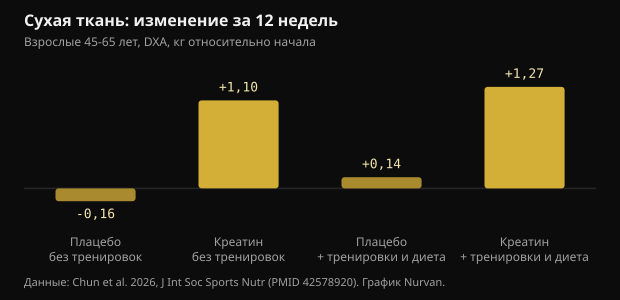
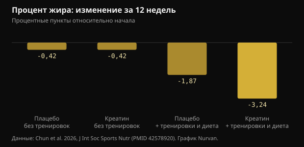

# 10 г креатина в день без зала: что на самом деле показало исследование

После 45 стандартный совет звучит так: поднимай вес и принимай креатин. Исследование 2026 года попробовало разделить эти две вещи и 12 недель наблюдало за теми, кто делал только вторую половину. Вот реальные цифры: те, что выдерживают проверку, и те, что нет.

## Коротко

- Те, кто принимал 10 г креатина в день без тренировок, за 12 недель набрали в среднем 1,1 кг сухой ткани по DXA; в группах плацебо сухая масса не изменилась.
- Сухая ткань по DXA включает воду, а креатин повышает общую воду тела: часть этого килограмма — не новая мышца.
- Процент жира заметно снизился только в группе, которая тренировалась и ела меньше (-3,24 пункта): сам по себе креатин никого не похудел.
- Раздел про память — самый слабый: по всей батарее тестов различий нет, а единственный положительный результат появляется на 6-й неделе и исчезает к 12-й.
- Креатинин крови растёт немного (меньше 0,16 мг/дл), потому что креатин распадается в креатинин: это эффект измерения, а не поражение почек, и об этом стоит сказать тому, кто читает анализы.

## Что именно сделали

Исследование провели в лаборатории спортивного питания Техасского университета A&M и опубликовали в Journal of the International Society of Sports Nutrition. Семьдесят три здоровых малоподвижных человека 45-65 лет сами решали, участвовать ли в программе тренировок и диеты; внутри каждого блока их затем двойным слепым методом распределяли на 10 г моногидрата креатина в день (две порции по 5 г) или мальтодекстриновое плацебо. Двенадцать недель завершили шестьдесят четыре человека.

Программа включала три силовые тренировки в неделю плюс около 20 минут кардио и питание с дефицитом 300-500 ккал в день. Те, кто не тренировался, жили как обычно. На 0, 6 и 12-й неделе измеряли состав тела по DXA, разовый максимум в жиме лёжа и жиме ногами, кровь натощак и батарею когнитивных тестов.

Две детали весят больше, чем кажется. Первая: в каждой группе без тренировок было по 13 человек — мало. Вторая: тренироваться или нет, участники выбирали сами, а не по жребию, поэтому два блока не сравнимы как в чистом эксперименте. Слепая рандомизация касалась только креатина против плацебо внутри блока.

## Результат, попавший в заголовки: сухая масса без тренировок

Через 12 недель сухая ткань по DXA выросла на 1,1 кг (95% доверительный интервал: 0,2-2,0) у тех, кто принимал креатин без тренировок, и на 1,27 кг у тех, кто принимал его, тренируясь и питаясь с дефицитом. В обеих группах плацебо не изменилось ничего.

*Сухая ткань: изменение за 12 недель — Данные: Chun et al. 2026, J Int Soc Sports Nutr (PMID 42578920). График Nurvan.*

Это противоречит расхожей мысли, что креатин работает только при тренировочном стимуле. Но есть две оговорки. Метод: DXA измеряет сухую ткань, то есть мышцы плюс воду плюс органы, а не чистую мышцу. И группы без тренировок были самыми маленькими в исследовании.

Деталь, которую отмечают сами авторы, меняет прочтение: группа креатина без тренировок ела больше всех, с достоверно более высоким потреблением энергии и углеводов. Больше углеводов — больше мышечного гликогена, а каждый грамм гликогена удерживает воду.

## Почему «+1 кг сухой массы» — это не «+1 кг мышц»

Креатин попадает в мышцу вместе с водой. В работе с прямыми измерениями воды тела (разведение оксидом дейтерия и бромидом натрия) протокол загрузки с последующим поддержанием увеличил мышечный креатин, массу тела и общую воду тела, не сместив соотношение между водой внутри и вне клеток.

Это не значит, что креатин не строит мышцу: за месяцы и с тренировками строит. Это значит, что за 12 недель без тренировок часть килограмма — внутриклеточная вода, и DXA её не различает. Эффект реален, но его природа проще, чем о нём рассказывают.

Метаанализ 2026 года у женщин в постменопаузе помогает откалибровать ожидания: в семи включённых исследованиях креатин прибавил в среднем 0,37 кг сухой массы, с ясной пользой при не менее 5 г в день вместе с силовыми, тогда как дозы 3 г и меньше без тренировок измеримого эффекта не дали.

## На жировую массу креатин сам по себе не повлиял

Здесь картина чистая. Процент жира заметно снизился только в группе, где сочетались креатин, тренировки и дефицит калорий: -3,24 процентных пункта против -1,87 у тренировавшихся на плацебо. Без тренировок креатин и плацебо пришли к одному и тому же.

*Процент жира: изменение за 12 недель — Данные: Chun et al. 2026, J Int Soc Sports Nutr (PMID 42578920). График Nurvan.*

Это самый полезный ответ исследования тем, кто ищет короткий путь: креатин улучшает результат процесса, но не заменяет его. Главный рычаг по-прежнему силовые тренировки плюс дефицит калорий.

## А память? Самая хрупкая часть работы

В резюме говорится об улучшении отдельных когнитивных показателей. При внимательном чтении результатов энтузиазм уменьшается.

- В тесте на воспроизведение слов общий анализ не показывает эффекта ни времени, ни группы. Единственный плюс — число правильно воспроизведённых слов с задержкой, на 6-й неделе, в группе креатина без тренировок. К 12-й неделе его нет.
- Узнавание изображений, тест на бдительность с цифрами и тест Струпа: пользы нет.
- В узнавании слов общий анализ незначим; выделяется одно время реакции.
- В тесте реакции выбора доля правильных ответов была выше в группе плацебо без тренировок.

Авторы сами пишут, что когнитивные находки следует считать поисковыми и что поправка на множественные сравнения не применялась. Когда измеряют десятки переменных без поправки, случайные положительные результаты ожидаемы.

Метаанализы дают более устойчивую и более скромную картину. По 16 рандомизированным исследованиям креатин улучшает память с малым эффектом (стандартизованная разность средних 0,31) и не улучшает ни общую когнитивную, ни исполнительную функцию; только эффект на память достигает умеренной определённости по GRADE. Другой метаанализ у здоровых людей находит тот же малый эффект и помещает его в возраст 66-76 лет, тогда как между 11 и 31 годом эффекта нет.

## Креатинин и анализы крови: практическая часть

Креатин спонтанно распадается в креатинин — ту самую молекулу, которую лаборатория измеряет для оценки работы почек. Чем больше креатина в обороте, тем больше креатинина в крови: это арифметика, а не повреждение почек.

В исследовании креатинин вырос на 6-8% (меньше 0,1 мг/дл) без тренировок и на 16-18% (меньше 0,16 мг/дл) с тренировками, оставаясь ниже 1,0 мг/дл. Расчётная скорость клубочковой фильтрации, которая считается именно из креатинина, снизилась на 5-7% и на 14-20%, оставшись в пределах нормы. Авторы уточняют, что не измеряли ни цистатин C, ни фильтрацию напрямую, поэтому это снижение нельзя читать как ухудшение работы почек.

Практический вывод прост: если сдаёте анализы, принимая креатин, скажите об этом тому, кто их трактует. Любые вопросы про почки, лекарства или болезни — к врачу, а не к самостоятельному чтению бланка.

## Что говорит исследование на самом деле

**С оговорками** — 10 г креатина в день добавляют сухую массу даже без тренировок.

В этом исследовании так и вышло: +1,1 кг сухой ткани по DXA за 12 недель против нуля на плацебо. Но в группе было 13 человек, попали туда не по жребию, ели они больше остальных, а DXA считает сухой тканью и воду, которую креатин затягивает в мышцу.

**Опровергнуто** — Креатин сам по себе сжигает жир.

Без тренировок креатин и плацебо закончили 12 недель с одинаковым изменением процента жира (-0,42 пункта). Настоящая разница, -3,24 пункта, появилась только при сочетании креатина, силовых и дефицита калорий.

**С оговорками** — Креатин улучшает память после 45.

В этом исследовании общий анализ тестов памяти незначим, а единственный плюс исчезает к 12-й неделе. Метаанализы находят малый эффект на память, заметнее всего в 66-76 лет, и никакого — на общую когнитивную функцию.

**С оговорками** — Нужно 10 г в день.

Десять граммов выбрали потому, что гипотезы про мозг требуют высоких доз, а не потому, что это нужно мышце. Для массы и силы ориентир позиционного документа ISSN — по-прежнему 3-5 г в день, а метаанализ у женщин в постменопаузе видел пользу уже от 5 г вместе с силовыми.

**Опровергнуто** — Рост креатинина на фоне креатина означает проблему с почками.

Креатин превращается в креатинин: показатель растёт по метаболическим причинам и тянет вниз расчётную фильтрацию, которая из него и считается. Анализ 684 рандомизированных исследований не нашёл роста почечных, печёночных или желудочно-кишечных нежелательных явлений по сравнению с плацебо, даже при самых высоких дозах и сроках.

**Не проверить** — Креатин без тренировок повышает напряжённость.

Балл напряжения в опроснике настроения был выше в группе креатина без тренировок, чем на плацебо, на 12-й неделе, но общий анализ опросника значимых различий не показывает. Это одно значение среди десятков сравнений.

## Как это применить

1. Если можете тренироваться — тренируйтесь: полный набор (силовые, кардио, умеренный дефицит, креатин) дал самое большое изменение жира и силы. Один креатин туда не доводит.
2. Если не тренируетесь, 3-5 г моногидрата креатина в день остаются ориентиром ISSN для массы и силы. Десять граммов из исследования идут из гипотезы о мозге, а не из доказанного преимущества для мышц.
3. Не ждите от креатина похудения. Вес на весах может вырасти в первые недели из-за воды в мышцах: это ожидаемо и это не жир.
4. Взвешивайтесь и измеряйтесь всегда в одинаковых условиях и смотрите тренды за 4-6 недель, а не отдельные дни. Вода тела колеблется слишком сильно.
5. Сдаёте кровь — предупредите, что принимаете креатин. Креатинин и расчётную фильтрацию тогда читают иначе, а оценка остаётся за врачом.
6. Ведите учёт рабочих весов: если за 8-12 недель сила не растёт, дело в программе или восстановлении, а не в марке добавки.

> **Веса, замеры и добавки в одном месте**  
> В Nurvan вы записываете подходы, рабочие веса и RIR от тренировки к тренировке, следите за весом и замерами во времени и отмечаете принимаемые добавки, включая креатин. В разделе анализов отчёты лежат рядом со всем остальным, поэтому данные уже готовы, когда вы говорите с врачом или тренером. — **Попробовать Nurvan** (https://nurvan.app)

## Частые вопросы

### Работает ли креатин, если я не хожу в зал?

В этом исследовании у тех, кто принимал его без тренировок, выросла сухая ткань по DXA и максимум в жиме лёжа. В группе было 13 человек, и часть прироста — вода в мышцах. Самый надёжный эффект креатина по-прежнему тот, который он даёт вместе с силовыми тренировками.

### Лучше 5 или 10 г в день?

Для массы и силы ориентир — 3-5 г в день. Более высокие дозы применяли в работах, которые ищут эффекты для мозга, где доказательств мало и они непостоянны. Для мышц десять граммов не нужны.

### Вреден ли креатин для почек?

У здоровых людей обзоры не нашли повреждения почек, а анализ 684 рандомизированных исследований не увидел больше нежелательных явлений, чем на плацебо. Креатинин растёт по метаболическим причинам, и это снижает расчётную фильтрацию: артефакт расчёта. Тем, у кого известна болезнь почек или есть сомнения по своим анализам, нужно поговорить с врачом.

### Какая часть прибавки веса — вода?

Исследование это не разложило. Работы с прямыми измерениями воды тела показывают, что креатин увеличивает общую воду тела, не меняя соотношения воды внутри и вне клеток. За 12 недель без тренировок разумно ожидать, что часть килограмма — вода.

## Источники

- Chun J, Liu Y, Kibler GL et al., 2026. Effects of creatine supplementation with and without exercise and diet intervention on body composition, cognitive function, and markers of health in middle-aged and older adults. J Int Soc Sports Nutr 23(sup1):2716273. [PMID 42578920](https://pubmed.ncbi.nlm.nih.gov/42578920/) · [DOI 10.1080/15502783.2026.2716273](https://doi.org/10.1080/15502783.2026.2716273)
- Naddafha S, Antonio J, Kreider RB, Stout JR, 2026. Creatine monohydrate for lean mass, strength, and bone density in postmenopausal women: a systematic review and meta-analysis. J Int Soc Sports Nutr 23(1):2668435. [PMID 42141930](https://pubmed.ncbi.nlm.nih.gov/42141930/) · [DOI 10.1080/15502783.2026.2668435](https://doi.org/10.1080/15502783.2026.2668435)
- Xu C, Bi S, Zhang W, Luo L, 2024. The effects of creatine supplementation on cognitive function in adults: a systematic review and meta-analysis. Front Nutr 11:1424972. [PMID 39070254](https://pubmed.ncbi.nlm.nih.gov/39070254/) · [DOI 10.3389/fnut.2024.1424972](https://doi.org/10.3389/fnut.2024.1424972)
- Prokopidis K, Giannos P, Triantafyllidis KK et al., 2023. Effects of creatine supplementation on memory in healthy individuals: a systematic review and meta-analysis of randomized controlled trials. Nutr Rev 81(4):416-427. [PMID 35984306](https://pubmed.ncbi.nlm.nih.gov/35984306/) · [DOI 10.1093/nutrit/nuac064](https://doi.org/10.1093/nutrit/nuac064)
- Powers ME, Arnold BL, Weltman AL et al., 2003. Creatine supplementation increases total body water without altering fluid distribution. J Athl Train 38(1):44-50. [PMID 12937471](https://pubmed.ncbi.nlm.nih.gov/12937471/)
- Gonzalez DE, Dickerson BL, Hines K et al., 2026. Creatine supplementation dose and duration are not associated with increased side effects: a structured review and study-level dose-response analysis of randomized controlled trials. Sports 14(4):137. [PMID 42043069](https://pubmed.ncbi.nlm.nih.gov/42043069/) · [DOI 10.3390/sports14040137](https://doi.org/10.3390/sports14040137)
- Kreider RB, Kalman DS, Antonio J et al., 2017. International Society of Sports Nutrition position stand: safety and efficacy of creatine supplementation in exercise, sport, and medicine. J Int Soc Sports Nutr 14:18. [PMID 28615996](https://pubmed.ncbi.nlm.nih.gov/28615996/) · [DOI 10.1186/s12970-017-0173-z](https://doi.org/10.1186/s12970-017-0173-z)

Статья написана под впечатлением от публикации [Dan Garner (@dangarnernutrition)](https://www.instagram.com/p/Dd1cvUmkUS7/). Источники найдены через PubMed.

> Примечание: информационный материал. Он не заменяет консультацию врача или квалифицированного специалиста.
