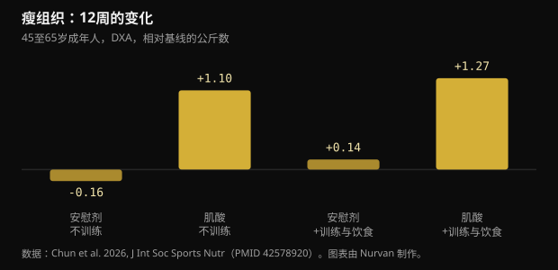
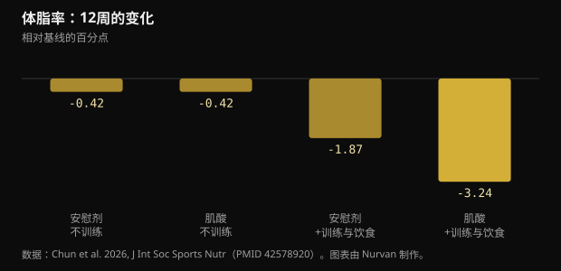

# 不去健身房、每天10克肌酸：这项研究真正发现了什么

过了45岁，标准建议只有两句：举铁，补肌酸。2026年的一项试验试着把两者拆开，用12周观察那些只做后半句的人。下面是真实数字，哪些站得住脚，哪些站不住。

## 速览

- 每天服用10克肌酸且不训练的人，12周内DXA测得的瘦组织平均增加1.1公斤；安慰剂组没有变化。
- DXA测的瘦组织包含水分，而肌酸会提高全身总水量：这一公斤里有一部分并不是新长的肌肉。
- 体脂率只有在既训练又少吃的那一组才明显下降（-3.24个百分点）：只吃肌酸并没有让任何人变瘦。
- 记忆部分最薄弱：整套测验没有差异，唯一的阳性结果出现在第6周，到第12周就消失了。
- 血肌酐略有上升（不到0.16 mg/dL），因为肌酸会降解为肌酐：这是测量效应，不是肾损伤，值得告诉看化验单的人。

## 这项研究具体做了什么

研究在德州农工大学运动营养实验室进行，发表于 Journal of the International Society of Sports Nutrition。73名45至65岁、平时久坐的健康成年人自行选择是否参加训练加饮食方案；在各自的组别内，再以双盲方式分配到每天10克一水肌酸（两次各5克）或麦芽糊精安慰剂。64人完成了12周。

方案为每周三次力量训练加约20分钟有氧，饮食每天制造300至500千卡的缺口。不训练的人维持原有生活。在第0、6、12周测量DXA身体成分、卧推与腿举的1RM、空腹血液指标以及一整套认知测验。

有两个细节比看上去更重要。第一，不训练的两组各只有13人，数量很少。第二，练还是不练由参与者自己选择而非随机分配，因此两大组之间并不像干净实验那样可比。双盲随机只发生在各组内部的肌酸与安慰剂之间。

## 上了标题的结果：不训练也长瘦体重

12周后，不训练但服用肌酸的人，DXA瘦组织增加1.1公斤（95%置信区间0.2至2.0）；训练加控制饮食并服用肌酸的人增加1.27公斤。两个安慰剂组都没有变化。

*瘦组织：12周的变化 — 数据：Chun et al. 2026, J Int Soc Sports Nutr（PMID 42578920）。图表由 Nurvan 制作。*

这与“肌酸只有配合训练刺激才有用”的流行说法相反。但有两点要注意。方法上，DXA测的是瘦组织，也就是肌肉加水分加器官，而不是纯肌肉。另外，不训练的两组是全研究里最小的。

作者提到的一个细节会改变解读：不训练的肌酸组比其他所有人吃得更多，能量和碳水摄入显著更高。碳水更多意味着肌糖原更多，而每克糖原都会带着水一起储存。

## 为什么“瘦体重+1公斤”不等于“肌肉+1公斤”

肌酸是和水一起进入肌肉的。在一项直接测量体水的研究中（用氧化氘和溴化钠稀释法），先加载后维持的方案提高了肌肉肌酸、体重和全身总水量，但没有改变细胞内外水分的比例。

这并不是说肌酸不能增肌：在数月的时间里配合训练，它可以。这是说，在不训练的12周里，那一公斤中有一部分是细胞内水，而DXA无法区分。效应真实存在，只是性质比流传的说法平常得多。

2026年一项针对绝经后女性的荟萃分析有助于校准预期：在纳入的七项试验中，肌酸平均增加0.37公斤瘦体重；当每天至少5克并结合力量训练时效果清晰，而每天3克或更少且不训练时则看不到可测量的效果。

## 在体脂上，单吃肌酸什么也没做到

这里结论很干净。体脂率只有在肌酸、训练和热量缺口三者结合的组里明显下降：-3.24个百分点，而训练加控制饮食的安慰剂组为-1.87。不训练的情况下，肌酸和安慰剂落在同一个位置。

*体脂率：12周的变化 — 数据：Chun et al. 2026, J Int Soc Sports Nutr（PMID 42578920）。图表由 Nurvan 制作。*

这是这项研究给“想走捷径的人”最有用的回答：肌酸能改善一个过程的结果，但不能替代这个过程。真正的杠杆仍然是力量训练加热量缺口。

## 记忆呢？论文里最薄的一块

摘要提到若干认知指标有改善。细读结果，热情就会收缩。

- 单词回忆测验中，整体分析没有时间效应，也没有组间效应。唯一的阳性是延迟后正确回忆的单词数，出现在第6周、不训练的肌酸组。到第12周已经消失。
- 图片再认、数字警觉测验和Stroop测验：没有收益。
- 单词再认的整体分析不显著；只有一个反应时指标冒出来。
- 选择反应测验中，正确率反而是不训练的安慰剂组更好。

作者自己写明，认知方面的发现应视为探索性，并且没有对多重比较做校正。当你在不校正的情况下测量几十个变量，出现一些偶然的阳性是意料之中的。

荟萃分析给出的画面更稳定也更保守。在16项随机试验中，肌酸改善记忆的效应很小（标准化均数差0.31），对整体认知功能和执行功能没有改善；按GRADE只有记忆这一项达到中等确定性。另一项针对健康人群的荟萃分析发现同样的小效应，并把它集中在66至76岁，而11至31岁之间什么也没有。

## 肌酐和血液检查：实际要点

肌酸会自发降解为肌酐，而肌酐正是实验室用来估算肾功能的那个分子。循环里的肌酸越多，血里的肌酐就越多：这是算术，不是肾损伤。

研究中，不训练时肌酐升高6%至8%（不到0.1 mg/dL），训练时升高16%至18%（不到0.16 mg/dL），但都低于1.0 mg/dL。由肌酐推算的估算肾小球滤过率因此分别下降5%至7%和14%至20%，仍在正常范围内。作者说明，他们没有测胱抑素C，也没有直接测滤过率，因此这一下降不应被解读为肾功能减退。

实际结论很简单：服用肌酸期间做血检，请告诉解读化验单的人。任何关于肾脏、用药或疾病的问题都应交给医生，而不是自己对着报告下判断。

## 研究真正说了什么

**需补充说明** — 每天10克肌酸，不训练也能增加瘦体重。

这项研究里确实如此：12周DXA瘦组织增加1.1公斤，安慰剂组没有变化。但该组只有13人、不是随机分进这一支、吃得比其他人多，而且DXA会把肌酸拉进肌肉的水分一并算作瘦组织。

**不成立** — 单吃肌酸就能减脂。

不训练时，肌酸组和安慰剂组12周后的体脂率变化完全相同（-0.42个百分点）。真正的差距-3.24个百分点，只来自肌酸加力量训练加热量缺口。

**需补充说明** — 肌酸能改善45岁以后的记忆。

这项研究中记忆测验的整体分析并不显著，唯一的阳性到第12周消失。荟萃分析发现记忆上有一个小效应，在66至76岁最明显，对整体认知则没有效果。

**需补充说明** — 必须每天10克。

选10克是因为关于大脑的假说需要更高剂量，而不是肌肉需要。就增肌和力量而言，ISSN立场声明的参考量仍是每天3至5克，绝经后女性的荟萃分析在每天5克配合力量训练时就看到了收益。

**不成立** — 吃肌酸时肌酐升高说明肾脏出了问题。

肌酸会转化为肌酐：数值因代谢原因上升，并把由它推算的估算滤过率一起拉低。一项对684项随机试验的分析发现，与安慰剂相比，肾脏、肝脏或胃肠道不良反应并未增加，即使在最高剂量和最长时程下也是如此。

**无法判断** — 不训练吃肌酸会让人更紧张。

情绪问卷中的紧张分数在第12周时，不训练的肌酸组高于安慰剂组，但该问卷的整体分析没有显著差异。这是几十个比较中的一个孤立数据。

## 怎么用

1. 如果能训练就训练：完整组合（力量、有氧、适度热量缺口、肌酸）带来了体脂和力量上最大的变化。只靠肌酸达不到。
2. 如果不训练，每天3至5克一水肌酸仍是ISSN为增肌和力量给出的参考剂量。研究里的10克来自关于大脑的假说，而不是已被证明的肌肉优势。
3. 不要指望肌酸带来减脂。最初几周体重秤上的数字可能上升，那是肌肉里的水，属于预期之内，也不是脂肪。
4. 每次在相同条件下称重和量围度，看4至6周的趋势而不是单日数据。体水波动太大。
5. 做血检时说明自己在吃肌酸。肌酐和估算滤过率的解读会不同，判断交给医生。
6. 记录训练负荷：如果8至12周力量没有提升，问题出在计划或恢复，而不是补剂品牌。

> **负荷、围度和补剂都在同一个地方**  
> 在 Nurvan 里，你可以逐次训练记录组数、负荷和RIR，长期跟踪体重与围度，并记下正在服用的补剂，包括肌酸。化验单板块把报告和其他数据放在一起，这样你和医生或教练沟通时，数据已经在那里了。 — **试用 Nurvan** (https://nurvan.app)

## 常见问题

### 不去健身房，肌酸还有用吗？

在这项研究里，不训练而服用肌酸的人，DXA瘦组织和卧推1RM都有提升。该组只有13人，其中一部分增加是肌肉里的水。肌酸最可靠的效果，仍然是配合力量训练时取得的那一份。

### 每天5克还是10克更好？

就增肌和力量而言，参考量是每天3至5克。更高剂量用于寻找大脑效应的研究，而那里的证据仍然少且不稳定。肌肉并不需要10克。

### 肌酸伤肾吗？

在健康人群中，综述没有发现肾损伤，对684项随机试验的分析也没有看到比安慰剂更多的不良反应。血肌酐因代谢原因上升，从而拉低估算滤过率，这是计算上的假象。已知肾病或对自己结果有疑问的人应当咨询医生。

### 增加的体重里有多少是水？

这项研究没有拆分。使用直接测量体水的研究显示，肌酸提高全身总水量，但不改变细胞内外水分的比例。在不训练的12周里，合理预期是那一公斤中有一部分是水。

## 参考文献

- Chun J, Liu Y, Kibler GL et al., 2026. Effects of creatine supplementation with and without exercise and diet intervention on body composition, cognitive function, and markers of health in middle-aged and older adults. J Int Soc Sports Nutr 23(sup1):2716273. [PMID 42578920](https://pubmed.ncbi.nlm.nih.gov/42578920/) · [DOI 10.1080/15502783.2026.2716273](https://doi.org/10.1080/15502783.2026.2716273)
- Naddafha S, Antonio J, Kreider RB, Stout JR, 2026. Creatine monohydrate for lean mass, strength, and bone density in postmenopausal women: a systematic review and meta-analysis. J Int Soc Sports Nutr 23(1):2668435. [PMID 42141930](https://pubmed.ncbi.nlm.nih.gov/42141930/) · [DOI 10.1080/15502783.2026.2668435](https://doi.org/10.1080/15502783.2026.2668435)
- Xu C, Bi S, Zhang W, Luo L, 2024. The effects of creatine supplementation on cognitive function in adults: a systematic review and meta-analysis. Front Nutr 11:1424972. [PMID 39070254](https://pubmed.ncbi.nlm.nih.gov/39070254/) · [DOI 10.3389/fnut.2024.1424972](https://doi.org/10.3389/fnut.2024.1424972)
- Prokopidis K, Giannos P, Triantafyllidis KK et al., 2023. Effects of creatine supplementation on memory in healthy individuals: a systematic review and meta-analysis of randomized controlled trials. Nutr Rev 81(4):416-427. [PMID 35984306](https://pubmed.ncbi.nlm.nih.gov/35984306/) · [DOI 10.1093/nutrit/nuac064](https://doi.org/10.1093/nutrit/nuac064)
- Powers ME, Arnold BL, Weltman AL et al., 2003. Creatine supplementation increases total body water without altering fluid distribution. J Athl Train 38(1):44-50. [PMID 12937471](https://pubmed.ncbi.nlm.nih.gov/12937471/)
- Gonzalez DE, Dickerson BL, Hines K et al., 2026. Creatine supplementation dose and duration are not associated with increased side effects: a structured review and study-level dose-response analysis of randomized controlled trials. Sports 14(4):137. [PMID 42043069](https://pubmed.ncbi.nlm.nih.gov/42043069/) · [DOI 10.3390/sports14040137](https://doi.org/10.3390/sports14040137)
- Kreider RB, Kalman DS, Antonio J et al., 2017. International Society of Sports Nutrition position stand: safety and efficacy of creatine supplementation in exercise, sport, and medicine. J Int Soc Sports Nutr 14:18. [PMID 28615996](https://pubmed.ncbi.nlm.nih.gov/28615996/) · [DOI 10.1186/s12970-017-0173-z](https://doi.org/10.1186/s12970-017-0173-z)

本文受 [Dan Garner（@dangarnernutrition）](https://www.instagram.com/p/Dd1cvUmkUS7/) 的一则帖子启发。文献通过 PubMed 检索。

> 提示：本文为科普内容，不能替代医生或合格专业人士的意见。
