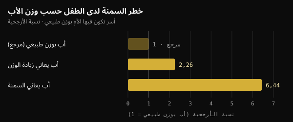
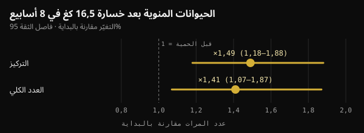

# وزن الأب عند الحمل: ما الذي ينتقل فعلًا إلى الطفل؟

حين نتحدث عن الصحة قبل الحمل، نفكر غالبًا في الأم وحدها. لكن دراسة نُشرت في مجلة Nature عام 2024 لفتت الانتباه إلى الأب أيضًا. ستجد هنا ما أثبتته الدراسة فعلًا، وما أُضيف إليها في الطريق، وما الذي يفيد فعله في الأشهر التي تسبق محاولة الإنجاب.

## باختصار

- لدى الفئران، كفى أسبوعان من نظام غذائي عالي الدهون قبل التزاوج ليصبح نحو 30% من الذكور المولودين أقل تحمّلًا للغلوكوز، من دون تغيّر في وزنهم.
- اختفى هذا الأثر حين عاد الأب إلى غذائه المعتاد مدة 4 أسابيع قبل الإخصاب: لدى الفأر، الإشارة قابلة للعكس.
- لدى البشر، البيانات ارتباطات لا أدلة سببية: في مجموعتين من لايبزيغ، ومع أم بوزن طبيعي، ارتبط الأب الذي يعاني زيادة الوزن بنحو ضعف احتمال السمنة لدى الطفل.
- بعض الأرقام المتداولة على وسائل التواصل (جزء "ارتفع 3,8 مرات" يعطّل إنزيم الهكسوكيناز 2) لا ترد في الدراسة الأصلية.
- في الأشهر التي تسبق الحمل، يهمّ الوزن والتغذية ونمط الحياة. ومكمّل حمض الفوليك والزنك للرجال، الذي جُرّب على 2370 زوجًا، لم يزد عدد الولادات.

## ماذا فعلت دراسة Nature فعلًا؟

الدراسة من إعداد أنيكا تومار وزملائها في مركز Helmholtz Munich، بقيادة رافاييلي تيبيرينو، ونُشرت في Nature في يونيو 2024. كان السؤال دقيقًا: إذا كان غذاء الأب يغيّر شيئًا في حيواناته المنوية، فهل يحدث ذلك أثناء تكوّنها في الخصية، أم لاحقًا أثناء نضجها في البربخ؟

البربخ هو القناة الملاصقة للخصية حيث تُكمل الحيوانات المنوية نضجها. أعطى الباحثون ذكور فئران صغيرة غذاءً يأتي 60% من سعراته من الدهون مدة أسبوعين فقط. تزاوجت مجموعة فورًا مع إناث لم تتعرض لهذا الغذاء. وعادت مجموعة أخرى أولًا إلى الغذاء المعتاد مدة 4 أسابيع، فوُلدت صغارها من حيوانات منوية لم تتعرض قط للغذاء الدهني.

- **لم يتغير وزن الصغار**، لكن نحو 30% من ذكور المجموعة الأولى أصبحوا غير متحمّلين للغلوكوز (يتعاملون أسوأ مع سكر الدم) وأقل حساسية للإنسولين.
- **كانت صغار المجموعة الثانية طبيعية**: جاءت الإشارة من الحيوانات المنوية التي تعرضت للغذاء أثناء نضجها، واختفت بعد شهر من التغذية المعتادة.
- **ازدادت في الحيوانات المنوية جزيئات RNA صغيرة من الميتوكوندريا**، هي جزيئات RNA الناقلة الميتوكوندرية (mt-tRNA) وأجزاؤها (mt-tsRNA). وفي أجنة من خليتين، أظهر الباحثون أن جزيئات mt-tRNA الأبوية تنتقل إلى الجنين عند الإخصاب.

إنه طريق انتقال لا يمر عبر الحمض النووي: ليس طفرة، بل إشارة مرتبطة بالحالة الاستقلابية للأب في تلك اللحظة.

## وماذا عن البشر؟

يتضمن البحث نفسه نوعين من البيانات البشرية. الأول يخص الحيوانات المنوية: لدى 18 متطوعًا فنلنديًا شابًا، كانت جزيئات mt-tsRNA النوع الوحيد من RNA الصغير الذي يزداد مع ارتفاع مؤشر كتلة الجسم (BMI). ويصف الباحثون أنفسهم العيّنة بأنها صغيرة.

والثاني يخص الأطفال. في دراستين لطب الأطفال في لايبزيغ (Leipzig Childhood Obesity Cohort وLIFE Child)، ارتبط مؤشر كتلة جسم الأب بمؤشر الطفل حتى بعد احتساب مؤشر الأم. وفي الأسر التي تكون فيها الأم بوزن طبيعي، ارتبط وجود أب يعاني زيادة الوزن بنحو ضعف احتمال السمنة لدى الطفل، ووجود أب يعاني السمنة بأكثر من ستة أضعاف.

*المصدر: Tomar et al., Nature 2024، مجموعات لايبزيغ. نسب الأرجحية الواردة في نص الدراسة؛ الأب بوزن طبيعي = مرجع. رسم Nurvan.*

وللمقارنة، فسّر وزن الأم 18% من الفروق في مؤشر كتلة الجسم بين الأطفال، ووزن الأب 6% إضافية. صحّح الباحثون لعامل القرابة وللخطر الوراثي المقدَّر، لكن الدراسة الرصدية لا تستطيع الفصل تمامًا بين البيولوجيا وعادات الأسرة: فالبيت الذي يأكل طعامًا غير صحي يفعل ذلك عادة معًا.

## ليست كل الدراسات في الاتجاه نفسه

في عام 2024 أيضًا، نشر فريق من برشلونة في مجلة Heliyon تجربة مشابهة مع فارق واحد: أصبحت ذكور الفئران بدينة فعلًا بغذاء من النمط الغربي. وُجدت في الحيوانات المنوية للآباء البدناء 450 منطقة من الحمض النووي بقابلية وصول مختلفة (أي "مفتوحة" للقراءة بدرجة أكبر أو أقل). ومع ذلك لم تظهر لدى الصغار، ذكورًا وإناثًا، سوى تغيّرات استقلابية خفيفة في بداية الحياة اختفت لاحقًا. لا استعداد دائم للسمنة أو السكري.

يتحدث الباحثون عن مرونة الصغار: التغيّر المقيس في الحيوانات المنوية لا يعني تلقائيًا أثرًا في الطفل.

كلمتان يجب عدم الخلط بينهما: الأثر **بين الأجيال** يخص الأبناء (F1) الذين حُمل بهم من حيوانات منوية متعرضة؛ أما الأثر **العابر للأجيال** فيصل إلى الأحفاد وما بعدهم (F2 وF3) من دون تعرّض جديد. دراسة Nature تخص الأبناء فقط.

## ما يُتداول وما ورد في الدراسة

على وسائل التواصل، تُروى هذه الدراسة غالبًا بتفاصيل دقيقة جدًا: جزء من RNA ارتفع 3,8 مرات يدخل الجنين ويعطّل mRNA الخاص بالهكسوكيناز 2 (إنزيم أساسي لاستخدام الغلوكوز)، وصغار غير متحملين للغلوكوز وُلدوا بالإخصاب في المختبر، وأجزاء أعلى بـ 2,3 مرة لدى الرجال الذين يتجاوز مؤشر كتلة جسمهم 30.

هذه الأرقام غير موجودة في النص الكامل للدراسة على PubMed Central. لكنها تظهر، منسوبة إلى تومار وزملائها، في مراجعة نُشرت في مجلة Clinical Epigenetics عام 2026. أما في الدراسة الأصلية:

- فالصغار غير المتحملين للغلوكوز وُلدوا من **تزاوج طبيعي**؛ واستُخدم الإخصاب في المختبر فقط لإنتاج أجنة من خليتين لتحليلها؛
- ويكتب الباحثون أن بياناتهم تُظهر انتقال جزيئات mt-tRNA الكاملة، **لا** انتقال الأجزاء، الذي يرونه مرجّحًا لكنه غير مثبت؛
- ويعامل تحليل الحيوانات المنوية البشرية مؤشر كتلة الجسم كمتغير مستمر لدى 18 شابًا، من دون مقارنة من هم فوق 30 ومن هم دونه.

فالآلية التي تُروى بكل هذه الثقة هي حتى الآن فرضية معقولة.

## وزن الأب يمكن تغييره، والحيوانات المنوية تستجيب

يحتاج الحيوان المنوي البشري إلى نحو شهرين ليتكوّن ويصل إلى السائل المنوي: في دراسة بالماء الموسوم على 11 رجلًا، ظهرت أولى الحيوانات المنوية "الجديدة" بعد 64 يومًا في المتوسط (بين 42 و76). من هنا تأتي نافذة الشهرين إلى ثلاثة أشهر قبل الحمل التي يكثر ذكرها. لكن لدى الفأر، كانت الأسابيع الأخيرة من النضج هي الأهم.

ويتحسن السائل المنوي حين يخسر رجل يعاني السمنة وزنه. في تجربة دنماركية عشوائية، اتبع 56 رجلًا يتراوح مؤشر كتلة جسمهم بين 32 و43 نظامًا غذائيًا من 800 سعرة يوميًا مدة 8 أسابيع تحت إشراف طبي، وخسروا 16,5 كغ في المتوسط. ارتفع تركيز الحيوانات المنوية وعددها نحو مرة ونصف. وبقي التحسن بعد عام لدى من حافظوا على وزنهم، لا لدى من استعادوه.

*المصدر: Andersen et al., Hum Reprod 2022 (n = 56). التغيّر بعد 8 أسابيع من حمية منخفضة السعرات مقارنة بالبداية، مع فاصل ثقة 95%. رسم Nurvan.*

ولدى رجال يعانون سمنة شديدة، تغيّرت كذلك مثيلة الحمض النووي في الحيوانات المنوية تغيّرًا واضحًا بعد جراحة السمنة، بما في ذلك في مناطق مرتبطة بالتحكم في الشهية.

لكن ما زالت هناك حلقة مفقودة: لم تُثبت أي دراسة على البشر بعد أن خسارة الأب لوزنه قبل الحمل تحسّن الصحة الاستقلابية لطفله. نعرف أن وزن الأب يرتبط بصحة الطفل، وأن الحيوانات المنوية تستجيب لخسارة الوزن؛ أما الصلة المباشرة فلم تُختبر.

## وماذا عن المكمّلات "لتهيئة" الحيوانات المنوية؟

كثيرًا ما تُستخدم دراسات كهذه لبيع مكمّلات لخصوبة الرجل. لكن أقوى اختبار متاح يشير إلى الاتجاه المعاكس.

في تجربة FAZST (مجلة JAMA، 2020)، وُزّع 2370 زوجًا على وشك بدء علاج للإنجاب عشوائيًا: تناول الرجال مدة 6 أشهر حمض الفوليك (5 ملغ) والزنك (30 ملغ) أو دواءً وهميًا. كانت نسب الولادة متطابقة تقريبًا، 34% مقابل 35%، ولم تتغير معظم مؤشرات السائل المنوي. بل كان تفتّت الحمض النووي في الحيوانات المنوية أعلى قليلًا مع المكمّل (29,7% مقابل 27,2%).

لم تقس التجربة الصحة الاستقلابية للأطفال، لكن الرسالة واضحة: لا مكمّل اليوم يحل محل الوزن ونمط الحياة، ولا توجد دراسة بشرية تبرر بروتوكول مكمّلات "قبل الحمل" للرجال استنادًا إلى هذه البيانات.

## ماذا يقول البحث حقًا

انطلق هذا المقال من منشور لماركو غويرتشوني (@the___doc)، يعرض فيه الدراسة بحذر ويعدّد حدودها. هذه أبرز ادعاءاته مقارنة بالمصادر الأصلية.

- **مؤكَّد** — "تومار وزملاؤها، Nature، يونيو 2024: الحيوانات المنوية الناضجة هي التي تستجيب للغذاء، و30% من الذكور المولودين يصبحون غير متحملين للغلوكوز." يصح لدى الفئران.
- **تنفيه الدراسة الأصلية** — "بالإخصاب في المختبر، من دون مساهمة الأم." الصغار الذين دُرسوا وُلدوا من تزاوج طبيعي مع إناث غير متعرضة. واستُخدم الإخصاب في المختبر فقط لتحليل أجنة من خليتين.
- **غير قابل للتحقق** — "جزء يرتفع 3,8 مرات ويعطّل mRNA الخاص بالهكسوكيناز 2؛ ولدى الرجال الذين يتجاوز مؤشرهم 30 يكون أعلى بـ 2,3 مرة." ترد هذه الأرقام في مراجعة من 2026، لا في الدراسة، التي يكتب مؤلفوها أن انتقال الأجزاء إلى الجنين غير مثبت.
- **يحتاج إلى توضيح** — "في مجموعتين، يؤثر مؤشر كتلة جسم الأب في الصحة الاستقلابية للطفل بشكل مستقل عن الأم." الارتباط قائم، لكنه رصدي، ويفسّر الأب حصة أصغر من الأم (6% مقابل 18%).
- **مؤكَّد** — "الأثر بين الأجيال وليس عابرًا للأجيال؛ لدى الفأر سلسلة سببية، ولدى البشر ارتباط." وكذلك نتيجة Heliyon (450 منطقة، بلا استعداد دائم)، وهي من الفئران.
- **غير قابل للتحقق** — "نصف الظاهرة هو البيئة المشتركة بعد الولادة." لا شك أن بيئة الأسرة مهمة، لكننا لم نجد تقديرًا بنسبة 50% في المصادر التي راجعناها.
- **مؤكَّد** — "لا توجد بيانات بشرية تبرر بروتوكول مكمّلات." وتجربة FAZST تسير في الاتجاه نفسه.
- **يحتاج إلى توضيح** — "الأشهر الثلاثة الأخيرة هي النافذة." تتكوّن الحيوانات المنوية في نحو شهرين: ثلاثة أشهر نافذة احتياطية.

## كيف تطبّق ذلك

إن كنت تفكر في الإنجاب، إليك كيف تحوّل هذه البيانات إلى خطوات عملية. هي عادات صحية عامة، لا علاج.

1. **ابدأ قبل شهرين إلى ثلاثة أشهر.** هذا هو الوقت اللازم لتكوّن "جيل جديد" من الحيوانات المنوية، لكن الأسابيع الأخيرة مهمة أيضًا.
2. **راقب وزنك ومحيط خصرك.** إن كان لديك وزن زائد، فحتى الخسارة المعتدلة والمستدامة تسير في الاتجاه الصحيح. أما الحميات منخفضة السعرات جدًا، كحمية الـ 800 سعرة في الدراسة الدنماركية، فتحت إشراف طبي فقط.
3. **حسّن جودة غذائك.** مزيد من الأطعمة قليلة المعالجة والخضار والبقوليات والبروتين قليل الدهن؛ وأقل من الأطعمة فائقة المعالجة والمشروبات السكرية.
4. **تمرّن بانتظام**، جامعًا بين تمارين القوة والتمارين الهوائية. في التجربة الدنماركية، كانت الرياضة إحدى الاستراتيجيات للحفاظ على الوزن المفقود.
5. **التدخين والكحول والنوم.** الإقلاع عن التدخين، وتقليل الكحول، والنوم الكافي جزء من الاستعداد نفسه.
6. **لا تشترِ مكمّلات "للحيوانات المنوية" استنادًا إلى هذه الدراسات.** إن كانت لديك أسئلة عن الخصوبة أو طالت محاولاتكما، فتحدّث مع طبيبك أو مع طبيب ذكورة يمكنه طلب تحليل للسائل المنوي.

ليست المسألة مسألة لوم، بل وسيلة إضافية للتأثير. ومراجعة نشرها الفريق نفسه في ميونخ عام 2025 تدعو إلى استعداد للحمل يشمل الوالدين معًا، لا الأم وحدها.

<h3>خطّط للأشهر الثلاثة المقبلة بالأرقام</h3>

في Nurvan تسجّل وزنك وقياسات جسمك، وتتابع طعامك في اليوميات، وتدوّن كل تمرين، فترى أسبوعًا بعد أسبوع إن كنت تسير في الاتجاه الصحيح. وإن كنت تعمل مع مدرّب، فهو يرى البيانات نفسها ويمكنه أن يحدد لك خطة التغذية وبرنامج التدريب.

<a href="https://nurvan.app">جرّب Nurvan</a>

## أسئلة شائعة

### كنت أعاني زيادة الوزن حين حدث الحمل: هل سيصاب طفلي بالسمنة؟

لا، ليس قدرًا محتومًا. تصف البيانات خطرًا متوسطًا على عدد كبير من الأسر، لا مصيرًا فرديًا. عوامل كثيرة مهمة، بدءًا من طريقة أكل الأسرة وحركتها في البيت، وهذه يمكن تغييرها في أي وقت.

### كم من الوقت قبل الحمل يهم وزن الأب؟

تتكوّن الحيوانات المنوية البشرية في نحو شهرين، لذا فإن الشهرين إلى الثلاثة السابقة هي النافذة الأكثر ذكرًا. لدى الفئران، كفى أسبوعان من الغذاء لإحداث الأثر، و4 أسابيع من الغذاء المعتاد لإلغائه. أما لدى البشر فلم يُقس التوقيت الدقيق.

### هل توجد مكمّلات "تنظّف" الحيوانات المنوية قبل الحمل؟

لا توجد أدلة على البشر. في أكبر تجربة، لم يزد حمض الفوليك والزنك مدة 6 أشهر الولادات ولم يحسّنا جودة السائل المنوي. إن كان لديك نقص أو مشكلة في الخصوبة، فتقييم ذلك من شأن الطبيب.

### هل ينطبق هذا على الأم أيضًا؟

نعم، وبدرجة أكبر: في بيانات لايبزيغ، فسّر وزن الأم حصة أكبر من الفروق بين الأطفال. الجديد ليس أن الأب أهم من الأم، بل أنه مهم هو أيضًا.

## المصادر

1. Tomar A, Gomez-Velazquez M, Gerlini R et al., 2024. Epigenetic inheritance of diet-induced and sperm-borne mitochondrial RNAs. *Nature* 630(8017):720–727. [PMID 38839949](https://pubmed.ncbi.nlm.nih.gov/38839949/) · [DOI 10.1038/s41586-024-07472-3](https://doi.org/10.1038/s41586-024-07472-3)
2. Tahiri I, Llana SR, Fos-Domènech J et al., 2024. Paternal obesity induces changes in sperm chromatin accessibility and has a mild effect on offspring metabolic health. *Heliyon* 10(14):e34043. [PMID 39100496](https://pubmed.ncbi.nlm.nih.gov/39100496/) · [DOI 10.1016/j.heliyon.2024.e34043](https://doi.org/10.1016/j.heliyon.2024.e34043)
3. Song S, Zhang B, Xiong F et al., 2026. Sperm tRNA-derived fragments: molecular mechanisms and clinical implications for paternal epigenetic inheritance. *Clin Epigenetics* 18(1). [PMID 42135772](https://pubmed.ncbi.nlm.nih.gov/42135772/) · [DOI 10.1186/s13148-026-02155-4](https://doi.org/10.1186/s13148-026-02155-4)
4. Andersen E, Juhl CR, Kjøller ET et al., 2022. Sperm count is increased by diet-induced weight loss and maintained by exercise or GLP-1 analogue treatment: a randomized controlled trial. *Hum Reprod* 37(7):1414–1422. [PMID 35580859](https://pubmed.ncbi.nlm.nih.gov/35580859/) · [DOI 10.1093/humrep/deac096](https://doi.org/10.1093/humrep/deac096)
5. Donkin I, Versteyhe S, Ingerslev LR et al., 2016. Obesity and bariatric surgery drive epigenetic variation of spermatozoa in humans. *Cell Metab* 23(2):369–378. [PMID 26669700](https://pubmed.ncbi.nlm.nih.gov/26669700/) · [DOI 10.1016/j.cmet.2015.11.004](https://doi.org/10.1016/j.cmet.2015.11.004)
6. Misell LM, Holochwost D, Boban D et al., 2006. A stable isotope-mass spectrometric method for measuring human spermatogenesis kinetics in vivo. *J Urol* 175(1):242–246. [PMID 16406920](https://pubmed.ncbi.nlm.nih.gov/16406920/) · [DOI 10.1016/S0022-5347(05)00053-4](https://doi.org/10.1016/S0022-5347(05)00053-4)
7. Schisterman EF, Sjaarda LA, Clemons T et al., 2020. Effect of folic acid and zinc supplementation in men on semen quality and live birth among couples undergoing infertility treatment: a randomized clinical trial. *JAMA* 323(1):35–48. [PMID 31910279](https://pubmed.ncbi.nlm.nih.gov/31910279/) · [DOI 10.1001/jama.2019.18714](https://doi.org/10.1001/jama.2019.18714)
8. Skerrett-Byrne DA, Pepin AS, Laurent K et al., 2025. Dad's diet shapes the future: how paternal nutrition impacts placental development and childhood metabolic health. *Mol Nutr Food Res* 69(22):e70261. [PMID 40913545](https://pubmed.ncbi.nlm.nih.gov/40913545/) · [DOI 10.1002/mnfr.70261](https://doi.org/10.1002/mnfr.70261)

مقال مستوحى من منشور [Marco Guercioni (@the___doc)](https://www.instagram.com/p/DdokwJDiH92/). جرى الرجوع إلى المصادر عبر PubMed.

> ملاحظة: محتوى للتثقيف فقط، ولا يغني عن رأي الطبيب أو المختص المؤهل.
