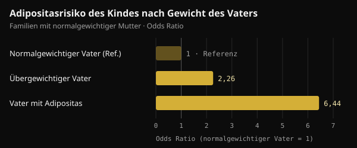
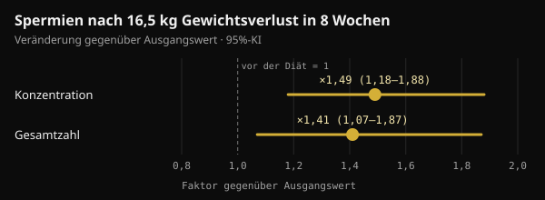

# Gewicht des Vaters bei der Zeugung: was wirklich beim Kind ankommt

Wenn es um Gesundheit vor der Schwangerschaft geht, denken die meisten an die Mutter. Eine Studie in Nature hat 2024 den Blick auch auf den Vater gelenkt. Hier liest du, was sie wirklich gezeigt hat, was unterwegs dazugedichtet wurde und was in den Monaten vor dem Kinderwunsch sinnvoll ist.

## Kurz gefasst

- Bei Mäusen reichten zwei Wochen sehr fettreicher Ernährung vor der Paarung, damit rund 30 % der männlichen Nachkommen eine gestörte Glukosetoleranz entwickelten, ohne dass sich ihr Gewicht änderte.
- Der Effekt verschwand, wenn die Väter vor der Zeugung 4 Wochen lang normal fraßen: Bei der Maus ist das Signal umkehrbar.
- Beim Menschen gibt es Zusammenhänge, keine Beweise: In zwei Leipziger Kohorten ging ein übergewichtiger Vater bei normalgewichtiger Mutter mit etwa doppelter Chance auf Adipositas beim Kind einher.
- Manche Zahlen aus Social Media (ein um das 3,8-Fache erhöhtes Fragment, das das Enzym Hexokinase 2 blockiert) stehen nicht in der Originalstudie.
- In den Monaten vor der Zeugung zählen Gewicht, Ernährung und Lebensstil. Folsäure plus Zink für Männer, getestet an 2.370 Paaren, führte nicht zu mehr Geburten.

## Was die Nature-Studie tatsächlich gemacht hat

Die Studie stammt von Anika Tomar und Kollegen am Helmholtz Munich unter der Leitung von Raffaele Teperino und erschien im Juni 2024 in Nature. Die Frage war präzise: Wenn die Ernährung des Vaters etwas an den Spermien verändert, passiert das bei ihrer Bildung im Hoden oder danach, während sie im Nebenhoden reifen?

Der Nebenhoden (Epididymis) ist der am Hoden anliegende Gang, in dem Spermien ihre Reifung abschließen. Die Forschenden gaben jungen männlichen Mäusen nur 2 Wochen lang eine Kost mit 60 % der Kalorien aus Fett. Eine Gruppe paarte sich sofort mit nie exponierten Weibchen. Die andere kehrte vorher 4 Wochen zum Normalfutter zurück, sodass ihre Nachkommen aus Spermien stammten, die die fettreiche Kost nie erlebt hatten.

- **Das Gewicht der Nachkommen änderte sich nicht**, aber rund 30 % der Männchen der ersten Gruppe wurden glukoseintolerant (sie verarbeiteten Blutzucker schlechter) und weniger insulinempfindlich.
- **Die Nachkommen der zweiten Gruppe waren unauffällig**: Das Signal kam von Spermien, die während der Reifung der Kost ausgesetzt waren, und verschwand nach einem Monat normaler Ernährung.
- **In den Spermien nahmen kleine mitochondriale RNAs zu**, mitochondriale Transfer-RNAs (mt-tRNAs) und ihre Fragmente (mt-tsRNAs). In Zwei-Zell-Embryonen zeigten die Autoren, dass väterliche mt-tRNAs bei der Befruchtung auf den Embryo übergehen.

Das ist ein Übertragungsweg, der nicht über die DNA läuft: keine Mutation, sondern ein Signal, das an den Stoffwechselzustand des Vaters in diesem Moment gekoppelt ist.

## Und beim Menschen?

Dieselbe Arbeit enthält zwei Arten menschlicher Daten. Die erste betrifft Spermien: Bei 18 jungen finnischen Freiwilligen waren mt-tsRNAs die einzige Art kleiner RNA, die mit dem Body-Mass-Index (BMI) anstieg. Die Autoren selbst sprechen von einer kleinen Stichprobe.

Die zweite betrifft Kinder. In zwei Leipziger Kinderstudien (Leipzig Childhood Obesity Cohort und LIFE Child) hing der BMI des Vaters mit dem des Kindes zusammen, auch nach Berücksichtigung der Mutter. In Familien mit normalgewichtiger Mutter ging ein übergewichtiger Vater mit etwa doppelter Chance auf Adipositas beim Kind einher, ein Vater mit Adipositas mit mehr als sechsfacher.

*Quelle: Tomar et al., Nature 2024, Leipziger Kohorten. Odds Ratios aus dem Haupttext; normalgewichtiger Vater = Referenz. Nurvan-Grafik.*

Zur Einordnung: Das Gewicht der Mutter erklärte 18 % der Unterschiede im BMI der Kinder, das des Vaters weitere 6 %. Die Autoren korrigierten für Verwandtschaft und geschätztes genetisches Risiko, doch eine Beobachtungsstudie kann Biologie und Familiengewohnheiten nicht ganz trennen: Ein Haushalt, der ungesund isst, tut das meist gemeinsam.

## Nicht alle Studien zeigen in dieselbe Richtung

Ebenfalls 2024 veröffentlichte eine Gruppe aus Barcelona in Heliyon ein ähnliches Experiment, mit einem Unterschied: Die männlichen Mäuse wurden mit westlicher Kost wirklich adipös. In den Spermien adipöser Väter fanden sich 450 DNA-Regionen mit veränderter Zugänglichkeit (mehr oder weniger "offen" für das Ablesen). Trotzdem hatten die Nachkommen, männlich wie weiblich, nur leichte Stoffwechselveränderungen früh im Leben, die später verschwanden. Keine dauerhafte Neigung zu Adipositas oder Diabetes.

Die Autoren sprechen von Resilienz der Nachkommen: Eine Veränderung in den Spermien bedeutet nicht automatisch eine Wirkung auf das Kind.

Zwei Begriffe, die man nicht verwechseln sollte: Ein **intergenerationaler** Effekt betrifft die Kinder (F1), die mit exponierten Spermien gezeugt wurden; ein **transgenerationaler** reicht ohne neue Exposition bis zu Enkeln und weiter (F2, F3). Die Nature-Studie betrifft nur die Kinder.

## Was kursiert und was in der Studie steht

In sozialen Medien wird die Studie oft mit sehr genauen Details erzählt: ein um das 3,8-Fache erhöhtes RNA-Fragment, das in den Embryo gelangt und die mRNA der Hexokinase 2 (ein Schlüsselenzym für die Glukoseverwertung) blockiert, glukoseintolerante Nachkommen aus künstlicher Befruchtung und 2,3-fach höhere Fragmente bei Männern mit einem BMI über 30.

Im Volltext der Studie auf PubMed Central stehen diese Zahlen nicht. Sie tauchen, Tomar und Kollegen zugeschrieben, in einer 2026 in Clinical Epigenetics erschienenen Übersichtsarbeit auf. In der Originalstudie dagegen:

- stammen die glukoseintoleranten Nachkommen aus **natürlicher Paarung**; die künstliche Befruchtung diente nur dazu, Zwei-Zell-Embryonen für die Analyse zu erzeugen;
- schreiben die Autoren, dass ihre Daten den Übergang ganzer mt-tRNAs zeigen, **nicht** den der Fragmente, den sie für wahrscheinlich, aber unbewiesen halten;
- behandelt die Spermienanalyse beim Menschen den BMI als stetige Variable bei 18 jungen Männern, ohne Vergleich über und unter 30.

Der so selbstsicher erzählte Mechanismus ist also derzeit eine plausible Hypothese.

## Das Gewicht des Vaters lässt sich ändern, und die Spermien reagieren

Ein menschliches Spermium braucht etwa zwei Monate, um zu entstehen und im Ejakulat anzukommen: In einer Studie mit markiertem Wasser an 11 Männern erschienen die ersten "neuen" Spermien im Schnitt nach 64 Tagen (42 bis 76). Daher das oft genannte Fenster von 2–3 Monaten vor der Zeugung. Bei der Maus zählten allerdings vor allem die letzten Wochen der Reifung.

Und das Sperma verbessert sich, wenn ein Mann mit Adipositas abnimmt. In einer dänischen randomisierten Studie hielten 56 Männer mit einem BMI von 32 bis 43 acht Wochen lang unter ärztlicher Aufsicht eine Diät mit 800 kcal pro Tag ein und verloren im Schnitt 16,5 kg. Spermienkonzentration und -zahl stiegen auf etwa das Anderthalbfache. Nach einem Jahr hielt der Effekt bei denen an, die ihr Gewicht hielten, nicht bei denen, die wieder zunahmen.

*Quelle: Andersen et al., Hum Reprod 2022 (n = 56). Veränderung nach 8 Wochen kalorienarmer Diät gegenüber dem Ausgangswert, mit 95%-Konfidenzintervall. Nurvan-Grafik.*

Bei Männern mit schwerer Adipositas veränderte sich zudem nach einer bariatrischen Operation die DNA-Methylierung der Spermien deutlich, auch an Stellen, die mit der Appetitsteuerung zu tun haben.

Ein Baustein fehlt jedoch: Noch keine Studie am Menschen hat gezeigt, dass eine Gewichtsabnahme des Vaters vor der Zeugung die Stoffwechselgesundheit des Kindes verbessert. Wir wissen, dass das Gewicht des Vaters mit der Gesundheit des Kindes zusammenhängt und dass Spermien auf Abnehmen reagieren; die direkte Verbindung ist nicht getestet.

## Und Nahrungsergänzung, um die Spermien "vorzubereiten"?

Studien wie diese werden oft genutzt, um Präparate für die männliche Fruchtbarkeit zu verkaufen. Der stärkste verfügbare Test zeigt in die andere Richtung.

In der FAZST-Studie (JAMA, 2020) wurden 2.370 Paare vor einer Kinderwunschbehandlung zufällig eingeteilt: Die Männer nahmen 6 Monate lang Folsäure (5 mg) und Zink (30 mg) oder ein Placebo. Die Geburtenrate war praktisch gleich, 34 % gegenüber 35 %, und fast alle Spermaparameter blieben unverändert. Die DNA-Fragmentierung der Spermien war mit dem Präparat sogar etwas höher (29,7 % gegenüber 27,2 %).

Die Studie hat die Stoffwechselgesundheit der Kinder nicht gemessen, doch die Botschaft ist klar: Kein Präparat ersetzt derzeit Gewicht und Lebensstil, und keine Humanstudie rechtfertigt auf Basis dieser Daten ein "Vor-der-Zeugung"-Protokoll für Männer.

## Was die Forschung wirklich sagt

Anlass für diesen Artikel war ein Beitrag von Marco Guercioni (@the___doc), der die Studie vorsichtig vorstellt und ihre Grenzen aufzählt. Hier seine wichtigsten Aussagen im Abgleich mit den Originalquellen.

- **Bestätigt** — „Tomar und Kollegen, Nature, Juni 2024: Reife Spermien reagieren auf die Ernährung, und 30 % der männlichen Nachkommen werden glukoseintolerant.“ Gilt für Mäuse.
- **Von der Originalstudie widerlegt** — „Mit künstlicher Befruchtung, ohne Beitrag der Mutter.“ Die untersuchten Nachkommen stammten aus natürlicher Paarung mit nicht exponierten Weibchen. Die künstliche Befruchtung diente nur der Analyse von Zwei-Zell-Embryonen.
- **Nicht überprüfbar** — „Ein Fragment steigt um das 3,8-Fache und blockiert die mRNA der Hexokinase 2; bei Männern mit BMI über 30 ist es 2,3-fach erhöht.“ Diese Zahlen stehen in einer Übersichtsarbeit von 2026, nicht in der Studie, deren Autoren schreiben, dass der Übergang der Fragmente auf den Embryo nicht belegt ist.
- **Zu präzisieren** — „In zwei Kohorten beeinflusst der BMI des Vaters die Stoffwechselgesundheit des Kindes unabhängig von der Mutter.“ Der Zusammenhang besteht, ist aber beobachtend, und der Vater erklärt einen kleineren Anteil als die Mutter (6 % gegenüber 18 %).
- **Bestätigt** — „Es ist intergenerational, nicht transgenerational; bei der Maus gibt es eine Kausalkette, beim Menschen einen Zusammenhang.“ Ebenso der Heliyon-Befund (450 Regionen, keine dauerhafte Neigung), der von Mäusen stammt.
- **Nicht überprüfbar** — „Die Hälfte des Effekts ist die gemeinsame Umgebung nach der Geburt.“ Das Familienumfeld zählt sicher, doch eine Schätzung von 50 % haben wir in den geprüften Quellen nicht gefunden.
- **Bestätigt** — „Keine Humandaten rechtfertigen ein Protokoll mit Nahrungsergänzungsmitteln.“ Die FAZST-Studie weist in dieselbe Richtung.
- **Zu präzisieren** — „Die letzten drei Monate sind das Fenster.“ Spermien entstehen in etwa 2 Monaten: 3 Monate sind ein vorsichtiges Fenster.

## So setzt du es um

Wenn du über ein Kind nachdenkst, lassen sich diese Daten so in konkrete Schritte übersetzen. Es sind gute allgemeine Gewohnheiten, keine Behandlung.

1. **Fang 2–3 Monate vorher an.** So lange braucht eine "neue Generation" Spermien, doch auch die letzten Wochen zählen.
2. **Achte auf Gewicht und Taillenumfang.** Wenn du Übergewicht hast, geht schon eine moderate, nachhaltige Abnahme in die richtige Richtung. Sehr kalorienarme Diäten wie die mit 800 kcal aus der dänischen Studie nur unter ärztlicher Aufsicht.
3. **Verbessere die Qualität deiner Ernährung.** Mehr wenig verarbeitete Lebensmittel, Gemüse, Hülsenfrüchte und mageres Eiweiß; weniger Hochverarbeitetes und zuckerhaltige Getränke.
4. **Trainiere regelmäßig**, Kraft und Ausdauer kombiniert. In der dänischen Studie war Training eine der Strategien, um das Gewicht zu halten.
5. **Rauchen, Alkohol und Schlaf.** Mit dem Rauchen aufhören, weniger Alkohol trinken und genug schlafen gehören zur selben Vorbereitung.
6. **Kauf keine "Spermien-Präparate" auf Grundlage dieser Studien.** Wenn du Fragen zur Fruchtbarkeit hast oder ihr es schon länger versucht, sprich mit deiner Ärztin, deinem Arzt oder einem Andrologen, der ein Spermiogramm veranlassen kann.

Es geht nicht um Schuld, sondern um einen zusätzlichen Hebel. Eine Übersichtsarbeit derselben Münchner Gruppe von 2025 plädiert für eine Vorbereitung auf die Zeugung, die beide Eltern einbezieht, nicht nur die Mutter.

<h3>Plane die nächsten drei Monate mit Zahlen</h3>

In Nurvan erfasst du Gewicht und Körpermaße, führst dein Ernährungstagebuch und protokollierst jedes Training. So siehst du Woche für Woche, ob du in die richtige Richtung gehst. Arbeitest du mit einem Coach, sieht er dieselben Daten und kann dir Ernährungsplan und Trainingsplan zuweisen.

<a href="https://nurvan.app">Nurvan testen</a>

## Häufige Fragen

### Ich war bei der Zeugung übergewichtig. Wird mein Kind adipös?

Nein, das ist kein Schicksal. Die Daten beschreiben ein durchschnittliches Risiko über viele Familien, kein individuelles Ergebnis. Viele Faktoren zählen, angefangen damit, wie die Familie isst und sich bewegt, und das lässt sich jederzeit ändern.

### Wie lange vor der Zeugung zählt das Gewicht des Vaters?

Menschliche Spermien entstehen in etwa zwei Monaten, daher sind die 2–3 Monate davor das meistgenannte Fenster. Bei Mäusen reichten 2 Wochen Diät für den Effekt und 4 Wochen Normalkost, um ihn aufzuheben. Den genauen Zeitrahmen beim Menschen hat niemand gemessen.

### Gibt es Präparate, die die Spermien vor der Zeugung "reinigen"?

Dafür gibt es beim Menschen keine Belege. In der größten Studie erhöhten Folsäure und Zink über 6 Monate weder die Geburtenrate noch die Spermaqualität. Ob ein Mangel oder ein Fruchtbarkeitsproblem vorliegt, beurteilt die Ärztin oder der Arzt.

### Gilt das auch für die Mutter?

Ja, sogar stärker: In den Leipziger Daten erklärte das Gewicht der Mutter einen größeren Teil der Unterschiede zwischen den Kindern. Neu ist nicht, dass der Vater mehr zählt als die Mutter, sondern dass er auch zählt.

## Quellen

1. Tomar A, Gomez-Velazquez M, Gerlini R et al., 2024. Epigenetic inheritance of diet-induced and sperm-borne mitochondrial RNAs. *Nature* 630(8017):720–727. [PMID 38839949](https://pubmed.ncbi.nlm.nih.gov/38839949/) · [DOI 10.1038/s41586-024-07472-3](https://doi.org/10.1038/s41586-024-07472-3)
2. Tahiri I, Llana SR, Fos-Domènech J et al., 2024. Paternal obesity induces changes in sperm chromatin accessibility and has a mild effect on offspring metabolic health. *Heliyon* 10(14):e34043. [PMID 39100496](https://pubmed.ncbi.nlm.nih.gov/39100496/) · [DOI 10.1016/j.heliyon.2024.e34043](https://doi.org/10.1016/j.heliyon.2024.e34043)
3. Song S, Zhang B, Xiong F et al., 2026. Sperm tRNA-derived fragments: molecular mechanisms and clinical implications for paternal epigenetic inheritance. *Clin Epigenetics* 18(1). [PMID 42135772](https://pubmed.ncbi.nlm.nih.gov/42135772/) · [DOI 10.1186/s13148-026-02155-4](https://doi.org/10.1186/s13148-026-02155-4)
4. Andersen E, Juhl CR, Kjøller ET et al., 2022. Sperm count is increased by diet-induced weight loss and maintained by exercise or GLP-1 analogue treatment: a randomized controlled trial. *Hum Reprod* 37(7):1414–1422. [PMID 35580859](https://pubmed.ncbi.nlm.nih.gov/35580859/) · [DOI 10.1093/humrep/deac096](https://doi.org/10.1093/humrep/deac096)
5. Donkin I, Versteyhe S, Ingerslev LR et al., 2016. Obesity and bariatric surgery drive epigenetic variation of spermatozoa in humans. *Cell Metab* 23(2):369–378. [PMID 26669700](https://pubmed.ncbi.nlm.nih.gov/26669700/) · [DOI 10.1016/j.cmet.2015.11.004](https://doi.org/10.1016/j.cmet.2015.11.004)
6. Misell LM, Holochwost D, Boban D et al., 2006. A stable isotope-mass spectrometric method for measuring human spermatogenesis kinetics in vivo. *J Urol* 175(1):242–246. [PMID 16406920](https://pubmed.ncbi.nlm.nih.gov/16406920/) · [DOI 10.1016/S0022-5347(05)00053-4](https://doi.org/10.1016/S0022-5347(05)00053-4)
7. Schisterman EF, Sjaarda LA, Clemons T et al., 2020. Effect of folic acid and zinc supplementation in men on semen quality and live birth among couples undergoing infertility treatment: a randomized clinical trial. *JAMA* 323(1):35–48. [PMID 31910279](https://pubmed.ncbi.nlm.nih.gov/31910279/) · [DOI 10.1001/jama.2019.18714](https://doi.org/10.1001/jama.2019.18714)
8. Skerrett-Byrne DA, Pepin AS, Laurent K et al., 2025. Dad's diet shapes the future: how paternal nutrition impacts placental development and childhood metabolic health. *Mol Nutr Food Res* 69(22):e70261. [PMID 40913545](https://pubmed.ncbi.nlm.nih.gov/40913545/) · [DOI 10.1002/mnfr.70261](https://doi.org/10.1002/mnfr.70261)

Inspiriert von einem Beitrag von [Marco Guercioni (@the___doc)](https://www.instagram.com/p/DdokwJDiH92/). Quellen über PubMed abgerufen.

> Hinweis: Dieser Inhalt dient nur der Information und ersetzt nicht den Rat einer Ärztin, eines Arztes oder einer qualifizierten Fachperson.
