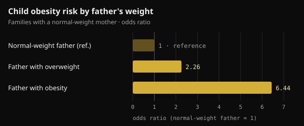
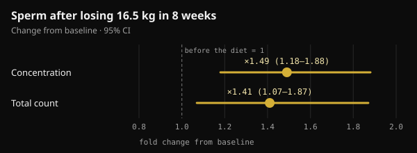

# Father's weight at conception: what actually reaches the child

When people talk about health before pregnancy, they almost always mean the mother's. A 2024 study in Nature put the spotlight on fathers too. Here is what it really showed, what got added along the way, and what makes sense to do in the months before trying for a baby.

## Key takeaways

- In mice, two weeks of a very high-fat diet before mating made about 30% of male offspring glucose intolerant, without changing their body weight.
- The effect disappeared when fathers went back to a normal diet for 4 weeks before conceiving: in mice, the signal is reversible.
- In humans the data are associations: in two German cohorts, with a normal-weight mother, a father with overweight was linked to roughly double the odds of child obesity.
- Some numbers circulating on social media (a fragment "up 3.8-fold" that blocks the enzyme hexokinase 2) do not appear in the original study.
- In the months before conception, weight, diet and lifestyle matter. A folic acid and zinc supplement for men, tested in 2,370 couples, did not increase live births.

## What the Nature study actually did

The study comes from Anika Tomar and colleagues at Helmholtz Munich, led by Raffaele Teperino, and was published in Nature in June 2024. The question was precise: if a father's diet changes something in his sperm, does it happen while sperm are being made in the testis, or later, while they mature in the epididymis?

The epididymis is the coiled tube attached to the testis where sperm finish maturing. The researchers fed young male mice a diet with 60% of calories from fat for just 2 weeks. One group mated straight away with females never exposed to the diet. Another went back to normal chow for 4 weeks first, so their pups came from sperm that had never met the high-fat diet.

- **Offspring body weight did not change**, but about 30% of males in the first group became glucose intolerant (they handled blood sugar worse) and less insulin sensitive.
- **Offspring of the second group were normal**: the signal came from sperm exposed to the diet while maturing, and it vanished after a month of normal eating.
- **Sperm carried more small mitochondrial RNAs**, mitochondrial transfer RNAs (mt-tRNAs) and their fragments (mt-tsRNAs). In two-cell embryos, the authors showed that paternal mt-tRNAs are passed to the embryo at fertilization.

This is a route of transmission that does not go through DNA: not a mutation, but a signal tied to the father's metabolic state at that moment.

## What about humans?

The same paper contains two kinds of human data. The first is about sperm: in 18 young Finnish volunteers, mt-tsRNAs were the only type of small RNA that rose with body mass index (BMI). The authors themselves call it a small sample.

The second is about children. In two pediatric studies from Leipzig (the Leipzig Childhood Obesity Cohort and LIFE Child), the father's BMI was linked to the child's even after accounting for the mother's. In families with a normal-weight mother, having a father with overweight was linked to about twice the odds of child obesity, and a father with obesity to more than six times the odds.

*Source: Tomar et al., Nature 2024, Leipzig cohorts. Odds ratios reported in the main text; normal-weight father = reference. Nurvan chart.*

For scale, the mother's weight explained 18% of the differences in children's BMI, the father's a further 6%. The authors adjusted for relatedness and estimated genetic risk, but an observational study cannot fully separate biology from family habits: a household that eats badly tends to do it together.

## Not every study points the same way

Also in 2024, a group in Barcelona published a similar experiment in Heliyon, with one difference: the male mice became truly obese on a Western-style diet. Sperm from obese fathers showed 450 DNA regions with different accessibility (more or less "open" to being read). Yet the offspring, male and female, had only mild metabolic changes early in life that later faded. No lasting predisposition to obesity or diabetes.

The authors talk about offspring resilience: a change measured in sperm does not automatically mean an effect on the child.

Two words worth keeping apart: an **intergenerational** effect concerns the children (F1) conceived with exposed sperm; a **transgenerational** one reaches grandchildren and beyond (F2, F3) without new exposure. The Nature study is about children only.

## The numbers going around vs what's in the paper

On social media this study often comes with very precise details: an RNA fragment up 3.8-fold that enters the embryo and blocks the mRNA of hexokinase 2 (a key enzyme for using glucose), glucose-intolerant offspring produced by IVF, and fragments 2.3 times higher in men with a BMI over 30.

These figures are not in the full text of the study on PubMed Central. They do appear, attributed to Tomar and colleagues, in a review published in Clinical Epigenetics in 2026. In the original study:

- the glucose-intolerant offspring came from **natural mating**; IVF was only used to produce two-cell embryos for analysis;
- the authors write that their data show transfer of whole mt-tRNAs, **not** of the fragments, which they consider likely but unproven;
- the human sperm analysis treats BMI as a continuous variable in 18 young men, with no comparison above and below 30.

So the mechanism told with such confidence is, for now, a plausible hypothesis.

## A father's weight can change, and sperm respond

A human sperm cell takes about two months to form and reach the ejaculate: in a labeled-water study of 11 men, the first "new" sperm appeared after 64 days on average (range 42 to 76). Hence the often-quoted 2–3 month window before conception. In mice, though, it was mostly the last weeks of maturation that mattered.

And semen improves when a man with obesity loses weight. In a Danish randomized trial, 56 men with a BMI of 32 to 43 followed an 800 kcal/day diet for 8 weeks under medical supervision and lost 16.5 kg on average. Sperm concentration and count rose by roughly one and a half times. The gain held at one year in men who kept the weight off, not in those who regained it.

*Source: Andersen et al., Hum Reprod 2022 (n = 56). Change after an 8-week low-calorie diet versus baseline, with 95% confidence intervals. Nurvan chart.*

In men with severe obesity, sperm DNA methylation also changed markedly after bariatric surgery, including at sites linked to appetite control.

One piece is still missing: no human study has yet shown that a father losing weight before conception improves his child's metabolic health. We know that paternal weight is linked to child health and that sperm respond to weight loss; the direct link has not been tested.

## What about supplements to "prepare" sperm?

Studies like this are often used to sell male fertility supplements. The strongest test available points the other way.

In the FAZST trial (JAMA, 2020), 2,370 couples about to start fertility treatment were randomized: the men took folic acid (5 mg) and zinc (30 mg) or a placebo for 6 months. Live births were practically identical, 34% versus 35%, and almost all semen measures were unchanged. Sperm DNA fragmentation was actually slightly higher with the supplement (29.7% versus 27.2%).

The trial did not measure children's metabolic health, but the message is clear: no supplement currently replaces weight and lifestyle, and no human study supports a "pre-conception" supplement protocol for men based on these data.

## What the research actually says

This article was inspired by a post from Marco Guercioni (@the___doc), who presents the study cautiously and lists its limits. Here are its main claims checked against the original sources.

- **Confirmed** — "Tomar and colleagues, Nature, June 2024: mature sperm respond to diet, and 30% of male offspring become glucose intolerant." True in mice.
- **Contradicted by the original study** — "Via IVF, with no maternal contribution." The offspring tested were born from natural mating with unexposed females. IVF was only used to analyze two-cell embryos.
- **Not verifiable** — "One fragment rises 3.8-fold and blocks hexokinase 2 mRNA; in men with BMI over 30 it is 2.3 times higher." These numbers appear in a 2026 review, not in the study, whose authors write that transfer of the fragments to the embryo is not demonstrated.
- **Needs nuance** — "In two cohorts, paternal BMI affects the child's metabolic health independently of the mother's." The association is real, but observational, and the father explains a smaller share than the mother (6% versus 18%).
- **Confirmed** — "It is intergenerational, not transgenerational; in mice there is a causal chain, in humans an association." So is the Heliyon finding (450 regions, no lasting predisposition), which comes from mice.
- **Not verifiable** — "Half of the effect is the shared environment after birth." Family environment clearly matters, but we found no 50% estimate in the sources reviewed.
- **Confirmed** — "No human data justify a supplement protocol." The FAZST trial points the same way.
- **Needs nuance** — "The last three months are the window." Sperm take about 2 months to form: 3 months is a cautious window.

## How to apply it

If you are thinking about having a baby, here is how to turn these data into concrete steps. They are good general habits, not a treatment.

1. **Start 2–3 months ahead.** That is how long a "new generation" of sperm takes, but the last weeks count too.
2. **Watch weight and waist.** If you carry extra weight, even a moderate, sustainable loss points the right way. Very low-calorie diets, like the 800 kcal one in the Danish study, only under medical supervision.
3. **Improve diet quality.** More minimally processed foods, vegetables, legumes and lean protein; fewer ultra-processed foods and sugary drinks.
4. **Train regularly**, combining strength and aerobic work. In the Danish trial, exercise was one of the strategies used to keep the weight off.
5. **Smoking, alcohol and sleep.** Quitting smoking, cutting back on alcohol and sleeping enough are part of the same preparation.
6. **Don't buy "sperm" supplements on the strength of these studies.** If you have fertility concerns or have been trying for a while, talk to your doctor or a urologist, who can order a semen analysis.

This is not about blame: it's one more lever. A 2025 review from the same Munich group argues for preconception care that involves both parents, not just the mother.

<h3>Plan the next three months with numbers</h3>

In Nurvan you log weight and body measurements, track meals in the food diary and record every workout, so you can see week by week whether you're heading the right way. If you work with a coach, they see the same data and can assign your nutrition plan and training program.

<a href="https://nurvan.app">Try Nurvan</a>

## FAQ

### I was overweight when we conceived. Will my child be obese?

No, it is not destiny. The data describe average risk across many families, not an individual outcome. Many factors matter, starting with how the family eats and moves, and those can change at any time.

### How long before conception does a father's weight matter?

Human sperm take about two months to form, so the 2–3 months before are the most quoted window. In mice, 2 weeks of diet were enough to cause the effect and 4 weeks of normal eating to undo it. The exact timing in humans has not been measured.

### Are there supplements that "clean up" sperm before conception?

There is no human evidence for that. In the largest trial, folic acid and zinc for 6 months did not increase births or improve semen quality. If you have a deficiency or a fertility problem, that is for your doctor to assess.

### Does this apply to mothers too?

Yes, even more so: in the Leipzig data the mother's weight explained a larger share of the differences between children. The news is not that fathers matter more than mothers, but that they matter too.

## Sources

1. Tomar A, Gomez-Velazquez M, Gerlini R et al., 2024. Epigenetic inheritance of diet-induced and sperm-borne mitochondrial RNAs. *Nature* 630(8017):720–727. [PMID 38839949](https://pubmed.ncbi.nlm.nih.gov/38839949/) · [DOI 10.1038/s41586-024-07472-3](https://doi.org/10.1038/s41586-024-07472-3)
2. Tahiri I, Llana SR, Fos-Domènech J et al., 2024. Paternal obesity induces changes in sperm chromatin accessibility and has a mild effect on offspring metabolic health. *Heliyon* 10(14):e34043. [PMID 39100496](https://pubmed.ncbi.nlm.nih.gov/39100496/) · [DOI 10.1016/j.heliyon.2024.e34043](https://doi.org/10.1016/j.heliyon.2024.e34043)
3. Song S, Zhang B, Xiong F et al., 2026. Sperm tRNA-derived fragments: molecular mechanisms and clinical implications for paternal epigenetic inheritance. *Clin Epigenetics* 18(1). [PMID 42135772](https://pubmed.ncbi.nlm.nih.gov/42135772/) · [DOI 10.1186/s13148-026-02155-4](https://doi.org/10.1186/s13148-026-02155-4)
4. Andersen E, Juhl CR, Kjøller ET et al., 2022. Sperm count is increased by diet-induced weight loss and maintained by exercise or GLP-1 analogue treatment: a randomized controlled trial. *Hum Reprod* 37(7):1414–1422. [PMID 35580859](https://pubmed.ncbi.nlm.nih.gov/35580859/) · [DOI 10.1093/humrep/deac096](https://doi.org/10.1093/humrep/deac096)
5. Donkin I, Versteyhe S, Ingerslev LR et al., 2016. Obesity and bariatric surgery drive epigenetic variation of spermatozoa in humans. *Cell Metab* 23(2):369–378. [PMID 26669700](https://pubmed.ncbi.nlm.nih.gov/26669700/) · [DOI 10.1016/j.cmet.2015.11.004](https://doi.org/10.1016/j.cmet.2015.11.004)
6. Misell LM, Holochwost D, Boban D et al., 2006. A stable isotope-mass spectrometric method for measuring human spermatogenesis kinetics in vivo. *J Urol* 175(1):242–246. [PMID 16406920](https://pubmed.ncbi.nlm.nih.gov/16406920/) · [DOI 10.1016/S0022-5347(05)00053-4](https://doi.org/10.1016/S0022-5347(05)00053-4)
7. Schisterman EF, Sjaarda LA, Clemons T et al., 2020. Effect of folic acid and zinc supplementation in men on semen quality and live birth among couples undergoing infertility treatment: a randomized clinical trial. *JAMA* 323(1):35–48. [PMID 31910279](https://pubmed.ncbi.nlm.nih.gov/31910279/) · [DOI 10.1001/jama.2019.18714](https://doi.org/10.1001/jama.2019.18714)
8. Skerrett-Byrne DA, Pepin AS, Laurent K et al., 2025. Dad's diet shapes the future: how paternal nutrition impacts placental development and childhood metabolic health. *Mol Nutr Food Res* 69(22):e70261. [PMID 40913545](https://pubmed.ncbi.nlm.nih.gov/40913545/) · [DOI 10.1002/mnfr.70261](https://doi.org/10.1002/mnfr.70261)

Inspired by a post from [Marco Guercioni (@the___doc)](https://www.instagram.com/p/DdokwJDiH92/). Sources accessed via PubMed.

> Note: this content is for information only and does not replace advice from a doctor or qualified professional.
