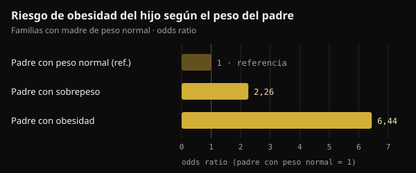
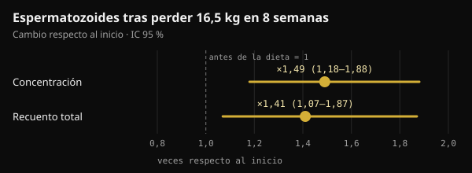

# Peso del padre en la concepción: qué llega de verdad al hijo

Cuando se habla de salud antes del embarazo, casi siempre se piensa en la madre. Un estudio publicado en Nature en 2024 puso el foco también en el padre. Aquí tienes lo que demostró de verdad, lo que se añadió por el camino y lo que tiene sentido hacer en los meses antes de buscar un hijo.

## En resumen

- En ratones, dos semanas de dieta muy rica en grasa antes del apareamiento bastaron para que cerca del 30 % de las crías macho fueran intolerantes a la glucosa, sin cambiar su peso.
- El efecto desaparecía si el padre volvía a una dieta normal durante 4 semanas antes de concebir: en el ratón, la señal es reversible.
- En humanos los datos son asociaciones: en dos cohortes de Leipzig, con madre de peso normal, un padre con sobrepeso se asociaba a un riesgo de obesidad del hijo aproximadamente doble.
- Algunas cifras que circulan en redes (un fragmento «multiplicado por 3,8» que bloquea la enzima hexoquinasa 2) no aparecen en el estudio original.
- En los meses previos a la concepción cuentan el peso, la alimentación y el estilo de vida. Un suplemento de ácido fólico y zinc para el hombre, probado en 2370 parejas, no aumentó los nacimientos.

## Qué hizo realmente el estudio de Nature

El estudio es de Anika Tomar y colegas del Helmholtz Munich, dirigidos por Raffaele Teperino, y se publicó en Nature en junio de 2024. La pregunta era concreta: si la dieta del padre cambia algo en sus espermatozoides, ¿ocurre mientras se forman en el testículo o después, mientras maduran en el epidídimo?

El epidídimo es el conducto pegado al testículo donde los espermatozoides terminan de madurar. Los investigadores dieron a ratones macho jóvenes una dieta con el 60 % de las calorías procedentes de grasa durante solo 2 semanas. Un grupo se apareaba enseguida con hembras nunca expuestas. Otro volvía antes a la dieta normal durante 4 semanas, así que sus crías nacían de espermatozoides que nunca habían visto la dieta grasa.

- **El peso de las crías no cambiaba**, pero cerca del 30 % de los machos del primer grupo se volvían intolerantes a la glucosa (manejaban peor el azúcar en sangre) y menos sensibles a la insulina.
- **Las crías del segundo grupo eran normales**: la señal venía de espermatozoides expuestos a la dieta mientras maduraban, y desaparecía con un mes de alimentación normal.
- **En los espermatozoides aumentaban pequeños ARN mitocondriales**, los ARN de transferencia mitocondriales (mt-tRNA) y sus fragmentos (mt-tsRNA). En embriones de dos células, los autores mostraron que los mt-tRNA paternos pasan al embrión en la fecundación.

Es una vía de transmisión que no pasa por el ADN: no una mutación, sino una señal ligada al estado metabólico del padre en ese momento.

## ¿Y en humanos?

El mismo trabajo incluye dos tipos de datos humanos. El primero trata de los espermatozoides: en 18 jóvenes voluntarios finlandeses, los mt-tsRNA eran el único tipo de ARN pequeño que aumentaba con el índice de masa corporal (IMC). Los propios autores hablan de una muestra pequeña.

El segundo trata de los hijos. En dos estudios pediátricos de Leipzig (Leipzig Childhood Obesity Cohort y LIFE Child), el IMC del padre se asociaba con el del hijo incluso teniendo en cuenta el de la madre. En las familias con madre de peso normal, tener un padre con sobrepeso se asociaba a un riesgo de obesidad del hijo aproximadamente doble, y un padre con obesidad a un riesgo más de seis veces mayor.

*Fuente: Tomar et al., Nature 2024, cohortes de Leipzig. Odds ratios del texto del estudio; padre con peso normal = referencia. Gráfico Nurvan.*

Para hacerse una idea, el peso de la madre explicaba el 18 % de las diferencias de IMC entre los niños y el del padre un 6 % adicional. Los autores corrigieron por parentesco y riesgo genético estimado, pero un estudio observacional no puede separar del todo biología y hábitos familiares: una casa donde se come mal suele hacerlo en conjunto.

## No todos los estudios apuntan en la misma dirección

También en 2024, un grupo de Barcelona publicó en Heliyon un experimento parecido, con una diferencia: los ratones macho llegaban a ser obesos de verdad con una dieta de tipo occidental. En los espermatozoides de los padres obesos había 450 regiones del ADN con accesibilidad distinta (más o menos «abiertas» a la lectura). Aun así, las crías, machos y hembras, solo tuvieron alteraciones metabólicas leves al principio de la vida, que luego desaparecieron. Ninguna predisposición duradera a obesidad o diabetes.

Los autores hablan de resiliencia de las crías: un cambio medido en los espermatozoides no equivale automáticamente a un efecto en el hijo.

Dos palabras que conviene no confundir: un efecto **intergeneracional** afecta a los hijos (F1) concebidos con espermatozoides expuestos; uno **transgeneracional** llega a los nietos y más allá (F2, F3) sin nueva exposición. El estudio de Nature solo trata de los hijos.

## Lo que circula y lo que dice el estudio

En redes, este estudio se cuenta a menudo con detalles muy precisos: un fragmento de ARN multiplicado por 3,8 que entra en el embrión y bloquea el ARNm de la hexoquinasa 2 (una enzima clave para usar la glucosa), crías intolerantes obtenidas por fecundación in vitro y fragmentos 2,3 veces más altos en hombres con un IMC superior a 30.

Esas cifras no están en el texto completo del estudio en PubMed Central. Aparecen, atribuidas a Tomar y colegas, en una revisión publicada en Clinical Epigenetics en 2026. En el estudio original, en cambio:

- las crías intolerantes a la glucosa nacen de **apareamiento natural**; la fecundación in vitro solo se usó para obtener embriones de dos células que analizar;
- los autores escriben que sus datos muestran el paso de los mt-tRNA enteros, **no** el de los fragmentos, que consideran probable pero no demostrado;
- el análisis de espermatozoides humanos trata el IMC como variable continua en 18 jóvenes, sin comparar a quienes están por encima y por debajo de 30.

El mecanismo contado con tanta seguridad es, por ahora, una hipótesis plausible.

## El peso del padre se puede cambiar, y el esperma responde

Un espermatozoide humano tarda unos dos meses en formarse y llegar a la eyaculación: en un estudio con agua marcada en 11 hombres, los primeros espermatozoides «nuevos» aparecieron de media a los 64 días (entre 42 y 76). De ahí la ventana de 2 a 3 meses antes de la concepción que tanto se cita. En el ratón, sin embargo, lo que más contaba eran las últimas semanas de maduración.

Y el semen mejora cuando un hombre con obesidad pierde peso. En un ensayo aleatorizado danés, 56 hombres con un IMC de 32 a 43 siguieron durante 8 semanas una dieta de 800 kcal al día bajo control médico y perdieron de media 16,5 kg. La concentración y el recuento de espermatozoides aumentaron alrededor de una vez y media. La mejora se mantenía al año en quienes conservaban el peso, no en quienes lo recuperaban.

*Fuente: Andersen et al., Hum Reprod 2022 (n = 56). Cambio tras 8 semanas de dieta hipocalórica respecto al inicio, con intervalo de confianza del 95 %. Gráfico Nurvan.*

En hombres con obesidad grave, además, la metilación del ADN de los espermatozoides cambiaba de forma marcada tras la cirugía bariátrica, también en zonas relacionadas con el control del apetito.

Falta, eso sí, una pieza: ningún estudio en humanos ha demostrado todavía que adelgazar antes de la concepción mejore la salud metabólica del hijo. Sabemos que el peso paterno se asocia a la salud del hijo y que el esperma responde a la pérdida de peso; el vínculo directo no se ha probado.

## ¿Y los suplementos para «preparar» el esperma?

Estudios como este se usan a menudo para vender suplementos de fertilidad masculina. La prueba más sólida disponible apunta en sentido contrario.

En el ensayo FAZST (JAMA, 2020), 2370 parejas a punto de empezar un tratamiento de reproducción asistida se repartieron al azar: los hombres tomaron durante 6 meses ácido fólico (5 mg) y zinc (30 mg) o un placebo. Los nacimientos fueron prácticamente iguales, 34 % frente a 35 %, y casi todos los parámetros del semen no cambiaron. La fragmentación del ADN espermático fue incluso algo mayor con el suplemento (29,7 % frente a 27,2 %).

El ensayo no midió la salud metabólica de los hijos, pero el mensaje es claro: hoy ningún suplemento sustituye al peso y al estilo de vida, y ningún estudio en humanos justifica un protocolo «preconcepción» para el hombre basado en estos datos.

## Qué dice de verdad la investigación

Este artículo parte de una publicación de Marco Guercioni (@the___doc), que presenta el estudio con prudencia y enumera sus límites. Estas son sus afirmaciones principales comparadas con las fuentes originales.

- **Confirmado** — «Tomar y colegas, Nature, junio de 2024: son los espermatozoides ya maduros los que responden a la dieta, y el 30 % de las crías macho se vuelve intolerante a la glucosa». Vale en ratones.
- **Desmentido por el estudio original** — «Con fecundación in vitro, sin contribución materna». Las crías estudiadas nacieron por apareamiento natural con hembras no expuestas. La fecundación in vitro solo sirvió para analizar embriones de dos células.
- **No verificable** — «Un fragmento aumenta 3,8 veces y bloquea el ARNm de la hexoquinasa 2; en hombres con IMC superior a 30 es 2,3 veces más alto». Estas cifras aparecen en una revisión de 2026, no en el estudio, cuyos autores escriben que el paso de los fragmentos al embrión no está demostrado.
- **Con matices** — «En dos cohortes, el IMC del padre influye en la salud metabólica del hijo con independencia del de la madre». La asociación existe, pero es observacional y el padre explica una parte menor que la madre (6 % frente a 18 %).
- **Confirmado** — «Es intergeneracional, no transgeneracional; en el ratón hay una cadena causal, en humanos una asociación». También el dato de Heliyon (450 regiones, sin predisposición duradera), que procede de ratones.
- **No verificable** — «La mitad del fenómeno es el entorno compartido tras el nacimiento». El entorno familiar pesa, sin duda, pero en las fuentes revisadas no encontramos una estimación del 50 %.
- **Confirmado** — «Ningún dato humano justifica un protocolo de suplementos». El ensayo FAZST va en la misma línea.
- **Con matices** — «Los últimos tres meses son la ventana». Los espermatozoides se forman en unos 2 meses: 3 meses son una ventana prudente.

## Cómo aplicarlo

Si estás pensando en tener un hijo, así puedes convertir estos datos en pasos concretos. Son buenos hábitos generales, no un tratamiento.

1. **Empieza 2 o 3 meses antes.** Es lo que tarda en formarse una «nueva generación» de espermatozoides, aunque las últimas semanas también cuentan.
2. **Vigila el peso y el perímetro de cintura.** Si tienes sobrepeso, incluso una pérdida moderada y sostenible va en la buena dirección. Las dietas muy bajas en calorías, como la de 800 kcal del estudio danés, solo con control médico.
3. **Cuida la calidad de la dieta.** Más alimentos poco procesados, verduras, legumbres y proteínas magras; menos ultraprocesados y bebidas azucaradas.
4. **Entrena con regularidad**, combinando fuerza y ejercicio aeróbico. En el ensayo danés, el ejercicio fue una de las estrategias para mantener el peso perdido.
5. **Tabaco, alcohol y sueño.** Dejar de fumar, reducir el alcohol y dormir lo suficiente forman parte de la misma preparación.
6. **No compres suplementos «para el esperma» basándote en estos estudios.** Si tienes dudas sobre tu fertilidad o lleváis tiempo intentándolo, habla con tu médico o con un andrólogo, que puede pedir un seminograma.

No se trata de buscar culpables: es una palanca más. Una revisión de 2025 del mismo grupo de Múnich propone una preparación a la concepción que implique a los dos progenitores, no solo a la madre.

<h3>Prepara los próximos tres meses con datos</h3>

En Nurvan registras tu peso y tus medidas, sigues la alimentación en el diario y anotas cada entrenamiento, así ves semana a semana si vas en la dirección correcta. Si trabajas con un coach, ve los mismos datos y puede asignarte el plan de alimentación y el programa de entrenamiento.

<a href="https://nurvan.app">Prueba Nurvan</a>

## Preguntas frecuentes

### Tenía sobrepeso cuando concebimos: ¿mi hijo será obeso?

No, no es un destino. Los datos describen un riesgo medio en muchas familias, no un resultado individual. Influyen muchos factores, empezando por cómo se come y se mueve la familia en casa, y eso se puede cambiar en cualquier momento.

### ¿Con cuánta antelación a la concepción cuenta el peso del padre?

Los espermatozoides humanos se forman en unos dos meses, así que los 2 o 3 meses previos son la ventana más citada. En ratones, 2 semanas de dieta bastaron para causar el efecto y 4 semanas de alimentación normal para anularlo. En humanos no se han medido los plazos exactos.

### ¿Hay suplementos que «limpien» el esperma antes de concebir?

No hay pruebas en humanos. En el ensayo más grande, el ácido fólico y el zinc durante 6 meses no aumentaron los nacimientos ni mejoraron la calidad del semen. Si tienes una carencia o un problema de fertilidad, la valoración corresponde al médico.

### ¿Vale también para la madre?

Sí, y todavía más: en los datos de Leipzig, el peso de la madre explicaba una parte mayor de las diferencias entre los niños. La novedad no es que el padre cuente más que la madre, sino que también cuenta.

## Fuentes

1. Tomar A, Gomez-Velazquez M, Gerlini R et al., 2024. Epigenetic inheritance of diet-induced and sperm-borne mitochondrial RNAs. *Nature* 630(8017):720–727. [PMID 38839949](https://pubmed.ncbi.nlm.nih.gov/38839949/) · [DOI 10.1038/s41586-024-07472-3](https://doi.org/10.1038/s41586-024-07472-3)
2. Tahiri I, Llana SR, Fos-Domènech J et al., 2024. Paternal obesity induces changes in sperm chromatin accessibility and has a mild effect on offspring metabolic health. *Heliyon* 10(14):e34043. [PMID 39100496](https://pubmed.ncbi.nlm.nih.gov/39100496/) · [DOI 10.1016/j.heliyon.2024.e34043](https://doi.org/10.1016/j.heliyon.2024.e34043)
3. Song S, Zhang B, Xiong F et al., 2026. Sperm tRNA-derived fragments: molecular mechanisms and clinical implications for paternal epigenetic inheritance. *Clin Epigenetics* 18(1). [PMID 42135772](https://pubmed.ncbi.nlm.nih.gov/42135772/) · [DOI 10.1186/s13148-026-02155-4](https://doi.org/10.1186/s13148-026-02155-4)
4. Andersen E, Juhl CR, Kjøller ET et al., 2022. Sperm count is increased by diet-induced weight loss and maintained by exercise or GLP-1 analogue treatment: a randomized controlled trial. *Hum Reprod* 37(7):1414–1422. [PMID 35580859](https://pubmed.ncbi.nlm.nih.gov/35580859/) · [DOI 10.1093/humrep/deac096](https://doi.org/10.1093/humrep/deac096)
5. Donkin I, Versteyhe S, Ingerslev LR et al., 2016. Obesity and bariatric surgery drive epigenetic variation of spermatozoa in humans. *Cell Metab* 23(2):369–378. [PMID 26669700](https://pubmed.ncbi.nlm.nih.gov/26669700/) · [DOI 10.1016/j.cmet.2015.11.004](https://doi.org/10.1016/j.cmet.2015.11.004)
6. Misell LM, Holochwost D, Boban D et al., 2006. A stable isotope-mass spectrometric method for measuring human spermatogenesis kinetics in vivo. *J Urol* 175(1):242–246. [PMID 16406920](https://pubmed.ncbi.nlm.nih.gov/16406920/) · [DOI 10.1016/S0022-5347(05)00053-4](https://doi.org/10.1016/S0022-5347(05)00053-4)
7. Schisterman EF, Sjaarda LA, Clemons T et al., 2020. Effect of folic acid and zinc supplementation in men on semen quality and live birth among couples undergoing infertility treatment: a randomized clinical trial. *JAMA* 323(1):35–48. [PMID 31910279](https://pubmed.ncbi.nlm.nih.gov/31910279/) · [DOI 10.1001/jama.2019.18714](https://doi.org/10.1001/jama.2019.18714)
8. Skerrett-Byrne DA, Pepin AS, Laurent K et al., 2025. Dad's diet shapes the future: how paternal nutrition impacts placental development and childhood metabolic health. *Mol Nutr Food Res* 69(22):e70261. [PMID 40913545](https://pubmed.ncbi.nlm.nih.gov/40913545/) · [DOI 10.1002/mnfr.70261](https://doi.org/10.1002/mnfr.70261)

Artículo inspirado en una publicación de [Marco Guercioni (@the___doc)](https://www.instagram.com/p/DdokwJDiH92/). Fuentes consultadas a través de PubMed.

> Nota: contenido informativo; no sustituye la opinión de un médico o de un profesional cualificado.
